# 我如何使用 Blob 存储来存放我的播客. mp3 文件

> 原文：<https://www.sitepoint.com/blob-storage-host-podcast-mp3-files/>

我主持了一个名为[独立开发播客](https://indiedevpodcast.wordpress.com/?WT.mc_id=13396-DEV-sitepoint-article20)的播客，我在 30 分钟的片段中采访了来自世界各地的游戏开发者。我总是对人们能够创造的东西着迷，我更好奇他们是如何让这些游戏发生的。

我将播客的最新剧集存储在 PodOmatic 上，这允许 iTunes 和其他播客订阅源阅读器获取它们，但我一次可以存储的播客剧集数量有限，因为我使用的是免费层。除非我升级到高级级别，否则我的旧剧集会丢失。

## Blob 存储解决了什么问题？

有了 blob 存储，我可以将我所有的. MP3 文件存储在一个容器中，然后允许公众从这个容器中下载它们。

当我把文件上传到 blob 容器时，我得到了一个 HTTP 端点，我可以用它作为下载剧集的链接。[点击此链接](https://blobindiedev.blob.core.windows.net/podcastep/Ep%2019%20Michael%20Hicks%20Pt%202.mp3)下载迈克尔·希克斯的最新一集。你也可以对你录制的视频做同样的事情。

在本教程中，我将带你一步步了解如何设置我的容器来存放播客的所有. MP3 文件。

## Blob 存储是如何工作的？

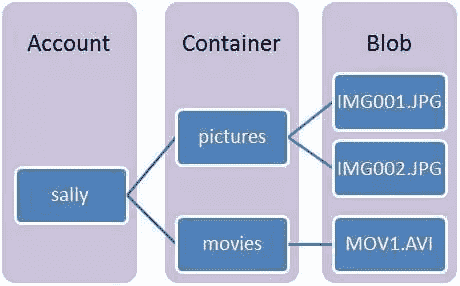

Blob 存储是一种用于存储大量非结构化数据(如文本或二进制数据)的服务，可以通过 HTTP 或 HTTPS 从世界任何地方访问这些数据。您也可以将这些文件设为公共或私有，这意味着您可以将它用作您自己的内容的存储库，只供您自己访问，或者使用它作为一种经济高效的方式来存储大量媒体以与他人共享。

Blob 存储的常见用途包括:

*   将图像、文档、音频或视频直接提供给浏览器
*   存储要分发给其他人的文件
*   流式视频和音频
*   执行安全备份和灾难恢复

你可以在这里找到更多关于 Blob 存储的信息。

### Blob 概念和术语

*   存储帐户:所有对 Azure 存储的访问都是通过存储帐户完成的。

*   容器:容器提供一组 blobs。所有 blobs 必须在一个容器中。

*   Blob:任何类型和大小的文件。有两种类型的 blob 可以存储在 Azure 存储中:块 blob 和页面 blob。大多数文件都是块 blobs，我们将在本教程中使用它们。单个块 blob 的大小可达 200 GB。

*   URL 格式:blob 可使用以下 URL 格式寻址:
    http://. blob . core . windows . net//
    以下示例 URL 可用于寻址上图中的一个 blob:

## 我如何获得 Blob 存储？

你需要像 Azure 这样的云存储解决方案。你可以注册一个[免费 Azure 试用版](http://azure.microsoft.com/en-us/pricing/free-trial/?WT.mc_id=13396-DEV-sitepoint-article20)，或者[联系我](mailto:%20dvoyles@microsoft.com)了解如何获得 BizSpark 帐户的信息。这是我用来存放文件的，但是如果你喜欢其他的解决方案，你也可以跟着做。

## 创建存储帐户

现在，您已经了解了 blob 存储是如何工作的，以及为什么要使用它。让我们来看一下创建帐户和容器的过程。这直接来自 Azure 门户网站上的 blob 存储博客:

若要使用 Azure 存储，您需要一个存储帐户。您可以按照以下步骤创建存储帐户。(也可以通过使用 Azure 服务管理客户端库或者服务管理 [REST API](http://msdn.microsoft.com/library/azure/hh264518.aspx?WT.mc_id=13396-DEV-sitepoint-article20) 来创建存储账户。)

登录 [Azure 管理门户](http://manage.windowsazure.com/?WT.mc_id=13396-DEV-sitepoint-article20)。

在导航窗格的底部，单击**新建。**

点击**数据服务、**然后**存储、**然后点击**快速创建。**

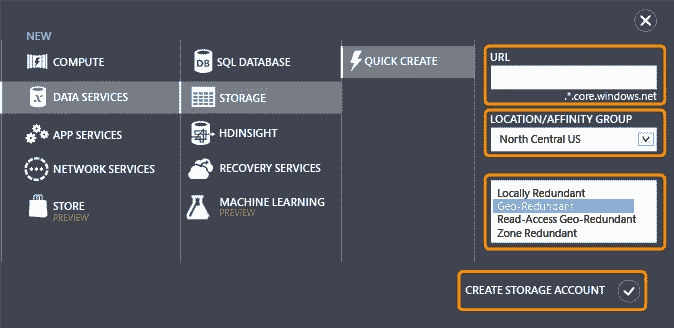

在 URL 中，键入要在存储帐户的 URI 中使用的子域名称。该值成为 URI 中的主机名，用于寻址订阅的 Blob、队列或表资源。

选择一个离您当前位置最近的区域/地缘组。

或者，您可以为您的帐户选择所需的复制类型。地理冗余复制是默认设置，可提供最大的持久性，这意味着您的文件将跨同一区域的多个数据中心进行备份。因此，如果哥斯拉摧毁了一个数据中心，你的信息仍然会备份在另一个数据中心。

点击**创建存储账户**。

你已经准备好了。现在，您可以创建一个容器来存放您的文件。

## 创建容器

在 Azure 门户中，点击屏幕左侧的**存储**图标。将出现一个新屏幕，显示您在上面创建的帐户名称。对我来说，它叫做 **blobindiedev。**

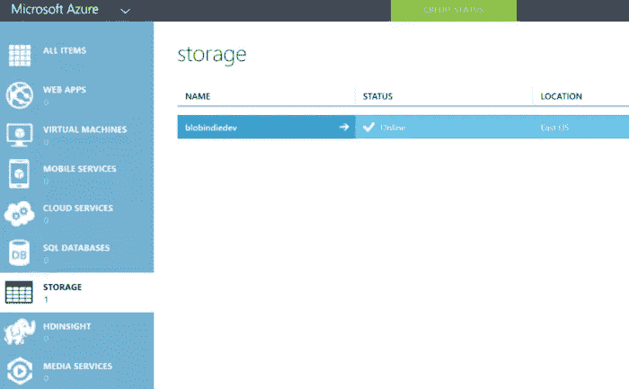

点击 blob 的名称，然后点击页面顶部的**容器**。你会在这里做一个新的。在页面底部，点击**添加**来创建一个新的容器。

我把我的播客命名为 T1，因为它将包含我所有的剧集。

默认情况下，容器是私有的，只能由帐户所有者访问。要允许对容器中的 Blob(. MP3)进行公共读取访问，但不允许对容器属性和元数据进行公共读取访问，请使用“公共 Blob”选项。要允许对容器和 blobs 的完全公共读取访问，请使用“公共容器”选项。我们需要公共容器。

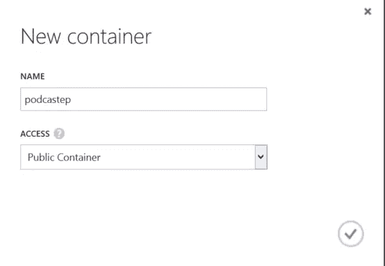

我们现在准备从 Visual Studio 上传文件到这个容器。

## 从 Visual Studio 上载文件

对于这一部分，你需要 Visual Studio。你可以从这里免费下载 VS 2013 社区版。你还需要 Azure SDK 来从 Visual Studio 访问你的 Azure 帐户。[在这里下载 SDK。](http://azure.microsoft.com/en-us/downloads/?WT.mc_id=13396-DEV-sitepoint-article20)您需要与您正在使用的 Visual Studio 版本相匹配的 SDK。如果你安装了 VS 2013，你会想要使用 [VS 2013 Azure SDK。](http://go.microsoft.com/fwlink/p/?linkid=323510&clcid=0x409?WT.mc_id=13396-DEV-sitepoint-article20)

安装好之后，打开 Visual Studio，点击**服务器浏览器**并寻找 Azure 按钮。点击**存储**，它会要求你登录你的账户。

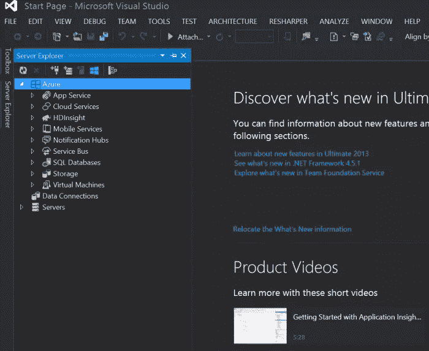

点击存储，你应该会看到你创建的新的 Blob 存储帐户，以及将托管剧集的容器。

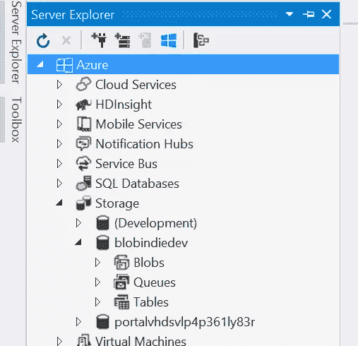

点击斑点图标/文本来查看你的容器。我看到播客，以及我上传到那里的任何文件。

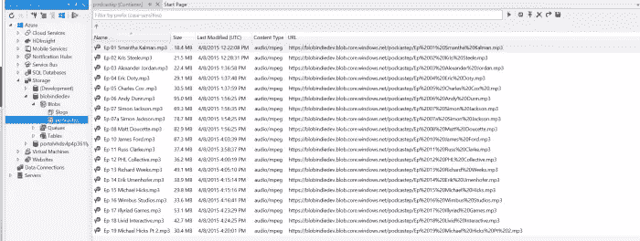

要上传您自己的文件，请单击上传 Blob 图标，这是一个指向水平线的箭头。

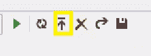

将出现一个弹出窗口，要求您浏览到要上传的文件。

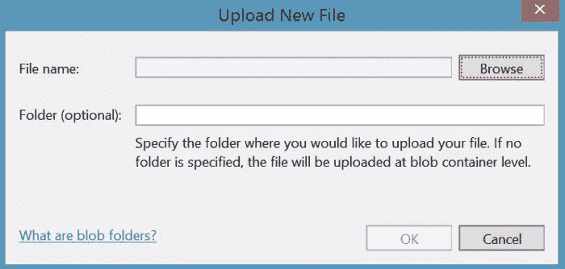

就我而言，我正在寻找播客剧集。你应该看到 **Azure 活动日志**出现在屏幕底部，通知你文件的当前状态。

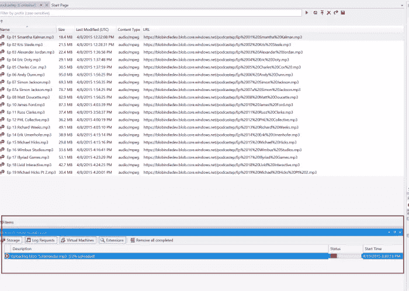

一旦它完成上传，右键单击文件，并复制网址。

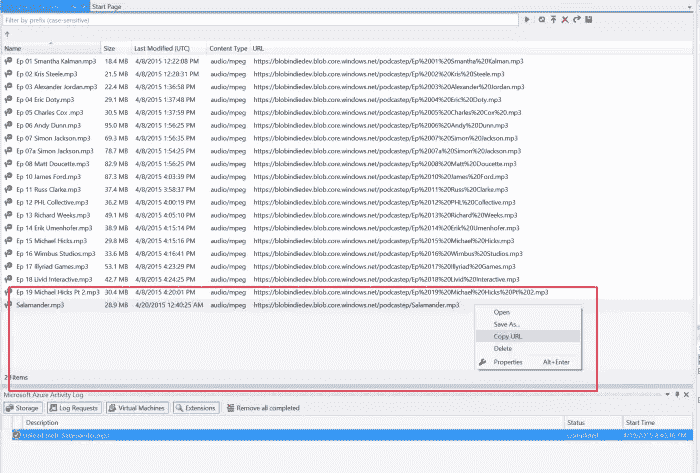

现在，其他人可以通过该 URL 下载您的文件！在我的网页上，我提供了每一集的链接，现在人们可以看到我所有的剧集了！

如果你导航回 Azure 门户，你可以看到它们都在那里。

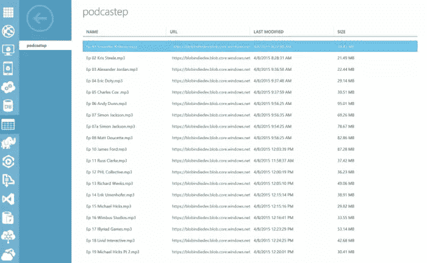

## 结论

Azure Blob 存储是在互联网上保存和服务内容的一种经济高效的方式。 [blob 存储页面](http://azure.microsoft.com/en-us/pricing/details/storage/?WT.mc_id=13396-DEV-sitepoint-article20)有更多的信息，但是希望在这之后，你能理解其中的价值。我可以录制我的播客，并轻松地提供给世界各地的任何人，而不必支付月费或自己建立任何硬件。最棒的是，我总共花了 5 分钟才把文件放到网上。

有什么问题吗？请随意伸出手。

以下是本系列教程的完整列表:

*   HTML5 视频简介
*   Azure 媒体服务、AES 和 PlayReady DRM 简介
*   使用 Azure 媒体服务的实时流 HTML5 视频
*   使用 Azure Blob 存储来存储和提供您的音频和视频文件
*   使用此 Azure Media Player 向所有设备播放流媒体服务视频
*   将视频上载到 Azure Media Services

本文是微软网站开发技术系列的一部分。我们很高兴与您分享微软 Edge 和新的 T2 Edge html 渲染引擎。获得免费虚拟机或在你的 Mac、iOS、Android 或 Windows 设备上进行远程测试@ [dev.modern.ie](http://dev.modern.ie/?utm_source=SitePoint&utm_medium=article20&utm_campaign=SitePoint)

## 分享这篇文章