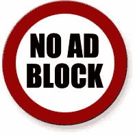

# 如何阻止广告拦截器

> 原文：<https://www.sitepoint.com/block-ad-blockers/>

我最近写了一篇关于[为什么选择不会被广告拦截器](https://www.sitepoint.com/file-naming-important/)无意中拦截的文件名很重要的文章。评论显示，广告屏蔽技术惹恼了许多网站所有者。如果他们不能获得收入作为回报，他们为什么要生产优质内容？

不可能检测广告拦截器的存在。使用不同的实现技术，并且它们不一定嵌入在浏览器中。广告拦截器也以不同的方式工作:一些使用一个很长的广告商域名列表，而另一些使用正则表达式来抑制匹配的 URL。

正则表达式匹配被最流行的拦截器之一使用， [Firefox 的 Adblock Plus 插件](http://adblockplus.org/)。但是，我们可以利用 URL 检查技术来阻止 Adblock 用户查看您的内容，除非他们禁用该插件。

您的 HTML 页面应该遵循以下示例:

```
 <!DOCTYPE html PUBLIC "-//W3C//DTD HTML 4.01//EN" "https://www.w3.org/TR/html4/strict.dtd">
<html lang="en">
<head>
<meta http-equiv="content-type" content="text/html; charset=UTF-8">
<title>Advert Blocker blocking</title>
<meta http-equiv="content-language" content="en"><meta name="language" content="en">

<style type="text/css">
#content { display: none; }

#blockermessage
{
	font-weight: bold;
	text-align: center;
	padding: 4px;
	color: #fff;
	background-color: #c00;
}
</style>

<script type="text/javascript" src="/banner-advert.js"></script>

</head>
<body>

	<div id="content">
		<h1>Main content</h1>
		<p>This will be hidden to people using advert blockers.</p>
	</div>

	<div id="blockermessage">
		<p>Please switch of your advert blocker and enable JavaScript to view this page.</p>
	</div>

</body>
</html> 
```

解释:

*   主要内容应该包含在一个外部元素中，比如`<div id="content">`。
*   你应该为使用广告拦截器的人提供替代信息，如`<div id="blockermessage">`所示。
*   页面上的前两个 CSS 规则对这些元素进行样式化是很重要的。由于外部 CSS 文件可以被阻止，我建议将其直接嵌入 HTML 中。#content 规则必须设置为`display: none`，而#blockermessage 规则可以设置为大字体、粗体或您选择的任何方式。
*   最后，包含一个外部 JavaScript 文件。这应该是一个文件/文件夹名称，将触发广告拦截规则，如横幅广告。js。

横幅广告. js 的代码:

```
 // reveal content to those not using an advert blocker
if (document.styleSheets && document.styleSheets.length > 0) {
	var ss = document.styleSheets[0];
	var bRule = (ss.cssRules ? ss.cssRules : ss.rules);
	if (bRule.length > 1) {
		bRule[0].style.display = "block";
		bRule[1].style.display = "none";
	}
} 
```

它的工作方式如下:

1.  加载页面时，每个人的主要内容都被关闭，只显示#blockermessage。
2.  对于大多数人来说，banner-advert.js 代码是立即执行的。这会改变嵌入的样式，因此#content 变得可见，而#blockermessage 被隐藏。它发生在主要内容显示之前，因此用户不会看到任何差异。
3.  AdBlock 会发现 banner-advert.js 并拒绝加载它。不会修改样式，因此主要内容保持隐藏。

这应该会让许多优质内容网站的所有者感到高兴。但是—打住— **我强烈建议你不要在你的网站上实现它！**有许多技术问题，阻止拦截器是徒劳的…参见[为什么阻止广告拦截器会失败](https://www.sitepoint.com/blocking-ad-blockers-will-fail/)。

另见:[为什么文件命名比你想象的更重要](https://www.sitepoint.com/file-naming-important/)。

## 分享这篇文章