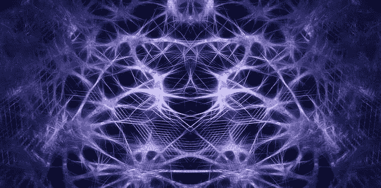
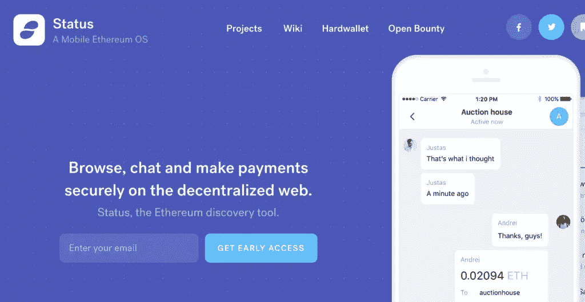
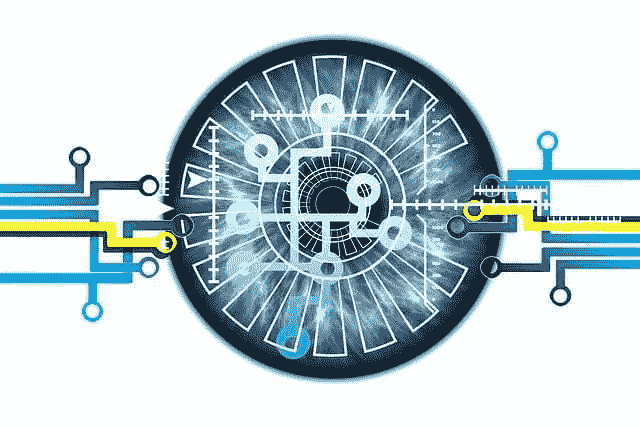

# 区块链的九大用途

> 原文：<https://www.sitepoint.com/blockchain-top-uses/>

**[区块链](https://bitfalls.com/2017/08/20/blockchain-explained-blockchain-works/)经常被[硬塞进它本不应该参与的项目](https://bitfalls.com/2018/05/10/probably-dont-need-blockchain-might-need-ico/)，所以很难发现它的长期可行性如何，以及它最终是否能真正被*用于*某些事情。**

考虑到这一点，我们编制了区块链的九大用途清单，这些用途不仅是可行的，而且是必要的和极有可能的。

## 1.财务自由

第一个也是最明显的用途是分散资金。比特币最初的目的是一种廉价、简单但不可信的方式，可以在一天中的任何时间向世界上的任何人转移货币价值。随着这一愿景慢慢消失，其他人接过了衣钵，现在有许多加密货币正在这么做。在跳过固定电话，直接使用有数据连接的智能手机的不发达国家，只要这些人愿意成为自己的银行，电子银行现在是可能的。

但是这有多大的可行性呢？如果像脸书、谷歌和 Twitter 这样的大公司可以被命令禁止与加密货币相关的广告，那么没有银行账户的人将需要越狱和有根的手机来安装一些进入加密货币所必需的软件。这可能是我们需要克服的一个障碍。毕竟，各种应用商店仍然高度集中。

尽管如此，区块链不仅能够让人们建立自己的信托基金(与以太坊签订智能合同)或者组织自己的储蓄和退休基金，这种能力是这个世界无法长期忽视的——不管是好是坏。

## 2.分散数据

运行在世界各地成千上万台机器上的区块链使得用数据做奇妙的事情成为可能。如果您突然获得了在世界上每台机器上运行代码、存储数据或处理数学运算的能力，您可以很容易地找到这可能变得有用的场景。

像假人和 iExec 这样的项目，通过将任务分成数千个更小的部分，并向每个部分返回一个经过验证的解决方案，在原点形成主解决方案，从而使分别像渲染图形或执行 CPU 指令这样的计算繁重的任务成为可能。想象一下，不用去租一台超级计算机，就能利用分布式计算在几秒钟内绘制出人类基因组，并以预先购买的代币支付执行者的费用！

数据存储的潜力是区块链的另一件大事。虽然我们确实有 Bittorrent 和类似的解决方案，但没有动力让文件*作为种子*保存，从而可以长时间恢复。像[【IPFS】](https://bitfalls.com/2017/10/29/ipfs-just-take-internet-back/)、Siacoin、Filecoin、Storj、Maidsafe、Datacoin 等项目正在开发以加密、保密但安全的方式在多台机器上存储文件的方法。例如，Siacoin 向用户付费，让他们出租多余的硬盘空间。用户通过 Sia 代币付费，虽然现在文件访问比 S3 和类似的私人解决方案慢，但它更便宜，并显示出很大的长期潜力。甚至对于数据库，也有 BigchainDB 和[类似的选项](https://www.sitepoint.com/managing-data-storage-with-blockchain-and-bigchaindb/)。

最后，游戏。随着所有数据和文件的分发，以及以太坊区块链安全网络的支持，[许多带有收藏品的游戏](https://bitfalls.com/2018/02/18/15-alternatives-cryptokitties-no-idea-existed/)已经出现。仍然有挑战需要解决，但随着像 [Loom 的 dappchains](https://bitfalls.com/2018/03/14/loom-token-lifelong-membership-loom-dappchains/) 这样的扩展解决方案，高吞吐量游戏终于成为可能。

## 3.分散式互联网和聊天

通过利用上面提到的分散数据，我们可以在世界各地的各种计算机上存储网站，并以分散的方式检索它们。

到目前为止，我们需要一个中央服务器(或其集群)来托管网站或在线传输信息，以太坊的 [Swarm 和 Whisper](https://ethereum.stackexchange.com/questions/375/what-is-swarm-and-what-is-it-used-for#388) 协议使基于区块链的聊天和分布式文件检索成为可能。

Status 和 Toshi 是第一批完全深入这些概念的平台，它们已经发展成为启动分散应用程序的平台。实际上，它们是自己的应用商店，公开了区块链 API，但也可以与安装它们的智能手机通信。这使得分散获取网站和发送消息成为可能。

一个不再能根据地区审查内容的脸书或 YouTube，或者一个不再能在叛乱发生时关闭的聊天平台:所有这些现在都成为了现实。这是 UX 的噩梦，我们正在努力解决，但它就在这里，而且很有效。

关于完全在区块链上运行的分散式 web 应用程序的示例，请参见 [DelegateCall](https://bitfalls.com/2018/03/13/delegatecall-first-real-web3-0-decentralized-app-stackoverflow-killer/) 。

## 4.不可变的记录

另一个相当简单的用例是不可变记录。这可以通过两种方式实现:验证式和全店式。

验证是指用户将文件的原件保存在某个地方，最好用某个权威机构或参与者或可证明身份的私钥签名，然后对其进行哈希处理。这个散列存储在区块链中，当重新散列文件时，可以很容易地验证其准确性。但是，这假定该文件存在于区块链之外的某个地方。

全存储方式是文件本身用私钥加密，并以某种方式完全存储在区块链上——也许使用上面的一种分散数据解决方案。然后，该文件将永远保持可访问性*和可验证性*。

这在很多领域都很有用。例如，犯罪记录不应该是可擦除的，你应该能够在任何时间、任何管辖范围内识别罪犯，甚至在跨越边境时自动识别。健康记录也是如此:它们没有理由不能被地球上的每个卫生机构互换和验证。加密健康记录很简单，需要时可以用病人的私钥当场解密，这可以是简单的指纹或虹膜扫描。

房地产或契约的所有权也是一个完美的用例:所有权可以易手，在这种情况下，新的所有者用旧所有者的私钥写在旧所有者之后，表示合法的交换，同时保留可自动审计的书面记录。

## 5.文明的自动化

参考上面的自动审计，我们可以使用区块链来去除很大一部分中介行业。房地产经纪人、经销商、许多律师和会计师……甚至税务稽查员。如果一个国家[过渡到发达的中央银行发行的加密货币](https://bitfalls.com/2017/10/31/dkuna-use-case-government-cryptocurrency-option/)，所有的交易将立即变成 100%准确的自动审计。这意味着没有税务报告，没有检查，没有罚款，没有金钱损失的痕迹。这是一个无现金社会 2.0。

## 6.民主(投票)

选举经常受到腐败和丑闻的困扰，更不用说排长队和年轻一代不去投票，因为这太不切实际了。将选举转移到区块链不仅使选举变得公平和可验证，还打开了择优投票的大门，许多人说这是唯一能够拯救民主的东西——而现在每个人都有一票……

在一个以功绩为基础的民主国家，这很容易在区块链实现自动化，就作物喷粉限制和法规而言，一个农民的投票权可能是律师的五倍。更重要的是，这让政府可以随时要求人民投票，而无需巨额竞选费用和随之而来的游行:在电子设备上发出简单的通知，用户就可以在自己舒适的家中进行投票。

## 7.忠诚度积分

一个更普通但同样受欢迎的(并且被广泛使用！)区块链的目的是忠诚度积分的象征化。随着区块链几乎免费的基础设施到位，以及像 [Loom 的 dappchains](https://bitfalls.com/2018/03/14/loom-token-lifelong-membership-loom-dappchains/) 这样的扩展解决方案正在工作中，许多公司正在过渡到用户收集可交易代币的忠诚度积分系统。

如果我有三个达美乐的代币，而我的朋友有五个，为什么我不能把我的三个代币发给她，这样她就可以通过简单地把代币发送到达美乐的以太坊地址来在线订购我们的免费的八个代币的比萨饼？

## 8.版税和作者证明

基于不可变记录方面，区块链还可以数字化创作内容的所有权。通过散列一个数字作品，比如一幅数字绘画、一首歌曲、一部电影或任何其他东西，并将其上传到区块链，你可以证明你是该作品的原作者——不可撤销。这种技术在法庭上完全可以作为证据，因为区块链是不可改变的，是关于某个州的真理的终极。这个状态表明，你证明了自己在某个时刻拥有这个作品。

正在运行的应用程序的一个例子就是 [Po.et](https://www.po.et/) 。

## 9.公司管理

最后，还有 Dao。一个 DAO 是一个去中心化的自治应用程序，和上面的民主点有点关系。政府可以使用区块链来统计选票，公司可以用区块链用户替换整个董事会。这就是今天道教徒所做的。

a 道会给投资人派发代币，这些代币作为投票权。该公司需要权衡的任何决定都将由代币持有者投票决定。例如，想象一个投资 DAO，它可以使用在投资阶段收集的以太坊投资到其他项目中。一位用户建议 YetAnotherICO 项目值得投资。该用户可以将此作为官方建议发送(全部自动)，其他人可以在一定时间内对他们的呼叫进行投票。取决于一个地址中有多少个令牌，这就是该地址的投票权重。如果大多数人投票赞成，这个建议就通过了。

现代 DAO 的一个有趣的用例是 [AmpNet](http://ampnet.io/) ，它让人们点对点销售电力，而一个著名的失败案例(由于代码编写不当)是 [DAO 事件](https://www.coindesk.com/understanding-dao-hack-journalists/)。

## 奖励:供应链

您可能已经听到许多专家提到供应链是区块链的一个很好的用例。这个想法是，使用 QR 码和传感器从原产地到目的地跟踪给定的商品，因此商店中的客户可以简单地扫描产品的 QR 码，并看到其整个原产地轨迹(因此，origin trail 公司)。

然而，只要有人在管道中，这就不是一个可行的选择。默认情况下，人类是会犯错的。它们是任何自动化系统中最薄弱的一点，如果一个卡车司机的冰箱在后面的西红柿箱上有区块链连接的温度传感器，而司机的工资取决于他的成功率，你可以肯定，大多数司机宁愿在加油站停下来，拿起冰，在空调故障时直接倒在传感器上，也不愿让机器人降低他们的工资。

只有当人类完全脱离商品的生产和运输时，我们才能在供应链中使用区块链。

## 结论

区块链是许多问题的可行解决方案，但对更多问题来说并不合适。当考虑你的项目是否需要区块链奖时，一定要在宣布你的项目基于区块链之前咨询区块链的专家。

不要因为营销原因把自己锁在一个技术里面。真正研究它是否可行。即使是这样，你也可能在解决问题时走在了时间的前面(比如供应链)，所以谨慎行事和等待比匆忙行事要好。

## 分享这篇文章