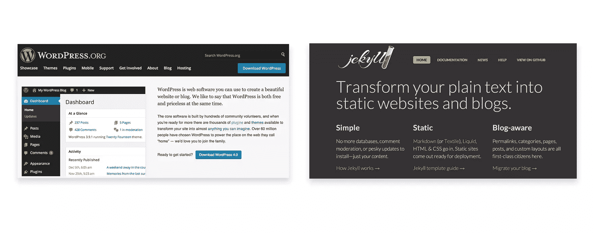

# 博客:WordPress 还是 Jekyll

> 原文：<https://www.sitepoint.com/blogging-wordpress-or-jekyll/>

**免责声明！**我其实不太喜欢写比较。虽然我总是试图保持中立和实事求是，但我觉得有些人总是感到被冒犯，被迫吹毛求疵或更糟。所以请让我提醒你**这篇文章仅仅是为了给两个平台**一个粗略的概述，以及你应该从每个平台期待什么。

所以你想创建自己的博客，或者把你的博客移植过来，但是你可能不知道哪个平台最适合你的需求。当然，在 **WordPress** 或 **Jekyll** 之外还有一个世界，但是为了简单起见，我们将只深入研究这两个。

首先，请允许我介绍两位:

> WordPress 是一个免费的开源博客工具和基于 PHP 和 MySQL 的内容管理系统(CMS)。功能包括插件架构和模板系统。
> ——[维基百科——WordPress](http://en.wikipedia.org/wiki/WordPress)

> 将你的纯文本转换成静态网站和博客。
> ——[Jekyllrb.com](http://jekyllrb.com/)

注意:这两个平台都完全能够支持复杂的网站，但是鉴于本文的篇幅，我们将只关注博客部分。

## 数据存储

真正区分这些平台的第一件事是它们处理数据的方式，在我们的例子中是文章的集合。

WordPress 是一个基于 MySQL 的 CMS，所有的东西都存储在一个数据库中。WordPress 然后在需要的时候读取和写入这个数据库，获取现有的和添加新的内容。

它一文不值 WP 商店不仅仅是文章。例如，在这一点上，这可能比文章更重要，WordPress 存储帐户凭证。要登录你的仪表板并写文章，你必须输入你的用户名和密码，这样你就可以访问管理区，授予访问数据库。

另一方面，Jekyll 基本上是一大堆只为构建静态网站而编译的文件。就其本身而言，如果 Jekyll 站点没有首先被编译成 HTML/CSS，任何服务器或浏览器都无法读取或服务它。因此，尽管用 Ruby 编写，Jekyll 实际上完全不需要服务器端语言或数据库系统。

## 主办；主持

无论你最终选择什么，托管都应该与你有关，并对你的决定产生影响。这两个系统实际上并不完全相同。

WordPress 作为一个 PHP/MySQL CMS 需要托管在一个支持 PHP 5.2.4 或更高版本和 MySQL 5.0 或更高版本的服务器上。WordPress 官方推荐 [Apache](http://httpd.apache.org/) 或者 [Nginx](http://nginx.org/) 。然而，一旦所有的东西都在服务器上设置好了，你就不必时不时地推新的东西，因为所有的东西都存储在数据库中。

说到 Jekyll，我怎么推荐都不够 [GitHub Pages](https://pages.github.com/) 主持。事情是这样的，GitHub 页面支持 Jekyll，也就是说完全兼容。当你将一个未编译的 Jekyll 项目(它有一些非常特殊的特征)推送到 GitHub 库的一个 [`gh-pages`分支](http://jekyllrb.com/docs/github-pages/#project-pages)(公共的或私有的，没关系)，GitHub 会在其端编译它并服务它。

这意味着你不必在你的机器上编译你的项目，然后推送到服务器上。您可以将未编译的源代码推到您的存储库中，将编译留给 GitHub Pages 来完成。

这也意味着你可以直接通过 GitHub 更新你的网站，并使用 GitHub 作为一个 CMS，这可以非常方便地修复打字错误和一些小问题。也就是说，当你的文章涉及到图片之类的东西时，克隆、工作、提交和推送会方便得多。

无论如何，您也可以决定在您的机器上编译您的 Jekyll 项目，并将其推送到与 GitHub 完全无关的服务器上，但是由于 Jekyll 根本不依赖于任何数据库，所有东西都只是文件，因此您需要将每篇新文章推送到您的服务器上，这可能会很繁琐。

## 写作

在 WordPress 中写一篇文章需要经过以下步骤:

1.  使用您的安全凭证登录您的 WordPress 仪表盘；
2.  进入“文章”部分创建一篇新文章；
3.  在 WordPress 编辑器中写你的文章(Markdown 需要一个插件)；
4.  通过 WordPress 预览系统预览一下；
5.  发布它让它活起来。

在 Jekyll 写一篇文章:

1.  在您的计算机上打开 Jekyll 项目的未编译源代码；
2.  在`_posts`文件夹中新建一个文件；
3.  在 Markdown 中写你的文章；
4.  运行`jekyll serve`预览您的文章；
5.  然后:
    1.  如果你通过 GitHub 页面托管，就推送你的库；
    2.  运行`jekyll build`并在你的服务器上推送，如果你托管编译过的站点的话。

## 最后的想法

现在，我的观点是:如果你不害怕命令行(通常不会比`jekyll build`长)，GitHub 是你的一个选择，Jekyll 是完美的工作流程。对于一个技术相关的博客，我怎么推荐都不为过。

现在，如果你正在为一个不太懂技术的人建立一个博客，或者想在几分钟内准备一些简单的东西，免费/便宜主题的 WordPress 可能对你来说足够好了。

我不喜欢 WordPress 的是它使用数据库，这直接涉及到一些安全问题(凭证、黑客、服务器……)，并且可能会慢，这取决于你的主机和你的主题的质量。如果你问我，WordPress 对于一个简单的个人博客来说是一个大材小用的解决方案。

另一方面，Jekyll 一开始可能看起来有点可怕，但如果你至少有一些技术背景，最终会非常容易和舒适地使用。当涉及到我自己的网站/博客时，我喜欢控制一切，这正是 Jekyll 允许我做的。

## 分享这篇文章