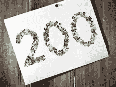

# 博客世界播客庆祝 200 集

> 原文：<https://www.sitepoint.com/boagworld-podcast-celebrates-200-episodes/>

**[SitePoint 播客](https://www.sitepoint.com/podcast/)背后最大的灵感来源之一是长期播出的 [Boagworld 播客](http://boagworld.com/)，它在上周播出了第 200 集 [12 小时直播马拉松](http://boagworld.com/news/200-live)。**

除了《博客世界》的主持人保罗·博格和马库斯·利灵顿之外，还有一大批明星嘉宾，包括 SitePoint 的作者瑞秋·安德鲁和 T2，SitePoint 的播客主持人帕特里克·奥基夫，以及其他“Britpack”的名人，如安迪·克拉克、德鲁·麦克勒朗和丹·鲁宾。

这场直播马拉松取得了巨大的成功，一些参与者[说这场秀](http://www.rachelandrew.co.uk/archives/2010/02/13/women-and-the-backchannel/)感觉就像一场免费的网络会议。编辑后的版本将于 2 月 19 日(星期五)发布在[博客世界网站](http://boagworld.com/)(和播客馈送)上，采访记录将在未来几周和几个月内发布。

说到播客里程碑，**请务必在 2 月 26 日下周五收看 [SitePoint 播客#50](https://www.sitepoint.com/podcast/) 。**

恭喜你，Boagworld。再敬 200 块。

## 分享这篇文章