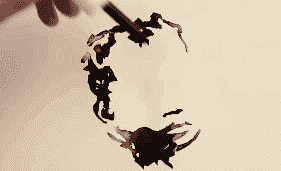
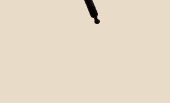

# 嘣！一个完美想法落地的声音

> 原文：<https://www.sitepoint.com/boom-sound-perfect-idea-landing/>

> 媒介就是信息。

这个短语是由[马歇尔·麦克卢汉](https://en.wikipedia.org/wiki/Marshall_McLuhan)在 60 年代中期创造的。马歇尔是一位有影响力的作家和思想家，他也给了我们“[地球村](https://en.wikipedia.org/wiki/Global_village_(term))”这个术语。

他认为，一种新发明的媒体对社会的*影响——即书籍、电视或电影——比为该媒体创造的任何一个单独的内容都要重要得多。*

 *麦克卢汉于 1980 年去世，但随着互联网的兴起，他的思想又大规模地重新流行起来。他是 BoingBoing 一代的代表人物。

今天我只想展示一件设计作品，它可能是我见过的最令人惊叹的信息与完美媒介的融合。

国际人道主义组织国际团结组织(Solidarités International)希望通过一场宣传活动来纪念[世界水日](http://www.unwater.org/worldwaterday)，强调不可饮用水的危害。

在这个[惊人的视频片段](https://www.youtube.com/watch?v=fq9mw8wR-1Q)中，克莱门特·博韦从在防油纸上创作隐形水彩画开始。水珠在纸上形成清澈的小溪。

但是现在奇迹出现了！

克莱门特用滴管向水中加入一滴墨水，黑暗立刻在水状物体中涌动。看着这些图像不知从哪里冒出来，真是令人惊讶。

看着清澈的水被墨水“污染”,还有一种奇怪的心理上的不舒服。

这既是一场表演，也是一件艺术品，因为克莱门特必须准确把握滴水的时间，以创造出正确的色调平衡。

### (墨水)瓶中的信息

这个克莱门特工作的主要目的是让记者帮助公众关注水污染问题。

当然，核心信息是？

> 你的墨水有助于让看不见的问题变得可见

对我来说，这几乎是最完美的例子:**信息+媒介=杰作**。

点击此处观看完整视频。

最初发表于 [SitePoint 设计简讯](https://www.sitepoint.com/newsletter/)。* 

## *分享这篇文章*