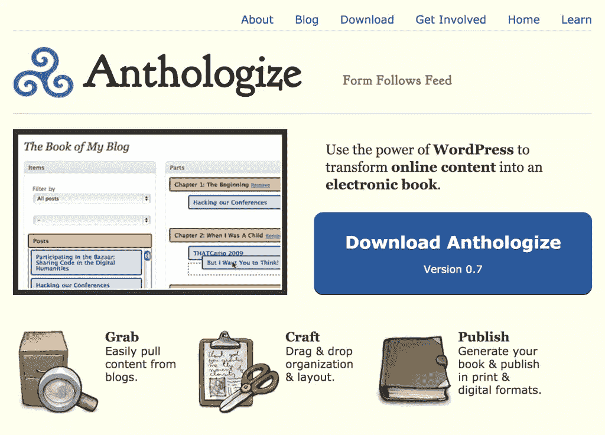
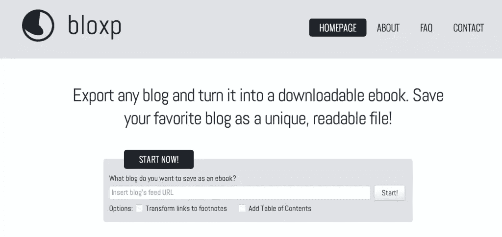
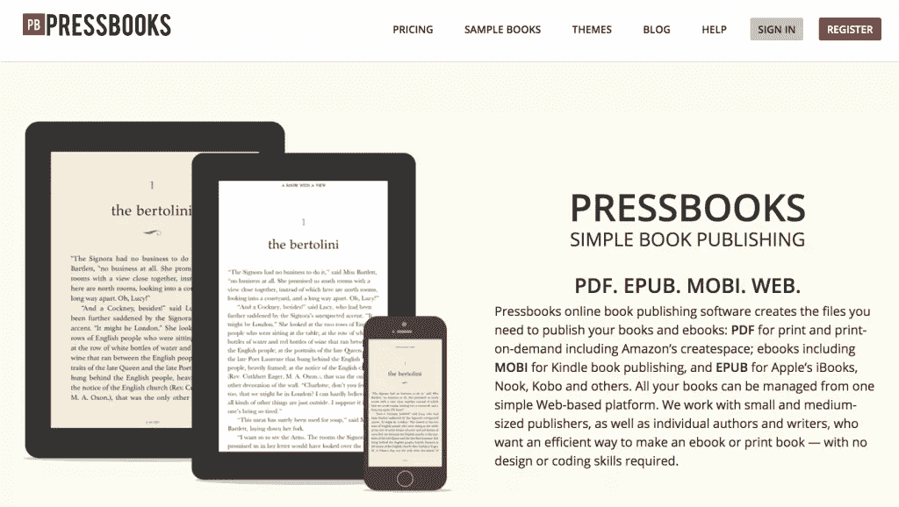

# 通过把你的 WP 博客变成电子书来提升你的品牌

> 原文：<https://www.sitepoint.com/boost-brand-turning-wordpress-blogs-ebooks/>

本文由 [99designs](https://99designs.com.au/) 为您带来。[他们推出了一项新的书籍封面设计服务](https://99designs.com.au/book-cover-design)。作者和出版商现在可以举办比赛来寻找他们的读者会喜欢的书的封面！本文更新于 1 月 20 日。

如果你有一个 WordPress 博客，很有可能你已经写了或者将要写足够的内容来写一本书。即使你没有足够的 200-300 页的材料，记住，今天许多电子书只是 10-100 页面，这取决于目的和目标受众。如果你想建立读者群，增加你的读者群的最好方法之一就是改变你内容的用途。通过将你最好的博客文章组合成一本小册子，你可以用它作为赠品来改进你的[电子邮件营销策略](https://www.sitepoint.com/email-marketing-strategies-actually-work/)，甚至出售指南来获利，或者只是将这些材料作为提高你可信度的一种方式。

虽然将你的博客文章打包成电子书听起来是一项艰巨的任务，但是 WordPress 的多功能性使得你可以使用现成的插件轻松转换你的内容。

## 将… 收入选集

Anthologize 是一个开源插件，它允许你使用拖放编辑器，点击几下就可以创建你的电子书。使 Anthologize 从其他工具中脱颖而出的特性是，它与你现有的网站挂钩，而不是要求你将内容放入一个空白的 WordPress 安装中。

安装插件时，用户在安装时会看到一个新的面板。只需为您计划创建的每本书创建一个项目。从那里，添加内容到你的书就像在 WordPress 中创建一个菜单。唯一的区别是，当你调用博客文章时，不是创建菜单按钮，而是从你的大纲生成电子书。

Anthologize 甚至支持从外部 RSS 提要中提取内容，因此如果您有跨 web 的内容(或者正在为客户打包内容)，您可以从一个中心位置轻松处理它。

虽然这对于很多人来说是一个很好的工具，但是最大的限制是你需要有一个自托管的 WordPress 安装程序来运行它。Anthologize 不支持 WordPress.com 托管的网站，因为该平台不允许用户在自己的网站上添加自定义插件。

## Bloxp

对于那些喜欢使用 WordPress.com 来满足出版需求的用户来说， [Bloxp](http://www.bloxp.com/) 是一个有用的工具，它可以让你创建电子书而不用担心技术上的麻烦。

只需输入包含您想要的内容的 RSS 提要，然后使用 Bloxp 站点选择要导出的特定部分。从那里你可以下载你的电子书。

Bloxp 的两个最大限制是，只能导出为 EPUB 格式，最终产品有一个包含水印的封面。虽然您可以随时创建自定义封面，并在需要时将 EPUB 文件转换为其他格式( [Calibre](http://calibre-ebook.com/) 是一个优秀的定制工具)，但这两个步骤都是您需要采取的额外步骤，而不是现成的。

## 印刷书籍

如果你计划经常出版数字小册子，那么 [PressBooks](http://pressbooks.com/) 可能是你的工具。PressBooks 与其他 WordPress 出版解决方案有一点不同，因为这个插件只适用于新安装的 [WordPress multisite](http://codex.wordpress.org/Create_A_Network) 。总的来说，WordPress multisite 的设置和配置并不太难，但是如果你不习惯手动改变你的 wp-config 文件，那么这个插件可能不太适合你。

PressBooks 最值得注意的资产是插件中包含的广泛的主题选择，该插件为您提供了多种格式选项，这些选项已被确认可以在各种设备上工作。此外，PressBooks 支持从 Microsoft Word 导入内容，此外，如果您希望一个项目有多个参与者，也可以在插件中设置。

PressBooks 有免费版和付费版。免费版本可以作为插件安装在你的自托管网站上，但它会在你创建的文件上添加水印。要删除水印，EPUB 和 MOBI 文件的一次性费用为 25 美元/本，PDF 文件导出的清理费用为 100 美元/本。

## 打磨你的材料

虽然本指南概述了一些你可以为网络打包内容的方法，但是如果你真的想将你的材料付诸实践，你应该仔细阅读如何通过你的产品获得被动收入。除了帮助你赚取额外的钱，为你的客户提供数字产品也是提高你可信度的一笔巨大财富。

此外，请记住，虽然这些工具极大地帮助简化了自助出版过程，但它们并不是完美的解决方案。根据帖子内容的类型，你可能需要自己手动编辑页面布局，或者与熟悉电子书创作的有经验的设计师联系。

## 分享这篇文章