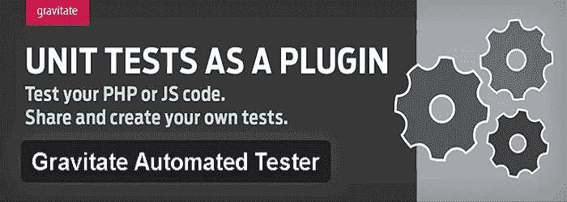
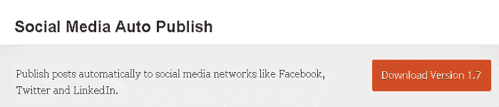

# 用 5 个 WordPress 自动化工具提高生产力

> 原文：<https://www.sitepoint.com/boost-productivity-with-5-tools-for-wordpress-automation/>

管理一个 WordPress 站点可能是一项具有挑战性的任务，尤其是当你的站点有很多 web 访问者的时候。有一大堆活动，从定期创建优质内容，到跟踪评论，管理社交媒体网络，到实施内容营销策略等等，你需要管理一切。

虽然 WordPress 是一个巧妙的平台，但你需要花费大量的时间和精力让你的网站从各个角度看起来都很出色。你总是需要确保你对你的网站所做的改变对你有利。然而，分析每一个 WordPress 任务变得困难，但是在 WordPress 自动化工具和插件的帮助下，你可以轻松实现你的目标。

幸运的是，WordPress 提供了大量的工具和插件，可以让你在几分钟内自动完成你的任务。通过让你的 WordPress 站点自己完成所有繁重的工作，你将能够把更多的精力放在其他能够提高你的生产力和效率的重要方面。

这里列出了一些最好的 WordPress 工具和插件，它们可以自动完成你网站的一些关键任务。

## 1.重力自动测试仪

可用性: [WordPress 插件目录](https://wordpress.org/plugins/gravitate-automated-tester/)

Gravitate Automated Tester 使您可以轻松地对 PHP 或 JavaScript 代码进行测试。虽然它是开发人员的理想选择，但是任何人都可以使用它——这都要归功于它简单且用户友好的界面。

该插件只是检查 PHP 错误、JavaScript 错误和其他警告。事实上，它允许搜索引擎在生产中自动索引您的站点，而不允许搜索引擎在开发和试运行中索引您的站点。

## 2.社交媒体自动发布

可用性: [WordPress 插件目录](https://wordpress.org/plugins/social-media-auto-publish/)

这是 WordPress 的一个神奇的社交媒体自动化插件，可以自动发布帖子到流行的社交媒体网络，如脸书、LinkedIn 和 Twitter。这个插件简化了在文章中附加图片的过程。

社交媒体自动发布插件的最佳功能是，它允许你在几秒钟内按类别或自定义帖子类型过滤分享。然而，你需要为每个社交网络档案创建一个应用程序，以便将你的帐户与插件连接起来，但这是一个简单的过程，所以你不需要担心。

## 3.WordPress 转 Twitter

可用性: [WordPress 插件目录](https://wordpress.org/plugins/wp-to-twitter/)

每当你更新你的 WordPress 博客或者添加一个链接，这个插件会自动发布一个 Twitter 更新，以及所选择的 URL 缩短服务。

由于 Twitter 已经成为分享博客文章的最佳社交分享平台之一，你应该将 WordPress 整合到 Twitter 插件中来自动完成这个社交媒体营销任务。向博客文章主题添加标签变得很容易，因为您可以在发布之前格式化您的推文。

此外，每当帖子发布时，它会自动将发布的帖子发送到您的 Twitter 个人资料中。该插件还有一个高级版本，可以让你安排推文，多次推文或添加图片。

## 4.协同计划

可用性: [WordPress 插件目录](https://wordpress.org/plugins/coschedule-by-todaymade/)

CoSchedule 是 WordPress 的一个编辑器日历插件，帮助你在日历视图中自动安排文章。这是内容营销和社交调度的理想工具。它让你和你的团队在不同的社交媒体营销活动中有条不紊，从而节省你的时间。

你所需要做的就是将这个插件集成到你的 WordPress 站点中，它将帮助你在几秒钟内协作、安排和自动化你所有的社交媒体和内容营销活动。

## 5.UpdraftPlus

可用性: [WordPress 插件目录](https://wordpress.org/plugins/updraftplus/)

如果您想自动执行站点的备份和恢复任务，那么 UpdraftPlus 是您的理想选择。你可以把你的网站备份到云端，Google Drive，Rackspace Cloud，Dropbox 或者 UpdraftPlus Vault。然后，您甚至可以通过几次点击来恢复。

该插件会自动重复运行备份，让您专注于其他重要的事情。事实上，它会自动恢复或撤销失败的上传，并允许你直接从你的 WordPress 仪表盘下载备份档案。

## 结论

自动化不同的 WordPress 任务可以帮助你专注于网站的其他重要方面，提高你的工作效率，让你为你的业务创造更多的商机。

在这 5 个插件的帮助下，你可以自动完成你的 WordPress 站点的任务，帮助你成为一个成功的站点所有者。

## 分享这篇文章