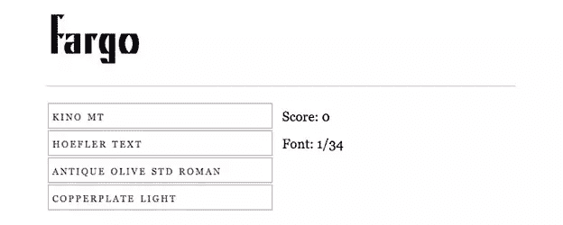
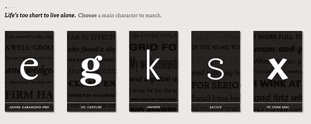
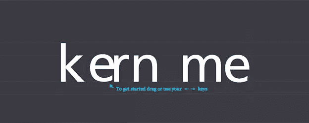
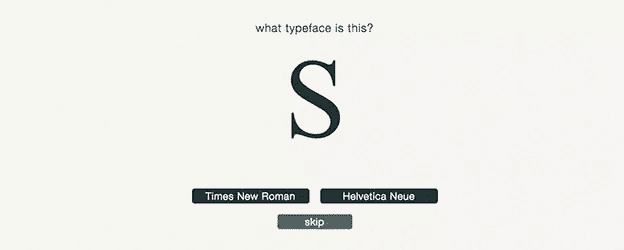
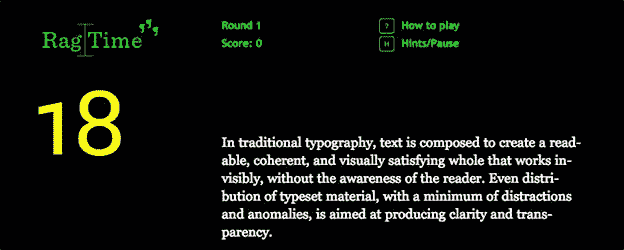
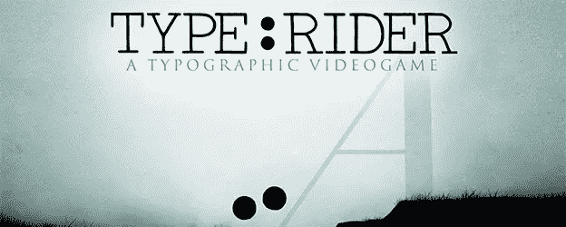

# 用这些有趣的排版游戏来提升你的技能

> 原文：<https://www.sitepoint.com/boost-skills-fun-typography-games/>

这里有一些乐趣。我们已经收集了一系列有趣的印刷游戏，肯定会考验你的知识。快速配对字体，眨眼之间识别字体，改进字距调整，了解一些您最喜欢的字体背后的历史。

最棒的是？几乎所有这些游戏都是免费的！

### 1.[相当难的字体游戏](http://fontgame.ilovetypography.com/)

通过难度较大的字体游戏学习快速阅读字体。这个概念很简单:文本将出现在每一轮，你的任务是识别它。当心…这比看起来要难！

### 2.[类型连接](http://www.typeconnection.com/step1.php)

[type connection](http://www.typeconnection.com/step1.php)——“印刷约会游戏”——帮助设计师通过瞬间决策增强他们的字体配对能力，确保每个级别的设计师都能快速上手。一个很好的触摸是翻转功能，它显示每种字体的历史意义，独特的属性和字母结构，包括大写高度，x 高度和基线。

### 3.[内核类型](http://type.method.ac/)

还在研究你的[字距调整](http://99designs.com/designer-blog/2014/01/20/11-kerning-tips/)技能吗？ [Kerntype](http://type.method.ac/) 会让你立刻成为职业选手！只需使用箭头键或鼠标将中间的字母拖到正确的位置。当你完成后，点击“比较”,看看你的工作如何达标。

### 4.[类型战争](http://typewar.com/)

类似于难度相当大的字体游戏， [Typewar](http://typewar.com/) 挑战你只用一个*字母*来识别字体，从而提高赌注。看看你能达到什么水平，并与其他玩家进行比较，以衡量你做得有多好。

### 5.[拍摄衬线](http://www.tothepoint.co.uk/more/fun/shoot_the_serif/)

“[我拍了衬线](http://www.tothepoint.co.uk/more/fun/shoot_the_serif/)”可能是一个愚蠢的文字游戏，但对于初学设计的人来说，这是一堂宝贵的课。通过瞄准衬线字母和不惜一切代价避免无衬线字母来摆正你自己！

### 6.[拉格泰姆](http://fathom.info/ragtime/game.html)

对于任何级别的设计师来说，制作干净的抹布都是一件痛苦的事情。输入:[Rag Time](http://fathom.info/ragtime/game.html)-这是一种有趣的方式，当你随着俗气的 Rag Time 音乐的曲调砍下一段段文字时，可以加快你的排版技巧。

### 7.[类型:骑手](http://typerider.arte.tv/#/)

这款屡获殊荣的手机游戏因其令人惊叹的视觉效果和字体集成而引起了广泛关注。专注于字体的历史意义，你将探索 10 个主题世界，这些世界与世界上最著名的字体相呼应，包括 Garamond、Helvetica 等。

在这里先睹为快[、](https://vimeo.com/71401892)然后在 [iOS](https://itunes.apple.com/us/app/type-rider/id667443268) 或 [Android](https://play.google.com/store/apps/details?id=com.bulkypix.typerider) 上下载(起价 2.99 美元)。

#### 有另一个有趣的排版游戏添加到组合？分享到评论里吧！

*经 [99designs 设计博客](http://99designs.com/designer-blog/)许可转载。*

## 分享这篇文章