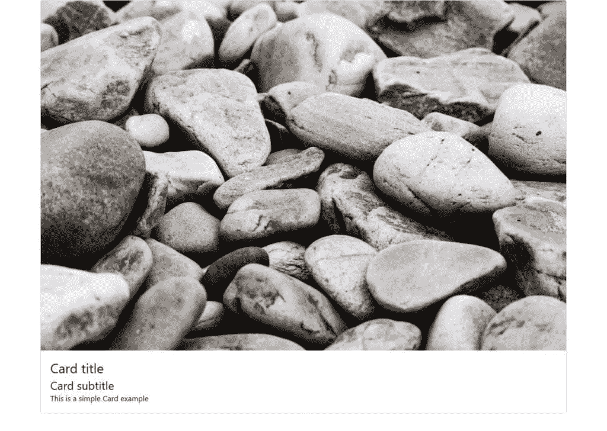
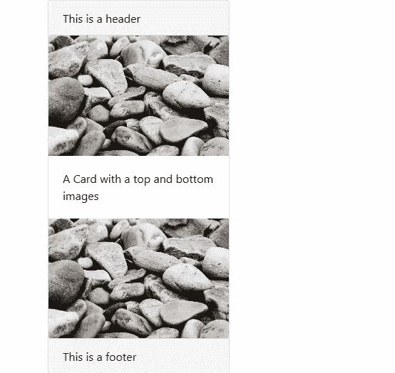
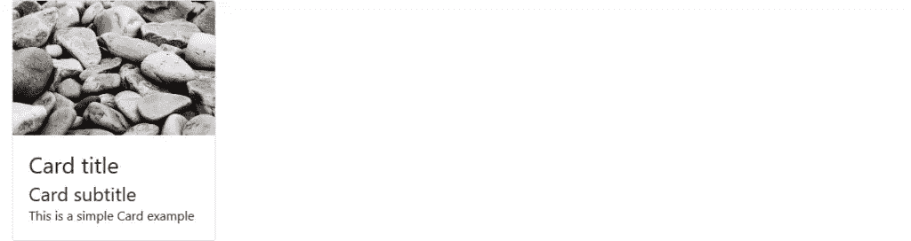
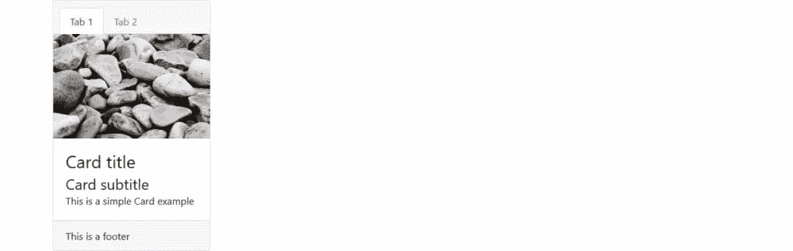
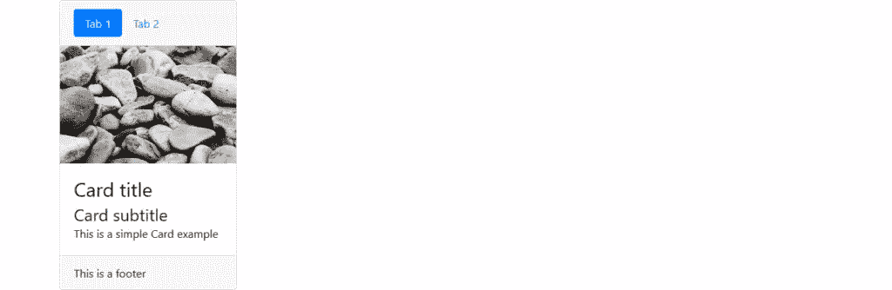
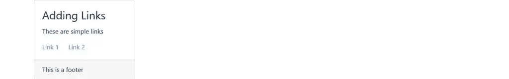

# 引导卡组件:完整介绍

> 原文：<https://www.sitepoint.com/bootstrap-card-component-introduction/>

在本文中，我将向您介绍引导卡组件，并带您了解它的许多特性和用途。在本教程结束时，您将能够在 web 项目中使用引导卡来实现出色的布局和页面内容组织。

Bootstrap 是最流行的 HTML、CSS 和 JavaScript 框架，用于快速创建响应迅速、移动优先的 web 布局。

使用 Bootstrap 为开发人员提供了许多优势，包括:

*   您只需具备一些 HTML 和 CSS 知识，就可以轻松快速地构建一个响应式布局
*   该库旨在实现移动性——首先从核心开始
*   它兼容所有现代浏览器等。
*   它的网格系统使用 Flexbox
*   它提供了大量的特性和组件。

最新版本的 Bootstrap 提供了许多新的现代功能，例如对 Flexbox 的支持，以及新的[卡组件](http://getbootstrap.com/docs/4.0/components/card/)，它取代了早期版本库中的面板、缩略图和孔。

## 什么是自举卡组件？

Bootstrap 引入了一个新的 UI 组件来创建卡片，它为显示内容提供了一个灵活而时尚的容器。卡片有最小的样式，但是你可以很容易地用额外的样式选项扩展它们。

该组件构建在 Flexbox 之上，您可以使用 Bootstrap [spacing 实用程序类](https://getbootstrap.com/docs/4.0/utilities/spacing/)进行边距和填充。

卡片可以方便地容纳不同类型的内容，如标题、副标题、正文和图像等。，以及可选的页眉和页脚部分。您也可以包含不同的部分(卡块),根据您的用途构建不同类型的卡。

## 在您的项目中包含 Bootstrap

你可以很容易地在你的网站上开始使用 Bootstrap，要么从 CDN 下载，要么从 getbootstrap.com 下载。

为了介绍新的 Bootstrap card 组件，您将创建一个简单的具有 Bootstrap 样式的 HTML 页面来演示 card 组件的基本元素。继续在您的项目文件夹中创建`index.html`文件，然后从 [docs starter 模板](https://getbootstrap.com/docs/4.0/getting-started/introduction/)中添加以下内容:

```
<!doctype html>
<html lang="en">
  <head>
    <!-- Required meta tags -->
    <meta charset="utf-8">
    <meta name="viewport" content="width=device-width, initial-scale=1, shrink-to-fit=no">

    <!-- Bootstrap CSS -->
    <link rel="stylesheet" href="https://maxcdn.bootstrapcdn.com/bootstrap/4.0.0/css/bootstrap.min.css" integrity="sha384-Gn5384xqQ1aoWXA+058RXPxPg6fy4IWvTNh0E263XmFcJlSAwiGgFAW/dAiS6JXm" crossorigin="anonymous">

    <title>Bootstrap Card Example</title>
  </head>
  <body>
       <div class="container">    
    </div>

    <!-- Optional JavaScript -->
    <!-- jQuery first, then Popper.js, then Bootstrap JS -->
    <script src="https://code.jquery.com/jquery-3.2.1.slim.min.js" integrity="sha384-KJ3o2DKtIkvYIK3UENzmM7KCkRr/rE9/Qpg6aAZGJwFDMVNA/GpGFF93hXpG5KkN" crossorigin="anonymous"></script>
    <script src="https://cdnjs.cloudflare.com/ajax/libs/popper.js/1.12.9/umd/popper.min.js" integrity="sha384-ApNbgh9B+Y1QKtv3Rn7W3mgPxhU9K/ScQsAP7hUibX39j7fakFPskvXusvfa0b4Q" crossorigin="anonymous"></script>
    <script src="https://maxcdn.bootstrapcdn.com/bootstrap/4.0.0/js/bootstrap.min.js" integrity="sha384-JZR6Spejh4U02d8jOt6vLEHfe/JQGiRRSQQxSfFWpi1MquVdAyjUar5+76PVCmYl" crossorigin="anonymous"></script>
  </body>
</html> 
```

我们包含了来自不同 cdn 的引导文件及其依赖项(jQuery 和 popper.js ),然后创建了一个容器部分。

## 卡片的最小样式

为了制作一张基本的卡片，我们需要—

*   使用带有`div`标签的`.card`创建外部容器
*   将`.card-body`类添加到内部的`div`标签中，以创建卡体
*   使用带有标题标签的`.card-title`和`card-subtitle`类来添加标题和副标题
*   使用带有`<p>`标签的`card-text`类来添加文本内容
*   使用带有``标签的`card-img-top`类将图像添加到卡片的顶部。

这些是构成完整但基本的卡片布局的基本元素，我们可以从下面的例子中看到:

```
<div class="card">
  
  <div class="card-body">
    <h3 class="card-title">Card title</h3>
    <h4 class="card-subtitle">Card subtitle</h4>
    <p class="card-text">This is a simple Card example</p>
  </div>
</div> 
```

这是结果的截图:



可以看出，卡片占据了其容器`div`的整个宽度。

通过简单地将`card-body`类与`card-img-overlay`类进行切换，我们可以将图像用作覆盖图:


我们还可以使用带有``标签的类`.card-img-bottom`来在卡片底部添加图像:

```
<div class="card">
  <div class="card-header">
      This is a header    
  </div>
  
  <div class="card-body">
      <p class="card-text">A Card with a top and bottom images</p>

  </div>
  

  <div class="card-footer">
          This is a footer
  </div>
</div> 
```



卡片顶部和底部图像被称为[图像帽](https://getbootstrap.com/docs/4.0/components/card/#image-caps)。

## 控制自举卡组件的宽度和高度

默认情况下，卡片占据其父容器中所有可用的宽度，但是您可以使用`width`和`max-width`类来控制卡片的尺寸。因此，让我们通过减小卡片的宽度来改变前面的示例:

```
<div class="card" style="width:20rem;">
  
  <div class="card-body">
    <h3 class="card-title">Card title</h3>
    <h4 class="card-subtitle">Card subtitle</h4>
    <p class="card-text">This is a simple Card example</p>
  </div>
</div> 
```


通常情况下，卡片的高度会被调整以垂直适应卡片的内容，但我们也可以使用自定义 CSS(例如，`style=" height: 10rem;"`)或 Bootstrap 的大小调整实用程序(例如，`<div class="card h-200">`)来控制它。

请注意，Bootstrap 的最新版本已经切换到了*雷姆*单位，而不是 *px* 单位，因为*雷姆*是一个可缩放的测量单位——因此它与用户设置配合得更好，这使得文本更加[易于访问](https://www.sitepoint.com/making-bootstrap-accessible/)。结果是页面中的所有元素都将随着屏幕大小而缩放。(你可以在 SitePoint 的“ [Bootstrap:赢得你的超级智能特性](https://www.sitepoint.com/bootstrap-super-smart-features-to-win-you-over/)”文章中找到更多关于 Bootstrap 的新特性。

控制引导卡组件宽度的另一个选项是使用[引导网格](http://getbootstrap.com/docs/4.0/layout/grid/)(行和列):

```
<div class="row">
    <div class="col-sm-3">
        <div class="card">
            
            <div class="card-body">
                <h3 class="card-title">Card title</h3>
                <h4 class="card-subtitle">Card subtitle</h4>
                <p class="card-text">This is a simple Card example</p>
            </div>
        </div>
    </div>
</div> 
```



## 引导卡组件页眉和页脚

通过添加分别带有`.card-header`和`.card-footer`类的标题(`<h*>`)和`div`标签，引导卡组件可以选择性地具有页眉和页脚。

继续我们的示例，让我们为引导卡组件添加一个页眉和页脚:

```
<div class="row">
    <div class="col-sm-3">
        <div class="card">
            <div class="card-header">
                This is a header
            </div>
            
            <div class="card-body">
                <h3 class="card-title">Card title</h3>
                <h4 class="card-subtitle">Card subtitle</h4>
                <p class="card-text">This is a simple Card example</p>
            </div>
            <div class="card-footer">
                    This is a footer
            </div>
        </div>
    </div>
</div> 
```

这是结果的截图:


## 添加导航

Bootstrap card 组件的另一个很好的特性是可以向标题部分添加高级导航模式，比如选项卡和导航药丸。

因此，让我们改变一下我们的简单示例，在卡片的标题部分添加一个选项卡式导航元素，在`<ul>`标签上添加`.nav-tabs`和`.card-header-tabs`类:

```
<div class="card-header">
  <ul class="nav nav-tabs card-header-tabs">
    <li class="nav-item">
        <a class="nav-link active" href="#">Tab 1</a>
    </li>
    <li class="nav-item">
        <a class="nav-link" href="#">Tab 2</a>
    </li>
  </ul>        
</div> 
```



同样，我们可以通过简单地在`<ul>`列表标签上用`nav-pills`替换`.nav-tabs`，用`card-header-pill`替换`.card-header-tabs`来添加导航药丸:

```
<div class="card-header">
  <ul class="nav nav-pills card-header-pill">
    <li class="nav-item">
        <a class="nav-link active" href="#">Tab 1</a>
    </li>
    <li class="nav-item">
        <a class="nav-link" href="#">Tab 2</a>
    </li>
  </ul>        
</div> 
```



您可以在[引导导航组件文档](https://getbootstrap.com/docs/4.0/components/navs/)中找到更多相关信息。

## 向引导卡组件添加链接

我们可以使用带有`.card-link`类的`<a>`标签在卡片中快速添加链接:

```
<div class="card">
<div class="card-body">
  <h3 class="card-title">Adding Links</h3>
  <p class="card-text">These are simple links</p>
  <a href="#" class="card-link">Link 1</a>
  <a href="#" class="card-link">Link 2</a>
</div>
<div class="card-footer">
      This is a footer
</div>
</div> 
```



## 在引导卡组件中对齐和转换文本

我们可以使用不同的引导类([文本实用程序](https://getbootstrap.com/docs/4.0/utilities/text/))来对齐卡片组件中的文本，例如`.text-left`(向左对齐文本)、`.text-right`(向右对齐文本)、`.text-center`(居中文本)、`.text-justify`(对齐文本)和`.text-nowrap`(防止文本换行)。

我们还可以用`.text-lowercase`(将文本转换成小写)`.text-uppercase`(将文本转换成大写)`.text-capitalize`(将每个单词的第一个字母转换成大写)来应用文本转换。

## 自定义引导卡组件背景、前景和边框颜色

使用引导文本和背景[颜色工具](https://getbootstrap.com/docs/4.0/utilities/colors/) — `text-primary, text-white, bg-primary`等等，可以完全定制引导卡组件的背景和前景颜色。

使用 Bootstrap 的边框工具(例如，`border-primary`)我们可以快速设置卡片的边框颜色。

下面的 CodePen 演示展示了我们可以用 Bootstrap 创建的所有不同种类的卡。请自行尝试:

参见 [CodePen](https://codepen.io) 上 SitePoint ( [@SitePoint](https://codepen.io/SitePoint) )的 Pen [Bootstrap 4 卡例](https://codepen.io/SitePoint/pen/mXqdda/)。