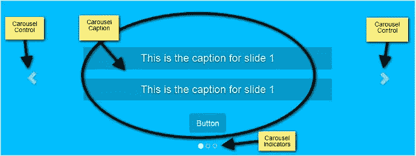

# 用 CSS3 动画给引导转盘增添趣味

> 原文：<https://www.sitepoint.com/bootstrap-carousel-with-css3-animations/>

对开发人员来说，在网站上添加滑块或轮播来展示内容是一个常见的客户请求。可用的免费和高级 carousel 插件数量惊人，其中许多提供了大量有用的配置选项和动态效果。然而，有时候，您需要的只是一个具有最少选项的轻量级转盘。在这种情况下，如果你的项目使用流行的开源前端框架 [Bootstrap](http://getbootstrap.com/) ，你就不需要再寻找比 [Bootstrap Carousel 组件](http://getbootstrap.com/docs/4.0/components/carousel/) 更多的东西了。

在本文中，我将展示如何向 Bootstrap Carousel 添加一些有趣的动画效果，同时仍然确保这个方便的 JavaScript 组件不会膨胀并且可以快速实现。

## Animate.css 简介

尽管制作我自己的动画效果很有价值，但我将使用一个著名的开源 CSS3 动画库，它最恰当的名字是 Dan Eden 的 [Animate.css](http://daneden.github.io/animate.css/) 。

这样我就可以专注于手头的任务，而不是解释 CSS3 动画的代码。然而，如果你想深入这个话题，你可以在 SitePoint 上欣赏克雷格·巴克勒的 CSS3 动画系列。

使用 Animate.css 需要两个步骤:

1.  在 HTML 文档的`<head>`部分包含`animate.min.css`
2.  将`animated yourchosenanimation`的类添加到您打算在网页上制作动画的元素中。

在后一步中，您将使用与 Animate.css 网站上看到的众多动画中的任何一个相对应的类名来替换 *yourchosenanimation* 。

## 介绍引导转盘

引导转盘组件有三个主要部分:

*   **转盘指示器**跟踪幻灯片的总数，为用户提供当前正在查看的幻灯片所占位置的视觉线索，并为滑块提供替代导航。
*   位于带有类`.carousel-inner`的包装容器内的**转盘项目**，代表每一张单独的幻灯片。你在每一个项目里面放置你的图像。你也可以给你的幻灯片添加**字幕**。好的一面是，你可以用类`carousel-caption`将几乎任何 HTML 元素放入容器中，Bootstrap 会处理样式和格式。你要制作动画的就是这些标题。
*   最后，**转盘控件**是导航箭头，使用户能够访问下一张和上一张幻灯片。



为了使这个演示简单，我不打算在传送带上添加图像。焦点都在如何使旋转木马标题动画化上。

## 构建 HTML 结构

如果您正在跟进，以下是您需要在项目中包含的内容:

*   [jQuery](http://jquery.com/)
*   [Bootstrap 的 CSS 和 JavaScript](http://getbootstrap.com/docs/4.0/getting-started/download/)
*   字体棒极了，或者任何其他品牌的图标，尽管你可以自由地用简单的文本替换这些图标
*   [Animate.css](https://github.com/daneden/animate.css)
*   一个样式表和 JavaScript 文档，您可以在其中添加自己的代码。

下面是引导转盘的代码:

```
<!-- indicators -->
<div id="carouselExampleIndicators" class="carousel slide">
  <ol class="carousel-indicators">
    <li data-target="#carouselExampleIndicators" data-slide-to="0" class="active"></li>
    <li data-target="#carouselExampleIndicators" data-slide-to="1"></li>
    <li data-target="#carouselExampleIndicators" data-slide-to="2"></li>
  </ol>

  <!-- carousel content -->
  <div class="carousel-inner">

    <!-- first slide -->
    <div class="carousel-item active">
      <div class="carousel-caption d-md-block">
        <h3 data-animation="animated bounceInLeft">
          This is the caption for slide 1
        </h3>
        <h3 data-animation="animated bounceInRight">
          This is the caption for slide 1
        </h3>
        <button class="btn btn-primary btn-lg" data-animation="animated zoomInUp">Button</button>
      </div>
    </div>

    <!-- second slide -->
    <div class="carousel-item">
      <!-- second slide content -->  
    </div>

    <!-- third slide -->
    <div class="carousel-item">
      <!-- third slide content -->
    </div>
  </div>

  <!-- controls -->
  <a class="carousel-control-prev" href="#carouselExampleIndicators" role="button" data-slide="prev">
    <span class="carousel-control-prev-icon" aria-hidden="true"></span>
    <span class="sr-only">Previous</span>
  </a>
  <a class="carousel-control-next" href="#carouselExampleIndicators" role="button" data-slide="next">
    <span class="carousel-control-next-icon" aria-hidden="true"></span>
    <span class="sr-only">Next</span>
  </a>

</div>
```

您将制作动画的 carousel 标题中的元素添加了一个`data-animation`属性，并使用特定的动画类名作为它们各自的值。

如果您想试验 Animate.css 库中的其他动画，请随意用您选择的动画类名替换`data-animation`属性中的值。

## 将 CSS 添加到旋转木马

现在，充分发挥你的创造力，根据你的喜好设计轮播标题。我在这里要关注的风格规则是与这个演示的顺利进行相关的。

更具体地说，您正在控制 CSS `animation-delay`属性，它定义了每个动画开始的时间。

```
.carousel-caption h3:first-child {
  animation-delay: 1s;
}

.carousel-caption h3:nth-child(2) {
  animation-delay: 2s;
}

.carousel-caption button {
  animation-delay: 3s;
}
```

上面的代码片段确保元素按顺序开始它们的动画。这里有发挥的空间。例如，您可以选择同时开始制作前两个标题的动画，然后是按钮动画。这取决于你，所以尽情享受吧！

## 编写 jQuery

让我们从初始化转盘开始。在您的自定义 JavaScript 文件中，添加以下代码片段:

```
var $myCarousel = $('#carouselExampleIndicators');

// Initialize carousel
$myCarousel.carousel();
```

现在旋转木马开始运转了。让我们来处理动画部分。

为了使第一张幻灯片中的标题具有动画效果，该脚本必须在页面在浏览器中完成加载后立即启动。然而，为了在随后的幻灯片出现时制作动画，代码必须在`slide.bs.carousel`事件上触发。这意味着相同的代码将被使用两次:页面加载和`slide.bs.carousel`事件。

为了避免重复(遵循 <abbr title="Don't Repeat Yourself">DRY</abbr> 原则)，只需将代码包装在一个函数中，并根据需要将其附加到适当的事件上。

代码如下:

```
function doAnimations(elems) {
  var animEndEv = 'webkitAnimationEnd animationend';

  elems.each(function () {
    var $this = $(this),
        $animationType = $this.data('animation');

    // Add animate.css classes to
    // the elements to be animated
    // Remove animate.css classes
    // once the animation event has ended
    $this.addClass($animationType).one(animEndEv, function () {
      $this.removeClass($animationType);
    });
  });
}

// Select the elements to be animated
// in the first slide on page load
var $firstAnimatingElems = $myCarousel.find('.carousel-item:first')
  .find('[data-animation ^= "animated"]');

// Apply the animation using the doAnimations()function
doAnimations($firstAnimatingElems);

// Attach the doAnimations() function to the
// carousel's slide.bs.carousel event
$myCarousel.on('slide.bs.carousel', function (e) {
  // Select the elements to be animated inside the active slide
  var $animatingElems = $(e.relatedTarget)
    .find("[data-animation ^= 'animated']");
  doAnimations($animatingElems);
});
```

上面的代码块中发生了很多事情，所以让我们来分解一下。

### 查看`doAnimations()`功能

`doAnimations()`功能执行下述任务。

它首先在一个变量中缓存一个字符串，该变量包含 **animationend** 事件的名称。您可能已经猜到，当每个动画结束时，这个事件就会触发。您需要这些信息，因为每次动画结束时，您都需要删除 Animate.css 类。如果做不到这一点，轮播字幕将仅被动画显示一次，也就是说，仅在轮播第一次显示特定幻灯片时。

```
var animEndEv = 'webkitAnimationEnd animationend';
```

接下来，该函数循环遍历您想要制作动画的每个元素，并提取`data-animation`属性的值。回想一下，这个值包含 Animate.css 类，您需要将这些类添加到 carousel 内的元素中，以便对它们进行动画处理。

```
elems.each(function () {
  var $this = $(this),
    $animationType = $this.data('animation');    
  // etc...
});
```

最后，`doAnimations()`函数动态地将 Animate.css 类添加到您想要制作动画的每个元素中。它还附加了一个事件侦听器，该侦听器只在动画结束时触发一次。动画结束后，您刚刚添加的 Animate.css 类将被删除。这确保了下一次传送带回到同一张幻灯片时，动画会再次出现。(试着删除这段代码，你会看到动画只出现一次。)

```
$this.addClass($animationType).one(animEndEv, function () {
  $this.removeClass($animationType);
});
```

### 动画显示第一个旋转木马标题

一旦页面加载到浏览器中，您就像这样触发第一张幻灯片中的动画:

```
var $firstAnimatingElems = $myCarousel.find('.carousel-item:first')
  .find("[data-animation ^= 'animated']");  
doAnimations($firstAnimatingElems);
```

在这段代码中，首先找到第一张幻灯片。从那里，通过使用从*动画*开始的`data-animation`属性的值，选择想要在标题中制作动画的内容。然后使用这样获得的数据作为`doAnimations()`函数中的一个参数，让该函数完成它的工作。

### 在旋转木马字幕滑动时制作动画

当每张幻灯片变得可见时，动画显示轮播字幕需要下面描述的步骤。

首先，给`slide.bs.carousel`事件附加一个事件监听器。根据引导转盘文档:

> 当调用 slide 实例方法时，该事件立即触发。

```
$myCarousel.on('slide.bs.carousel', function (e) {
  // do stuff...
});
```

接下来，选择**活动幻灯片**——即当前视图中的幻灯片——并从那里找到您想要制作动画的元素。下面的代码使用`slide.bs.carousel`事件的`.relatedTarget`属性来获取活动幻灯片。

```
var $animatingElems = $(e.relatedTarget).find("[data-animation ^= 'animated']");
```

最后，调用`doAnimations()`函数，将包含要动画化的元素列表的`$animatingElements`作为参数传递。

```
doAnimations($animatingElems);
```

完整的演示显示在下面的代码栏中。

在 [CodePen](https://codepen.io) 上通过 SitePoint ( [@SitePoint](https://codepen.io/SitePoint) )看到 Pen [Bootstrap Carousel 和 Animate.css](https://codepen.io/SitePoint/pen/KQzPvK/) 。