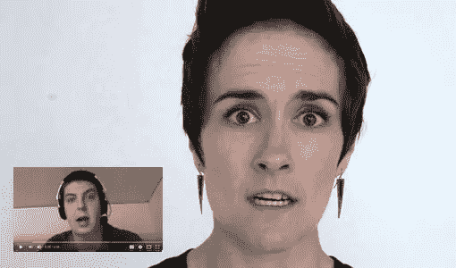
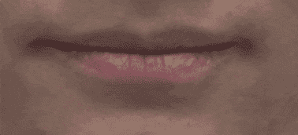
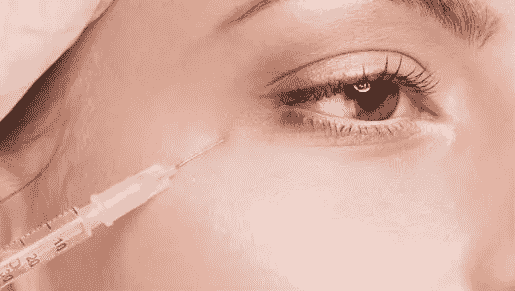
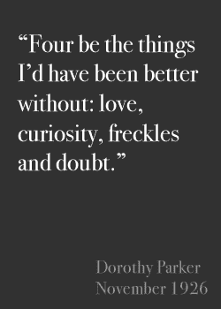

# 肉毒杆菌和设计同理心的艺术

> 原文：<https://www.sitepoint.com/botox-art-designing-empathy/>

我们都知道互联网上有很多“巨魔”,而且很可能永远都有。

但是在 SitePoint 的早期，我们注意到一个有趣的趋势:旁边有作者头像的文章在评论线程中几乎总是比没有作者头像的文章得到更公平的对待。

我们发现，使用漫画或卡通头像的作家比那些什么都不用的作家表现得更好。使用标识或非面部图形的作者更有可能吸引攻击性和不礼貌的反馈。

这并不意味着摄影头像完全保护了作者免受批评——你也不想这样。但是批评往往更加公平和有建设性。

### 这里发生了什么事？

在 2011 年为《社会心理学》&个性科学杂志进行的一项研究中，测试对象被要求观看一系列面孔，然后描述他们在每张脸上看到的情绪。这个想法是为了测试他们想象另一个人感受的能力——我们称之为移情的特征。

尽管结果因人而异，但大多数人都表现出了正确识别他们所看到的面部表情的良好技能。

当分析每个用户测试的视频记录时，有趣的部分来了。高速摄像机显示，在回答之前，每个测试用户都短暂地复制了他们在照片中看到的表情。

这些所谓的“[微表情](https://go.sitepoint.com/t/y-l-duhruhk-l-m/)完全是无意识的，无意识的，肉眼几乎察觉不到，但似乎有助于受试者理解他们所看到的。

显而易见的问题是:*如果我们阻断这些微表情*会发生什么？

### 肉毒杆菌只是表面现象

几个月后，同样的测试对象在进行另一轮测试前接受了肉毒杆菌注射。你可能知道，肉毒杆菌通过麻痹眼睛和嘴巴周围的小型面部肌肉来发挥作用。这减少了皱纹的出现，但也阻止了微表情。

令人惊讶的是，这些“打了肉毒杆菌”的测试对象对他们看到的面孔的理解能力明显下降。某种反馈回路被打破，他们的移情能力下降。

似乎当我们身体上模仿一个面部表情时，它会触发一段那种情绪感觉的记忆。你可以说，我们通过进入他们的*面孔*来进入他们的*思维*。

### 将同理心融入我们的用户界面

当我们将单词与附近的面孔联系起来时，我们阅读时听到的“内在声音”就发生了变化。我在下面的例子中制作了动画来展示这一点。这是多萝西·帕克的名言:

1.  作为纯文本
2.  旁边是一个充满活力，容光焕发的帕克
3.  旁边是一个悲伤的，几乎崩溃的帕克

你可以看到同样的引用 ***感觉*** 每次意象改变都很不一样。我们的大脑会发生变化。

在我们的设计工作中，我们都使用了大量的人脸，但是我认为有两个地方吸引用户的共鸣特别有用。

1.  任何类型的编辑文本:博客、评论、论坛、评论线程等。任何时候，当你提出你希望你的用户给予关注和尊重的想法时，都要有一张面孔。显然，一个放松、自信微笑的作者更有可能引发放松、微笑、自信的读者。
2.  **评价和引用**:评价都是关于社会证明的。我们在推荐作者方面帮助用户越多，他们对推荐词的重视程度就越高。

### 这个陷阱

每个人都是他们成长的世界的产物，并带来他们自己的偏好和偏见。这是一门不精确的科学，但是——如果你有选择的话——向读者展示来自相似用户(年龄、性别和地域)的内容可能会得到更多的共鸣。

当然，停止对你的用户使用 botoxing(如果你可以的话)。

*最初发表于 [SitePoint 设计通讯](https://www.sitepoint.com/newsletter/)。*

## 分享这篇文章