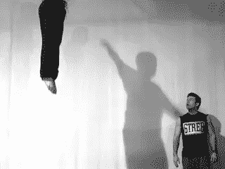
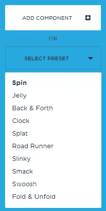
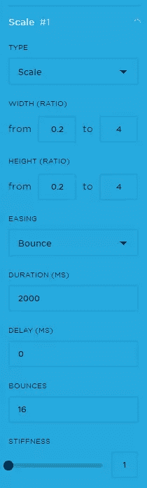
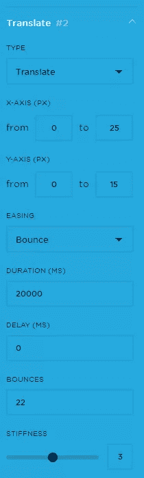
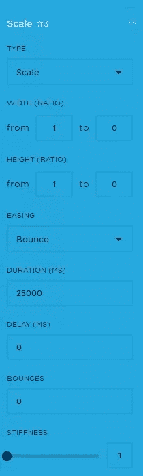

# 弹跳。快速创建复杂的 CSS 动画

> 原文：<https://www.sitepoint.com/bouncejs-create-complex-css-animations-fast/>

照片:icopythat

自 1995 年以来，JavaScript——一种简单的脚本语言，专为“让网页更动态”这一简单任务而设计——已经走过了漫长的道路。

由 Mozilla 联合创始人 Brendan Eich 发明，在过去五年的大部分时间里，它一直在稳步取代 Adobe 的 Flash，成为网络上动画、游戏和应用程序的首选工具。

随着 JavaScript 的兴起，出现了大量新的库和生成器，允许开发人员轻松访问更复杂的功能。BounceJS 就是这些新工具中的一个。

由 Joel Besada 创建的 BounceJS 可以让你在简单界面的帮助下生成流畅优雅的 CSS 动画，然后预览、分享和导出它们。这非常简单！如果你喜欢俏皮的动画，试试[蹦蹦跳跳](http://bouncejs.com/)。

在下文中，我们将看看它的特点和动画工作流程，并设计一个自定义动画从我们创造的零开始。

应该会很好玩的，相信我！

## 连接

生成器的界面简洁明了，使得创建动画成为一项简单的任务。

左边是组件列表，在这里我们可以给你的动画链添加各种效果，并在以后混合和调整它们。它还提供了一个各种动画预设的列表，你可以检查和混音。

跑路动画预设爆笑。你不得不佩服作者对细节的热爱。

许多这些预设可以用作模板，因此您可以重新混合您的自定义动画，并在添加组件时节省一些时间。

在屏幕中间，您可以找到动画的预览。正方形是占位符，可视化动画的所有运动。

预览屏幕下有 3 个按钮:播放动画、循环动画和慢动作。

后者对于详细分析运动特别有用。

您创建的每个动画都有一个唯一的 URL。您也可以通过点击:获取简短 URL 来获取此简短链接

***免责声明:**与大多数代码生成器一样，经过深思熟虑的手工编写的代码几乎总是要优越得多。然而，这也将是相当多的要求和耗时。如果你对之后手动调整代码不感兴趣，我建议不要过度使用 Bounce。弹跳。JS 使用了大量的矩阵变换，这并不是所有动画场景的最佳方法。*

在制作这部动画的过程中，我经历了惨痛的教训。然而，你的动画可能没有这个复杂，这是一件好事。记住:动画时间线越长，生成的代码越多，千万不要抓狂。

这是最基本的。这个过程在技术上没有什么困难，剩下的就看你的想象力了。

## 是时候做点什么了！

让我们创建一个自定义动画。在下面的例子中，我将展示如何创建一个从上往下看的降落伞动画——你通常会在卡通中看到的那种夸张的动画。

在弹跳。JS，动画被分解成‘组件’。把组件想象成舞蹈动作的不同部分。请记住，我们只是设计这个动画的行为，而不是它所动画的对象，也不是背景/舞台。当然，一旦我们的运动最终确定，在任何环境下将它应用于任何物体都是微不足道的。

## 动画组件 1

问:跳伞运动员跳伞后会做什么？

答:当然，他们会打开降落伞。让我们把它转化成一个动画。

为了模拟降落伞的打开，最好的方法是使用一个*比例的*组件。参考预览中正方形的原始大小，我在这里使用了 0.2 的原始大小，以 4 的大小结束。基本上，它在动画结束时变得大了 20 倍。

由于降落伞将有相同的宽度和长度(如果你从顶部看它的高度)，我们保持两个维度的长宽比相同。我们选择*弹跳*姿态作为*放松*，因为它的运动特性最符合我们的需求。在持续时间中，我们指定我们的动画应该覆盖的时间段。由于降落伞打开的速度非常快，我在这里输入了 2000 毫秒。

无论动画组件的顺序如何，所有组件都在动画开始时激活，因此如果您希望组件稍后启动，则需要在“延迟”字段中指定延迟。

提示: *如果你创建复杂的动画，最好保持组件的顺序与它们被激活的顺序相同，这样你就不会太容易混淆。*

*反弹*字段指定元素在整个动画中反弹的次数。在这种情况下，我把 16，一个相对较高的数字，但似乎是一个降落伞动画。

这同样适用于*刚度*量。让我们为那放一个最小值。

## 动画组件 2

接下来，我们将模拟降落伞的运动，就好像风正在以一种微妙的随机方式改变它的路径。为此，我们将使用*翻译*组件。我在这里加了一个细微的移动(向右 25 个单位，向下 15 个单位)，应该真的够了。我建议再次使用反弹作为缓解，由于动画的流体性质。

由于这个组件将在整个动画中播放，我让它播放 20000 毫秒，这应该涵盖了它的整个长度。降落伞将从时间线的起点开始移动，所以我们不需要延迟。由于降落伞的运动受风的影响更大，但比第一个组件更坚硬，我在这里给了它 22 个*弹跳*和 3 的*硬度*。

## 动画组件 3

最后，我们将添加动画的最后一个组件。

如果你从上面看跳伞运动员，很明显，随着距离的增加，他会显得越来越小。

所以他的初始尺寸是 1，在动画结束时他的尺寸实际上是 0。让我们为宽度和高度插入这些值。

显然，动画的持续时间应该很长。25000 毫秒的量应该可以了。

由于这个动画组件将与其他组件同时播放(即没有延迟)，我们不需要添加任何反弹或刚度效果，因为它是从前面的组件继承的。所以把他们留在这里的截图 0。

当然，这只是一个粗略的指导方针，但是结果显然在你的手中。

但是，你之后应该会有一个和[这个](http://bouncejs.com/#%7Bl%3A1%2Cs%3A%5B%7BT%3A%22c%22%2Ce%3A%22b%22%2Cd%3A1500%2CD%3A0%2Cf%3A%7Bx%3A0.1%2Cy%3A0.1%7D%2Ct%3A%7Bx%3A2%2Cy%3A2%7D%2Cs%3A1%2Cb%3A12%7D%2C%7BT%3A%22t%22%2Ce%3A%22b%22%2Cd%3A12000%2CD%3A0%2Cf%3A%7Bx%3A0%2Cy%3A0%7D%2Ct%3A%7Bx%3A25%2Cy%3A15%7D%2Cs%3A3%2Cb%3A22%7D%2C%7BT%3A%22c%22%2Ce%3A%22b%22%2Cd%3A15000%2CD%3A0%2Cf%3A%7Bx%3A1%2Cy%3A1%7D%2Ct%3A%7Bx%3A0%2Cy%3A0%7D%2Cs%3A1%2Cb%3A0%7D%5D%7D)类似的结果。

一旦对结果感到满意，就可以将动画导出为 CSS 并在项目中使用。

你也可以在 [GitHub](https://github.com/tictail/bounce.js) 上找到 BounceJS 的库

## 你怎么想呢?

有了这么多创新的新方法来设计和制作网站动画，像 BounceJS 这样的生成器就非常方便了，特别是当它节省了你手动编写这些动画的宝贵时间时。

试试吧，把你的实验贴在评论区。我们很好奇你的结果！

## 分享这篇文章