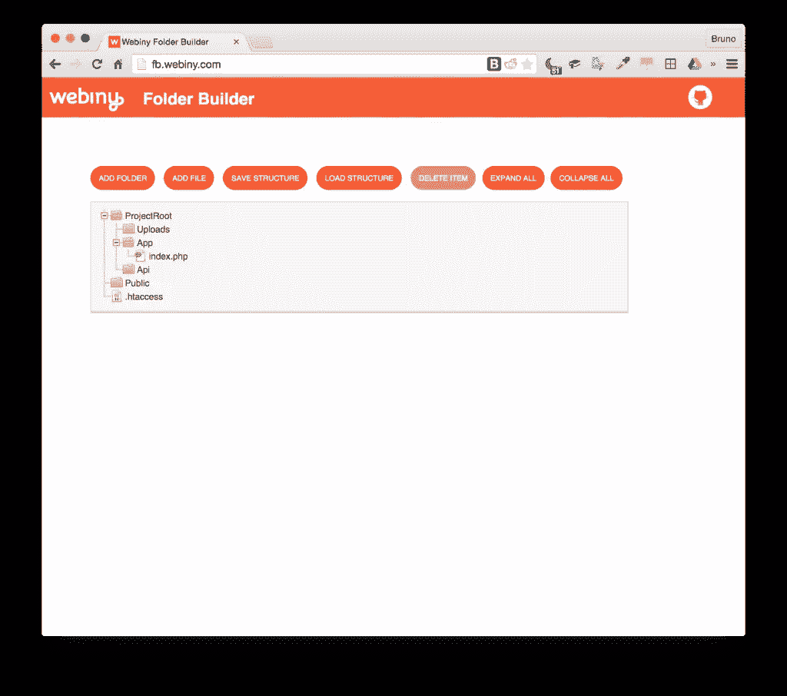
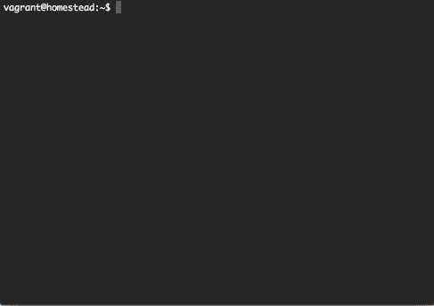
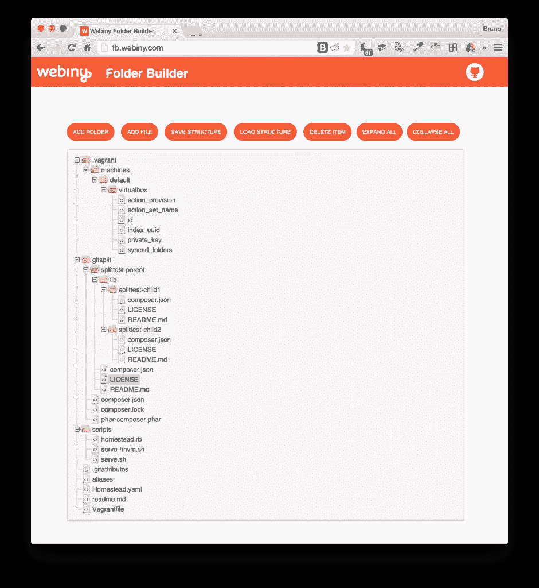

# 使用 Box 快速轻松地将您的应用打包成 Phars

> 原文：<https://www.sitepoint.com/boxing-apps-phars-quickly-easily-box/>

在本教程中，我们将使用 [Box](https://github.com/box-project/box2) 将一个 PHP 应用程序打包到一个 Phar 中，以使它易于通过 Composer 发布和全球安装。


## 靠什么？

为此我们需要一个项目，打包另一个“Hello World”脚本是没有意义的。我们将使用 [Webiny 的 FolderBuilder](http://fb.webiny.com) ，这是一个工具，您可以使用它来规划项目的文件夹结构，交互式地拖放文件和文件夹，甚至导出这些结构并与其他人共享。



但是那几乎完全是一个 JavaScript 工具，为什么我们要用 Phars 来做呢？是的，那个 GUI *是* JS，但是如果你看一下[的 repo](https://github.com/Webiny/FolderBuilder) ，你会注意到里面有一个 PHP 脚本，你可以在任何文件夹上运行，并获得所需的 JSON 生成。这意味着您也可以轻松地从现有项目中生成 FolderBuilder 兼容的结构，这对于规划项目的重构非常方便。

虽然从任何想要解析到 JSON 的文件夹中下载并运行脚本非常简单，但是为什么不把整个项目做成 Phar-distributed 并允许类似这样的事情:

```
composer global require webiny/folderbuilder
folderbuilder . > structure.json
```

## 纸盒包装

让我们启动一个盒子项目。首先，如果我们的系统中没有 Box，我们需要安装它。当然，我像往常一样使用 [Homestead 改进版](https://www.sitepoint.com/quick-tip-get-homestead-vagrant-vm-running/),以保持与我的主机操作系统的隔离。

```
composer global require kherge/box
```

我们*可以*下载 Box 的`phar`并使用它，但是我们这里是[作曲人群](https://www.sitepoint.com/mastering-composer-tips-tricks/)，我们不使用那些过时的特定于平台的方法；)

现在完成了，从我们机器的任何地方都可以访问到`box`命令:



要用 Box 打包一个应用程序，需要在项目的文件夹中包含一个`box.json`文件。其中最简单的可以在[示例应用](https://github.com/box-project/box2-example/blob/master/box.json)中看到:

```
{
    "files": ["src/Put.php"],
    "main": "bin/main",
    "output": "example.phar",
    "stub": true
}
```

我们将要打包的项目有很多文件，但是只有一个文件是 Phar 真正需要的，所以为了保持简洁，我们将只打包那个文件(和另一个文件，稍后会详细介绍)。在这点上，我们的`json`文件不会有太大的不同(不过如果你想看一个更复杂的，可以在[这里](https://github.com/box-project/box2/blob/2.0/box.json.dist)看到 from 框本身)。我们开始吧！

## Box.json

**流浪用户注意**:使用[家园改良](https://www.sitepoint.com/quick-tip-get-homestead-vagrant-vm-running/)等流浪盒子时，Phar 扩展[由于某种原因将无法写入文件](https://github.com/box-project/box2/issues/90)。解决方案是将“输出”属性更改为共享文件夹之外的文件夹，或者在共享文件夹之外执行所有操作。在这种情况下，我们将采用后一种方法，只在流浪者用户的“home”文件夹中执行所有操作。

当然，我们做的第一件事是克隆回购协议:

```
cd ~
git clone https://github.com/webiny/folderbuilder
cd folderbuilder
git checkout 74b234fa33bd69690a2c26df38ef7d188c4e69eb
```

最后一个命令是必要的，这样您就可以在我应用本文中概述的修复之前进入项目状态。

然后，我们创建文件`box.json`，并用以下内容填充它:

```
{
	"files": ["structure.php"],
	"output": "bin/wfb.phar",
	"stub": true,
	"main": "structure.php"
}
```

那么这意味着什么呢？

“files”属性列出了我们希望包含在 Phar 中的所有文件。“输出”是我们构建的产物，“主”表示入口文件。使用 CLI 应用程序时需要“存根”。帮助文件说:

*" stub(string，boolean)设置用于指定 stub 文件的位置，或者是否应该生成一个 stub 文件。如果提供了路径，那么存根文件将在 Phar 中原样使用。如果提供了 true，将生成一个新的存根。如果提供了 false(或 nothing ),将使用 Phar 类使用的默认存根。*和进一步的解释可以在[这里找到](http://php.net/manual/en/phar.fileformat.stub.php)。

我们创建了一个 bin 文件夹，因为它是放置编译资源的公共地方。

然后，我们运行:

```
box build -v
```

Box 将自动检测文件夹中的`box.json`文件，并产生与此类似的输出:

```
? Output path: /home/vagrant/folderbuilder/bin/wfb.phar
? Adding files...
  + /home/vagrant/folderbuilder/structure.php
? Adding main file: /home/vagrant/folderbuilder/structure.php
? Generating new stub...
* Done.
```

如果我们现在执行命令:

```
php bin/wfb.phar
```

当前目录的结构将以 JSON 格式显示在屏幕上，就像我们直接运行`php structure.php`一样。

## 可执行的

但是我们如何让它运行而不需要指定`php`或`.phar`？如果你看看`wfb.phar`的内容，头两行会写道:

```
#!/usr/bin/env php
<?php
```

这意味着“当这个文件被执行时，使用 PHP 环境来咀嚼它”。然而，为了能够做到这一点，我们需要使文件可执行，我们通过给我们的`box.json`文件添加一个“chmod”标志来做到这一点。同时，我们还可以确保包含在 phar 中的文件是通过使用 Box 附带的两个默认压缩器来压缩的:

```
{
	"files": ["structure.php", "bin/stub.php"],
	"output": "bin/wfb.phar",
	"stub": true,
	"main": "bin/stub.php",
	"chmod": "0755",
	"compactors": [
        "Herrera\\Box\\Compactor\\Json",
        "Herrera\\Box\\Compactor\\Php"
    ]
}
```

现在，重新运行`box build`，完成后，尝试运行:

```
bin/wfb.phar
```

应该能行。我们仍然需要指定扩展，仅仅从`box.json`中删除它会导致 Box 向我们抛出错误。如果我们把文件名中的`.phar`去掉，然后期待最好的结果，会怎么样呢？

```
mv bin/wfb.phar bin/wfb
bin/wfb
```

你瞧，它起作用了！好吧，现在我们怎么分配这个？

## 分配

如果您的项目已经有了一个`composer.json`文件，那么您需要做的就是为[供应商二进制文件](https://getcomposer.org/doc/articles/vendor-binaries.md)添加一个`bin`字段:

```
"bin": ["bin/wfb"]
```

在 FolderBuilder 的例子中，根本没有`composer.json`文件，所以我用`composer init`从头创建了一个。最终版本是[这里的](https://github.com/Webiny/FolderBuilder/blob/master/composer.json)。

这个项目也需要放到 Packagist 上。按照[这篇文章](https://www.sitepoint.com/listing-packages-on-packagist-for-composer/)中的说明，这是一个 5 分钟的努力。

## 尝试一下

一切都做好了，我们来试试吧。为此，我将启动一个新的 [Homestead 改进的](https://www.sitepoint.com/quick-tip-get-homestead-vagrant-vm-running/)实例，这样我可以 100%确定我是从一个全新的环境开始的，这样我就不必从我们构建本教程的环境中卸载任何东西。

启动一个新的 HI 实例进行测试实际上就是 5 行 shell 命令:

```
git clone https://github.com/swader/homestead_improved hi_fbtest
cd hi_fbtest
sed -i '' "s@map\: \.@map\: $PWD@g” Homestead.yaml
vagrant up
vagrant ssh
```

现在，在我的新虚拟机中，我运行:

```
composer global require webiny/folderbuilder
```

这应该够了。让我们看看它是否有效。我要绘制出 Code 文件夹(即 Homestead 改良项目的根，应该产生 scripts 文件夹、`Homestead.yaml`等文件和文件夹)。

```
wfb ~/Code > out.json
```

事实上，文件就在那里！将它的内容粘贴到 [FolderBuilder](http://fb.webiny.com) 中，我们得到了我们想要的东西。



## 结论

在本教程中，我们看到了用 Box 项目将 PHP 代码打包到 Phars 中。我们讨论了如何使它们可执行，并解释了如何在 Composer 安装期间分发这些 Phars，以便一旦全局需要，它们可以从任何地方立即访问。我们*可以*谈论签署 Phars 或者构建他们的自动更新脚本，但是这已经被[和其他人](http://moquet.net/blog/distributing-php-cli/)做得更好了——如果你想了解更高级的方面，可以看看那个帖子。

至于 Webiny 的文件夹生成器，它是开源的，欢迎投稿。对如何进一步改进有想法吗？也许把树的创建加入其中，读取一个 JSON 文件并创建在 GUI 中开发的东西？去吧，提交一份公关！

你在我们的过程中发现任何失误了吗？你遵循同样的工作流程还是用不同的方式包装你的 Phars？请在评论中告诉我们！

## 分享这篇文章