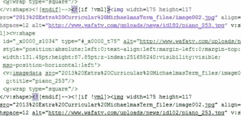
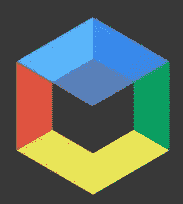
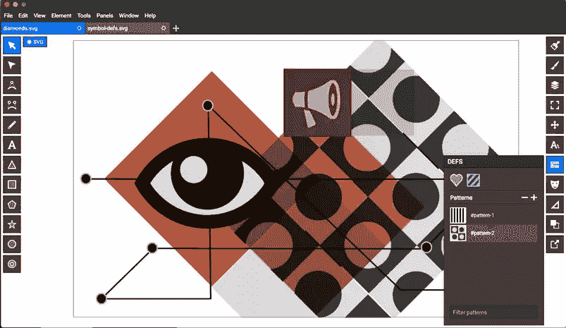
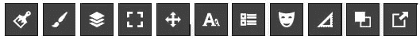
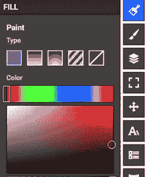
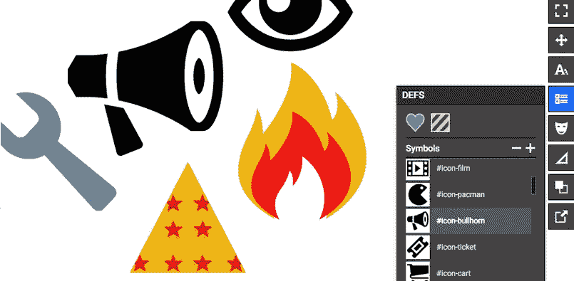
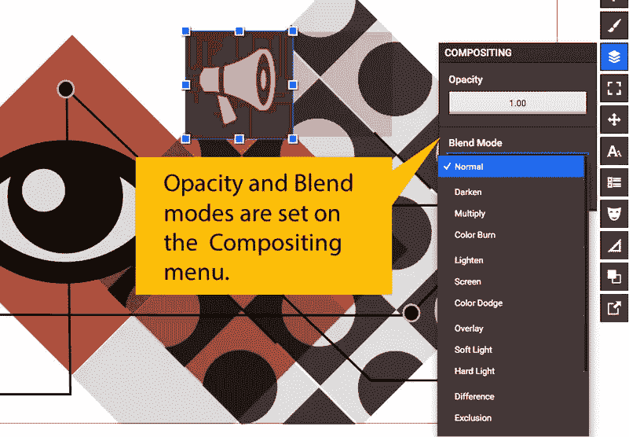
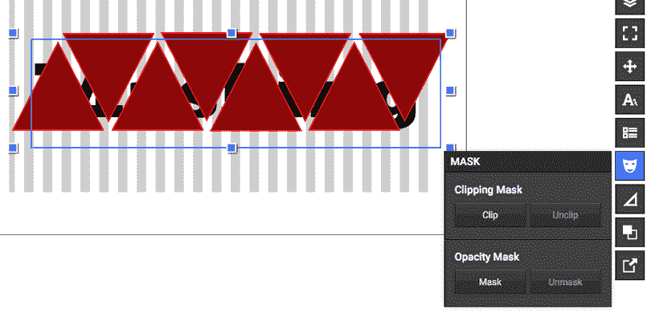

# Boxy SVG:一个快速、简单、非常有用的免费 SVG 编辑器

> 原文：<https://www.sitepoint.com/boxy-svg-a-fast-simple-insanely-useful-svg-editor/>

你曾经使用过微软 Word 的“另存为网页”功能吗？

哎哟。很痛苦。

Word HTML:你应该在 10 年前就看到了..

它应该是一个奇迹般的特性，但是如果你曾经不得不使用生成的 HTML 源代码，你可能会在第一次看到它的时候吐掉你的咖啡。它总是令人费解和臃肿——对网络来说是非常糟糕的品质。

公平地说，这也不是一个巨大的惊喜。

让我们面对现实吧:使用 MS Word 的人可能并没有把注意力放在什么在网络上最有效上。他们使用 Word–他们为什么要关心:

*   页面加载时间？
*   网络图像格式？
*   语义& SEO？
*   可变屏幕尺寸 _ 响应式设计)？
*   字体可用性？

所以事后思考的转换过程产生肥胖、混乱的 HTML 就不足为奇了，对吗？

## SVG 是新的“另存为网页”吗？

如今 SVG 炙手可热。在大多数知名的图形应用程序中，包括 Photoshop、Sketch、Illustrator 和 Inkscape，你都会发现“*另存为 SVG* ”，这通常是一件好事。

但类似的“文字到 HTML”的转换问题也有出现的风险。软件制造商正在竞相开发最好、最强大的图形工具。这可能需要在 3D 建模界面、透视转换器、斜面、字体生成器和其他“神奇”的技巧中加入干扰。

因此，将最终输出导出到 SVG 就成了这个过程最后要解决的问题——就像 Word 处理 HTML 一样。

这对设计自由来说是好事，但对充分利用 SVG 来说却不是好事。所以有时候最好有一个更简单的工具，只让您访问 SVG 擅长的东西。

## SVG 擅长什么？

SVG 有很多在网络上非常有用的特性。其中包括:

1.  **数学控制** : SVG *是*一种高效、简单明了的外形&布局语言，这使得它很容易在你的代码编辑器中操作。
2.  **符号**:有点像 CSS。定义一个图形一次——你可以随时调用它。
3.  与 CSS 平铺背景一样，这是一种用小图形覆盖大面积的好方法。
4.  **蒙版** : SVG 可以用硬矢量形状蒙版，也可以用软 alpha 通道蒙版。
5.  **混合模式/通道**:和 Photoshop、SVG 字母一样，你可以改变重叠层之间的交互方式——变暗、强光、颜色减淡等。

## met boxy SVG¨t0㎡

[Boxy SVG](http://boxy-svg.com/) 是一个免费的简化矢量编辑器——作为 Chrome 应用程序运行——旨在让您完全访问 ***确切地说是***SVG 擅长的功能。

现在我不想在这里做一个全面的回顾——你知道矢量编辑器是做什么的——但是我想谈谈我真正喜欢的一些特性。

### 基本绘图工具

正如你所料，Boxy 附带了一系列矢量创建工具——钢笔、贝塞尔曲线、文本和 SVG 中提供的基本形状(矩形、圆形、三角形等)。

右边的面板可能是更有趣的菜单。

按顺序，他们控制:

*   充满
*   中风
*   合成(层)
*   视图(文件尺寸、设置)
*   排列(对齐、变换、Z 顺序)
*   排版(包括路径上的字体、大小和类型)
*   Defs(可重复使用的资源，如模式和符号)
*   遮罩(矢量和 alpha)
*   几何形状(位置、大小和旋转)
*   路径(转换为路径、联合、相减等)
*   导出(如果需要，可以导出为 PNG)

### 描边和填充

除了可预测的颜色选择器和渐变控件，Boxy 还提供了一个非常酷的“图案填充”选项——这就是条纹框。点击模式框将打开 DEFS 面板，模式存储在这里。

### DEFS 小组

也许关于 SVG 格式最酷的事情是“定义”或“T0”的概念。这是 SVG 文档顶部的一个部分，您可以在其中定义可重用的资源，如符号和模式。

这有点像图形元素的 `<style>`块。Boxy SVG 使得创建、管理和重用你的符号和模式变得非常容易。这是它在盒子里的样子。

**符号**:选择你创建的任何图形，点击符号菜单上的“+”按钮，你会看到它立即出现在符号面板中。

在矩形 SVG 中使用 DEFS

我还发现，如果你在 [IcoMoon](https://icomoon.io/app/) 创建一个 SVG 图标集，然后在 Boxy SVG 中打开它，你会看到你所有的图标都出现在符号菜单中。即使您将它们从主文档视图中删除，您仍然可以在 DEFS 面板中找到它们。

图案:点击图案菜单上的“+”，你会得到一个新的画布来创建你的图案。完成后，您会发现您的新图案已经可以在填充和描边面板中使用了。

### 合成面板

混合模式在 SVG 中得到很好的支持，允许你的矢量形状以更多的方式进行交互。选择一个形状，切换下拉菜单，用*变暗*、*乘*、*色偏*、*差*、*强光*和所有你熟悉的 Photoshop faves 进行实验。

### 遮罩面板

遮罩是 SVG 的另一项超能力，在无数设计应用中非常有用。只需在你的图像前创建一个遮罩形状，选择两者，并点击遮罩菜单中的“剪辑”来激活遮罩。

动画:方框中的遮罩

BoxySVG 中还有很多，包括漂亮的排版控件和一个探路者工具，但我不想在这里写 2000 字。推荐你有戏，看你怎么想。除了时间，它不会花费你任何东西。

## 但是我有一个导出 SVG 的矢量应用程序。我为什么要用这个？

我认为检查 Boxy SVG 有两个很好的理由。

**1)** 。首先，通过限制 UI 选项，Boxy 帮助您了解 SVG 擅长什么。有了这些知识，你将开始设计更好的网络图标、信息图和图表。

**2)** 。其次，Boxy SVG 编写了简洁、高效、可读的 SVG。如果您熟悉 HTML，请在您最喜欢的文本编辑器中打开 SVG 文件，您应该会看到一个您可以理解的结构良好、整洁的文件。

现在开始将你自己的 CSS 类添加到你的 SVG 元素中，并在顶部添加一个`<style>`块，这样你就有了更强大的东西。现在很容易添加你自己的悬停效果、CSS 过渡和动画。

记住，试着让你的作品一开始就相对简单，这样你在理解你看到的代码时就不会有问题。有许多工具具有更令人印象深刻的特性集，但没有更令人印象深刻的 SVG。

目前，Boxy 中唯一没有的主要 SVG 特性是应用 SVG 滤镜的能力，比如模糊和颜色。然而，因为您可以访问代码，所以将过滤器手工编码到 SVG 文档中并不是什么大不了的事情(而且您会学到很酷的东西)。

简单性 ***是*** 在这里的杀手锏。

同样，这个应用程序是 100%免费的，没有广告。我不知道为什么，但礼物马，对不对？

对我来说，Boxy SVG 与其说是“导出 SVG 的矢量编辑器”,不如说是 SVG 语言的所见即所得 UI。

这是一个微妙的区别，但我认为这是一个重要的区别。

## 分享这篇文章