# 品牌:平面设计与营销的交汇点

> 原文：<https://www.sitepoint.com/branding-where-graphic-design-meets-marketing/>

虽然所有的设计师都会喜欢纯粹出于艺术目的的设计，但我们都必须以某种方式支付租金。因此，将设计应用于商业追求——特别是品牌——是艺术追求和商业应用结合的绝佳场所。

将设计原则应用于品牌的一个例子是 Avivo。Denis Olenik 是首席设计师，他亲切地向我们展示了他从零开始发展品牌的过程。当你通读这篇文章时，请注意丹尼斯是如何使用各种工具、设计定义和基本设计概念(如重复)来为 Avivo 建立一个漂亮的品牌组合的。

此外，一定要看看这篇文章末尾令人印象深刻的企业形象系列，为你自己的品牌项目收集灵感。

### 设计标志

当然，一个成功品牌的关键之一永远是一个标志。注意设计公司名称和标志是如何齐头并进的。仔细应用比例，结果是一个很好的平衡的外观和感觉。

[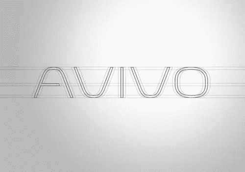](https://www.sitepoint.com/wp-content/uploads/2011/09/01.jpg)

[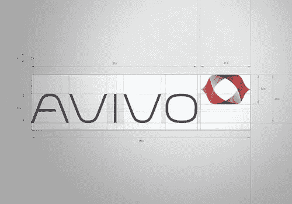](https://www.sitepoint.com/wp-content/uploads/2011/09/02.jpg)

### 排印

一个成功品牌的另一个关键是谨慎和一致地使用排版。如果可能的话，字体选择应该在所有媒体中使用，除非混合使用是合适的。

请注意丹尼斯的印刷选择是如何与公司名称紧密结合的。同样重要的是字体已经被定义和记录。对于一个完整的品牌组合来说，这种程度的尽职调查是必要的。

[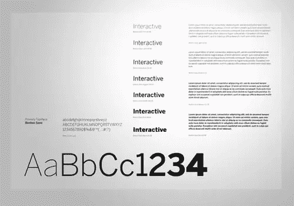](https://www.sitepoint.com/wp-content/uploads/2011/09/03-typography.jpg)

### 颜色选择和定义

然后丹尼斯开始选择和定义颜色。你可以在下面的第一张图片中看到精心挑选的调色板。接下来，用 CMYK、RGB 和 Pantone 颜色定义颜色。最后，应用和定义颜色，为公司提供多种但一致的选择。

[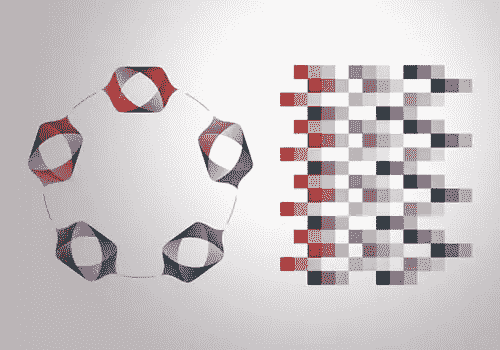](https://www.sitepoint.com/wp-content/uploads/2011/09/04-colors.jpg)

[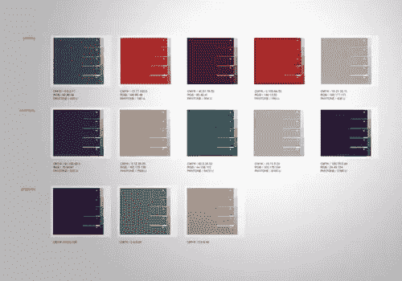](https://www.sitepoint.com/wp-content/uploads/2011/09/05-definitions.jpg)

[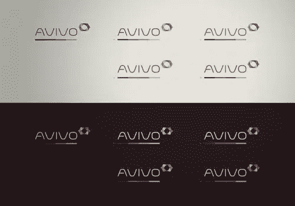](https://www.sitepoint.com/wp-content/uploads/2011/09/06-applied.jpg)

### 品牌的应用

最后，我们将看到品牌被应用到一些现实世界的营销宣传材料中。请注意该品牌如何在多种媒体和格式中运作良好，从名片到智能手机。

[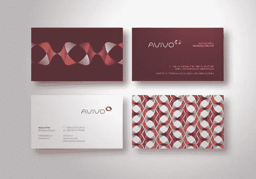](https://www.sitepoint.com/wp-content/uploads/2011/09/07-applied2.jpg)

[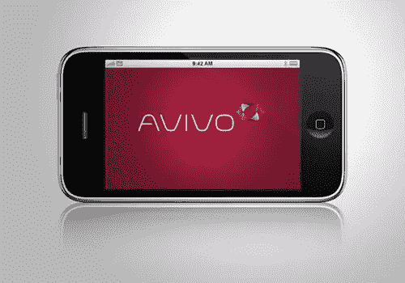](https://www.sitepoint.com/wp-content/uploads/2011/09/08-applied31.jpg)

### 更多企业标识集合

以下是由一些才华横溢的设计师设计的一些企业形象项目。看一看，收集一些灵感，并使用您新刷新的创意果汁来创建一些令人惊叹的设计！

#### 马克·布鲁克斯的《可可洛》

这家美发沙龙当然有一个“纽约”的外观和感觉与正确的风格和颜色的品牌。

[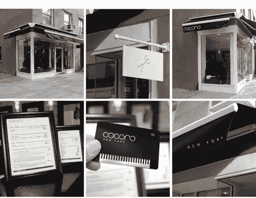](https://www.sitepoint.com/wp-content/uploads/2011/09/cocoro-identity-logo-sign.jpg)

[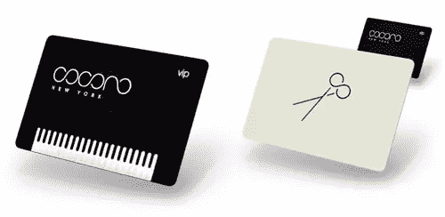](https://www.sitepoint.com/wp-content/uploads/2011/09/cocoro-identity-business-cards.jpg)

#### [雪佛兰的 Nonea](http://chevychase.se/#per_65)

排版与该品牌的图形完美匹配。

[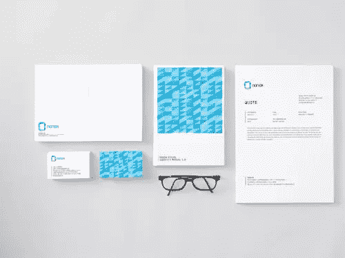](https://www.sitepoint.com/wp-content/uploads/2011/09/Nonea-12.jpg)

[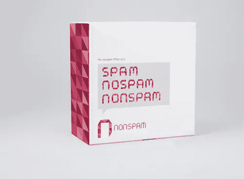](https://www.sitepoint.com/wp-content/uploads/2011/09/Nonea-11.jpg)

[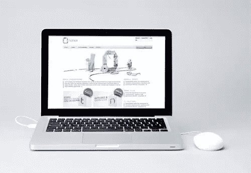](https://www.sitepoint.com/wp-content/uploads/2011/09/Nonea-21.jpg)

#### [靠 Ptarmak 吃饭](http://ptarmak.com/)

这家公司的标志负空间内的图像是辉煌的！

[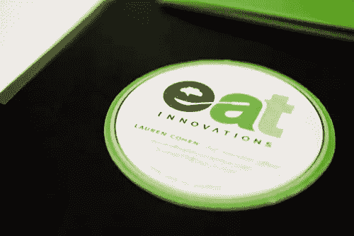](https://www.sitepoint.com/wp-content/uploads/2011/09/eat.6.jpg)

[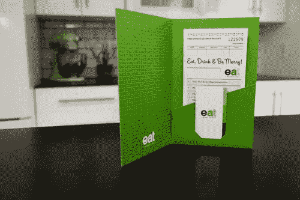](https://www.sitepoint.com/wp-content/uploads/2011/09/eat.4.jpg)

[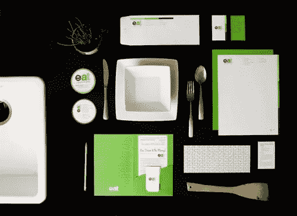](https://www.sitepoint.com/wp-content/uploads/2011/09/eat.1.jpg)

[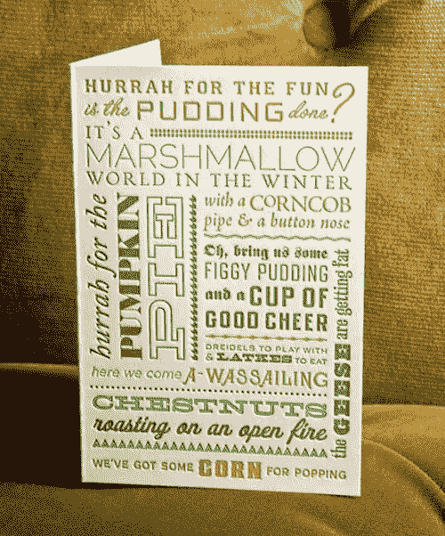](https://www.sitepoint.com/wp-content/uploads/2011/09/EAT_01.jpg)

#### [用这种根培养](http://thisisroot.co.uk/sculptivate.htm)

Root 通过模板推动 Play-Doh 开发了这个环境设计和构建代理的外观。

[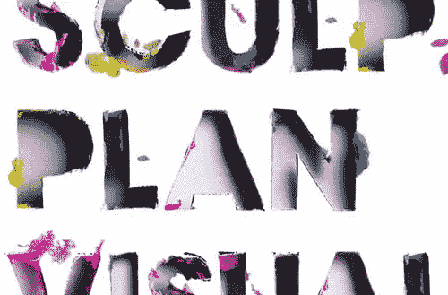](https://www.sitepoint.com/wp-content/uploads/2011/09/thisisroot_sculptivate_1.jpg)

[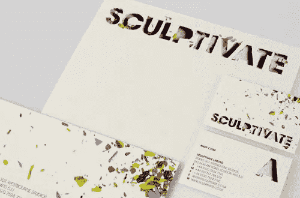](https://www.sitepoint.com/wp-content/uploads/2011/09/thisisroot_sculptivate_5.jpg)

#### [卢西亚诺·莫托所设计的](http://undesign.it/)

这家欧洲摩托车展厅的品牌用充满向前运动、黄色背景、赛车条纹和轮胎痕迹的醒目字体，完美地描绘了赛车的感觉。

[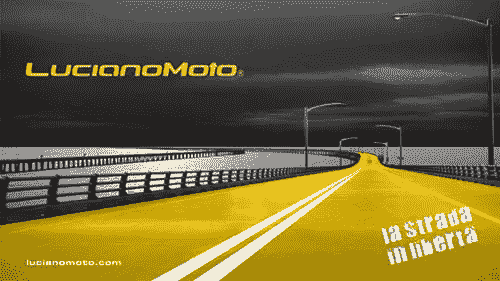](https://www.sitepoint.com/wp-content/uploads/2011/09/lmotovisual.jpg)

[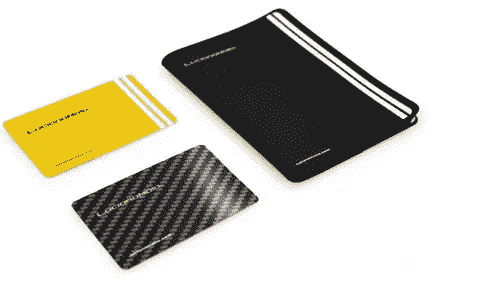](https://www.sitepoint.com/wp-content/uploads/2011/09/lmcloseroupok.jpg)

[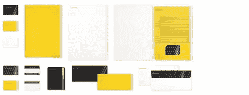](https://www.sitepoint.com/wp-content/uploads/2011/09/lmoto1.jpg)

*史蒂夫·科里拍摄的奶牛品牌形象。*

## 分享这篇文章