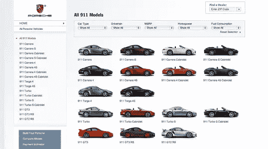
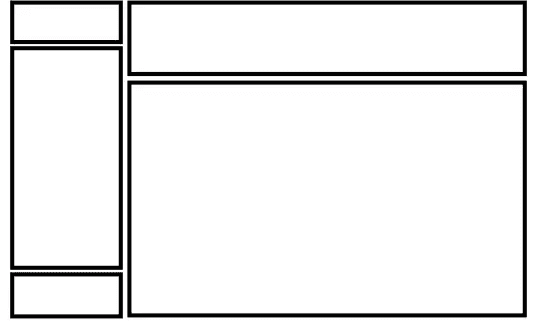
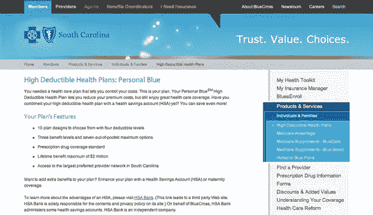
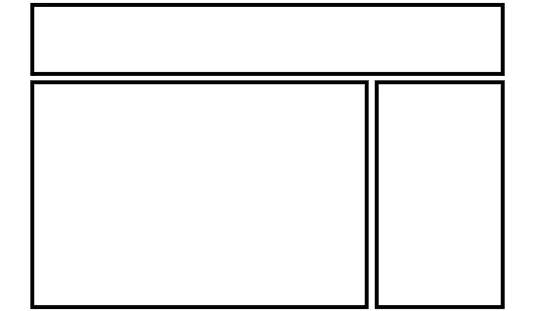
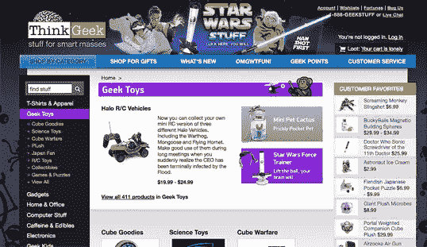
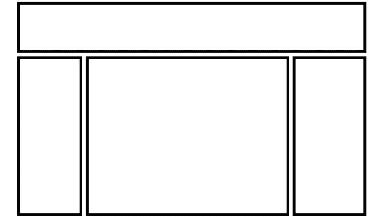
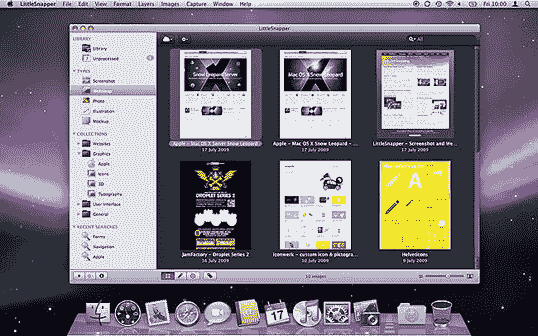

# 面包和黄油的布局和灵感

> 原文：<https://www.sitepoint.com/bread-and-butter-layouts-and-inspiration/>

到目前为止，我们谈论的大部分都是设计理论。理论是有帮助的，但它只能让我们理解为什么在网站设计中有些想法行得通，而有些却行不通。在我看来，例子和实践更有价值。大多数学术平面设计项目都包括一个富含艺术史和美术的课程。这些课程为从艺术角度理解平面设计提供了一个很好的基础，但对于你将设计放到网上时遇到的具体挑战，它们几乎没有帮助你做好准备。

巴勃罗·毕加索曾经说过:“我总是在做我做不到的事情，以便我能学会如何去做。”虽然我喜欢在设计新网站时采用这种方法，但首先要知道你能做什么。当你放眼整个互联网，你可以看到布局的可能性是无穷无尽的。然而，根据网站的目标，只有少数可能性有好的设计意义。这就是为什么我们一遍又一遍地看到某些身份、导航和内容的配置。

在本节中，我们将讨论三种最常见的布局，并探讨它们的优缺点。

## 三个典型的布局

### 左列导航

不管我们谈论的是流动的还是固定宽度的布局设计，左列导航格式是一个由来已久的标准。下图所示的[保时捷中心](http://www.porsche.com/usa/models/911/)的布局就是这种配置的经典范例。许多符合这种模式的网站不一定使用左栏作为主导航块——有时你会在页面顶部看到导航——但它们仍然将标题下的布局分为一个窄的(三分之一或更少)左栏和一个宽的右栏。它就像一条安全毯，或者你每周穿一次的腋窝有洞的舒适衬衫——即使它会让你的配偶发疯。由于这些原因，对于大多数项目来说，采用左列导航的布局是一个安全的选择。

使用左栏导航的网站的缺点是它们看起来缺乏创造性。这么多年来，人们已经用这么多种方式做了这么多次，以至于它们看起来都差不多。这并不是说你应该避免使用左栏导航布局。我猜，我设计的 75%的网站都有第二左栏导航，但是我会尽量把它混合起来。

说到混合，把左边的那一栏捡起来贴在内容的另一边怎么样？然后你会有一个右列导航布局。

### 右列导航

如果你打算把你的主要内容限制在页面的一边，现在更普遍的做法是把它推到左边，把导航、广告和附属内容放在右边。对于新闻网站、社交网络和具有扩展导航方案的网站来说，这是一种特别常见的配置，这些导航方案无法包含在简单的顶部导航中。南卡罗来纳州的 BlueCross BlueShield 就是这样一个例子。它的每个部分都有几种不同的布局和配色方案。下面的截图是第四级页面——也就是说，它距离首页四次点击。通过将二级导航放在右边，它可以避开那些已经很深的访问者，他们正在寻找一些非常具体的内容。

最终，决定是把导航列放在左边还是右边是一个判断，这实际上是关于你必须组织的内容的数量和类型。如果这是一个简单的网站，不需要任何二级导航，考虑一个狭窄的，无栏的布局。好的设计往往更多的是关于你漏掉了什么，而不是你放进了什么。如果你确实需要一个二级栏，只要记住内容是你的访问者在那里的目的…而且越来越多，他们在左边寻找它。

### 三栏导航

典型的三栏布局有一个宽的中间栏，两侧是两个小的导航栏。ThinkGeek 商店就是这种网页布局的一个例子。虽然在有大量导航、简短内容或广告要显示的页面上，三栏可能是必要的，但如果我们要保持布局不显得杂乱，空白是必不可少的。

## 寻找灵感

正因为左栏、右栏和三栏布局配置是大多数网页设计的基础，所以没有必要局限于这些布局。已经创建了大量的设计展示和设计模式网站，以展示新的和创新的想法，这些想法可能会帮助您跳出框框思考，包括以下内容(仅举几例):

*   无与伦比的风格
    有很多很棒的 CSS 画廊。无与伦比的风格比其他风格更具选择性，视频播客和采访通常也很有趣。
*   [CSS Drive](http://cssdrive.com/)
    喜欢无与伦比的风格，CSS Drive 是 CSS 画廊。这个网站的特别之处在于，他们很好地按照配色方案和布局对特色网站进行了分类。
*   从 2005 年到 2009 年，Patrick McNeil 收集并分类了数千个感兴趣的网页设计。他已经出版了两本书，Design Meltdown 网站仍然是灵感的巨大来源。
*   与前三个例子不同，模式点击是一个界面模式的画廊，而不是整个网站。在这里，您可以找到导航样式、联系人表单、分页、标签等的集合。
*   雅虎设计模式库
    类似于 Pattern Tap，但是例子和变化要少得多，雅虎设计模式库是学习标准用户界面元素的好地方。

## 使用“停尸房”文件

我知道你在想什么:“太好了，我有一堆图库和模式库要看——现在怎么办？”我的第一位平面设计教授教给我的最有用的技巧之一是，每当我为一个大型项目收集灵感时，就创建一个*停尸房文件*。这个概念相当简单:如果你正在做一个涉及火车的插图或营销项目，你可以剪下并打印出你能找到的任何可能给你灵感的东西，并把它们都放在一个文件夹里。这对你目前的项目有帮助，如果你需要做另一个涉及火车的项目，你会有很多灵感。

直到几年前，我才想起停尸房的档案。我发现自己在寻找一个在画廊网站上看到过的我喜欢的网站，但我不记得它的名称或地址了。当然，获得大量灵感资源是件好事，但是如果你找不到你想要的具体例子，这些资源就没用了。那时我开始创建自己的数字停尸房档案。最近，我一直在使用一个名为 [LittleSnapper](http://www.realmacsoftware.com/littlesnapper/) for Mac 的应用程序，它允许我创建部分屏幕的截图，甚至是整个网页(不再需要滚动、捕捉、滚动、捕捉)。LittleSnapper 还允许您为每个快照命名，并添加标签，以便以后查找。当然，不管你喜欢什么样的操作系统，有很多方法可以为你的停尸房文件拍摄快照。在无数次寻找灵感的时候，拥有一个可供我浏览的网站设计库是一个便利的资源。

### 为你自己的停尸房文件捕获一个屏幕截图

1.  选择显示您希望保存为屏幕截图的页面的浏览器窗口。
2.  将浏览器窗口的截图复制到你的剪贴板上— **在 PC 上:**按`Alt` + `Print Screen`或使用原生截图工具(Windows Vista 或 7)抓取屏幕的一部分；**在 Mac 上:**按`Shift` + `Command` + `4`，然后`Space`将光标变成摄像头。然后，按住`Control`，点击浏览器窗口。
3.  此时，您的剪贴板中应该有一个浏览器窗口的屏幕截图。在您喜欢的图形程序或文档编辑器中打开一个新文档，并粘贴到截图中。
4.  保存您的图像或文档。

接下来，我们将看看一些新的设计趋势。

## 美丽网页设计的原则

这篇文章来自杰森·比厄德的 [*美丽网页设计的原则*一书](https://www.sitepoint.com/premium/library "SitePoint.com: The Principles of Beautiful Web Design, 2nd Edition")(第二版现已出版)。这是第一章的第八和第九部分。

整个色彩章节已经被数字化了，所以如果你更喜欢色彩，请在设计节上点击[查看色彩章节。](https://www.sitepoint.com/design-ux/color/ "DesignFestival.com: Everything on Color")

## 分享这篇文章