# 在 Photoshop 中将图像分解成拼图块

> 原文：<https://www.sitepoint.com/break-an-image-into-puzzle-pieces-in-photoshop/>

谜题对很多事情来说都是象征性的:将抽象的部分组合成一个有凝聚力的整体，解决复杂的问题，以及完美的部件组合。这些背景和内涵可能是设计师的高需求，因此将拼图作为一种视觉技术是非常宝贵的。在本教程中，我们将把一张照片变成一个有趣的拼图。我们将从头开始做每件事，这将允许对你的最终结果有更大的控制。

在这个过程中，你将学习钢笔工具的使用，一些图层样式技巧和过滤器的使用。我还将演示如何通过几个简单的步骤创建自己的拼图游戏模式。所以，让我们开始吧！

**资源:**

杰尼·切克的狗

[拼图空白模板](https://www.sitepoint.com/wp-content/uploads/2013/01/Jigsaw-Puzzle-Blank-Template.zip "jigsaw puzzle template")

**最终结果:** 

[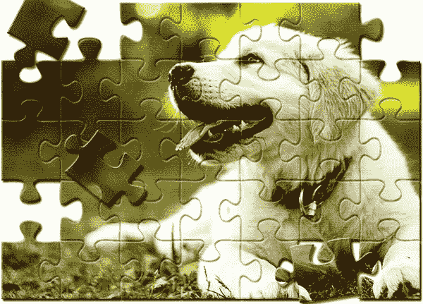](https://www.sitepoint.com/wp-content/uploads/2013/01/Final-result13.jpg)

### 第一步

在 Photoshop 中打开照片。

[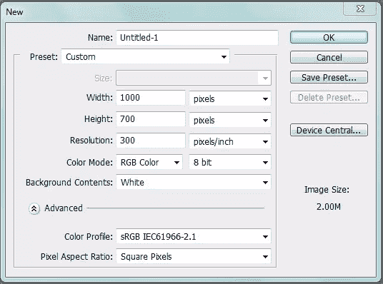](https://www.sitepoint.com/wp-content/uploads/2013/01/1.jpg)

### 第二步

通过“图层”>“复制图层”来复制图像图层我们将在这个复制的图像上应用拼图效果，并将原始图像保留在它下面作为备份。

[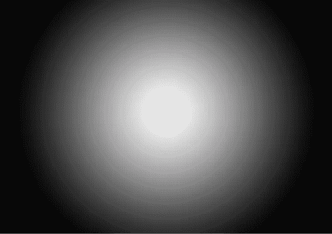](https://www.sitepoint.com/wp-content/uploads/2013/01/2.jpg)

### 第三步

在进一步处理之前，我们将对图像进行一些颜色调整。点击图层面板底部的“新建填充或调整图层”图标，选择“色彩平衡”选项。对中间色调、阴影和高光应用以下设置。完成后，合并复制的图像和色彩平衡层。为此，选择这两个层，并按 Ctrl + "E "。

[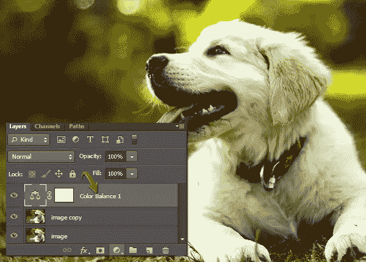](https://www.sitepoint.com/wp-content/uploads/2013/01/3b.jpg)

### 第四步

接下来，我们将赋予图像一些纹理。点击图像层选择它，进入“过滤器”>“过滤器画廊”>“纹理”>“纹理”，并应用以下设置。将这一层标记为“纹理”。

[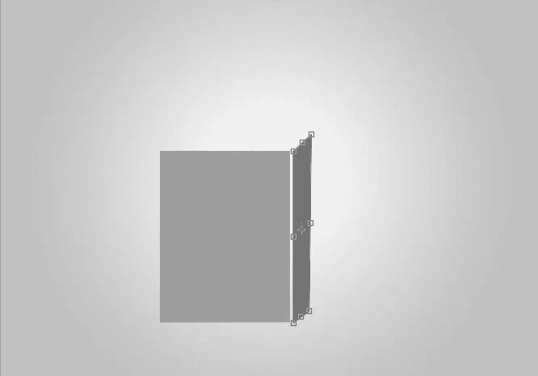](https://www.sitepoint.com/wp-content/uploads/2013/01/4.jpg)

[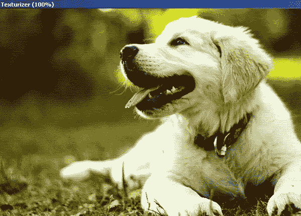](https://www.sitepoint.com/wp-content/uploads/2013/01/4b.jpg)

### 第五步

现在我将向你展示如何制作拼图模板。通过“图层”>“新建图层”创建一个新图层选择钢笔工具(工具模式:形状)，在顶部属性栏设置填充为“无”，描边为 0.5 磅纯黑。画出如下所示的笔画。

[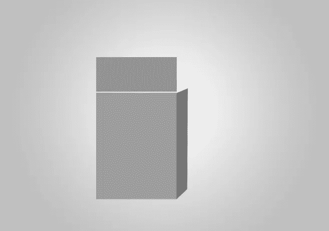](https://www.sitepoint.com/wp-content/uploads/2013/01/5.jpg)

### 第六步

进入“图层”>“栅格化”>“形状”，栅格化描边图层。复制描边图层，通过“编辑”>“变换路径”>“水平翻转”进行水平翻转。在移动工具(“V”)的帮助下，将两个笔画层相互连接。现在，选择两个笔画层，并通过按 Ctrl+ "E "合并它们。

[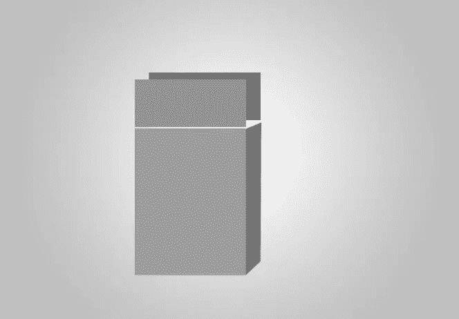](https://www.sitepoint.com/wp-content/uploads/2013/01/6.jpg)

### 第七步

复制合并层两次，并将这些副本放在原始层的下面，制作一个连续的笔画，如下所示。将这三层合并成一个连续的笔画。

### 第八步

复制笔画层，水平翻转，如下图所示。

[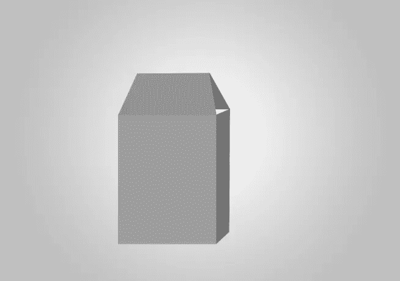](https://www.sitepoint.com/wp-content/uploads/2013/01/8.jpg)

合并这两个笔画层，复制，并向右侧拖动。重复同样的技巧，直到你覆盖了整个画布。完成后，合并所有的笔画图层，并将合并后的图层标注为“垂直笔画”。

### [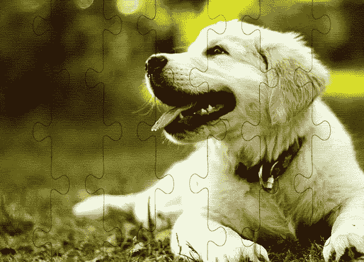](https://www.sitepoint.com/wp-content/uploads/2013/01/8b.jpg)

### 第九步

复制“垂直笔画”层，通过“编辑”>“变换”>“旋转 90⁰".”将其翻转为 90⁰如下图所示放置，完成拼图模板。这样，做一个简单的片段，就可以做一个完整的拼图。

### 

### 第十步

我用上面显示的相同技术制作了一个拼图空白模板。如果您想使用模板，可以跳过步骤 5-9。从教程资源下载 PNG 文件，进入“文件”>“放置”，选择拼图空白模板 PNG 文件。这将把拼图放在你正在处理的文档中。您可以使用自由变换工具(Ctrl+“T”)根据您的图像调整拼图的大小。

### 步骤 11

接下来，按 Ctrl + <click on="" the="" puzzle="" template="" layer="">选择它。之后，进入“选择”>“逆”。现在，点击纹理层，同时选择仍然是活跃的，并按 Ctrl + "C "复制它。按 Ctrl + "V "粘贴选择到一个新的层。将此图层标记为“照片拼图”。隐藏除这一层以外的其他层。</click>

### 步骤 12

双击“照片拼图”层，应用以下设置为“斜面和浮雕”和“阴影”。

[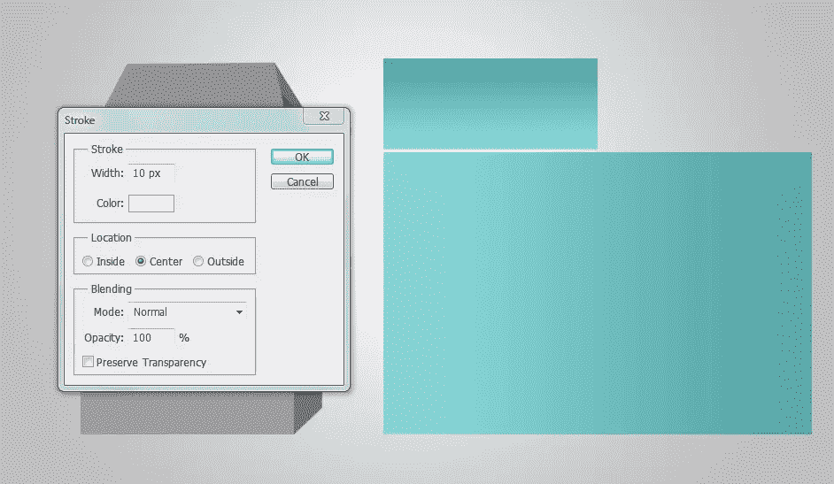](https://www.sitepoint.com/wp-content/uploads/2013/01/12.jpg)

[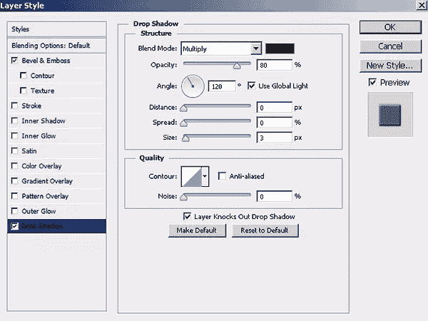](https://www.sitepoint.com/wp-content/uploads/2013/01/12b.jpg)

[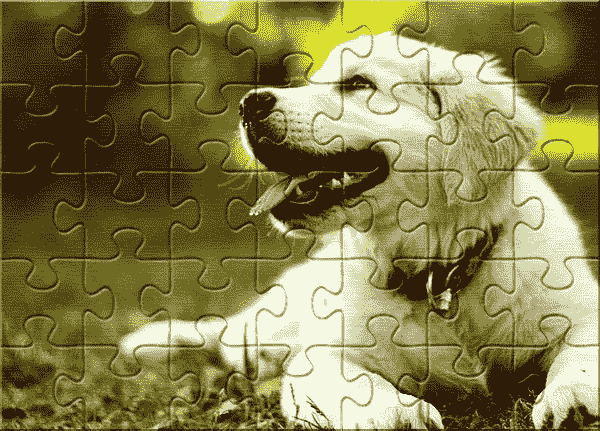](https://www.sitepoint.com/wp-content/uploads/2013/01/12c.jpg)

### 第十三步

到目前为止，我们的谜题看起来相当可信。然而，我们可以进一步增强它。选择钢笔工具(工具模式:形状)，设置填充为任意想要的颜色，描边为“无”。画出要移动的拼图块的形状。

### 步骤 14

按 Ctrl + <click on="" the="" puzzle="" piece="" layer="">选择它。现在点击“照片拼图”层，进入“编辑”>“清除”。在“照片拼图”层下面新建一个层，使用油漆桶工具用纯白填充。</click>

### 第十五步

再次，围绕拼图块层进行选择。现在，使纹理层可见，按 Ctrl + "C "复制选择它，并按 Ctrl + "V "粘贴到一个新的层。将这个剪切好的拼图块放在“照片拼图”层上面。

[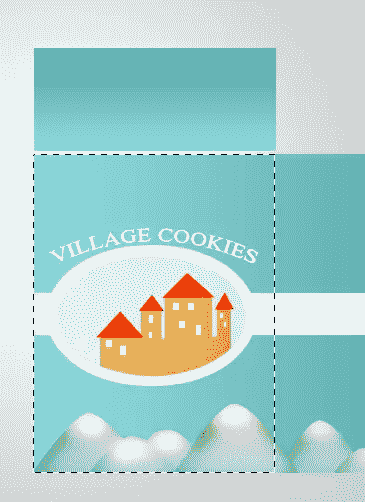](https://www.sitepoint.com/wp-content/uploads/2013/01/15.jpg)

### 第十六步

右键单击“照片拼图”层，选择“复制图层样式”选项，然后右键单击拼图块层，选择“粘贴图层样式”应用相同的效果。双击并修改拼图块上的投影设置。

[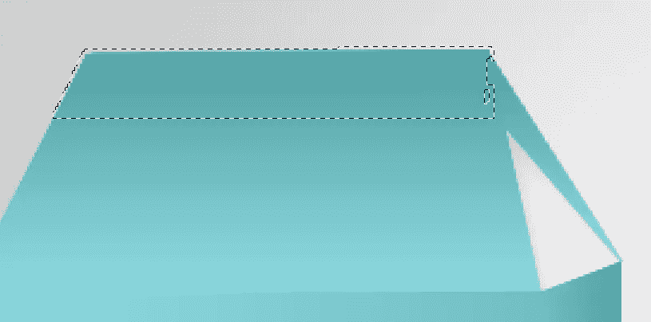](https://www.sitepoint.com/wp-content/uploads/2013/01/16.jpg)

使用自由变换工具(Ctrl+“T”)将这张图片旋转一点，然后随意排列。

[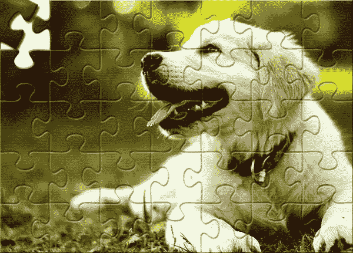](https://www.sitepoint.com/wp-content/uploads/2013/01/16b.jpg)

### 步骤 17

使用相同的技术玩拼图，创造你自己的结果。这是我的最终结果。

就这样，伙计们。我希望你学到了一些有趣的东西。请分享你的想法！

## 分享这篇文章