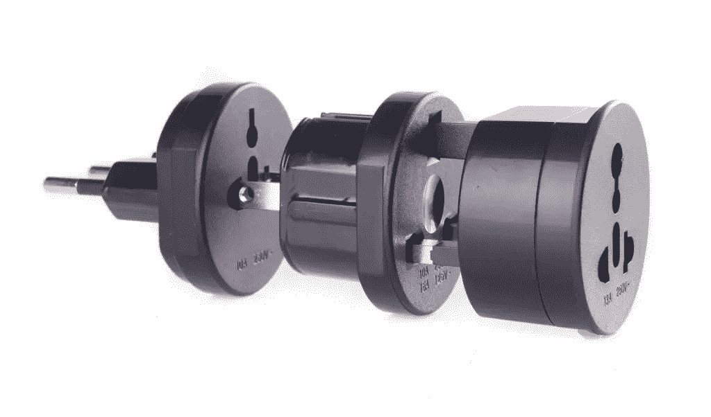
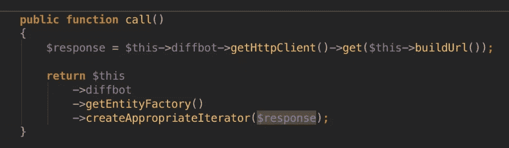

# 用 PHP-HTTP 和 HTTPlug 摆脱 Guzzle5

> 原文：<https://www.sitepoint.com/breaking-free-from-guzzle5-with-php-http-and-httplug/>

*这篇文章由[马克·萨基-卡萨尔](https://github.com/sagikazarmark)和[大卫·布赫曼](https://github.com/dbu)进行了同行评审。感谢 SitePoint 的所有同行评审员使 SitePoint 的内容尽可能做到最好！*

* * *

在之前的系列文章中，我们为 Diffbot 构建了一个 PHP 客户端。该客户端运行良好，使用相对广泛——我们甚至[在](https://www.sitepoint.com/turning-crawled-website-search-engine-php/)[的一个直播应用](http://search.sitepoint.tools)上测试了它以确保它达到标准——但它严重依赖于 Guzzle 5。

这有两个问题:

1.  Guzzle 6 出局，支持 [PSR 7](http://www.php-fig.org/psr/psr-7/) 。虽然 Guzzle 的作者声称 Guzzle 5 将在可预见的未来得到支持，但更安全的做法是怀疑它的寿命。此外，虽然 PSR 7 可能有[的怪癖](https://community.sitepoint.com/t/the-immutability-fad/199534?u=swader)，但如果只是为了与其他项目兼容，遵循 PSRs 也是好的
2.  有人在他们的应用程序中实现了我们的客户端，可能已经有一个首选的 HTTP 客户端在使用，并希望使用他们的客户端而不是 Guzzle。我们应该允许将任何 HTTP 客户端容易地注入到我们的 SDK 中。

巧合的是，有一个新项目允许我们这样做:[http plug](http://docs.httplug.io/)。



*注意:您不需要熟悉 Diffbot SDK 的内部逻辑。本文中的过程适用于任何具有具体 HTTP 客户机实现的包，并且很容易理解。*

## PHP-HTTP 和 HTTPlug

[PHP-HTTP](https://github.com/php-http/) 是 PHP 中 HTTP 相关工具的 Github 组织。它提供了[HTTP plug](https://github.com/php-http/httplug)，这是一个接口和异常的集合，用于在 PSR 7 请求和响应的基础上定义一个最小的 HTTP 客户端契约。该契约的实现*提供*虚拟包`php-http/client-implementation`。

这意味着使用 Guzzle 6 的人可以`composer require php-http/guzzle6-adapter`拉进适配器、HTTPlug 接口包，并将 Guzzle 6 本身作为适配器的依赖项。

HTTPlug 是可重用包的入口点。它是所有客户端(如 Guzzle6 适配器)所基于的客户端抽象。这些客户端然后进一步利用它们的底层包/依赖——在这个例子中是 Guzzle 6。

所以，从下到上:

*   存在一个 HTTP 客户端(Guzzle 6)
*   一个 Guzzle 6 适配器是用 HTTPlug 作为接口构建的，包装了 Guzzle 6
*   需要能够进行 HTTP 调用的应用程序需要一个客户端，需要 HTTPlug 的 HttpClient 接口，而不是直接使用 Guzzle 6
*   然后，该应用程序可以使用 Guzzle 6 或任何其他实现 HTTPlug 的 HttpClient 接口并包装另一个第三方 HTTP 客户端的适配器

该团队的计划是最终最大限度地支持 PHP 领域的各种 HTTP 客户端:Guzzle 6、Guzzle 5、Zend2、Zend1 等。这样，框架或应用程序的用户将不会与已安装的客户端版本发生冲突，并且只需将适当的适配器插入组合中。

注意，我们在这里几乎可以互换使用术语*适配器*和*客户端*——基于 HTTPlug 的适配器都是。它们是现有客户机的包装器，但直接用作客户机本身。

我们在这篇文章中的计划是用 HTTPlug 版本替换 Diffbot 的 PHP 客户端的依赖关系。

*注意:HTTPlug 和相关包是 alpha 软件，因此可能会更改。转换任何东西来使用它们都是一项冒险的努力。*

## 拔靴带

像往常一样，建议我们使用 [Homestead Improved](https://www.sitepoint.com/quick-tip-get-homestead-vagrant-vm-running/) 来引导我们的环境。一旦我们准备好了，我们就可以克隆和测试 SDK 的当前稳定版本:

```
git clone https://github.com/swader/diffbot-php-client
cd diffbot-php-client 
git checkout tags/0.4.5 
composer install
phpunit 
```

最后一个命令假设 PHPUnit 被全局安装在开发环境中。

所有的测试都应该通过(除了一个被跳过的测试，由于[一些无意义的事情](http://stackoverflow.com/q/30680565/504357)而被调试和修复)，所以我们准备开始转换。

## 入门指南

首先，我们需要创建一个新的分支来开发这个升级。

```
git checkout -b feature-httplug 
```

然后，我们将两个依赖项添加到我们的`composer.json`文件中:

```
 "require": {
        ...
        "php-http/client-implementation": "^1.0"
    },
    "require-dev": {
        ...
        "php-http/guzzle6-adapter": "~0.2@dev"
    }, 
```

这是告诉客户，从现在开始，它依赖于一个*虚拟包*–[这个](https://packagist.org/providers/php-http/client-implementation)。这意味着为了被使用，使用我们的 Diffbot 客户端的应用程序(像[这个](http://search.sitepoint.tools) ) **必须**选择这个包的一个实现(Packagist 上的链接中列出的一个)。当然，在包的开发过程中，如果没有实际的实现，就不可能测试和查看一切是否正常，所以我们指定了一个额外的`require-dev`依赖项。在上面的具体案例中，我们使用`"php-http/guzzle6-adapter": "~0.2@dev"`。我们选择这个特定的版本仅仅是因为它是最新的，没有稳定的版本。

*注意:你可能想知道为什么我们使用向`composer.json`中添加值的方法，而不是像我们通常做的那样在终端中交互声明依赖关系。这是因为对一个虚拟包执行`composer require`会抛出一个错误——这个包实际上并不存在，它只是它的虚拟名，一个占位符，所以 Composer 会因为不知道要安装什么而感到困惑。有[一个问题](https://github.com/composer/composer/issues/4535)建议对此进行改变，但这不太可能很快发生。*

由于`php-http`包仍在大量开发中，我们应该在`composer.json`文件中添加以下两个值:

```
"prefer-stable": true,
"minimum-stability": "dev" 
```

这是为了允许安装`dev`包(不稳定的)，但是如果有稳定的版本，最好选择稳定的版本。因此，与其获取高度不稳定的 PHPUnit 5.2.x，不如获取 5.0.8(在撰写本文时大多数都是最新的)，但如果我们要求它提供没有稳定版本的包(如`guzzle6-adapter`)，它也会成功。

如果我们打算安装 Guzzle6，我们还需要消除对 Guzzle5 的依赖。最终所需块如下所示:

```
 "require": {
        "php" : ">=5.4.0",
        "php-http/client-implementation": "^1.0"
    },
    "require-dev": {
        "symfony/var-dumper": "~2",
        "phpunit/phpunit": "^5.0",
        "php-http/guzzle6-adapter": "~0.2@dev"
    }, 
```

## 这个计划

SDK 目前的工作方式如下:在主 [Diffbot 类](http://diffbot-php-client-docs.readthedocs.org/en/1.0/01-diffbot.html)中，我们可选地设置一个 HTTPClient。这目前被绑定到 Guzzle 在版本 5 中的实现。如果没有设置自定义客户端实例，Diffbot 类将自动使用默认客户端。

然后， [Api 抽象的调用方法](http://diffbot-php-client-docs.readthedocs.org/en/1.0/abstract-api.html#Swader%5CDiffbot%5CAbstracts%5CApi::call)使用这个客户端向给定的 URL 发出一个`get`请求。另外，[中有一个自定义的`call`方法，抓取 API 类](http://diffbot-php-client-docs.readthedocs.org/en/1.0/api-crawl.html#Swader%5CDiffbot%5CApi%5CCrawl::call)和[搜索 API 类](http://diffbot-php-client-docs.readthedocs.org/en/1.0/api-search.html#call)。

调用的结果被保存为`$response`，这是一个 Guzzle5 响应。然后，该响应由[实体工厂](http://diffbot-php-client-docs.readthedocs.org/en/1.0/class-entityfactory.html#Swader%5CDiffbot%5CFactory%5CEntity::createAppropriateIterator)进行额外处理，检查其有效性并从中构建[实体](http://diffbot-php-client-docs.readthedocs.org/en/1.0/abstract-entity.html)，将它们推入[实体迭代器](http://diffbot-php-client-docs.readthedocs.org/en/latest/class-entityiterator.html)。

因此，计划是:

1.  用接受 HTTPlug 实现的方法替换`Diffbot::setHttpClient`
2.  修改 API abstract 的、Crawl 的和 Search class 的'`call`'方法，以便它们可以使用提供给它们的任何 HTTP 客户机实现发出 GET 请求。
3.  修改实体工厂和实体迭代器，使它们不再依赖于响应的 Guzzle5 版本，而是依赖于 PSR 7 版本。

PHP-HTTP 项目有一个额外的包， [Utils](https://github.com/php-http/utils) ，它包含 [HttpMethodsClient](http://docs.httplug.io/en/latest/utils/#httpmethodsclient) 。该类将消息工厂和 HTTP 客户端包装成一个整体，使得用 GET、POST 等常用动词发送请求变得更加容易——从而转换成类似于我们目前所拥有的内容:`$client->get( ... )`。更重要的是，它还返回 PSR-7 `ResponseInterface`，这意味着`getBody`方法将对我们可用——这将只剩下`toJson`方法未实现，这是我们自己可以轻松完成的事情。

此外，该项目有一个[发现](http://docs.httplug.io/en/latest/discovery/)组件，它具有一些静态类，用于发现已安装的[工厂](http://docs.httplug.io/en/latest/message-factory/)和客户端——这允许我们在某些情况下为最终用户提供零配置体验(参见[文档](http://docs.httplug.io/en/latest/discovery))。

有了作战计划，我们就可以开始重构了。

### 先决条件

让我们要求额外的软件包:

```
composer require "php-http/utils" "php-http/discovery" 
```

### Diffbot 类

Diffbot 类的顶部有这样一行:

```
use GuzzleHttp\Client; 
```

我们可以把它改成:

```
use Http\Client\Utils\HttpMethodsClient as Client; 
```

`setHttpClient`方法现在应该在 IDE 中突然出现，说它缺少一些必需的参数，即要使用的客户端，以及用来构建请求实例的[消息工厂](http://docs.httplug.io/en/latest/message-factory/)。

该方法应重构为:

```
/**
 * Sets the client to be used for querying the API endpoints
 *
 * @param Client $client
 * @see http://php-http.readthedocs.org/en/latest/utils/#httpmethodsclient
 * @return $this
 */
public function setHttpClient(Client $client = null)
{
    if ($client === null) {
		$client = new Client(
		   \Http\Discovery\HttpClientDiscovery::find(),
		   \Http\Discovery\MessageFactoryDiscovery::find()
		);
    }
    $this->client = $client;
    return $this;
} 
```

或者，发现类可以用位于类顶部的`use`语句导入。

这一更改现在允许 Diffbot SDK 的最终用户:

*   安装自己的客户机，让发现组件和 HttpMethodsClient 一起自动处理事情，或者
*   通过将 PSR 7 客户端和消息工厂的自定义实例注入到它的新实例中来配置它们自己的 HttpMethodsClient 实例，并将的*注入到`setHttpClient`方法中以获得充分的灵活性*

大多数用户会在 autopilot 上使用这个。

### API 摘要、抓取和搜索

接下来是`call`方法。



因为我们之前实现的`HttpMethodsClient`实例有一个`get`方法，所以在这方面不需要任何改变。然而，`$response`的例子显示了一种不匹配，而且理由很充分。最初`EntityFactory`所期待的`$response`是一种疯狂的反应。

由于投诉是由`EntityFactory`发出的，我们真的不需要编辑 API 摘要——它会自己处理事情。`Crawl`类`call`的对应物有点不同:

```
public function call()
{
    $response = $this->diffbot->getHttpClient()->get($this->buildUrl());

    $array = $response->json();

    if (isset($array['jobs'])) {
        $jobs = [];
        foreach ($array['jobs'] as $job) {
            $jobs[] = new JobCrawl($job);
        }

        return new EntityIterator($jobs, $response);
    } elseif (!isset($array['jobs']) && isset($array['response'])) {
        return $array['response'];
    } else {
        throw new DiffbotException('It appears something went wrong.');
    }
} 
```

这里有两个警告——该方法的第二行使用了`$response`的`json`方法，以及期待 Guzzle5 响应的`EntityIterator`实例化。从这里我们能影响的唯一一行是前者，所以让我们把它改成:

```
$array = json_decode($response->getBody(), true); 
```

在`Search`类的`call`方法中需要做一个类似的改变，其中:

```
$arr = $ei->getResponse()->json(['big_int_strings' => true]); 
```

更改为:

```
$arr = json_decode((string)$ei->getResponse()->getBody(), true, 512, 1); 
```

### 实体工厂

EntityFactory 类的顶部有以下导入:

```
use GuzzleHttp\Message\ResponseInterface as Response; 
```

我们可以将其改为:

```
use Psr\Http\Message\ResponseInterface as Response; 
```

同样的事情需要在`EntityFactory`类实现的`EntityFactory` [接口](http://diffbot-php-client-docs.readthedocs.org/en/1.0/class-interfaces.html#entityfactory)中完成。

另一个变化类似于我们在上面的`Crawl`类中所做的。我们改变:

```
$arr = $response->json(['big_int_strings' => true]); 
```

到

```
$arr = json_decode($response->getBody(), true, 512, 1); 
```

在`checkResponseFormat`和`createAppropriateIterator`两种方法中。

### 实体迭代器

我们改变:

```
use GuzzleHttp\Message\ResponseInterface as Response; 
```

到

```
use Psr\Http\Message\ResponseInterface as Response; 
```

### 试验

测试 HTTP 请求和 API 调用的主要方式 Mocking 在 [Guzzle 6](http://docs.guzzlephp.org/en/latest/testing.html) 中有所不同，所以我们的测试需要稍微大一点的改动。

由于本教程已经有点冗长，如果你有兴趣了解 Guzzle 5 和 Guzzle 6 之间的模仿差异，特别是 Diffbot SDK 的两个版本之间的差异，请参见[相关特性分支](https://github.com/Swader/diffbot-php-client/tree/feature-httplug)。

最后，让我们运行测试:

```
phpunit

PHPUnit 5.0.8 by Sebastian Bergmann and contributors.

Runtime:       PHP 5.6.10-1+deb.sury.org~trusty+1 with Xdebug 2.3.2
Configuration: /home/vagrant/Code/diffbot-php-client/phpunit.xml.dist

...............................................................  63 / 347 ( 18%)
............................................................... 126 / 347 ( 36%)
............S.................................................. 189 / 347 ( 54%)
............................................................... 252 / 347 ( 72%)
............................................................... 315 / 347 ( 90%)
................................                                347 / 347 (100%)

Time: 55.78 seconds, Memory: 34.25Mb 
```

成功！全部通过(预期跳过的测试除外)。

Diffbot SDK 现在不仅与 PSR 7 兼容，还可以接受 HTTP 客户端的其他实现。它所需要的只是一个支持 HTTPlug 接口的适配器，一切都应该开箱即用。

## 结论

HTTPlug 是在我们构建的应用程序中抽象 HTTP 客户端实现的一种有用的新方法。无论我们是自己构建 HTTP 客户端还是在其他应用程序中使用它们，PHP-HTTP 都以一个额外抽象层的合理价格提供了一个全新的可扩展性世界。

如果您想通过添加更多的适配器实现来提供帮助，或者只是通过试用软件包并给出反馈，该团队欢迎所有的贡献。联系我们，或者在下面的评论区留下你的反馈，如果你对这个教程感兴趣，别忘了点击“喜欢”按钮！

## 分享这篇文章