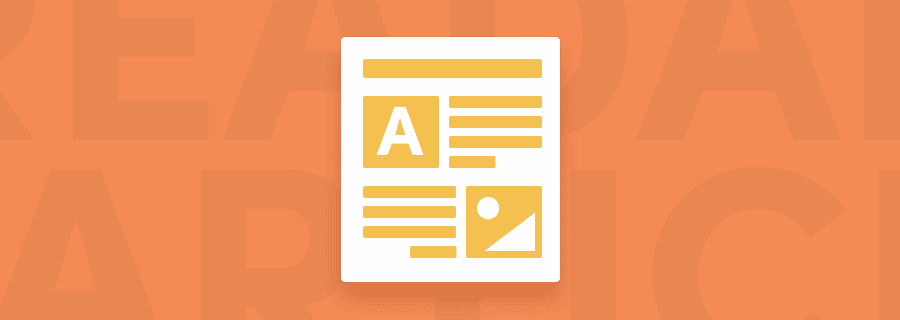
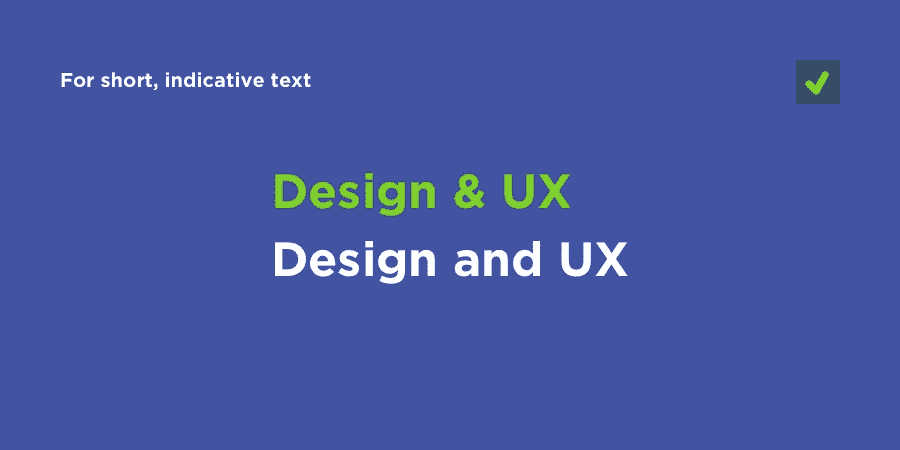
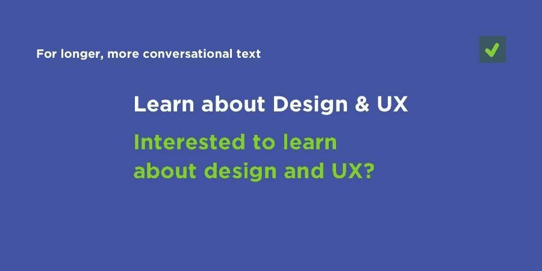
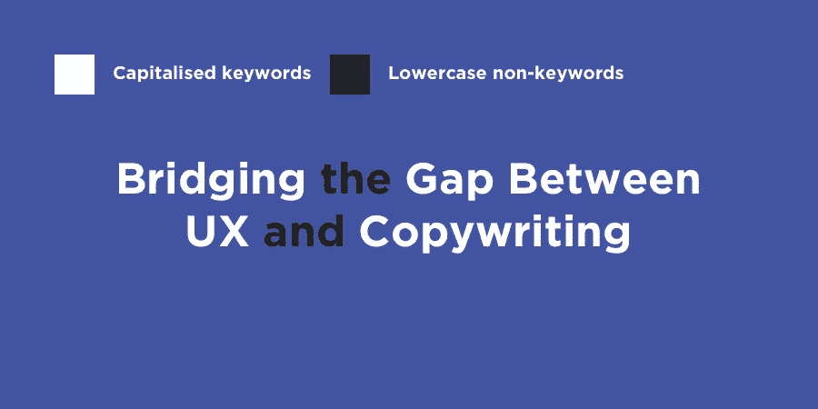
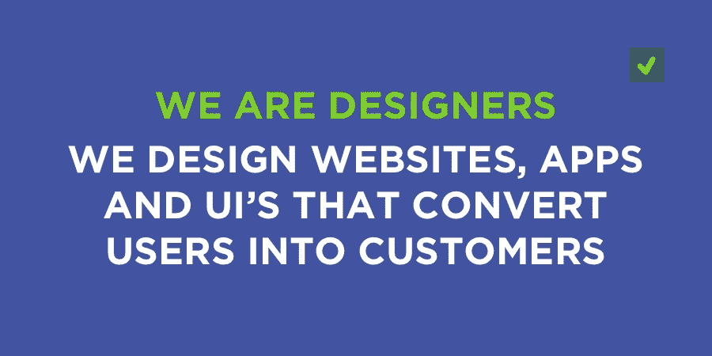
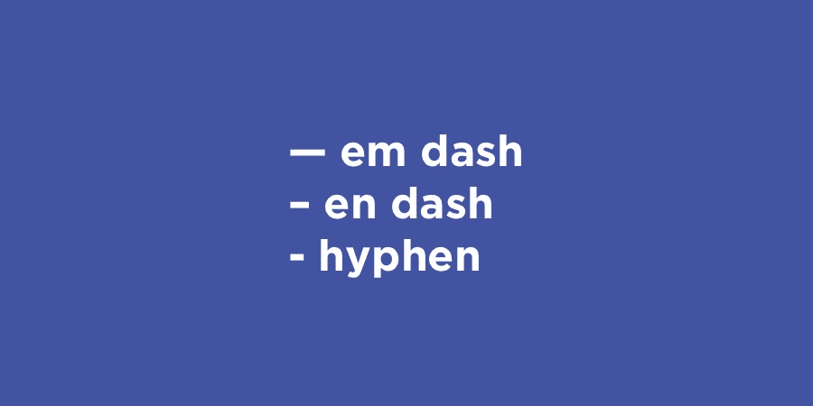
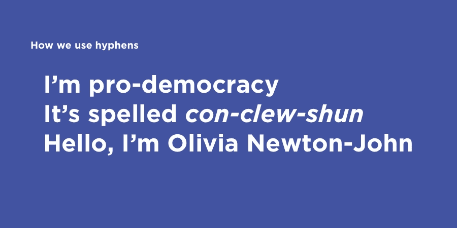
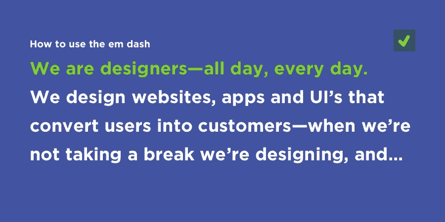

# 弥合 UX 和文案之间的鸿沟

> 原文：<https://www.sitepoint.com/bridging-gap-between-ux-and-copywriting/>

标点符号？语法？UX 设计？*什么？*

是的，你听到了！标点和语法对于最佳的阅读体验至关重要，反过来，也是最佳的用户体验。一个简单的逗号可以区别一个文本是否完全有意义，或者根本没有意义。

网页设计大约 95%是排版。11 年前[是这样的](https://ia.net/topics/the-web-is-all-about-typography-period/)，今天依然如此。当文案从用户体验的角度考虑他们的文字时，或者当设计师作为一个作家投入更多的时间改进时，内容的可读性和参与度可以成倍地提高。就像俗话说的“内容为王”。

让我们来看看一些非常重要的标点符号，它们可以极大地提高书面单词的可读性和理解性(除了基本的标点符号——冒号、逗号和句号)。我们将讨论**连字符**、**大写**和**破折号**。

## &的记号名称

一个[和符号](https://en.wikipedia.org/wiki/Ampersand)是一个意为“和”的语标，来源于连字“et”，是拉丁语*中“和”的意思。我们大多数人都知道“与”的意思，但是不确定什么时候使用它是可以接受的。*

我必须承认，我用错了好几年了！

**什么时候不应该使用与号:**

不要在句子中使用&符号。句子应该由自然语言组成，它们被设计成以一种对话的、类似人类的方式与用户“交谈”。当语言感觉友好和对话时，人们会对内容和用户界面产生共鸣(并且更有可能转化/参与其中)。

**当你*应该*用一个&符号:**

假设你有一个关于设计和 UX 的博客类别。在这种情况下，用户并不希望被左右、被吸引、被诱惑或被告知——用户在寻找**指示**。用户想要定位并点击该类别的链接，所以这是对话语气变得不太有用的地方。

“设计和 UX”很好，但“设计和 UX”更短，因此更清晰、更直接。很有可能这个博客也有许多其他感兴趣的类别，所以,“与”符号占用更少的空间，并允许导航中有更多的菜单项。

因此，在需要自然语言的句子和文本中使用“and ”,在锚文本和短标题中使用“and”。

## 小写，大写…Titlecase？

为什么我们在标题中使用 titlecase？

有趣的问题。它实际上不仅仅是一种形式，在标题、小标题和大标题中使用 titlecase 还有一个坚实的与 UX 相关的理由。

读者在进入句子之前会用标题来概括内容，他们也会更关注标题中的关键词。在一个在线内容如此容易获取的世界里，读者对他们所读的内容越来越挑剔。

在选择标题时，小写的单词是指那些*可以被*删除的单词。在这篇文章的标题“弥合 UX 和文案之间的差距”中，单词“the”和“and”可以被删除，标题仍然有意义。出于可读性的原因，我们仍然需要将它们包含在标题中(还记得我说过的关于自然语言的内容)，但是我们可以通过强制小写来使它们不那么明显。

### 大写和大写字母

几乎所有的文本都是以大写字母开头的，但是**大写**呢？大写字母更难阅读，因为缺乏易读性(区分*单个*字母的能力)——当一个语句以大写形式出现时，每个字母都是相同的高度，所以更难区分两个字母。

不是不可能，而是更难。

大写的标题当然可以产生更大胆的效果，但是需要注意的是，大写最适合较短的文本。对于较长的文本，应该避免使用大写字母，以免影响可读性。

## 连字符

如果你认为破折号是连字符，那你就错了。实际上有许多不同类型的破折号——长破折号、短破折号、引用破折号(仅举几个例子),还有连字符(大约有十种不同的变体！).它们有不同的用途，看起来也略有不同。

这里有三个主要的:

*   长破折号:——(最长破折号)
*   短破折号:–(比长破折号短)
*   连字符:–(比所有破折号都短)

那么长破折号、短破折号和连字符之间有什么区别呢？

从视觉上来说，作为一名设计师，你只需要知道连字符和长破折号之间的区别，因为大多数用户不会真正注意到任何其他标记之间的区别。

应该注意的是，如果使用某种字体，减号和连字符之间的视觉差异可能会更明显(例如，对于“Arial”字体，减号和连字符看起来几乎相同)。

好吧，那么它们实际上是用来做什么的呢？

让我们从最常见的标记开始，连字符。

连字符用于连接常用短语中的单词(如“支持民主”)。我们称这些词为“复合结构”。我们也可以用连字符来发音(例如结论: *con-clew-shun* )。

或者双桶名(奥利维亚·纽顿-约翰)。

副本中的连字符不应用于表示暂停。我们有句号、逗号和分号；虽然，在某些情况下，这些标点符号实际上会产生负面影响。原因如下:

文案通常在短小精悍的时候效果最好，所以过度使用停顿会让读者觉得你在东拉西扯，浪费读者的时间。这让我想到了**破折号** …

## 长破折号

因为许多破折号看起来非常相似，所以在这个例子中，我将重点放在 **em 破折号** (—)上，它比大多数其他破折号稍长，当然也比普通的连字符(-)更长(在视觉上也更有特色)。

长破折号可以作为传统句号/逗号的合适替代，它们也可以产生更大的影响。长破折号产生的停顿没有句号长，但是*比*长，比逗号或分号长。如果你的陈述需要额外的一两句话，那么使用逗号来控制阅读速度以获得更好的可读性。如果你只需要添加一点额外的上下文，那么用一个长破折号来分隔你的最后一句话——就像我现在做的那样(向左看)。

这里有一个在 HTML 中显示特殊字符和标点符号的方便的备忘单。有些很棘手！

## 结论

虽然标点和语法是更好的内容设计的秘方，但它仍然是屏幕设计中相对未被触及的方面。也就是说，设计师开始注意到文案在用户参与和转化中起着重要作用。或许在未来几年，我们会看到“文案/设计师”的角色增多？开玩笑的。

还是我？

*注:本文[最初于 2017 年 6 月 14 日出现在 Sympli 博客](https://sympli.io/blog/2017/06/14/punctuation-grammar-bridging-the-gap-between-ux-and-copywriting/)上。Sympli 是一款设计移交工具，集成了 Photoshop、Sketch、Xcode 和 Android studio，在设计师和开发人员之间架起了一座桥梁——[我们还在 2016 年 8 月写过关于 Sympli](https://www.sitepoint.com/is-sympli-is-the-design-handoff-tool-that-developers-wont-hate/) 的文章。*

## 分享这篇文章