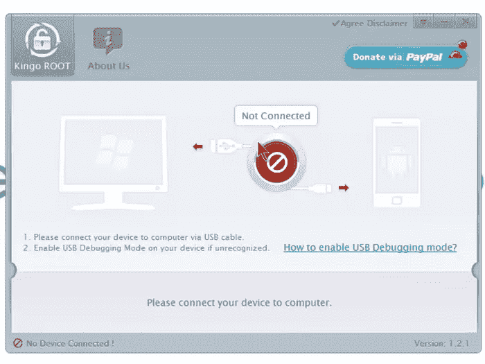
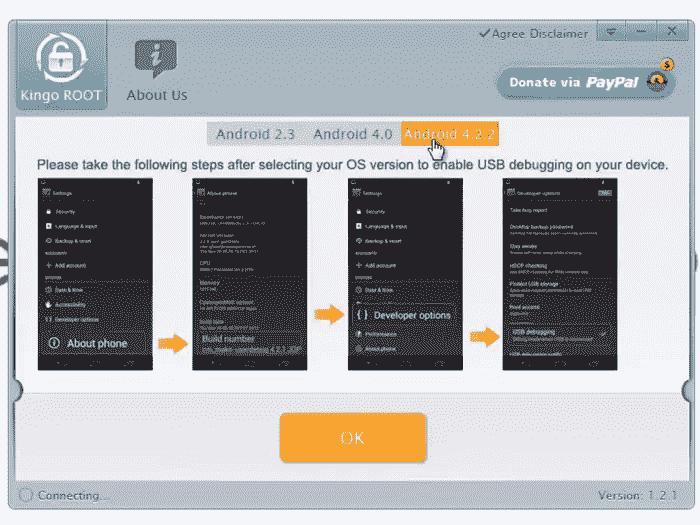
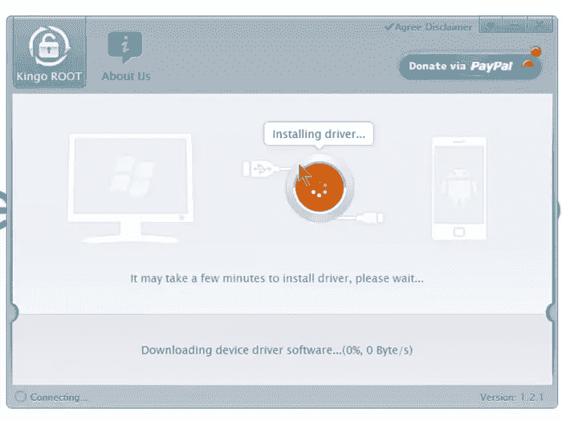
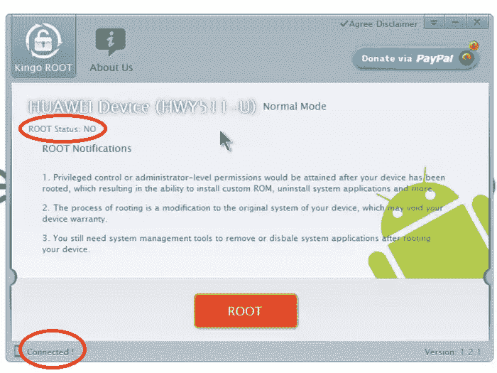

# Android 生根的简要指南

> 原文：<https://www.sitepoint.com/brief-guide-rooting-android/>

Android 是全球最受欢迎的智能手机和平板电脑操作系统。2013 年第三季度，售出的智能手机中有 81%是基于安卓系统的。

在 Google Play 商店和非官方网站上，有成千上万的安卓应用可供使用。有时，如果你在 Android 设备上安装一个应用程序，你会收到一条消息，要求获得安装和运行该应用程序的 Root 访问权限。

例如，如果您想将 Android 设备的屏幕录制为视频文件，有一些应用程序可用，例如 [SCR Free](https://play.google.com/store/apps/details?id=com.iwobanas.screenrecorder.free) ，但是要运行此应用程序，您需要 root 访问权限。

## 什么是生根？

root 是一个从你的 Android 设备上获得完全管理控制的过程。找到你的设备后，你将能够执行任何管理操作，例如卸载许多你从未使用过的预装应用程序。

例如，在 Windows 上有不同的用户角色，如管理员和来宾。来宾用户具有有限的访问权限，不能访问受密码保护的文件、文件夹和设置。具有管理员角色的用户拥有完全访问权限。

与 Windows 和其他操作系统非常相似，一些功能已被禁用，以防止偶然用户可能对操作系统造成的损害。

## 扎根安卓的利弊

支持 Android 设备有很多好处，但也有很多缺点。在为你的安卓设备找根之前，请记住以下几点。

### 优势

*   你将完全控制机器人。你将能够修改文件，删除烦人的应用程序，并访问许多新的设置和功能。

*   您将能够运行特殊的应用程序。

*   能够屏蔽显示在免费应用中的广告。

*   您可以卸载不喜欢或不使用的预装供应商或运营商应用程序。

*   您可以安装定制的 rom(rom 是一种替代操作系统)。这些是根植手机的强大功能，有可能提高速度和性能，并改变你的手机的外观和感觉。[点击这里查看可用的定制 rom 列表](http://www.makeuseof.com/tag/what-are-the-best-custom-android-roms/)。

*   您可以将整个系统备份到 SD 卡上，以后需要时再恢复。这允许试验定制的 rom，最先进的 Android，以及在多个操作系统之间切换的能力。

*   您可以在没有官方支持的旧设备上访问新版本的 Android 和应用程序。

### 不足之处

*   **生根立即使您的保修失效**。在找到您的手机后，您将无法将您的手机用于服务或保修请求。

*   **“砌砖”风险**。存在使您的手机完全无用和不可恢复的风险。

*   **表现不佳**。有时，为了提高手机速度，你可能会损失现有应用程序或定制 Android 版本提供的性能或功能。

## 法律问题

许多国家都有关于生根的法律，在一些国家生根是非法的，比如美国。确保它在你的国家是合法的。

欧洲自由软件基金会认为，对任何设备进行 root 或 flash 更新都是合法的。在英国，2003 年版权和相关权利条例使得为了互操作性的目的而规避 DRM 保护措施是合法的。

印度的版权法允许出于非侵犯版权的目的绕过 DRM。虽然新西兰的版权法允许使用技术保护措施，但仅限于合法使用，不允许侵犯版权。

这是为什么呢？根据维基百科，这主要与 DRM(数字版权管理)法规有关:

> 对设备进行寻根涉及规避其技术保护措施(以便允许 root 访问和运行替代软件)，因此其法律地位受到有关规避数字锁的法律的影响，例如保护数字版权管理(DRM)机制的法律。许多国家没有这样的法律，有些国家的法律包含了寻根的例外情况。

## 制造商的反应

许多制造商试图推出不可寻根的手机，如摩托罗拉 Droid X，但它们总是以某种方式可寻根。许多制造商发布了解锁或可解锁的设备，如谷歌的 Nexus 设备，在接受警告后可以解锁。

## 如何 Root Android？

有很多方法可以为 Android 设备找到根，我将向你展示一个简单易行的方法。

Kingo Android Root 是 Windows 上的一款免费应用程序，可用于 Android Root，请前往 [kingoapp](http://kingoapp.com) ，下载并安装该应用程序。安装后，通过 USB 电缆将您的 android 设备连接到您的 PC。

如果您的设备上没有启用 **USB 调试**，请确保它已启用。为此，进入**系统设置>开发者选项> USB 调试**。如果开发者选项关闭，点击按钮上的*。如果您看不到开发者选项，点击 7 次**关于手机**以启用开发者选项。*

当您的设备连接后，Kingo app 将下载必要的设备驱动程序软件。这可能需要几分钟时间。

这是我的华为手机连接时的屏幕截图。

准备就绪后，单击*根*按钮开始该过程，这可能需要几分钟才能完成。Root 后你会看到一个 **Root 成功**的消息。

启动设备后，它将重新启动，如果您看到任何错误，如*“启动器已停止”*和黑屏，请等待一两分钟。如果没有工作，然后只需重新启动您的设备，一切都应该是好的。

给我的华为 Y511 上根后，我的屏幕变黑了，我等了几分钟，重启手机，一切都开始工作了。

## 最后的话

我觉得你拥有你的设备，你用它做什么取决于你，但要确保你没有违反你的国家的法律，并了解根的缺点。

我能够安装和使用 Android 4.4 KitKat 的新应用程序和功能，对我来说这不是一个糟糕的体验，我很想知道你如何找到这个过程。

## 分享这篇文章