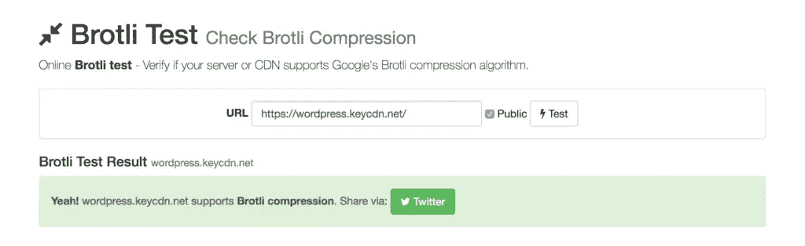
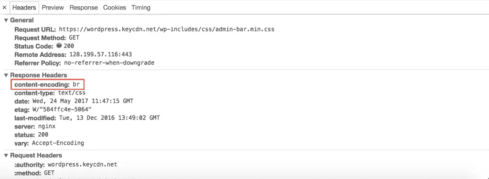
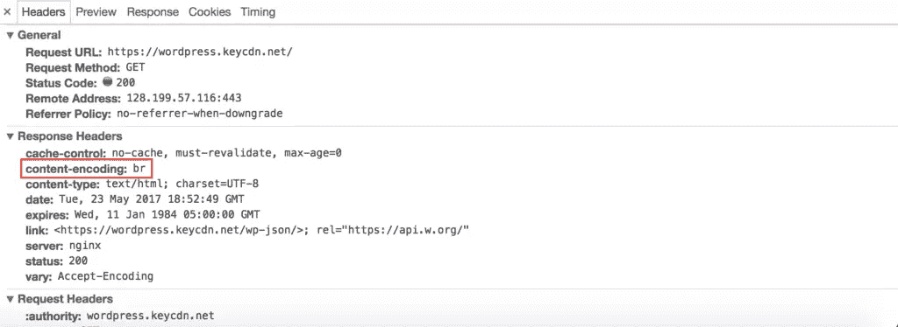
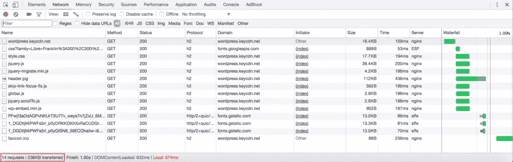
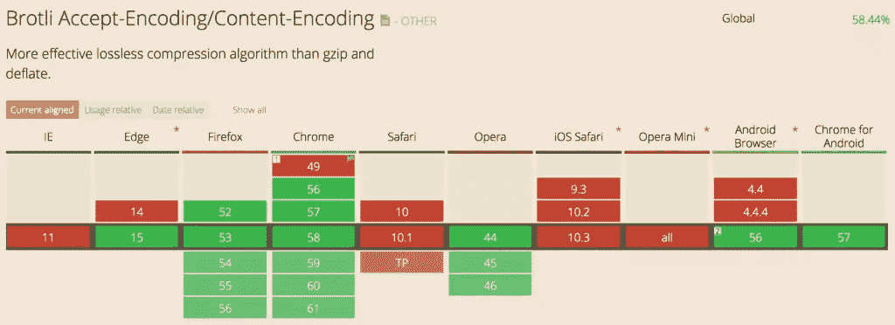

# 衡量 Brotli 压缩对 WordPress 的影响

> 原文：<https://www.sitepoint.com/brotli-compression-wordpress/>

出于各种原因，WordPress 是一个很棒的 CMS。它易于使用，有一个很好的社区，可配置，等等。然而，WordPress 用户似乎经常纠结的一件事是他们的 WordPress 站点的性能。这篇文章将介绍 Brotli 压缩，以及它对 WordPress 性能的影响。

> 声明:我为 KeyCDN 工作，并在这里引用了他们的一些文章和工具。

网上有许多[“加速 WordPress 帖子”](https://www.keycdn.com/blog/speed-up-wordpress/)提供了关于如何使用各种方法来提高网站加载时间的深刻见解，包括通过插件优化的。然而，自从谷歌发布他们最新的压缩算法——[brot Li](https://github.com/google/brotli)以来，还没有收集到太多的数据来确定在 WordPress 网站上启用该算法会带来什么样的性能提升。

在本文中，我们将通过测试 WordPress 在三种不同场景下的性能来衡量 Brotli 压缩的效果:

1.  启用 Gzip 的 WordPress
2.  启用 Brotli 的 WordPress
3.  启用 Brotli 的 WordPress+Brotli 支持的[内容交付网络](https://www.keycdn.com/what-is-a-cdn)

## 什么是 Brotli 压缩？

Brotli 以一种瑞士烘焙产品命名，是谷歌在 2015 年发布的一种相对较新的压缩算法。根据谷歌的说法，Brotli 压缩使用了 LZ77 算法的现代变体、T2 霍夫曼编码和二阶 T4 上下文建模的组合。

Google 已经使用 Brotli 压缩算法进行了各种测试，并将结果与其他现代压缩算法进行了比较。基于[这项研究](http://www.gstatic.com/b/brotlidocs/brotli-2015-09-22.pdf)，谷歌发现 Brotli 在压缩比方面平均超过 Zopfli(另一种现代压缩算法)20-26%。就性能而言，将文件压缩得更小总是受欢迎的。

## 在您的服务器上安装和配置 Brotli

Brotli 的一个小缺点是它还没有在任何流行的 web 服务器上正式发布。这意味着，如果您想让 Brotli 在您的服务器上启用，您需要自己做一些配置工作。下面 Brotli 的性能测试，一切都是在运行 Nginx 的 Ubuntu 16.04.2 LTS 上进行的(*需要学习使用 Nginx？使用 Nginx* 查看 SitePoint 高级课程[快速网站。下面，我们将逐步介绍如何使用相同的操作系统和 web 服务器启动并运行 Brotli。](https://www.sitepoint.com/premium/courses/faster-websites-with-nginx-2757)

Ubuntu 16.04 是第一个允许你使用`apt-get`安装 Brotli 的 Ubuntu 发行版。为此，只需运行:

`$ apt-get update && apt install brotli`

一旦完成，你需要安装 Brotli 压缩的 [Nginx 模块](https://github.com/google/ngx_brotli)并编译最新版本的 Nginx(目前是 [1.13.0](http://nginx.org/en/download.html) ):

```
$ git clone --recursive https://github.com/google/ngx_brotli ngx_brotli

$ wget http://nginx.org/download/nginx-1.13.0.tar.gz
$ tar zxvf nginx-1.13.0.tar.gz
$ cd nginx-1.13.0

$ ./configure --add-module=../ngx_brotli
$ make && make install 
```

Brotli 现在应该已经正确安装在您的服务器上了。接下来，您需要配置您的`nginx.conf`文件来指定您想要的配置指令。以下指令用于这些性能测试；但是，您可以根据需要对它们进行修改。

### Brotli 设置

```
brotli on;
brotli_comp_level 3;
brotli_types text/plain text/css application/json application/javascript application/x-javascript text/xml application/xml application/xml+rss text/javascript; 
```

指令的完整列表可以在 [Nginx 模块 Github 页面](https://github.com/google/ngx_brotli)找到。

由于`nginx.conf`文件被修改，最后一步是重新加载 Nginx。为此，请运行以下命令:

`systemctl reload nginx`

### 测试 Brotli 支持

Brotli 现在应该已经安装并配置在您的服务器上了。要验证这一点，您有两个选择。

1.  Use a [Brotli test tool](https://tools.keycdn.com/brotli-test) that will check based on a domain whether or not the server supports Brotli.

    

2.  Using the Chrome browser, open Chrome dev tools and navigate to the Network tab. Refresh the page and select one of your assets. You should see that the value for content-encoding is now `br` which stands for Brotli.

    

## 配置 Brotli 使用 WordPress

至此，您应该能够使用 Brotli 压缩正确地交付您的 WordPress 资产了。但是，如果您检查 HTML 文档的请求头细节，您可能会注意到内容编码值仍然是“Gzip”。这是因为 WordPress PHP 代码依赖于 PHP 设置“开”。

不幸的是，这是不能用 WP 滤镜改变的。然而，随着 Brotli 受欢迎程度的持续增长，WordPress 可能会推出一个简单的修复方法。此时，你需要通过编辑你的`php.ini`文件(如果使用 PHP 7.0，位于`/etc/php/7.0/fpm/php.ini`)来手动禁用`zlib.output_compression`。只需设置`zlib.output_compression = Off`并使用`systemctl restart php7.0-fpm.service`重启 PHP。

现在，当检查您站点的 HTML 文档时，您应该能够看到内容编码头值`br`。



## WordPress 上的 Brotli 性能测试

如上所述，我们的 Brotli 性能测试是在三种不同的场景下进行的。

1.  启用 Gzip 的 WordPress
2.  启用 Brotli 的 WordPress
3.  启用 Brotli 的 WordPress+brot Li 支持的 CDN

Brotli 和 Gzip 压缩级别都被设置为“3”。可以根据您喜欢的文件节省量和压缩时间来修改压缩级别。每个测试都使用运行“2017”主题的普通 WordPress 安装。默认情况下，这个主题加载 14 个资源并传输 236KB 的数据。



请注意，并非上述测试站点中的所有资产都是可压缩的。例如，图像不会被 Gzip 或 Brotli 压缩，任何第三方资源(如字体)也不会被 Brotli 压缩。因此，使用 Gzip 的所有压缩资产的总大小的基线是 84.7KB。为了考虑加载时间的变化，我们对页面进行了三次硬刷新，并计算了每个测试场景的平均加载时间。这样，所有资源都从服务器加载，而不是从浏览器缓存加载。

下表概述了加载速度和压缩资产大小的结果。

|  | WordPress Gzip | WordPress Brotli | WordPress Brotli + CDN |
| --- | --- | --- | --- |
| 加载速率 | 780 毫秒 | 690 毫秒 | 630 毫秒 |
| 压缩尺寸 | 84.7 KB | 81.7 KB | 81.7 KB |

正如我们从结果中看到的，Brotli 压缩的两种情况都比 Gzip 导致了更快的加载时间和更小的压缩大小。尽管页面大小的差异不是很大，但是请记住这些测试是在裸机 WordPress 安装上进行的。对于那些有很多资源的网站的人来说，在多种资产上的小节省肯定会增加。

此外，出于测试目的，我们将两种压缩方法都设置为最高级别，以观察可压缩资产大小的差异。结果如下:

*   **brot Li 11**–压缩大小:67.7 KB
*   Gzip 9–压缩大小:76.7 KB

尽管在这两种情况下，可能没有必要将压缩级别设置为 max(因为压缩时间要长得多),但有趣的是，Brotli 站点的可压缩资产大小比 Gzip 站点的可压缩资产大小小 13.2%。

## Brotli 支持情况如何？

Brotli 尚未在所有浏览器上得到普遍支持，尽管目前有相当多的流行浏览器支持它(截至 2017 年 5 月)。



[http://caniuse . com/# feat = brot Li](http://caniuse.com/#feat=brotli)

至于服务器支持，大多数流行的 web 服务器要么提供官方模块，要么提供社区创建的模块。如本文安装过程所示，Nginx 用户必须安装一个[扩展](https://github.com/google/ngx_brotli)，并在 Brotli 支持下编译 Nginx。类似地，Apache 用户可以实现 [mod_brotli](https://httpd.apache.org/docs/trunk/mod/mod_brotli.html) 模块来交付 brotli 压缩内容。

## 布罗特利的利与弊

像任何事情一样，使用 Brotli 也有利弊。以下是几点需要考虑的。

### 赞成的意见

*   较小的压缩结果
*   更快的加载时间
*   与 Gzip 相当的压缩时间

### 骗局

*   目前采用起来有点麻烦
*   非通用浏览器支持
*   完全实现 WordPress 需要手动配置

此外，Brotli 只能在 HTTPS 使用，这既有利也有弊。一方面，它帮助更多的网站从 HTTP 迁移到 HTTPS，创建一个更安全的互联网。而另一方面，它为那些想启用 Brotli 但仍在使用 HTTP 的人带来了更多的工作。

## 摘要

如测试结果所示，在 WordPress 站点上实现 Brotli 的结果在性能方面非常有益。在源服务器上实现 Brotli 允许在服务器端进行压缩，然后在支持 Brotli 压缩的 CDN 上缓存该内容允许更快的资产交付。

虽然 Brotli 还没有得到所有浏览器的普遍支持，但重要的是要认识到哪些浏览器是你的访问者使用最多的，并通过提供更快的加载时间来迎合他们。此外，对于那些使用不被支持的浏览器的人来说，这些浏览器将简单地退回到使用 Gzip——这是一个双赢的局面。

## 分享这篇文章