# 浏览器开发工具的秘密:启动，网络和性能

> 原文：<https://www.sitepoint.com/browser-devtools-secrets-start-up-network-and-performance/>

在过去的十年中，浏览器开发工具(browser DevTools)已经从基本的 JavaScript 控制台发展到完全集成的开发和调试环境。改变和检查你的 web 应用程序的任何方面已经成为可能，但是很少有人敢于超越基础。

我们将探讨一系列您可能考虑过或没有考虑过的特性。Chrome 的 DevTools 在大多数情况下都有描述，但是在可用的地方也会显示 Firefox 的替代选项。

## 快捷键

使用菜单来启动 DevTools 浪费了宝贵的时间！请尝试以下选项之一:

*   `F12`
*   `ctrl + shift + i`
*   `cmd + option + j`
*   或者右键单击页面上的任意元素，选择**检查**或**检查元素**。

Chrome 提供了有用的[键盘](https://www.sitepoint.com/best-mechanical-keyboards/)快捷键辅助。从 DevTools 中，按下`F1`或从右上角的三点菜单中选择**设置**。然后从菜单中选择**快捷键**:

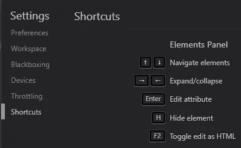

## 码头

DevTools 窗格可以停靠在浏览器窗口的左侧、右侧或底部。如果你需要更多的空间，将其移至一个单独的窗口。在 Chrome 的主三点式菜单中可以找到停靠选项:

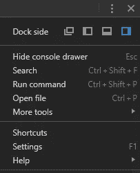

和 Firefox:

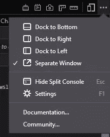

## 设置

DevTool 设置可通过同一菜单或按`F1`进入。这允许您设置选项，如显示的工具、主题、标签大小、颜色单位等。

## 自动启动开发工具

在处理 web 应用程序时，创建一个专用的桌面快捷方式来启动您的浏览器、打开 URL 和启动 DevTools 可能比较实用。对于 Chrome，使用以下 Chrome 命令行选项创建一个桌面图标:

```
chrome --auto-open-devtools-for-tabs http://localhost:8000/ 
```

其中`http://localhost:8000/`是您的开发 URL。

Firefox 也是如此:

```
firefox -devtools -url http://localhost:8000/ 
```

*(可执行文件的名称可能因系统而异。)*

## 发展中隐姓埋名

匿名/隐私模式在浏览器关闭后不会保留 cookies 和 localStorage 等数据。该模式非常适合测试渐进式 Web 应用程序(pwa)和登录系统。

你可以手动或通过在 Chrome 上添加`--incognito`或在 Firefox 的命令行上添加`-private`来启动浏览器。

## 命令选项板

Chrome DevTools 提供了一个类似编辑器的命令面板。按下`ctrl + shift + p`:

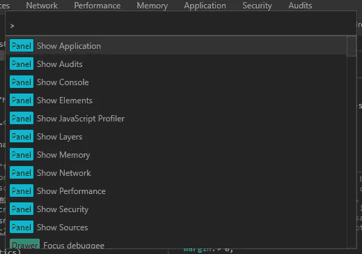

它提供了对大多数函数和源文件的快速访问(按退格键删除`>`)。

## 逃到控制台

无论您使用哪个 DevTool 面板，控制台都是有用的。点击`Esc`在底部窗格显示和隐藏控制台窗口。

## 查找页面颜色

当您单击任何 CSS 颜色属性时，大多数浏览器都会显示颜色选择器。Chrome 还在面板底部显示页面中使用的颜色:

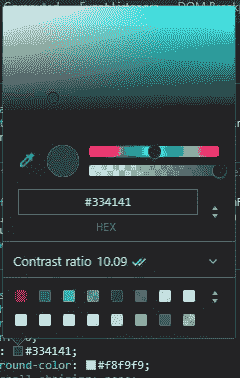

点击面板可以显示更多的颜色。

## 色彩对比可及性

颜色选择器还显示对比度，它指示前景文本和背景颜色之间的视觉差异。单击比率，查看其与 AA 和 AAA 可访问性标准的对比情况，这些标准确保大多数人都能阅读文本:

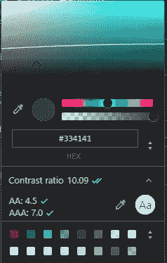

任何低于彩色花洒上的线的颜色都将通过 AA 对比度推荐。

## 截图

从 Chrome 的命令面板(`ctrl + shift + p`)，输入“截图”，然后选择一个选项来捕捉当前的视窗，整个页面，或当前活动的元素。该文件将保存到下载文件夹中。 *(Chrome 74+也允许区域捕捉。)*

Firefox 提供了**截图**系统，大多数菜单中都有。此外，您可以右键单击 DOM 视图中的任意元素，选择**截图节点**。

## 查找未使用的 CSS 和 JavaScript

Chrome 新的覆盖面板允许你快速定位未使用的代码。从 DevTools **More tools** 子菜单中选择 **Coverage** ，然后点击 record 按钮，浏览您的应用程序。然后单击任何文件打开其源文件:

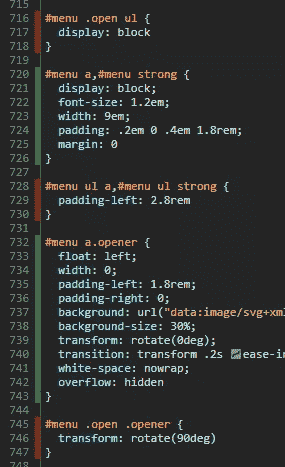

未使用的代码在行号栏中以红色突出显示。

请注意，当你导航到一个新的页面时，Chrome 似乎不会记住已使用/未使用的代码，但我希望在未来的版本中会提供这一功能。

## 禁用网络缓存

勾选**网络**面板中的**禁用缓存**，从网络上加载所有文件。这为首次页面加载提供了更好的评估。

## 限制网络速度

同样，当大多数用户通过 3G 接入时，测试您的系统 1gbps 连接也没有什么意义。**网络**面板在 Chrome 中提供了一个**在线**下拉菜单，在 Firefox 中提供了一个**节流**下拉菜单，允许你模拟特定的网络速度。

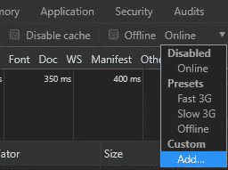

Chrome 还提供了一个工具来添加你自己的节流配置文件。

## 重新排列网络响应

默认情况下，**网络**面板显示一个按下载顺序排列的请求和响应表。但是，可以单击任何表格标题，按名称、状态、类型、大小、响应时间等重新排序。

## 过滤不完整的请求

要发现任何不完整或无响应的 HTTP 请求，请访问**网络**面板，并在**过滤器**框中输入`is:running`。

## 按响应大小过滤

从**网络**面板，在**过滤器**框中输入`larger-than:S`，其中`S`是以字节(`1000000`)、千字节(`1000k`)或兆字节(`1M`)为单位的大小。显示大于所选大小的响应。

要查找较小的响应，使用`-larger-than:S`。

## 过滤第三方内容

从**网络**面板，在**过滤器**框中输入`-domain:*.yourdomain`，其中`yourdomain`是您的主 URL，例如`sitepoint.com`。其余的响应显示第三方对 cdn、追踪器、社交媒体按钮等的请求。请求数量和有效负载大小显示在表下方的状态栏中。

## 阻止网络请求

在测试期间，可能会阻止跟踪器、分析、社交媒体小部件或任何其他请求。

右键单击 Chrome 的**网络**面板中的任何 HTTP 请求，并选择**阻止请求 URL** 来阻止该 URL，或**阻止请求域**来阻止对该域的任何请求。将打开**请求阻止**面板，您可以在其中添加或删除更多的 URL 或域:

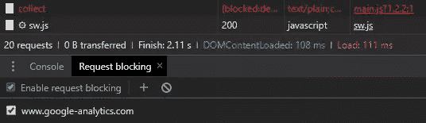

## 重新创建 Ajax 请求

Ajax XMLHttpRequest 操作可以通过右键单击 **Network** 表中的条目来检查，然后选择一个复制选项，比如 cURL、fetch 或 PowerShell。这将创建一个具有相同头、用户代理、cookies 和引用的命令，可以粘贴到编辑器或终端中。

## 启用脱机文件覆盖

Chrome 允许将任何文件保存到你的系统中，这样浏览器就可以从设备上而不是网络上获取文件。例如，如果您想要加载或编辑通常从 CDN 访问的资产，这可能允许离线开发。

在**源**中打开**覆盖**面板，点击 **+选择覆盖文件夹**，选择合适的文件夹。

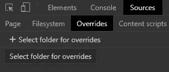

现在右击**网络**面板中的任何资源，选择**保存覆盖**。任何后续的页面重新加载都将从您的本地系统而不是 web 访问该文件。也可以修改保存的文件。

## 检查存储

Chrome 中的**应用**面板和 Firefox 中的**存储**面板允许您检查、修改和删除 cookies、缓存存储、localStorage、sessionStorage、IndexedDB 和 Web SQL(如果支持)中保存的值。

Chrome 的 **Clear storage** 面板还可以清除一个域的所有值，这在开发渐进式 Web 应用程序时非常有用。

## 性能监控器

Chrome 新的**性能监视器**可以从 DevTools **More tools** 菜单访问，并提供 CPU 使用率、JavaScript 堆大小、DOM 节点、事件监听器、样式重新计算等分析。与主要的**性能**面板不同，图表是实时更新的——不需要先记录个人资料。

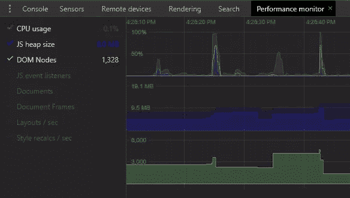

## 审计

Chrome 的**审计**面板最初是为了评估渐进式网络应用功能而设计的，但该工具已经发展成为一种通用工具，可以在移动和桌面视图中分析性能、可访问性、最佳实践和 SEO。

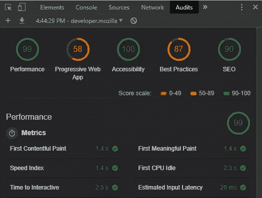

它不会捕捉到每个问题，您可能不同意某些观点，但它是一种对潜在问题进行快速评估的有用方法。

我希望你发现了新的东西。更多的 DevTool 秘密即将到来…

## 分享这篇文章