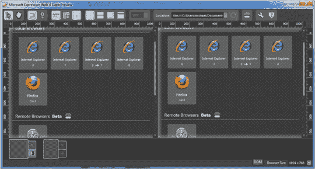
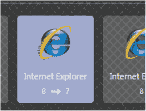
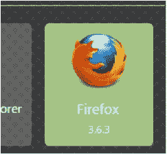
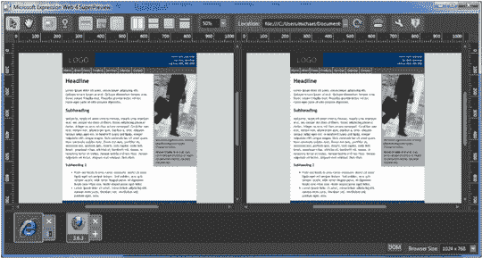
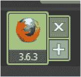

# 使用 SuperPreview 进行跨浏览器开发

> 原文：<https://www.sitepoint.com/browser-superpreview/>

有很多方法可以测试多种浏览器。很久以前，我们有自己的小浏览器区——办公室里一个肮脏的角落，那里聚集着满是灰尘、凌乱的电脑和他们不喜欢的浏览器。测试包括最被鄙视的活动:在办公室里走来走去。

后来，我们用不同的浏览器版本和不同的操作系统安装了虚拟机——这是时间、精力的巨大投入，而且经常会带来机器磨损的挫败感。

其他开发者订阅了包括在线工具的解决方案，如[browsershots.org](http://browsershots.org/)，它可以在多种浏览器中渲染你的页面，并将这些渲染结果作为位图图像返回给你。不幸的是，这种方法通常既慢又麻烦，而且只适用于公共 URL，这使得在构建站点时很难调试，当然也不容易与开发工具和生命周期集成。更重要的是，这些基于位图的方法都不允许您在简单的布局测试之外进行调试。例如，它们没有提供您在布局调试系统中所期望的 DOM 检查工具。

一年多以前，微软发布了第一个让 Internet Explorer 测试更容易的协同尝试:super preview——呃……preview。自试射以来的一年中，发生了许多引人注目的事件。

首先，SuperPreview 现在将非微软浏览器纳入其测试平台，这意味着你不再需要切换到测试 Firefox 或 Safari。它也变成了一个更加成熟的成品。最后，SuperPreview 已经集成到微软的主要 web 开发游戏 Expression Web 中。

所以，如果你参加 SuperPreview 聚会迟到了，让我给你一份执行摘要。

当你完成后，记得试试我们微软赞助的[文章测试](https://www.sitepoint.com/quiz/microsoft/browser-superpreview)。

## 进行基本测试

在 Expression Web 中，为当前页面启动 SuperPreview 很简单:从文件菜单中选择在 SuperPreview 中显示。一旦 SuperPreview 加载，您将看到如图[图 1 所示的显示，“SuperPreview 等待浏览器选择”](#fig_browserselection "Figure 1. SuperPreview awaiting browser selection")，程序等待您选择您想要的浏览器。

**图一。等待浏览器选择的超级预览**

在左侧选择 Internet Explorer 8，如[图 2【选择 I E8】](#fig_selectie8 "Figure 2. Selecting IE8")所示。

**图二。选择 IE8**

而在右边，点击 Firefox 3.6.3，如图[图 3，“选择 Firefox 3 . 6 . 3”](#fig_selectfirefox "Figure 3. Selecting Firefox 3.6.3")。

**图 3。选择火狐 3.6.3**

还有 *瞧啊* ！你现在可以看到页面的并排比较效果，如图 4[“不同浏览器中的站点对比一览”](#fig_comparison "Figure 4. Comparing the site, at a glance, in different browsers")所示。

**图 4。在不同的浏览器中比较网站，一目了然**

如果你想在其他浏览器版本中测试页面，只需点击你需要的浏览器旁边的添加( +) 按钮，如图[图 5，“添加更多浏览器版本到测试中”](#fig_addbroswers "Figure 5. Adding more browser versions to the test")。

**图 5。向测试中添加更多浏览器版本**

## 支持哪些浏览器？

那么，SuperPreview 支持哪些浏览器呢？该工具在兼容模式下支持 IE6、IE7、IE8 和 IE8。要添加 Firefox，只需在你的机器上安装这个浏览器。

有趣的是，SuperPreview 在 OSX 上也支持 Safari 4.0.4。我相信你一定有点好奇 OSX 的 Safari 是如何在 Windows PC 上神奇地呈现的。答案是微软已经实现了一个 web 服务，可以在云端呈现 OSX 上的 Safari。

要启用此功能，只需点击主工具栏上的远程浏览器按钮，如图[图 6“远程浏览器按钮”](#fig_remotebrowser "Figure 6. The Remote Browser button")所示。

**图 6。远程浏览器按钮**

系统会提示您登录免费的远程浏览器帐户。从现在开始，无论何时你选择在 OSX 上使用 Safari 获取页面渲染，SuperPreview 都会调用 web 服务并带回一个渲染。很酷，是吧？

## 分享这篇文章