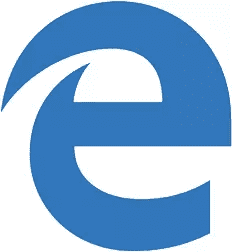

# 2015 年 5 月的浏览器趋势:微软能重获优势吗？

> 原文：<https://www.sitepoint.com/browser-trends-may-2015-can-microsoft-regain-edge/>

几个月来，浏览器市场基本上处于静止状态。让我们来看看来自 StatCounter 的[最新数据？…](https://gs.statcounter.com/#browser-ww-monthly-201405-201504)

## 2015 年 3 月至 4 月全球台式机和平板电脑浏览器统计

下表显示了过去一个月中浏览器的使用情况。

| 浏览器 | 三月 | 四月 | 变化 | 亲戚 |
| IE(全部) | 17.88% | 18.25% | +0.37% | +2.10% |
| IE11 | 10.63% | 10.76% | +0.13% | +1.20% |
| IE10 | 1.74% | 1.81% | +0.07% | +4.00% |
| IE9 | 2.18% | 2.26% | +0.08% | +3.70% |
| IE6/7/8 | 3.33% | 3.42% | +0.09% | +2.70% |
| 铬 | 49.07% | 49.97% | +0.90% | +1.80% |
| 火狐浏览器 | 16.81% | 16.77% | -0.04% | -0.20% |
| 旅行队 | 5.51% | 4.77% | -0.74% | -13.40% |
| iPad 野生动物园 | 5.42% | 5.09% | -0.33% | -6.10% |
| 歌剧 | 1.62% | 1.61% | -0.01% | -0.60% |
| 其他人 | 3.69% | 3.54% | -0.15% | -4.10% |

## 2014 年 4 月至 2015 年 4 月全球台式机和平板电脑浏览器统计

下表显示了过去 12 个月中浏览器的使用情况:

| 浏览器 | 2014 年 4 月 | 2015 年 4 月 | 变化 | 亲戚 |
| IE(全部) | 21.41% | 18.25% | -3.16% | -14.80% |
| IE11 | 8.33% | 10.76% | +2.43% | +29.20% |
| IE10 | 3.60% | 1.81% | -1.79% | -49.70% |
| IE9 | 3.31% | 2.26% | -1.05% | -31.70% |
| IE6/7/8 | 6.17% | 3.42% | -2.75% | -44.60% |
| 铬 | 45.33% | 49.97% | +4.64% | +10.20% |
| 火狐浏览器 | 18.60% | 16.77% | -1.83% | -9.80% |
| 旅行队 | 9.77% | 9.86% | +0.09% | +0.90% |
| 歌剧 | 1.37% | 1.61% | +0.24% | +17.50% |
| 其他人 | 3.52% | 3.54% | +0.02% | +0.60% |

(这些表格显示了桌面浏览器的市场份额估计值。“变化”栏是市场份额的绝对增加或减少。“相对”栏表示比例变化，即上个月有 8.8%的 IE9 用户更换了浏览器。有几个警告，所以我建议你阅读[如何计算浏览器市场份额](https://www.sitepoint.com/how-browser-market-share-is-calculated)和[StatCounter vs net Market Share](https://www.sitepoint.com/browser-trends-april-2015-statcounter-vs-netmarketshare/)。)

这是通常的故事。Chrome 的增幅最大，现在的市场份额不到 50%。Firefox 和 Opera 下降了一点，但最大的输家是 Safari。Mac OS 和 iPad 版本都有所下降，但是考虑到苹果最近 136 亿美元的季度利润，苹果不太可能会担心！

唯一获利的其他浏览器是 IE。说到这个…

### 再见 Internet Explorer，你好 Edge

我们知道微软的新浏览器已经有一段时间了。它现在有了一个正式的名字:**微软 Edge** 。

咩。我喜欢*《斯巴达人》*。

新 logo 看着眼熟吗？…

这是明智的选择。不了解或不关心 Edge 的现有 IE 用户不会注意到任何区别——他们仍然会点击那个蓝色的“e”图标。

名字和 logo 有点没什么意思。或许微软本可以更激进一些？也就是说，用户很少喜欢重大变化 *(Windows 8 有人喜欢吗？)*下面是[让我们来看看浏览器的最新版本](https://www.sitepoint.com/microsoft-edge-preview/)来吊起你的胃口。

## 全球移动浏览器统计，2015 年 3 月至 4 月

手机使用量略有增长，占全部网络活动的 33.47%。

热门移动浏览应用:

| 移动浏览器 | 三月 | 四月 | 变化 | 亲戚 |
| 铬 | 31.50% | 32.30% | +0.80% | +2.50% |
| 苹果手机 | 20.65% | 19.49% | -1.16% | -5.60% |
| 机器人 | 18.48% | 17.96% | -0.52% | -2.80% |
| UC 浏览器 | 12.71% | 13.69% | +0.98% | +7.70% |
| Opera Mini/Mobile | 8.41% | 9.09% | +0.68% | +8.10% |
| 不变的 | 2.13% | 2.20% | +0.07% | +3.30% |
| 诺基亚浏览器 | 2.40% | 2.12% | -0.28% | -11.70% |
| 其他人 | 3.72% | 3.15% | -0.57% | -15.30% |

移动市场依然活跃，大多数用户仍然使用设备上的默认浏览器。对于 iPhone 用户来说，这是 Safari——苹果不允许其他渲染引擎。自 2013 年 12 月以来首次跌破 20%。然而，iPhone 仍然非常受欢迎，所以这不太可能是一个长期趋势。

在图表的底端，IEMobile 已经超过古老的诺基亚浏览器，成为第六大最受欢迎的应用程序。但 2.2%的市场份额几乎不足以让人庆祝。也许微软 Edge 会更好？

## 分享这篇文章