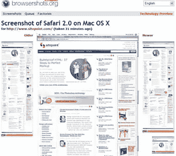

# Browsershots.org:免费测试九款浏览器

> 原文：<https://www.sitepoint.com/browsershotsorg-test-nine-browser-for-free/>

你是否曾夜不能寐，想知道你最新的网络杰作在 Ubuntu Edgy 上的 Konqueror 3.5.5 是什么样子？我想我们都有。不再醒着躺着。

尽管基于网络的浏览器测试服务并不新鲜，但 [Browsercam](http://www.browsercam.com/) 已经提供了多年的付费服务，像 Dan Vine 的 iCapture Safari testbed 这样的网站在填补空白方面做得非常出色——[Browsershots.org](http://browsershots.org/)可能是我见过的最全面的免费服务。

仍在 alpha 版本中，被称为“技术预览版”，Browsershots.org 目前提供三种操作系统上九种浏览器的全长(即不仅仅是视口)渲染，包括 Mac 上的 Safari 2.0，Windows 上的 MSIE 7.0 和 Ubuntu Linux 上的 Opera 等家族最爱。

虽然还不清楚这项服务是否会成为付费订阅服务，但目前它肯定是免费的、强大的、非常有用的。

显然 Digg 不久前停止了它，所以请随意测试它，但也许不要勾选所有的浏览器框，除非你真的需要。

## 分享这篇文章