# 用 3 种或更少的形状制作一个漂亮的标志

> 原文：<https://www.sitepoint.com/build-a-beautiful-logo-in-3-shapes-or-less/>

在发展你的品牌时，标识是必不可少的，但这并不意味着你的标识应该过度发展。许多知名品牌的标志出奇的简单，很好地服务于他们的目的；顾客认识并记住这些无处不在的标志，部分原因是它们的简单性。要吸取的教训是，你的 logo 不必由多个元素或不必要的复杂性组成——简单的 logo 也可以是复杂的。

你会发现下面的教程是一个只用三个或更少的形状来创建一个标志的练习。在教程的最后，我希望说明，仅仅因为你的标志简单，并不意味着它是无效的或不发达的。事实上，简单的标志可以胜过复杂得多的竞争。启动 Photoshop，让我们开始创建我们的标志。

### 概念

构思你的标志通常是设计过程中最难的部分。通常，您已经创建了一些缩略图来确定您想要的徽标外观。在这种情况下，我已经有一个想法，我想完成什么，所以将放弃素描，但要确保你有一个想法，你的标志在脑海中。在这个特别的教程中，我计划为一个虚构的能源公司设计一个简单的灵感来自球体的标志，这个公司专注于生态友好型能源，名为 BeauEnergie。这个想法很简单，但它的效果将使这个标志脱颖而出。

### 步骤 1:创建新文件

首先，打开 Photoshop，创建一个新文件。当对话菜单打开时，给画布 800 像素乘 500 像素的尺寸，然后按“OK”创建画布。

[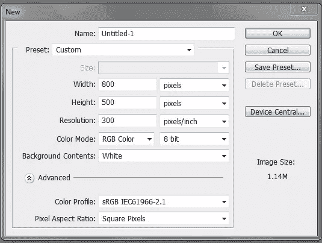](https://www.sitepoint.com/wp-content/uploads/2013/08/step1.png)

### 第二步:建立背景颜色

创建一个新层，命名为“BKG”。将前景色更改为#c4c4c4，并确保背景色设置为默认的#ffffff(白色)。下一步你会需要这个。选择前景后，填充画布。

### 第三步:添加渐变

我们需要添加一个渐变到我们的 BKG 层。要做到这一点，你将需要双击层进入“混合选项”菜单，或者你可以简单地右键单击，并前往“混合选项。”选中“渐变叠加”框，确保渐变颜色反映了#c4c4c4 和#ffffff 的颜色。将图层模式改为“叠加”，然后按“确定”

[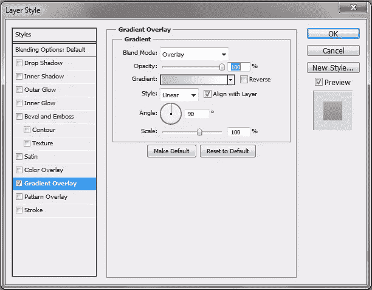](https://www.sitepoint.com/wp-content/uploads/2013/08/step3.png)

### 步骤 4:建立一个蓝色椭圆

开始我们的标志，我们将创建一个新的层。你可以将它命名为“蓝色椭圆”或“第一个形状”。给它起个容易识别的名字就行了。接下来，把你的前景色改成#25d1fc。选择椭圆工具(U ),在画布中间画一个相当大的圆。

[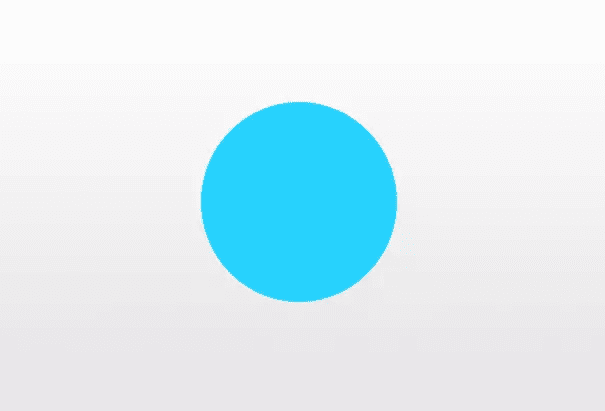](https://www.sitepoint.com/wp-content/uploads/2013/08/step4.png)

### 第五步:蓝色椭圆扭曲

接下来，我们将扭曲我们的蓝色椭圆的形状。要做到这一点，进入“编辑”>“变换”>“扭曲”，然后通过拖动中心向下，左边向上，右边向下来操作这些点，这样你就有了类似下图的东西。不要忘记按 Enter 键提交对形状的更改。

[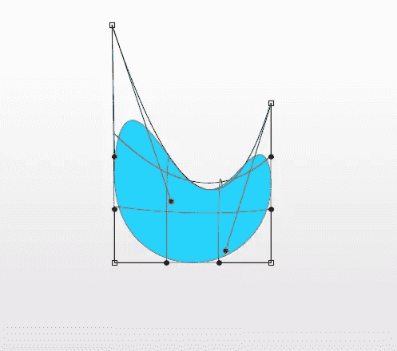](https://www.sitepoint.com/wp-content/uploads/2013/08/step5.png)

### 步骤 6:图层不透明度

我们的标志将具有一些透明的品质，所以我们将继续下去，改变图层模式为“颜色烧伤。”

### 步骤 7:蓝色椭圆渐变和发光

为了给我们的蓝色椭圆添加效果，你需要通过双击图层或者右键点击“混合选项”来访问“混合选项”菜单我们要添加的第一个效果是“内心发光”选中该框，并将颜色更改为#5aeeff。更改其余设置，以匹配下图所示的内容。

接下来，选中“渐变叠加”框，确保渐变反映了椭圆的颜色。更改其他设置，使它们与下面显示的设置相匹配。

[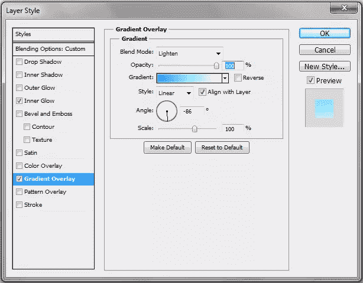](https://www.sitepoint.com/wp-content/uploads/2013/08/step7-1.png)

### 第八步:粉色椭圆

将前景色改为#fc2561，用椭圆工具创建另一个椭圆；它将小于蓝色椭圆。确保我们的新椭圆在蓝色椭圆层之上。

### 步骤 9:粉红色椭圆扭曲

就像以前一样，你想扭曲粉红色椭圆的形状，但给它一个几乎月牙状的形状。

[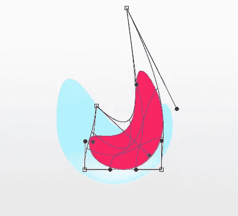](https://www.sitepoint.com/wp-content/uploads/2013/08/step9.png)

### 步骤 10:图层不透明度

不是改变粉红色椭圆的图层不透明度为“颜色烧伤”，我们将改变它为“乘”，不透明度为 100%。

### 步骤 11:粉红色椭圆渐变和发光

我们需要添加效果到我们的粉红色椭圆，所以打开“混合选项”菜单。我们将首先添加“内在发光”。选中该框，并将颜色更改为# 8de6ff。改变其余的设置，以符合下图。

[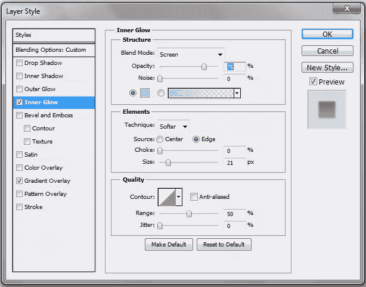](https://www.sitepoint.com/wp-content/uploads/2013/08/step11.png)

选中“渐变叠加”框，确保渐变反映了椭圆的颜色。更改其他设置，使它们反映以下值

[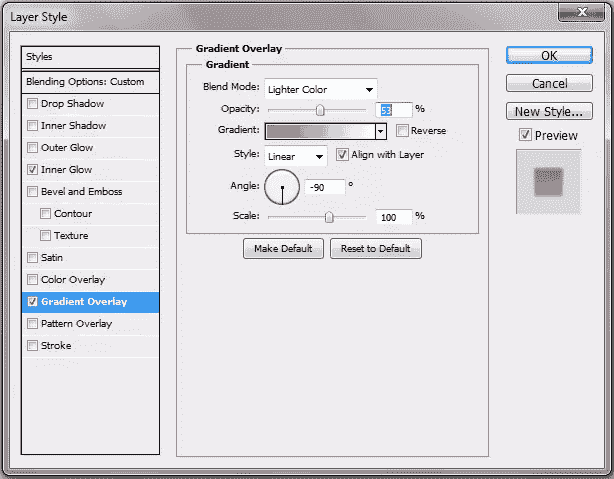](https://www.sitepoint.com/wp-content/uploads/2013/08/step11-1.png)

### 第 12 步:黄色椭圆

现在，设置你的前景色为#f3de00，你将再次需要创建另一个椭圆；这个将比前两个小，放在蓝色椭圆图层下面。

[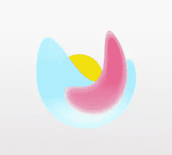](https://www.sitepoint.com/wp-content/uploads/2013/08/step12.png)

### 步骤 13:黄色椭圆扭曲

通过向上拖动顶部最外面的点来扭曲椭圆，使其顶部几乎是尖的。按 Enter 键提交对黄色形状的更改。

[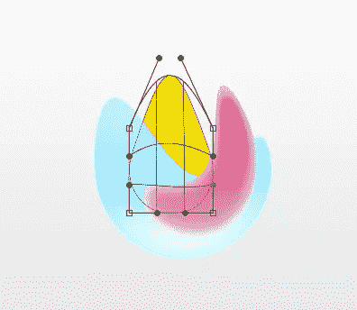](https://www.sitepoint.com/wp-content/uploads/2013/08/step13.png)

### 步骤 14:调整大小

使用变换工具或按键盘上的 Ctrl + "T "来调整新扭曲的黄色椭圆的大小。一旦对新大小感到满意，请务必按 Enter 键。

[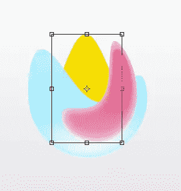](https://www.sitepoint.com/wp-content/uploads/2013/08/step14.png)

### 步骤 15:图层不透明度

将黄色椭圆的图层模式改为“变暗”

### 步骤 16:黄色椭圆渐变和发光

就像在前面的步骤中，你需要添加一个“内发光”和“渐变”到你的椭圆。选中“内发光”框，将颜色改为#fee55c。更改设置以匹配。

[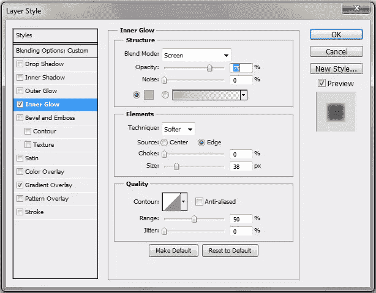](https://www.sitepoint.com/wp-content/uploads/2013/08/step16.png)

选中“渐变叠加”框，匹配下图所示的设置。

[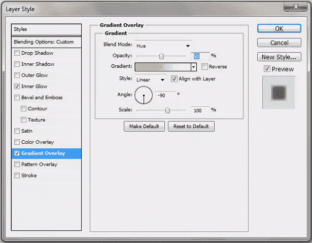](https://www.sitepoint.com/wp-content/uploads/2013/08/step16-1.png)

### 第十七步:阴影

在所有三个彩色椭圆下面新建一个层，用圆形选框工具画一个椭圆。这将是我们的影子要去的地方。

确保前景色是#898989，图层不透明度降低到 51%，图层模式改为“强光”。在 5px 应用高斯模糊。

### 结束

添加您选择的公司名称和任何其他您想要添加的收尾工作，完成徽标。

### 结论

简单的标志可以像复杂的标志一样与众不同、有效且容易记忆。只要稍加练习和计划，你就可以很容易地用三种或更少的形状创造出你自己的标志，就像我做的那样。一些设计改进来自于对元素的仔细分类，而不是新元素的添加。

## 分享这篇文章