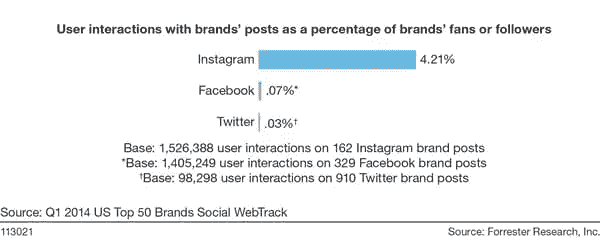
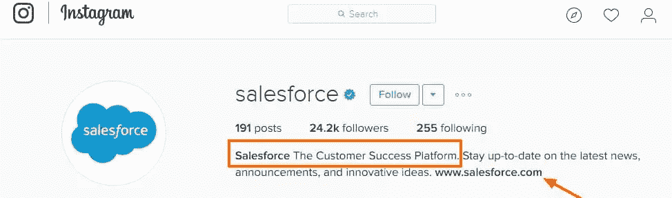
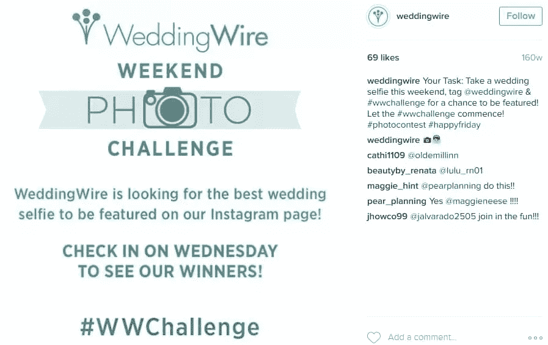
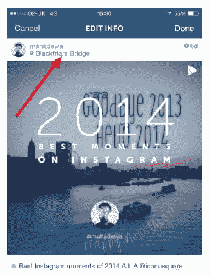
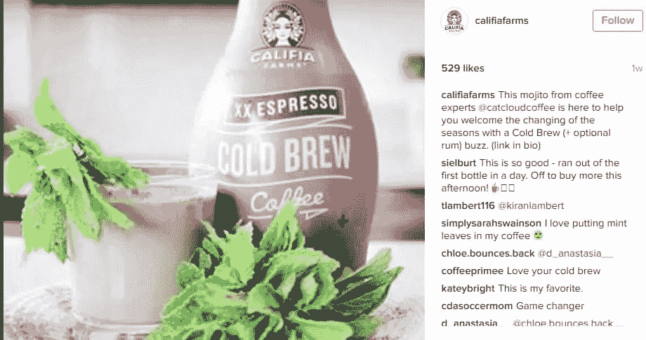

# 在 Instagram 上建立品牌的 25 个技巧

> 原文：<https://www.sitepoint.com/build-a-brand-on-instagram-with-these-25-tips/>

Instagram 是最令人兴奋的社交媒体渠道之一，通过它可以为你的企业建立品牌。这个平台非常直观，并且正在以惊人的速度增长。

> “到 2017 年，估计 51.8%的社交网络用户将使用 Instagram，到 2019 年，近三分之二的千禧一代智能手机用户将使用 Instagram”。[(来源)](http://www.emarketer.com/Article/Instagram-Continues-Double-Digit-Growth/1013612#sthash.AnPqCXAN.dpuf)

[根据这份报告](http://expandedramblings.com/index.php/important-instagram-stats/)，该平台 2016 年日活跃用户 3 亿。

Instagram 上顶级品牌的每名关注者参与率比脸书高出 58 倍，比 Twitter 高出 120 倍。

以下是一些重要的技巧，你可以用它们在 Instagram 上建立令人印象深刻的品牌形象:

## 1.创建个人资料

你需要在 Instagram 上创建一个单独的企业简介，发布与你的企业相关的内容。

在简历中添加行动号召和链接有助于让你的目标访问你的网站、登陆页面或联系页面。你需要在简历中展示你的企业的核心价值主张。

在简历中使用搜索关键词或标签是可选的，因为 Instagram 搜索结果中不会考虑这些。这里有一个例子:

## 2.链接到其他社交账户

你可以将你的 Instagram 帖子转发到其他社交账户，如脸书、Twitter、Tumblr、Flickr 和 Foursquare。您可以将这些帐户链接到您的 Instagram 帐户，并通过这些帐户上的简化共享获得更多 Instagram 帖子。

## 3.有规律

像任何其他社交媒体平台一样，你需要每天在 Instagram 上发帖，以确保你的粉丝能够积极参与你的业务。你也可以在脸书和 Twitter 等其他渠道推广你的 Instagram 账户，以获得更多关注者。

## 4.影响者外联

这是在 Instagram 上推广你的业务最流行的策略之一。您需要在平台上搜索拥有大量追随者的影响者帐户。确保这些人属于你的业务领域。你需要联系他们，看看他们是否愿意在他们的个人资料上“大声喊出”你的业务。他们这样做可能是免费的，这取决于他们有多少追随者。你也可以通过易货交易结束，作为回报，你可以推广他们的账户。

以下是 2016 年全球 Instagram 影响力排名前[的部分榜单。](https://getriver.com/instagram-influencers)

## 5.使用标签

标签是 Instagram 上获取搜索流量的最佳方式。你需要在文章标题中使用最多 3-5 个标签来提高文章的可见性。在工具中添加相关的关键短语，找到它们的流行度，然后做出明智的选择。这里有一个例子:

## 6.专业形象

Instagram 是一种视觉媒介，你的图片质量在建立你的品牌期望的声誉方面起着至关重要的作用。当你在 Instagram 页面上分享产品图片时，你可以雇佣一名专业摄影师。有品位的股票图片，比如来自 [Unsplash](http://unsplash.com) 的图片，也可以用来分享与你的业务相关的吸引人的帖子。使用 Instagram 图像滤镜让你的照片看起来很时尚。你可以看看竞争对手的帖子，了解哪些过滤器效果最好。在 Instagram 上发布的标准正方形图像大小为 1080px 乘以 1080px。

## 7.获得更多关注者

通过与他们互动，你可以在 Instagram 账户上获得更多有针对性的关注者。你需要在你的利基市场寻找客户。这些人可能是那些追随你的竞争对手的人，或者只是潜在客户。你需要关注这些帐户，喜欢和评论他们的帖子，并在你的帖子中标记他们。

## 8.组织竞赛

Instagram 竞赛是提高粉丝互动水平的一种有效方式。你需要创建一个竞赛标签，然后要求潜在的参与者使用标签和独特的标题上传引人注目的图片。挑选几个获胜者，并分发他们喜欢的奖品。这些东西可能是你公司品牌的咖啡杯、小玩意或任何目标群体会觉得有用的东西。这里有一个例子:

## 9.使用地理标记

Instagram 允许你在帖子中添加图片的位置。您可以使用此功能来标记您的企业正在参与或组织的活动的站点。该功能也有助于展示你的企业的位置。如果竞赛是在您的办公地点组织的，您也可以让您的竞赛参与者使用此功能。

[(来源)](http://moblivious.com/tips-tricks/how-to-add-location-to-your-instagram-photo-video/)

## 10.创建一个预告

你可以通过添加帖子来暗示即将发生的事情，从而围绕即将到来的竞赛、活动或产品发布营造兴奋感。你可以让你的追随者猜一猜，围绕一个特定的事件建立参与度。这种策略有助于在你的潜在客户和追随者中制造声势。

## 11.安排您的帖子

您可以轻松地将您的 Instagram 帖子安排在[之后](https://later.com/)。这个工具可以帮助你分享桌面上的文章。您可以开始免费使用这个工具。确保分析哪些发布时间获得了最高的覆盖面和参与度，这样你就可以在未来优化你的日程安排。

## 12.发布视频

Instagram 将视频长度限制从 15 秒提高到了 60 秒。您可以通过添加有关您的服务的视频来受益于此功能。这些视频可以是介绍性视频，也可以是宣传视频或教程。确保视频质量好，对你的目标群体有视觉吸引力。

## 13.嵌入图像

您可以使用嵌入功能将照片从 Instagram 添加到您的网站或博客。这些可能是从您的帐户或关注者的帐户添加的图像。您可以将参与者共享的竞赛帖子嵌入到单独的“竞赛展示”登录页面。将你的 Instagram 视频嵌入到你的网站，提高他们的浏览率。

## 14.开展付费活动

您可以轻松地将您的 Instagram 帐户与您的脸书页面和业务经理帐户相连接，开始在 Instagram 上开展付费活动。您可以使用脸书超能力编辑器制作广告，并针对特定受众开展活动。付费活动可以帮助您建立一个良好的追随者基础，您可以与该客户进行互动。

## 15.内容日历

在 Instagram 上发帖时需要有内容日历。它可以基于你所在行业流行的事件和节日。您还可以根据业务需求添加基于产品的促销活动。

## 16.使用 Instagram 故事

“Stories”是 Instagram 的一个新功能，灵感来自 Snapchat 的故事。该功能允许您在个人资料中添加临时照片和视频。这些故事会在消失前的 24 小时内展示给你的追随者。你可以在故事中添加涂鸦和滤镜，以独特的方式吸引观众。

## 17.使用通知

Instagram 允许你在网络中有人添加帖子时收到通知。您可以利用这一点与拥有大量追随者的特定客户开展业务。只需在他们的个人资料上打开帖子通知。

## 18.Instagram Direct

使用此功能，您可以一次向多达 15 个关注者发送直接消息。你可以附上一张图片或一段 15 秒钟的视频来传达你的信息。您可以选择您最活跃的追随者，并向他们发送一个具有此功能的报价或产品促销。该功能还可用于接触特定位置的潜在客户。

避免给人留下垃圾邮件制造者的印象。对于对您的业务有浓厚兴趣的用户，请谨慎使用此功能。

## 19.创建一个风格指南

在任何平台上建立品牌时，创建风格指南都很重要。Instagram 也是如此。你的指南应该详细说明你的调色板，标志的使用，图像设计，字体使用，标题和标签的规则。如果经常使用视频，还可以包括视频帖子指南。这有助于实现帖子的一致性，从而强化你的品牌形象。

## 20.测量和分析

你需要分析你的 Instagram 营销活动，以了解哪些内容最适合你的目标受众。这将有助于你的内容更有针对性，更吸引你的观众。您可以使用 Simply Measured、Iconosquare 和 Sprout Social 等工具来跟踪所需的指标。使用这些工具，你可以分析你的帖子在什么时候表现最好，参与度，追随者分析等等。

## 21.有创造力

Instagram 是一个平台，可以帮助你以吸引潜在客户的方式直观地展示你的品牌。您可以使用各种方法使您的帖子更具创意，例如添加引用作为图像叠加，使用图像过滤器，展示您的产品使用情况，突出现有客户或员工，使用有趣的模因，添加现场办公室活动视频等。以这种方式改变你的内容将有助于你与你的网络建立个人联系，并吸引更多的追随者。这里有一个例子:

## 22.不要卖

你需要通过有趣的帖子为你的品牌建立情感吸引力。换句话说，你需要专注于拉动策略而不是推动策略。你的帖子和图片需要为你的产品和服务树立目标，而不是传达一种推销。

## 23.在 Instagram 上开店

你可以通过像 Have2Have.It 这样的插件在 Instagram 上轻松建立一个商店。该工具可以帮助企业将用户从他们的 Instagram 页面重定向到在线商店。使用这样的工具可以帮助您为客户节省时间，简化他们的购物体验。

## 24.回复用户评论

你的一些追随者总是更积极地给你的帖子添加评论，并与他们互动。回应正面和负面的评论将有助于你与你的追随者建立关系，这将加强你的品牌形象，使其更值得信赖。

## 25.保持更新

你需要及时了解 Instagram 平台上的最新动态。关注 Instagram 企业博客,了解新的和即将推出的功能，帮助您更有效地营销您的企业。

随着越来越多的互联网用户转向移动，Instagram 是一个不容忽视的社交媒体平台。该平台为品牌提供高水平的参与，并允许您以独特的方式构建您的品牌故事。不要错过机会。

## 分享这篇文章