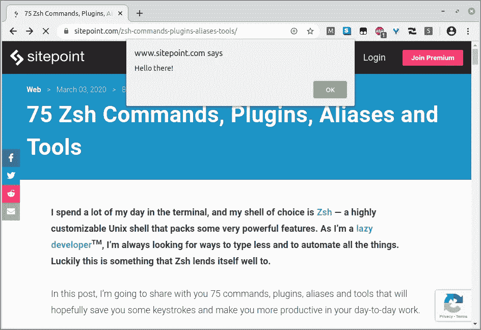
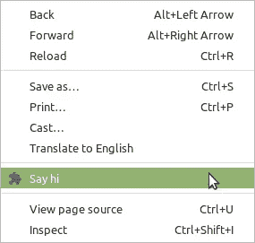
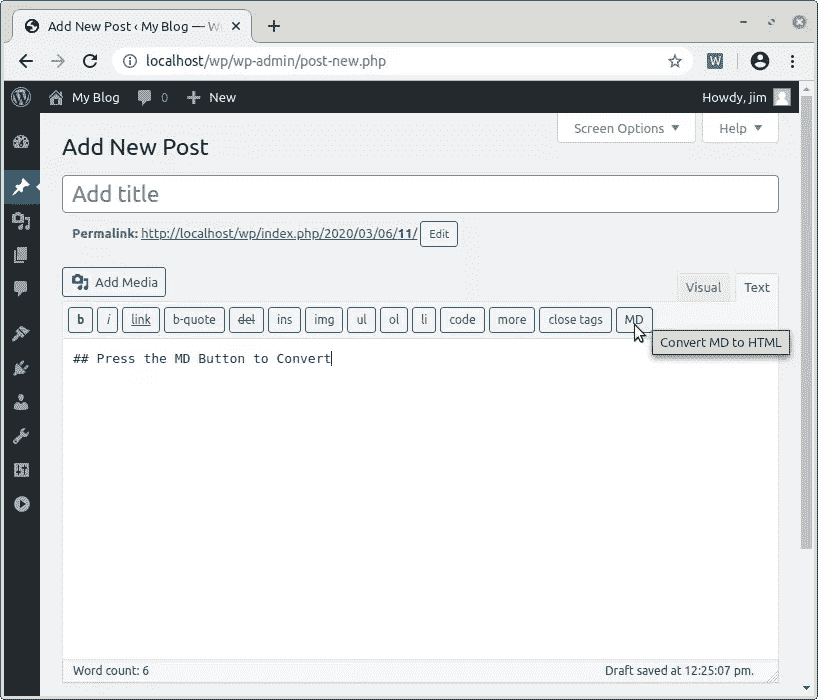
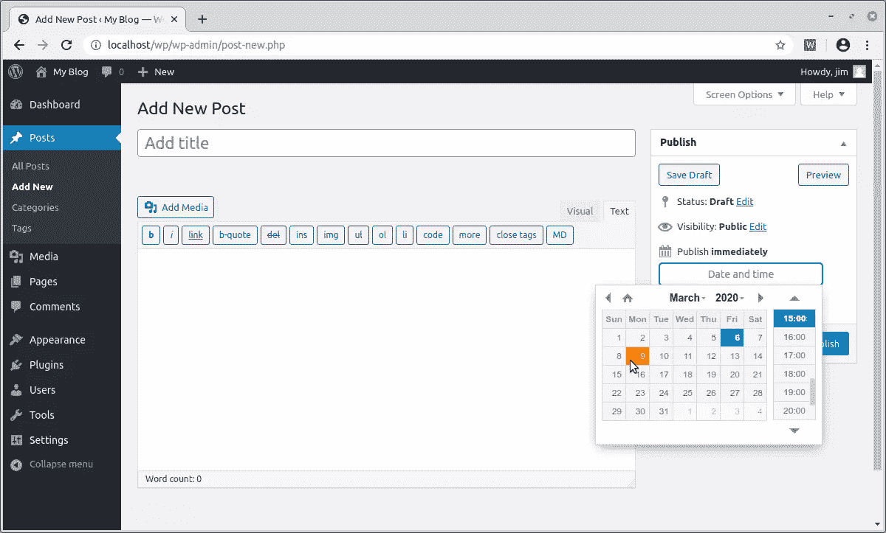

# 构建一个 Chrome 扩展来简化你的工作流程

> 原文：<https://www.sitepoint.com/build-a-chrome-extension/>

当我开始在 SitePoint 做 JavaScript 编辑时，我们的提交过程有点混乱——文章来自各个方向，格式多种多样。所以我们决定将事情标准化，并决定通过 Markdown 中的 GitHub 提交。

这是一个进步，但是我们仍然需要为我们的 WordPress 后端将 Markdown 转换成 HTML。当时 SitePoint 总部的当权者已经否决了任何 WordPress 插件的安装，这让我们考虑是否可以通过浏览器扩展来完成这项任务。幸运的是我们可以！

在接下来的文章中，我将展示如何构建自己的 Chrome 扩展来为 WordPress 添加额外的功能。我还将向您介绍 [SP-Tools](https://github.com/jameshibbard/SP-Tools) ，这是我们在 SitePoint 上使用的一个扩展，它让编辑的生活变得更加轻松。

## Chrome 扩展的剖析

不管你怎么想，构建一个 Chrome 扩展并不困难。让我们先来看看各种组件。

下一节的部分内容是从我写的另一篇关于使用 Vue.js 构建 Chrome 扩展的教程中借来的。

任何 Chrome 扩展的核心都是一个清单文件。这是 JSON 格式的，提供了关于扩展的重要信息，比如它的版本、资源或者它需要的权限。

一个清单文件本身不会做很多事情，所以我们可以使用一个[内容脚本](https://developer.chrome.com/extensions/content_scripts)来添加一些功能。内容脚本是“在网页环境中运行”的文件。也就是说，您在清单文件中指定 URL，然后当您的浏览器访问地址与您指定的 URL 匹配的页面时，内容脚本将被注入到页面中并运行。

为了演示这些概念，让我们从编写一个 Chrome 扩展来在 SitePoint 主站点上做一些事情开始。

创建一个名为`my-extension`的新文件夹和两个文件，`manifest.json`和`main.js`:

```
mkdir my-extension
cd my-extension
touch manifest.json main.js 
```

打开`manifest.json`并添加以下代码:

```
{
  "name": "My Extension",
  "version": "0.0.1",
  "manifest_version": 2,
  "content_scripts": [
    {
      "matches": [ "*://*.sitepoint.com/*" ],
      "js": [ "main.js" ]
    }
  ]
} 
```

`name`、`version`和`manifest_version`都是必填字段。`name`和`version`字段可以是你想要的；[清单版本](https://developer.chrome.com/extensions/manifestVersion)应该设置为 2(从 Chrome 18 开始)。

`content_scripts`键允许我们注册一个内容脚本(`main.js`)，它将在我们访问 SitePoint 时运行。注意我们如何使用[匹配模式](https://developer.chrome.com/extensions/match_patterns)来指定 URL 的部分，比如协议。

现在让我们将下面的代码添加到`main.js`中，让浏览器在我们访问 SitePoint 时向我们问好:

```
alert('Hello there!'); 
```

最后，让我们安装扩展。打开 Chrome，在地址栏输入`chrome://extensions/`。您应该会看到一个页面，显示您已经安装的扩展。

因为我们想从一个文件(而不是 Chrome 网络商店)安装我们的扩展，我们需要使用页面右上角的开关激活*开发者模式*。这将增加一个额外的菜单栏，带有选项 *Load unpacked* 。点击此按钮，选择您之前创建的`my-extension`文件夹。点击*打开*，扩展将被安装。

现在，当您访问 SitePoint 时，会出现以下情况:



恭喜你！你刚刚做了一个 Chrome 扩展。

### 后台脚本和消息传递

所以，那个对话框很烦人，对吧？为了结束这一部分，让我们添加一个上下文菜单条目来手动启动它，而不是让它出现在每次页面加载中。

这就给我们介绍了 Chrome 扩展的另一个重要组件——[后台脚本](https://developer.chrome.com/extensions/background_pages)。这些脚本可以对浏览器事件做出反应(比如用户点击一个上下文菜单条目)，并且它们可以完全访问 Chrome 的 API。然而，他们*没有*访问当前页面的权限，并且依靠消息传递与内容脚本进行通信。

像这样更新清单:

```
{
  "name": "My Extension",
  "version": "0.0.1",
  "manifest_version": 2,
  "permissions": [ "contextMenus" ],
  "content_scripts": [
    {
      "matches": [ "*://*.sitepoint.com/*" ],
      "js": [ "main.js" ]
    }
  ],
  "background": {
    "scripts": ["background.js"],
    "persistent": false
  }
} 
```

请注意，我们正在请求`contextMenus`权限，因为我们想要向上下文菜单添加一些内容，并且我们已经注册了一个非持久的后台脚本。使后台脚本非持久化允许它在不需要的时候被卸载。

接下来，创建一个`background.js`文件并添加:

```
chrome.runtime.onInstalled.addListener(() => {
  chrome.contextMenus.create({
    id: 'greet',
    title: 'Say hi',
    contexts: ['page'],
    documentUrlPatterns: ['*://*.sitepoint.com/*'],
  });
});

chrome.contextMenus.onClicked.addListener((info, tab) => {
  if (info.menuItemId === 'greet') {
    chrome.tabs.sendMessage(tab.id, { text: 'greet' }, (res) => {
      console.log(res);
    });
  }
}); 
```

当安装扩展时，我们注册上下文菜单条目，然后添加一个事件侦听器，以便每当条目被单击时，向我们的内容脚本发送一条消息。

像这样改变`main.js`:

```
chrome.runtime.onMessage.addListener((msg, sender, sendResponse) => {
  if (msg.text === 'greet') {
    alert('hi');
    sendResponse('I greeted the user');
  }
}); 
```

在这里，我们从我们的后台脚本中监听消息。如果它有一个“greet”文本，我们就发出警报并发回一条消息，通知后台脚本我们做了所请求的事情。

要尝试这一点，请返回到扩展页面(在`chrome://extensions/`)，然后单击重新加载图标并重新加载任何 SitePoint 页面。右键单击时，您应该会看到一个上下文菜单条目。



## 用 Chrome 扩展增强 WordPress 的功能

现在我们已经熟悉了 Chrome 扩展的基本组件，让我们看看如何为 WordPress 的功能添加一些东西。

为了理解这一部分，你需要一个 WordPress 的[工作安装。我在本地安装了我的。它在`http://localhost/wp`运行在 Apache 服务器上。](https://wordpress.org/support/article/how-to-install-wordpress/)

这个扩展的代码可以在 [GitHub](https://github.com/sitepoint-editors/wp-enhance) 上找到。

### 添加降价转换器

让我们从添加一个 Markdown 转换器到 WordPress 编辑器开始。与 SitePoint 上的体验一样，我将使用“经典”编辑器(通过安装[禁用古腾堡插件](https://wordpress.org/plugins/disable-gutenberg/)实现)和*文本*视图。

首先，为我们的新扩展创建以下文件夹结构:

```
wp-enhance
├── lib
│   ├── jquery.min.js
│   └── showdown.min.js
├── manifest.json
└── scripts
    └── main.js 
```

在命令行上:

```
mkdir wp-enhance
cd wp-enhance
mkdir lib scripts
touch lib/showdown.min.js lib/jquery.min.js
touch scripts/main.js
touch manifest.json 
```

如你所见，我们将使用[摊牌降价转换器](https://github.com/showdownjs/showdown)和 jQuery(因为我很懒)。

当务之急是获取这些库的最新缩小版([摊牌](https://cdnjs.cloudflare.com/ajax/libs/showdown/1.9.1/showdown.min.js)和 [jQuery](https://cdnjs.cloudflare.com/ajax/libs/jquery/3.4.1/jquery.min.js) )，并将内容添加到适当的文件中。

接下来，将以下代码添加到`manifest.json`:

```
{
  "manifest_version": 2,
  "name": "WP Enhance",
  "description": "A Chrome extension to enhance WordPress' functionality",
  "version": "0.0.1",
  "content_scripts": [
    {
      "matches": [ "http://localhost/wp/wp-admin/post-new.php" ],
      "js": [
        "lib/jquery.min.js",
        "lib/showdown.min.js",
        "scripts/main.js"
      ]
    }
  ]
} 
```

这里没有什么壮观的事情发生。该扩展被设置为在我们访问`http://localhost/wp/wp-admin/post-new.php`时运行，并且我们包含了我们刚刚下载的两个库。

最后，在`scripts/main`中添加以下内容:

```
'use strict';

const $editorToolbar = $('#ed_toolbar');
const $mainTextArea = $('#content');

function getShowdownConverter() {
  const converter = new showdown.Converter();

  // Set any options here, for example to add table support
  converter.setOption('tables', true);

  return converter;
}

function addMDButton() {
  const mdConverter = getShowdownConverter();
  const $convertButton = $('<input />', {
    type: 'button',
    value: 'MD',
    class: 'ed_button button button-small',
    title: 'Convert MD to HTML',
    click() {
      const md = $mainTextArea.val();
      const html = mdConverter.makeHtml(md);
      $mainTextArea.val(html);
    },
  });
  $editorToolbar.append($convertButton);
}

addMDButton(); 
```

这里，我们正在创建一个新的按钮，并把它附加到 WordPress 编辑器的工具栏上。当它被点击时，我们调用了摊牌的`makeHtml`方法，我们传递内容区域的内容。这将返回一些 HTML，然后我们将它们插入到编辑器中。

加载扩展并访问新的文章页面。您应该会看到类似这样的内容:



我相信你会同意，这是一个相当令人印象深刻的结果，只用了几行代码。

### 向发布小部件添加日期选择器

接下来，我们将使用日期选择器来增强发布小部件。这将取代你通常在点击 WordPress' *发布*窗口小部件中“立即发布”消息旁边的*编辑*链接时看到的一系列下拉框和输入框。

我们需要做的第一件事是下载一个日期选择器。对于这个演示，我将使用[这个](https://github.com/xdan/datetimepicker)。你可以从[这里](https://github.com/xdan/datetimepicker/releases/tag/2.5.20)下载必要的文件。解压缩该文件并将`build/jquery.datetimepicker.full.min.js`放入我们的`lib`文件夹。然后在扩展中创建一个新的`css`文件夹，并将`build/jquery.datetimepicker.min.css`放入其中。

我们的扩展现在应该是这样的:

```
wp-enhance
├── css
│   └── jquery.datetimepicker.min.css
├── lib
│   ├── jquery.datetimepicker.full.min.js
│   ├── jquery.min.js
│   └── showdown.min.js
├── manifest.json
└── scripts
    └── main.js 
```

现在将这些文件包含在清单中:

```
{
  "manifest_version": 2,
  "name": "WP Enhance",
  "description": "A Chrome extension to enhance WordPress' functionality",
  "version": "0.0.1",
  "content_scripts": [
    {
      "matches": [ "http://localhost/wp/wp-admin/post-new.php" ],
      "js": [
        "lib/jquery.min.js",
        "lib/showdown.min.js",
        "lib/jquery.datetimepicker.full.min.js",
        "scripts/main.js"
      ],
      "css": [ "css/jquery.datetimepicker.min.css" ]
    }
  ]
} 
```

最后，我们需要修改我们的内容脚本(`main.js`)，如下所示:

```
const $editorToolbar = $('#ed_toolbar');
const $mainTextArea = $('#content');
const $timeStampDiv = $('#timestampdiv');
const $wpSchedulePostDropdown = $('.timestamp-wrap');
let $datepicker;

const $dd = $('#jj');
const $mm = $('#mm');
const $yyyy = $('#aa');
const $hh = $('#hh');
const $mn = $('#mn');

function getShowdownConverter() { ... }

function addMDButton() { ... }

function addDatePicker() {
  $datepicker = $('<input />', {
    id: 'bandaid-datepicker',
    type: 'text',
    placeholder: 'Date and time',
  });

  $datepicker.datetimepicker();
  $timeStampDiv.prepend($datepicker);
}

addMDButton();

$wpSchedulePostDropdown.hide();
addDatePicker();

$datepicker.on('change', function updateDateFields() {
  // String in format yyyy/mm/dd hh:mm
  const dateString = this.value;

  $yyyy.val(dateString.substr(0, 4));
  $mm.val(dateString.substr(5, 2));
  $dd.val(dateString.substr(8, 2));
  $hh.val(dateString.substr(11, 2));
  $mn.val(dateString.substr(14, 2));
}); 
```

我们正在做的是获取对 WP 用来管理预定文章的时间和日期的输入元素的引用。然后我们隐藏这些元素并初始化 datepicker。每当用户选择一个日期，隐藏字段就会更新，并且可以安排发布。

重新加载扩展，然后刷新 WordPress 新帖页面。您现在拥有的应该是这样的:



同样，这是一个令人印象深刻的结果，代码不多。

## 测试扩展

在我们的 SP-Tools 扩展的早期，我注意到的一件事是，当 WordPress 更新时，东西会坏掉。因此，我开始思考如何测试这个扩展，并决定用 [Nightwatch](https://nightwatchjs.org/) 进行一些端到端测试是有意义的。

在下一节中，我将演示如何以同样的方式测试我们的扩展。

首先，我们需要生成一个`package.json`文件。在扩展根中，运行`npm init -y`。接下来，让我们安装 Nightwatch 和 ChromeDriver 作为开发依赖项:

```
npm install --save-dev nightwatch chromedriver 
```

现在创建一个`test`目录，添加一个`nightwatch.config.js`文件，以及一个用于测试代码的`wp.js`文件:

```
mkdir test
touch test/nightwatch.config.js test/wp.js 
```

将以下内容添加到配置文件中:

```
module.exports = {
  src_folders: 'test',
  output_folder: 'test',
  page_objects_path: '',
  custom_commands_path: '',
  custom_assertions_path: '',

  webdriver: {
    start_process: true,
    port: 9515,
    server_path: 'node_modules/.bin/chromedriver',
    log_path: false,
    cli_args: [],
  },

  test_settings: {
    default: {
      desiredCapabilities: {
        browserName: 'chrome',
        chromeOptions: {
          args: [
            'load-extension=./',
            '--test-type',
          ],
        },
      },
    },
  },
}; 
```

重要的部分是`'load-extension=./',`，它告诉 Nightwatch 将我们的扩展加载到测试浏览器中。

并将以下内容添加到`wp.js`(用您自己的登录凭证替换我的登录凭证):

```
module.exports = {
  'Test WordPress Mods': (browser) => {
    browser
      // Login to WP Dashboard
      .url('http://localhost/wp/wp-login.php')
      .setValue('#user_login', 'jim')
      .setValue('#user_pass', 'secret')
      .click('#wp-submit')

      // Go to New Post Page
      .url('http://localhost/wp/wp-admin/post-new.php')

      // Test MD > HTML conversion
      .setValue('#content', '## level 2 heading\n### level 3 heading')
      .click('input[value="MD"]')
      .assert.valueContains('#content', '<h2 id="level2heading">level 2 heading</h2>')
      .assert.valueContains('#content', '<h3 id="level3heading">level 3 heading</h3>')

      // This is here so that you can take a look at the browser
      .pause(5000)
      .end();
  },
}; 
```

现在运行测试，使用:

```
node_modules/.bin/nightwatch --config test/nightwatch.config.js 
```

你应该看到 Chrome 浏览器的一个实例打开了，Nightwatch 执行了我们指定的测试。测试的结果被输出到终端。

希望 Nightwatch 的 DSL 非常简单明了。你可以在他们的[文档](https://nightwatchjs.org/api/)中读到更多。如果您喜欢挑战，尝试为日期选择器添加测试。

请注意，我在这里硬编码了我的凭证。如果您将它用于演示之外的任何目的，那么最好将它们移到一个没有提交给 GitHub 的配置文件中。

别忘了你可以在 [GitHub](https://github.com/sitepoint-editors/wp-enhance) 上找到我迄今为止演示的所有内容的代码。

## SitePoint 的 Chrome 扩展的显著特点

我相信你已经意识到，你会发现这样一个浏览器扩展有多有用。大多数人会有(稍微)不同的需求，并且能够安装 WordPress 插件来解决他们遇到的大多数问题。

尽管如此，在这最后一节，我还是想概述一下我们已经添加到我们的 [SP-Tools 扩展](https://github.com/jameshibbard/SP-Tools)中的一些特性，希望它们能够启发甚至对其他人有用。

*   一个*大写并勾选*按钮。这将文章标题转换为[标题案例](http://www.grammar-monster.com/lessons/capital_letters_title_case.htm)。
*   一个标题分析工具，给你的标题打满分，并提供改进建议。
*   一个*大写副标题*按钮，用于检查文章中剩余标题的大写。
*   一个*复制链接*按钮，将文章的当前永久链接复制到剪贴板。
*   一个*重建链接*按钮，用于重建文章的永久链接。这是很有用的，例如，当 WordPress 基于一个随后改变的标题草稿创建一个永久链接时。
*   一个可扩展的 [molly-guard](http://www.urbandictionary.com/define.php?term=molly-guard) ，它执行许多检查并相应地禁用/启用发布按钮。除其他外，它还检查:
    *   明智的永久链接
    *   编辑器窗格中相对 URL 的存在
    *   编辑器窗格中存在空链接
    *   编辑器窗格中出现的`<h1>`标签
    *   摘录中出现的

        短代码标签

*   一个*复制标签*按钮，它给你一个以逗号分隔的标签列表，这些标签被复制到剪贴板。
*   一个 *rel= "赞助商"*按钮，将一篇文章中所有链接的`rel`属性切换为`sponsored`。

如果你想看看，你可以在 GitHub 上[找到我们的扩展。还有一些其他的好东西，比如上下文菜单条目，一些关闭我们主网站无限滚动的代码，当然，还有 Nightwatch 的测试。](https://github.com/jameshibbard/SP-Tools)

## 结论

在本教程中，我们看了组成 Chrome 扩展的各种组件。我已经演示了如何构建和测试我们自己的 Chrome 扩展来增强 WordPress 安装的基本功能。我还向您介绍了 SP-Tools，SitePoint 自己的 Chrome 扩展，我们用它来简化各种编辑任务。

如果你觉得我们的扩展有用，或者让它做其他事情，我很乐意在 [Twitter](https://twitter.com/jchibbard) 上听到你的意见。

## 分享这篇文章