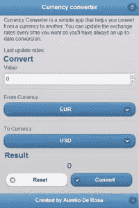

# 用 jQuery Mobile 和 Cordova 构建货币转换器:6

> 原文：<https://www.sitepoint.com/build-a-currency-converter-with-jquery-mobile-and-cordova-finishing-the-app/>

在本系列的前一部分[中，我展示了`functions.js`文件的其他几个函数，突出了它们的要点。在第六部分，也是最后一部分，我将描述剩下的最后一个函数和 Cordova 配置文件，我们将使用它来设置项目的属性，并为](https://www.sitepoint.com/build-a-currency-converter-with-jquery-mobile-and-cordova-rate-updates/ "Build a Currency Converter with jQuery Mobile and Cordova: Rate Updates") [Adobe PhoneGap 构建服务](http://build.phonegap.com/)定义几个指令。

### 初始化应用程序

首先，在`index.html`文件中，我将把函数`initApplication()`——我一会儿将描述它——附加到`deviceready`事件，当 Cordova 完全加载时该事件被触发。

```
$(document).one('deviceready', initApplication);
```

一旦启动，该函数将翻译在[用 jQuery Mobile 和 Cordova 构建货币转换器:翻译和转换逻辑](https://www.sitepoint.com/build-a-currency-converter-with-jquery-mobile-and-cordova-part-4/ "Build a Currency Converter with jQuery Mobile and Cordova: Translation and Conversion Logic")中描述的多语言书面文本，如果用户首选的口语可用，则调用`translateMainPage()`函数。然后，它调用`openLinksInApp()`函数来管理外部链接，如[第 5 部分](https://www.sitepoint.com/build-a-currency-converter-with-jquery-mobile-and-cordova-rate-updates/ "Build a Currency Converter with jQuery Mobile and Cordova: Rate Updates")所述。这两个动作独立于应用程序的其余部分，即使设备不满足要求。

```
translateMainPage();
openLinksInApp();
```

运行上述两个操作后，“货币转换器”根据要求测试设备(在[第 4 部分](https://www.sitepoint.com/build-a-currency-converter-with-jquery-mobile-and-cordova-part-4/ "Build a Currency Converter with jQuery Mobile and Cordova: Translation and Conversion Logic")中讨论)，如果不满足要求，它禁用“转换”按钮并退出该功能。

```
if (checkRequirements() === false)
{
  $('#submit-button').button('disable');
  return;
}
```

既然已经执行了基本操作，我们可以运行其他和更繁重的(实际上，它们并没有那么重)功能。因此，为了给用户一种幕后有事情发生的感觉，有一个函数显示 loader 小部件。然后，它继续更新界面，通过调用`fillCurrenciesSelection()`、更新汇率的函数`updateExchangeRates()`，以及通过读取最近一次货币汇率更新的日期和时间`updateLastUpdate()`，用存储的货币值填充两个选择框。

```
$.mobile.loading('show');

fillCurrenciesSelection();
updateExchangeRates();
updateLastUpdate();
```

至此，所有必要的进程都已被调用，我们需要将处理程序附加到一些页面的元素和事件上。一旦触发了`online`事件，第一个处理程序就会更新速率。正如您可能猜到的，后者在 Cordova 应用程序检测到它连接到互联网时触发。

```
$(document).on('online', updateExchangeRates);
```

下一个处理程序非常重要，因为它是执行货币转换的处理程序，而且它与“Convert”按钮相连。在它检索了从接口中选择的货币和两种货币的值之后，它调用`Currency`类的`convert()`方法来进行转换计算。然后，它调用`numberToString()`来根据用户偏好本地化结果，并将最终结果注入页面。最后，它用用户选择的最新货币更新应用程序设置。

```
$('#submit-button').click(function(event) {
  event.preventDefault();

  // Convert the value
  var result = Currency.convert(
    $('#from-value').val(),
    $('#from-type').val(),
    $('#to-type').val()
  );

   // Localize the result
   navigator.globalization.numberToString(
    result,
    function(number)
    {
      $('#result').text(number.value);
    },
    function()
    {
      $('#result').text(result);
    }
  );

  // Update settings
  var settings = Settings.getSettings();
  if ($.isEmptyObject(settings))
    settings = new Settings();
  settings.fromCurrency = $('#from-type').val();
  settings.toCurrency = $('#to-type').val();
  settings.save();
});
```

完成“转换”按钮功能后，我们现在可以继续“重置”按钮。它的行为非常简单。如果用户点击它，我们设置货币转换的输入字段，并将转换结果设置为零。我们还通过将两个选择框中选择的货币类型更改为列出的第一种货币来重置最后选择的货币。

```
$('#reset-button').click(function(event) {
  event.preventDefault();

  $('#from-value').val(0);
  $('#form-converter select').prop('selectedIndex', 0).selectmenu('refresh');
  $('#result').text(0);
});
```

我们需要放置的最后一个处理程序是“更新数据”按钮——主屏幕右上角的按钮。附带的函数只是测试互联网连接，如果找到了，就运行`updateExchangeRates()`函数。否则，它会通知用户它没有连接到互联网。

```
$('#update-button').click(function(event) {
  event.preventDefault();

  if (navigator.network.connection.type === Connection.NONE)
  {
    console.log('The connection is off. Can't update exchange rates.');
    navigator.notification.alert(
      'Your device has the connections disabled. Can't update exchange rates.',
      function(){},
      'Error'
    );
  }
  else
    updateExchangeRates();
});
```

现在所有的部分都已经就位，我们可以对用户隐藏加载小部件，这样他们就知道所有的后台操作都已经完成了。

```
$.mobile.loading('hide');
```

作为整个讨论的结论，下面是我们的“货币转换器”应用程序的截图:



### 创建科尔多瓦配置

因为我们将使用 [Adobe PhoneGap Build](http://build.phonegap.com) 服务来打包我们的项目，为了设置它的元数据(版本、名称、作者等等)，我们将使用一个名为`config.xml`的配置文件。详细解释这种格式超出了本文的范围，但是我将强调主要的概念，并将重点放在重要的`<access>`标签上。为了深入了解你可以用这个文件做什么，你可以阅读[官方文档页面](https://build.phonegap.com/docs/config-xml "Using config.xml")。

引用的文件遵循 [W3C 小部件规范](https://www.w3.org/TR/widgets/ "W3C widget specification")，并且必须位于项目文件的根目录下，与`index.html`文件处于同一级别。整个文档的根是一个有几个属性的`<widget>`标签，但是主要的是`id`(应用程序的唯一标识符)和`version`(指定应用程序的版本)。在`<widget>`标签中，你可以包含几个元素:

*   **名称**(必选):指定应用程序的名称。不一定要独一无二。
*   **描述**(必选):指定您的工作的描述。这将显示在应用程序的市场列表中。
*   **作者**(可选):应用的作者。遗憾的是，您只能指定一个作者，因此无法拥有多个作者的详细信息。
*   **图标**(可选):在将要安装你的应用的设备上显示的图标。如果不指定，将使用 Cordova 徽标。
*   **特性**(可选):指定您想要使用的特性。一些操作系统在安装应用程序之前，会要求用户提供这些功能的权限。在“货币转换器”中，唯一需要的功能是访问互联网连接。
*   **preference** (可选):打包项目时要应用的一组首选项，比如 Cordova 版本。
*   **splash** (可选):这个标签设置应用程序的闪屏——加载时显示的图像。

`<access>`标签非常重要，因为引用[文档](https://build.phonegap.com/docs/config-xml)，它<q cite="https://build.phonegap.com/docs/config-xml">为你的应用程序提供对其他域上资源的访问——特别是，它允许你的应用程序从外部域加载页面，这些页面可以接管你的整个 webview。</q>回想一下我们在上一部分的[的“管理外部链接”一节中讨论的内容，为了在 Cordova WebView 中打开外部链接，我们必须将它们添加到应用程序白名单中。使用`<access>`标签，有几种方法可以添加链接。事实上，您可以单独指定要添加的每个链接。考虑下面的例子:](https://www.sitepoint.com/build-a-currency-converter-with-jquery-mobile-and-cordova-rate-updates/ "Build a Currency Converter with jQuery Mobile and Cordova: Rate Updates")

`<access origin="https://www.audero.it" />`


对于上述每个批准的域，您还可以使用`subdomains`属性包括所有子域:

`<access origin="https://www.audero.it" subdomains="true" />`

由于我们的应用程序不会从外部和不安全的来源检索链接，因此我们可以使用`*`特殊字符来缩短允许任何外部资源的过程，如下例所示:

`<access origin="*" />`

现在我已经指出了格式的要点，您可以理解我们项目的配置文件的来源了。完整的文件如下。

```
<?xml version="1.0" encoding="UTF-8"?>
<widget xmlns     = "https://www.w3.org/ns/widgets"
        xmlns:gap	= "http://phonegap.com/ns/1.0"
        id        = "com.audero.free.utility.currencyconverter"
        version   = "1.0.0">

   <name>Currency converter</name>

   <description>Currency converter is a simple app that helps you convert from a currency to another. You can update the exchange rates anytime you want so you'll have always an up-to-date conversion.</description>

   <author href="http://www.audero.it" email="aurelioderosa@gmail.com">Aurelio De Rosa</author>

   <feature name="http://api.phonegap.com/1.0/network"/>

   <preference name="phonegap-version" value="2.3.0" />
   <preference name="target-device" value="universal" />

   <access origin="*" />

   <!-- Icons -->
   <icon src="icon.png" width="64" height="64" gap:role="default" />
   <icon src="images/icon-72x72.png" width="72" height="72" gap:platform="android" gap:density="hdpi" />
   <icon src="images/icon-96x96.png" width="96" height="96" gap:platform="android" gap:density="xhdpi" />
   <icon src="images/icon-72x72.png" width="72" height="72" gap:platform="ios" />

   <!-- Splash Screens -->
   <gap:splash src="splash.png" />
   <gap:splash src="images/splash-160x220.png" gap:platform="android" gap:density="ldpi" />
   <gap:splash src="splash.png" gap:platform="android" gap:density="mdpi" />
   <gap:splash src="images/splash-450x650.png" gap:platform="android" gap:density="hdpi" />
</widget>
```

### 结论

我不得不称赞那些完成了整个系列的人。越来越多的混合应用程序发布，包括我们刚刚构建的一个，证明你可以使用你已经掌握的网络技术来构建令人惊叹的游戏和实用程序。选择开发混合应用程序有利也有弊，但这无疑是您开发工具带中的一个额外工具。我的最后一个贡献是给你货币转换器库的链接。在这里，您可以找到并下载完整的现成软件包。对于那些懒得开发应用程序的人，我还创建了一个公共页面，你可以在这里下载由 T2 Adobe Build PhoneGap 服务支持的所有平台的安装程序。最后说明一下，Currency Converter 是在 CC BY 3.0(“知识共享署名 3.0”)许可下发布的。

我希望你喜欢这个系列，并对混合应用程序有更多的舒适和信心。感谢关注！

## 分享这篇文章