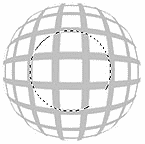
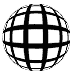
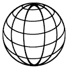
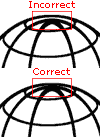
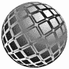
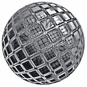

# 建立一个墨卡托

> 原文：<https://www.sitepoint.com/build-a-mercator/>

Gerhard us Mer ca tor:佛兰德制图师，他发明了“墨卡托投影”(1568 年)。

3D 艺术家将此称为“球形投影或映射”:在一张地图上，经线和纬线显示为直角相交的直线，在这张地图上，离赤道越远的区域看起来越扭曲。

这张图片可以有许多不同的外观，最受欢迎的是线条看起来都像缠绕在球体周围的字符串(本教程中的“样式 2”)。这种图像通常是用插图程序创建的，但稍加运用，也可以用非插图程序创建，如 Photoshop。

我们将在这里讨论两种风格——你在上面看到的那种(风格 1 ),以及上面提到的“风格 2”。作为奖励，我将展示几个快速的方法来改变和添加这个图片，给它一些不同的外观。

Mac 用户注意:PC 键 Ctrl = Mac 键 Cmd。PC 键 Alt = Mac 键选项。每走 2、3 步别忘了保存！

好了，我们开始吧！

##### 风格 1 —基本墨卡托

1.  创建一个新文档，并给它相等的长度和宽度，即 300 像素乘 300 像素。使用白色背景(至少在这个例子中)。
2.  创建一个新层(Ctrl+Shift+N)，并命名为“墨卡托”。然后用白色填充(按 D 键，然后 Ctrl+Delete)。
3.  在过滤器菜单下，选择“草图”，然后“半色调模式…”设置“模式类型”为线。然后设置对比度为全，线条粗细为 6px。按“确定”应用这些设置。
4.  Under the SELECT menu, choose "Color Range…". Then within the ‘Select’ dropdown menu, change the option to ‘Highlights’. Click OK to apply, then press the Delete key. And finally, Deselect (Ctrl+D).

    如果有人好奇，我们没有使用魔术棒工具来选择白色区域的原因是因为“选择颜色范围”功能可以提供更清晰的结果。

6.  此外，旧版本的 Photoshop 没有新的“背景橡皮擦”和“魔法橡皮擦”工具，但它们有“选择颜色范围”功能。所以这里解释的方法适用于所有版本的 Photoshop。
7.  This step is optional, and can be used if you want thinner lines. Under the FILTER menu, choose "Other", then "Maximum…" and set it to 3px. This, as you’ll notice, will reduce the thickness of your lines by 3 pixels.

    如果你想知道，这一步不能自动使用“半色调模式”过滤器；不是这样的。

9.  按 Ctrl+J 复制这一层。并在编辑菜单下，选择“变换/逆时针旋转 90”。按 Ctrl+E 将这两层合并在一起。
10.  在滤镜菜单下选择“扭曲/球形化…”。在最大级别使用“正常”设置，然后单击“确定”进行应用。然后按 Ctrl+F 再次应用相同的过滤器。
11.  现在在编辑菜单下，选择“变换/缩放…”。同时按住 ALT 和 Shift 键，然后抓住并向内拖动其中一个角控制点。将其大小调整到原来的 2/3 左右。一旦缩放，确保它在画布的真正中心-按 Ctrl+A(全选)，Ctrl+X(剪切选定)，Ctrl+V(粘贴)。现在真的居中了。
12.  现在使用椭圆选择工具。按住 ALT 和 Shift 键；尽可能靠近球体的正中间单击，并缩放与球体形状大小几乎完全相同的选择。你可以把它拉近，然后用箭头键把它推到最佳位置。您希望所选内容在地球形状内居中。请注意，我已经在这里亮了我的图像，所以你可以更容易地看到我的选择。
13.  按 Ctrl+Shift+I 反转选择。然后按 Delete 键，再按 Ctrl+D 取消选择。然后再次应用“球形化”滤镜。这将增加线条的球形外观，同时增加球体的大小，这就是为什么我们在第 8 步缩小了球体。这就是让这个效果看起来又好又干净的秘诀。
14.  The last step to making this effect complete is to spherize just the very center of the line grid, to improve the ‘Mercator projection’ of the lines. So, create a circular selection like the one shown in the example image.

    使用椭圆选择工具，按住 ALT 和 Shift 键；尽可能靠近球体的正中间单击，并向外拖动鼠标。请注意，您只想选择 3 个正方形的半径，从中心开始向外移动。

    完成后，羽化选区 10 像素(选择>羽化)。然后使用“正常”模式，使用设置为 10 的球形过滤器。然后可以取消选择。

你的图像现在应该看起来很像这一页的顶部。如果你想让你的球体倾斜，只需使用“编辑/变换”菜单下的旋转功能。试试正负 30 度。瞧啊。墨卡托。

***多余提示***

*   如果线看起来有点模糊，使用球体上的“反锐化掩模”滤镜来锐化线。不过不要做得太过——尝试使用 100% / 0.5 / 0 的设置。
*   The trick to getting the best results from this effect are is in Step 8 — scaling down the sphere before re-applying the ‘Spherize’ filter a second time.

    如果你想看到质量和效果的差异，那么在第 7 步，只需连续应用滤镜 2 次。大多数演示如何创建这个图像的教程都以这种方式使用球化过滤器，但它看起来并不那么好。

*   如果你想让效果看起来更像球形，你只需重复第 8 步，然后重新应用“球形化”滤镜。不过要小心过度使用滤镜，因为靠近中心的线条会开始变得太模糊(见示例图像)，这将需要您放大并手动清理它们，因为模糊蒙版滤镜对此不再有用。

##### 样式 2-线框球体

这张图片与之前的风格有些不同，但这张也很受欢迎——尤其是在公司标志上。与第一个相比，创建这个效果需要更多的时间，但是一旦你熟悉了这些步骤，只要你需要，你就可以很快重复这个效果。

您还可以创建一个动作来为您完成大量繁重的工作。虽然一个动作不能完全产生这种效果，但它可以完成大部分相关步骤。

Mac 用户注意:PC 键 Ctrl = Mac 键 Cmd。PC 键 Alt = Mac 键选项。每走 2、3 步别忘了保存！

1.  Create a new document and give it equal length and width dimensions, i.e. 300px by 300px. Use a white background (for this example, at least).
2.  Create a New Layer (Ctrl+Shift+N). Then create a circular selection that fills most of the canvas area. Hold down the ALT and SHIFT keys to create a perfect circle that draws from the center outward.
3.  对选区应用从白到黑的径向渐变。按住 Shift 键，在圆的正中心启动渐变工具，并将其拖动到正中心。让选择继续。
4.  Add an Adjustment Layer right above the sphere layer (click the split black and white circle image at the bottom of the Layers palette). Choose the "Posterize" filter for this adjustment layer. Set the filter to 6\.

    注意到发生了什么吗？我们得到 6 个单独的阴影部分，它们将成为我们的线框环。因此，将过滤器设置为您想要的响铃次数。如果您的选择不再活跃，再次按住 Ctrl 键单击渐变球体层以重新选择它。

5.  Add another Adjustment Layer right above the previous one. Choose the "Brightness and Contrast" filter for this layer. Set the Brightness up to +25, and Contrast down to -50\. This will allow us to see every level of gray clearly. Which will be helpful in the steps to come. If your selection is no longer active, Ctrl-click on the gradient sphere layer again to reselect it.
6.  Now I’ve left this part until after the Adjustment layers were added, specifically so you could see what happens when we apply the "Spherize" filter. Click on the gradient sphere layer to make it the active layer. Apply the "Spherize" filter (FILTER>Distort>Spherize) using the ‘Normal’ mode, and set to 100% strength.

    你有没有注意到应用这个滤镜是如何使球体的灰色部分变得更平坦，并给它们一个更好的，适合我们效果的形状？如果你没有将这个滤镜应用到你的渐变中，你的地球仪的线条会太陡，看起来会不正确。一旦你这样做了，让选择继续。

7.  Under the EDIT menu choose ‘Copy Merged’ (Ctrl+Shift+C). Open the Channels palette and create a new channel. Then paste what you just copied into the channel (press Ctrl+V). Now you can Deselect.
8.  Now under the FILTER menu, choose ‘Noise>Median’. Set it to 3px, and click OK. Then apply it twice more by pressing Ctrl+F twice. And now, also from the FILTER>Noise menu, choose ‘Dust and Scratches’. Apply this with the settings Radius=6 and Threshold=0\. Before going on, create a duplicate of your new channel as a backup.

    这些滤镜用于帮助平滑划分不同色调的线条。然而不幸的是，他们不能完全平滑它们，这是试图只用滤镜来实现这种效果的缺点之一。实际上，这里的问题过滤器是“色调分离”过滤器，而不是另外两个，但是不要担心——我们将通过应用更多的过滤器来获得更清晰的线条。

9.  Now open the FILTER menu and choose Stylize>Glowing Edges. Use the settings 5/20/15\. And now for the secret ingredient — a filter that will smooth our lines out even more! Under the ‘FILTER>Stylize’ menu, choose ‘Diffuse>Anisotropic’. Apply it once, then press Ctrl+F 4 times to apply the filter a total of 5 times.

    最后，按 Ctrl+L 打开级别过滤器。向左拖动右滑块至 128。然后开始向右拖动左边的滑块，直到线条变得更清晰、边缘更硬。不要走得太远，否则线条会显得参差不齐。如果发生这种情况，请将左侧滑块向后移动一点。单击“确定”进行应用。

10.  Ctrl-Click the channel to select the lines. Then go back to the Layers palette and create a New Layer, filling the selection with black. Then Deselect. Now you’ll need to ‘hide’ the bottom 3 layers — the original gradient sphere layer, and the 2 adjustment layers. Click on their ‘eye’ icons to hide those layers.

    你应该会看到你的通道的负面版本。将这一层命名为“基础球体”。如果你的线条有点不均匀，那么再次运行“漫射>各向异性”滤镜，将模糊蒙版设置为 250% / 0.5 / 0。如果它们只是有点模糊，那么只应用模糊蒙版滤镜设置为 100% / 0.5 / 0。

***多余提示***

*   这整个效果可以变成一个动作。但是作为一个行动，如果你遵循下面提示 4 给出的建议，那将是最好的。我还建议，如果你把它变成一个动作，你得到的动作是为墨卡托效应创建一个新的文档，而不是把它与你正在处理的任何当前图像结合起来。一旦效果出来了，你就可以合并图层并把它拖到你正在处理的文档中。
*   如果你的圆的边界是不均匀的，只需选择渐变球体并反转选择。然后在轮廓层——“基础球体”——按 Delete 键。现在再次反转选区，在编辑菜单下选择描边。在中间应用 7 像素的描边。这应该给你一个漂亮干净的边界。
*   如果你想线条更粗，然后应用“最小”滤镜到图层(滤镜>其他>最小)。我不会使用这个滤镜超过 1 或 2 个像素，因为线条会开始看起来扭曲。
*   有一种方法可以获得稍微好一点的效果。首先，把你的地球仪做得比你打算使用的大一倍。然后，在你完成所有的步骤后，将你的文档缩小 50%。因为 Photoshop 重新插值了图像，线条变得稍微平滑了一些。正如上一篇技巧文章中提到的，如果你打算加粗线条，这是非常好的。
*   我花了几个小时的时间发现“漫射”滤镜的“各向异性”设置可以让我们真正清理和平滑线条的边缘。在遇到这个过滤器之前，我尝试了许多其他过滤器。这里的要点是，仅仅因为你没有马上找到问题的解决方案，并不意味着没有解决方案。你只需要坚持你的实验，直到你发现正确的过滤器使用完美的设置。

接下来，我们将添加垂直线到球体，使它看起来更像一个线框地球。

我知道这现在看起来有点困难，但是相信我:一旦你知道了步骤，这种效果可能需要几分钟才能实现——特别是如果你创建一个动作来完成大部分工作。说到这里，这是一个很难使用动作创建的部分，因为它涉及到手动选择。

1.  Create a New Layer above your ‘base sphere’ layer. You don’t have to name this one.
2.  Ctrl-Click the original shaded sphere layer to make a selection of it. Now Stroke this selection by 5 pixels, in the center (EDIT>Stroke…)
3.  Again under the EDIT menu, go to the ‘Transform’ option and choose the ‘Scale’ function. Hold down the ALT key, grab one of the side control handles, and drag it inward so the circle gets thinner. Make it look like an oval — like the example image here.

    创建另一个新层，重复上述步骤，但这一次，调整圆圈的大小，直到它比第一个更薄。你会注意到这一步使线条变得很细。我们可以使用“其他”选项下的“最大值”过滤器轻松解决这个问题(过滤器>其他>最小值…)。

    当两个垂直线层都创建好并达到你的满意后，点击最上面的一个并按 Ctrl+E 将它们合并在一起。然后合并垂直线层到基础形状层。现在你应该只有一个层，上面有你的整个墨卡托，你可以随意给它上色，填充纹理等等。

这就是全部了。我们完了！

***多余提示***

*   还有一个更小的细节，真正完成了效果。选择“变换>缩放”工具，将两个垂直线层的高度减少 2 或 3 个像素。基本上，你希望这些线的顶端正好位于“基础球体”层的顶端线的下方。但是不要让任何白色区域显示在它们之间(参见示例图像)。如果您将这些层“链接”在一起，您可以同时调整它们的大小。
*   At this point, you might do well to create a new custom Brush out of your Mercator shape. That way, next time it will only be one click away. So, how can you do it?

    在 PS7:只要确保墨卡托层是活跃的，然后在编辑菜单下选择“定义画笔”。在 PS6 和 5.5:Ctrl-点击墨卡托层选择它，然后打开编辑菜单，选择“定义画笔”。

    如果你想知道为什么我不建议从这里创建一个矢量形状，这是因为 Photoshop 在试图将这张图像转换为矢量时非常糟糕——线条对它来说不够平滑。您最好在矢量(插图)程序中创建一个并导入它。至少作为笔刷，你可以在创建之前缩放它(仅限 PS7)。在早期版本中，您必须创建它，然后使用“变换>缩放”工具。

##### 墨卡托效应

现在我们要给我们原来的线框球体应用一些不同的效果。当然，这里有无限的选择，但是我将通过展示我发现的几个来让你开始。右边的这个标题图像只是一个很好的例子，展示了你可以将一个简单的墨卡托发展成一个更复杂的图形。

Mac 用户注意:PC 键 Ctrl = Mac 键 Cmd。PC 键 Alt = Mac 键选项。

尽管“样式 2”是更常用的样式，但我希望我们在这里使用“样式 1”，这样我就可以向你展示如何创建上图的内部线框球体。因此，保存并关闭“样式 2”文档，然后重新打开“样式 1”文档。每走 2、3 步别忘了保存！

1.  Your ‘Style 1’ document should have only 2 layers — the Mercator layer and the document Background layer. If it doesn’t, then do whatever you have to in order to achieve this.

    然后……如果你在教程结束时没有旋转你的墨卡托，现在就做。按 Ctrl+T，并在旋转功能的设置框中输入-30。在 PS6 和 ps7 中，沿着变换工具的选项栏寻找这个符号。

2.  按 Ctrl+J 复制“墨卡托”层。命名此层为“1”。然后按 Ctrl+I 将颜色反转为白色。哇！现在我们有了墨卡托的铅笔轮廓。

现在，下一部分将取决于你从教程的第一部分开始有多严格地遵循我的指示。但是我在这里给你看一个例子，这样你就能明白我要解释什么了。在过滤器菜单下，选择“其他>最大值”并将其设置为 3。然后在这里看我的例子图像。

如果你的白线和我的不一样，那么增加或减少数值直到它们看起来一样。你想要非常细的线条，线条交叉处有小点。设置正确后，单击“确定”应用它。然后将混合模式更改为排除。为了让这些线和点在繁忙的图像中更加突出(稍后你会看到它的效果)，按 Ctrl+J 复制图层。

命名这个新层为“2”。现在将这一层移到层“1”的正下方。按 Ctrl+I 将白色反转为黑色，并将该层的混合模式设置为叠加。

7.  现在再次复制墨卡托层，并确保这一层是低于层 2。命名此层为“3”。按 Ctrl+I 将黑色线条反转为白色，并将混合模式更改为排除。
8.  Create another new layer and move it so that it’s right above the bottom ‘Mercator’ layer. Name this new layer ‘4’. Then create a circular selection that’s the exact same size as the Mercator. The easiest way to do this is to hold the ALT and SHIFT keys down, click in the center of the Mercator, and drag outward until you reach the desired size.

    现在用白色到黑色的径向渐变填充选区，从右上角开始，到左下角结束。您的图像应该看起来类似于这里显示的。现在改变渐变球体图层的混合模式为“叠加”。让选择继续。不要担心——我们将在接下来的几个步骤中再次获得这种外观。

10.  重复层“3”。将这个复制层命名为“5”。现在把你的色板换成白色和中天蓝色——不要太暗，也不要太亮。按住 Ctrl 键单击图层选择墨卡托形状，并运行云过滤器的选择。然后取消选择，并将混合模式更改为正片。此外，调低这一层的不透明度为 25%。
11.  This next part is a bit complex, but it shouldn’t take long. Create a new layer above the original ‘Mercator’ layer. Name this new layer ‘6’. Hide the other layers above this by clicking on their eye icons; we need to see the contents of just this layer while we work on it.

    现在用白色填充圆形选区。继续选择。在滤镜菜单下，选择“草图”，然后选择“半色调图案…”。将“图案类型”设置为线条。然后设置对比度为全，线条粗细为 2px。按“确定”进行应用。现在在过滤器菜单下选择“其他>最大值”。将其设置为 2 像素，然后按确定。

    按 Ctrl+J 复制这一层，然后，从编辑菜单中，选择'变换>旋转 90 顺时针'。现在改变图层的混合模式为正片，按 Ctrl+E 合并这两个条纹图层。

    合并图层会停用选区，因此按住 Ctrl 键单击网格图层可以再次选择它。然后将选区缩小 50 像素。使用 PS 旧版本的用户应该在墨卡托中心创建一个 50×50 像素的新选区。现在羽化选区 2 个像素。使用设置+100%和“正常”模式，在所选区域运行球形过滤器。

    将选区扩大 25 像素——使用旧版本 PhotoShop 的用户必须分两个阶段完成。现在通过按 Ctrl+Shift+I 反转选区。接下来，我们需要将选区与主圆形相交。为此，请同时按住 Alt、Shift 和 Ctrl 键，然后单击该层。你现在应该有一个像这样的甜甜圈形状的选择。如果没有得到这个结果，请按 Ctrl+Z 撤消，然后再试一次。

    现在在滤镜菜单下，选择“扭曲>收缩”。将其设置为+100%并应用。接下来，按住 Ctrl 键单击图层“4”，这样你就完全选择了网格圆，并在所选区域运行球形化过滤器。这一次，设置过滤器为-100%和“正常”模式。现在羽化这个选区 10 个像素，反转选区，按 Delete 键 3 次。然后取消选择。最后，改变这一层的混合模式，以增加。

12.  Ok we’ve almost finished the effect — just a couple more things to do. Click on the original ‘Mercator’ layer, and create a new layer above it that you’ll call layer ‘7’. Press the D key to reset your Fore and Background colours, and run the Clouds filter. Ctrl-click layer ‘4’, to get a circular selection and, from the FILTER menu, choose ‘Pixelate>Mosaic’. Set it to 15, apply it, and then run the Unsharp Mask with the settings 150% / .5 / 0\. Run the Spherize filter twice, with the settings +100% and ‘Normal’ mode. Now press Ctrl+Shift+I to invert the selection, press the Delete key, and then Deselect.

    在“编辑”菜单下，选择“变换>旋转”。将球体旋转-30 度，使该层上的线与所有其他线匹配。

    最后但并非最不重要的，改变层的混合模式为排除。您现在应该有一个类似于此处显示的图像。对图像的外观有很大影响的变量是云过滤器。由于这是一个随机过滤效果，每个人的结果看起来都不一样。

我希望你觉得这个练习很有趣，并且你从中有所收获，即使事情的结果并不尽如人意——不管怎样，这是第一次！有很多东西可以从这个效果的步骤中学到，其中只有一个是这里显示的最终结果。

***多余提示***

*   影响墨卡托最终外观的一个步骤是改变所用的颜色——这些颜色应该在从上往下数的第三层。此外，尝试将该层设置为排除混合模式，以获得不同的外观。
*   另一种改变这种效果的方法是关闭第 4 层。这产生了一个有趣的轮廓效果。关闭和打开其他一些图层，看看你能找到什么变化。

玩得开心！

## 分享这篇文章