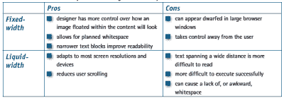

# 用 5 个步骤建立 phpBB 论坛

> 原文：<https://www.sitepoint.com/build-a-phpbb-forum/>

如果你想为你的网站建立一个论坛，你不需要从零开始。开源脚本 phpBB 可以很容易地安装在大多数 Web 服务器上。这篇文章将描述如何做好，从下载到定制。

要使用本教程，你不需要了解任何关于 PHP 的知识，只需要对数据库有最起码的经验。

##### phpBB 简介

phpBB 是一个稳定、开源的公告板脚本，可以从 phpbb.com 免费下载。它允许你建立无限数量的论坛和类别。可以创建具有不同权限的用户、版主和用户组。简而言之，它提供了你对公告板服务所期望的一切。有关所有支持功能的完整列表，请参见 phpbb.com/features 的[。](http://www.phpbb.com/features.php)

这个软件可以很容易地安装使用 FTP 和浏览器。它可以在任何支持 PHP 的服务器上运行，并需要以下任何一个数据库:MySQL、PostgreSQL、MS SQL 或通过 ODBC 访问。

不管您的服务器运行的是 IIS 还是 Apache，在 Apache Web 服务器上设置都要简单一些。任何网站管理员都应该能够在最短的时间内安装和配置 phpBB。

管理员界面允许持续维护，因此可以更改样式和添加或删除主题。事实上，任何行政职责都可以轻松执行。

phpBB 站点上提供的安装说明清晰明了。本文并不试图取代这些说明，而是对它们进行补充，并帮助不熟悉 PHP 的站点管理员。它将帮助您确定是否可以在您的服务器上运行 phpBB，如果可以，如何上传、安装和配置它。

##### 系统需求

由于 phpBB 是使用服务器端脚本语言 PHP 编写的，您需要知道您的 Web 服务器是否支持这种语言。

如果你不知道这个问题的答案，你可以随时询问你的网络主机，或者上传以下脚本到你的服务器。

```
<?php 

  phpinfo(); 

?>
```

使用任何文本编辑器来创建这个文件，并将其保存为 info.php。文件的实际名称不如扩展名. php 重要。在文本模式下，将该文件上传到服务器上的根目录。通过在浏览器中键入地址来查看。

如果您的服务器不支持 PHP，您将会看到上面显示的三行代码。在这种情况下，请联系您的 Web 主机，看看是否可以为您的域启用 PHP。

如果安装了 PHP，将显示 PHP 的配置设置。假设您的服务器上启用了 PHP，info.php 文件也将有助于确定您是否拥有 phpBB 所需的数据库支持。

根据您运行的 Web 服务器的不同，确认数据库对 phpBB 的支持略有不同。让我们首先看看使用 Apache 的 Web 服务器。

##### Apache/Linux

Apache 上的大多数 PHP 版本都支持 MySQL 数据库。您可以通过再次查看“info.php”文件来确认这一点。该文件的第三行应该是 Configure 命令。在这一行中，寻找单词`with-mysql`。

PostgreSQL 没有得到广泛的支持，但是您应该能够发现您的服务器是否以完全相同的方式支持它，而是寻找`with-pgsql`。

##### IIS/Windows

当 PHP 在 Windows 平台上运行时，没有 Configure 命令可用，所以我们将采用一种稍微不同的方法来确认数据库支持。再次查看 info.php 文件，从浏览器的菜单选项中选择查找，并搜索您的数据库类型。

例如，如果我们搜索`mssql`来确认对 MS SQL Server 的支持，我们应该会看到类似下面的文本:



同样，您可以使用搜索字符串`pgsql`测试 PostgreSQL，使用`mysql`测试 MySQL，使用`odbc`测试 ODBC 支持。

使用 info.php 文件来确定您拥有的数据库版本。当我们开始安装时，您需要知道这一点，并且，随着数据库和 PHP 支持的确认，我们现在可以开始这个过程。

##### 上传 phpBB 文件

假设您已经下载并解压缩了 phpBB 的文件，那么您需要上传的所有内容都应该在名为 phpBB2 的目录中。唯一真正的要求是保留目录结构。

使用您最喜欢的 FTP 程序将文件上传到您的服务器。确保所有非图形文件都以 ASCII 模式传输。大多数 FTP 程序会根据文件扩展名自动完成这项工作。确保您的软件配置为传输所有带有扩展名的文件。php，。第三方物流。公司。htm 和。cfg 作为文本文件。

上传完成后，更改 config.php 文件的权限，以便所有人都可以写入。如果你不知道怎么做，不用担心。该计划将让您选择保存一个新的 config.php 文件，然后覆盖原来的。

##### 准备安装

在准备在您的服务器上设置 phpBB 时，您需要以下信息:

*   数据库服务器主机名/DSN
*   数据库名称
*   数据库用户名
*   数据库密码
*   管理员电子邮件地址

在我们继续之前，让我们讨论一下这个信息。主机名将是托管数据库的域名。如果你的数据库和你的 Web 服务器在同一个服务器上，你只需要在这里输入`localhost`。如果它位于另一台服务器上，您可以输入适当的域名或 IP 地址。如果您使用 ODBC 连接，您将需要连接名。如果你对自己的情况不确定，请向你的虚拟主机澄清细节。

很简单，数据库名就是您计划使用的数据库的名称。您可以使用现有的数据库或创建一个新的数据库。要创建一个新的数据库，您可能需要再次与您的 Web 主机。如果您使用 MySQL 和 phpMyAdmin，那么这是一件相对简单的事情。如果您使用的是现有的数据库，那么创建的表名将带有一个独特的前缀，这样 phpBB 表就很容易识别。

用户名和密码不需要解释。管理电子邮件是您希望将与公告板相关的问题发送到的电子邮件地址。

##### 装置

有了所有的信息，安装就像把浏览器指向 installation 文件一样简单。如果您将 phpBB2 目录及其内容上传到服务器的根目录，那么您需要的路径是`http://www.<your domain>/phpBB2/install/install.php`。

填写文本框，然后按“开始安装”按钮。几秒钟内您就应该完成了—安装真的就这么简单。已经为您创建了所有必需的数据库表。如果你愿意，可以看看它们。总共应该有 29 个新表——我们甚至还没有考虑 SQL！

关闭浏览器，不要忘记删除名为 contrib 和 install 的目录。phpBB 不会运行，直到你这样做。如果在安装过程中，要求您下载“config.php”文件，您现在必须将它上传到 phpBB2 目录，覆盖现有文件。

##### 管理您的论坛

要管理您的公告板，请在浏览器中打开`http://www.<your domain>/phpBB2/index.php`，使用您在安装时指定的管理员名称和密码登录。然后，单击页面底部的“转到管理面板”链接。你可能想先去论坛管理>管理，建立一个新的论坛和类别。

Styles Admin 可能是您想要查看的下一个区域，但是在此之前，请访问 phpBB 站点，看看您可能还想下载哪些样式。安装时，phpBB 默认样式 subSilver 是唯一可用的样式，但是可以安装任意数量的样式。

在从 phpBB 站点下载它们之后，您需要将您的新样式上传到 Templates 目录，该目录位于 phpBB2 目录的正下方。在这之后，新的样式必须通过进入样式管理>添加从管理面板安装。

一旦你找到了你喜欢的主题，你可以在管理面板中选择风格管理>管理>编辑来定制它。您可以将主题与全新的级联样式表(CSS)相关联，也可以编辑现有的样式表。

##### 定制您的论坛

一旦你选定了一种风格，你无疑会想通过管理面板之外的方式进一步定制它。例如，您可能想要显示您自己的徽标，而不是 phpBB 徽标。

如果你对 HTML 有一定的了解，像这样的小改动并不太难。您希望对页眉外观进行的任何更改都可以通过更改名为 overall_header.tpl 的文件来解决。由于该文件包含在样式中的每一页中，因此您的更改将在整个公告栏中生效。

其他一些改变可能相对容易。例如，如果拥有用户组没有意义，可以简单地在 overall_header.tpl 文件中注释掉适当的代码。

请注意，phpBB 允许用户选择自己的样式，因此，除非您从 general configuration 菜单中选择覆盖用户选择的样式，否则任何已安装的模板都可供用户选择。如果你决定自定义样式，并且允许用户自己选择，你必须对每个样式模板进行适当的修改。你不应该做的一个改变是每页页脚的版权声明。

##### 结论

不费吹灰之力，你就在网站上安装了一个专业的公告板服务，不管你使用的是什么服务器，也不管你对 PHP 和数据库的了解程度如何。这个公告板的风格可以很容易地配置，以符合你的网站的其余部分的外观和感觉，所以给它一个尝试！

## 分享这篇文章