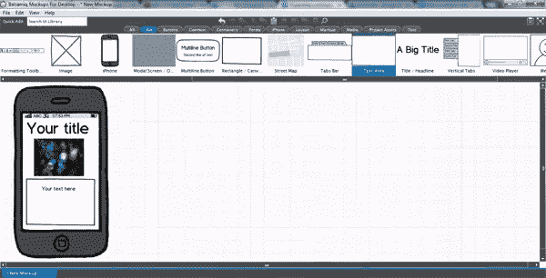
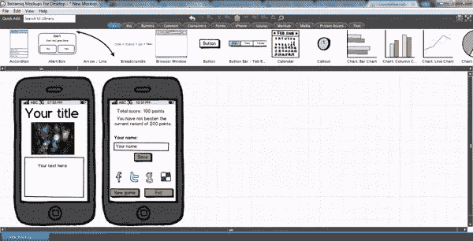
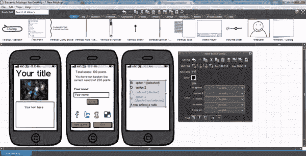

# 使用 Balsamiq 构建一个项目模型

> 原文：<https://www.sitepoint.com/build-a-project-mockup-using-balsamiq/>

一个好的设计师知道在开始一个新项目之前，最好先画一些草图。在我之前的文章 [，](https://www.sitepoint.com/create-a-mobile-mockup-with-codiqa/ "Create a Mobile Application Mockup with Codiqa")中，我描述了如何使用 Codiqa 工具集来调整和重新安排一个数字项目。在本文中，我将回顾另一个非常著名的在线工具 Balsamiq Mockups，将其与 Codiqa 进行比较，并强调它们的主要区别。

### 什么是 Balsamiq 模型？

Balsamiq 样机是一个工具，帮助开发人员创建线框，并通过其设计计划的可视化表示与客户和同事交流。与 Codiqa 不同，Balsamiq 是离线桌面软件。幸运的是，您可以使用自己选择的操作系统来使用它；它可以在 Mac、Windows 和 Linux 上运行。

Balsamiq 可以帮助你实时快速调整设计，提出一个故意粗糙和低保真度的设计(带有粗略的 UI 元素和手绘字体)，以鼓励尽可能多的反馈。该工具提供了多种方式来分享和征求对设计概念的反馈:模型可以导出为 PDF，常见的 PNG 图像也可以复制到剪贴板，以便您可以通过电子邮件或其他文档格式发送它们。

很像 Codiqa，Balsamiq 可以帮助你使用简单的拖放组件创建界面；该程序支持 75 个内置的用户界面组件和 187 个图标，以及由社区创建的大量附加组件。Balsamiq 模型也可以作为 Google Drive、Confluence、JIRA、FogBugz 和 XWiki 的插件使用。试用版仅持续七天，但您可以在整个时间段内使用它的全部功能。

### Balsamiq 模型如何工作

当你打开软件时，你会发现几个主要的类别将有助于创建你的设计模型。它们总共是十二个类别。第一个名为 All，正如您可能猜到的那样，包含了您在工作中可以使用的所有元素。其他类别包括:大、按钮、常用、容器、表单、iPhone、布局、标记、媒体、项目资源和文本。

让我们看看使用 Balsamiq 模型的元素可以做些什么。作为第一步，我放置了 iPhone 形状(这是唯一可用的形状，因此它代表了所有现代智能手机的轮廓)，并使用鼠标进行轻微调整来设置其大小。您会看到在图片的右侧有一个框，里面有编辑所选元素所需的所有工具。在这种情况下，您可以选择设备的方向、背景图案(如果您希望顶部切换栏出现)和分层。

现在，让我们在主页的风格上下功夫，确定我们想要在全新的主页上显示哪些元素。一般来说，我们可能会发现一个标题、一个页脚、一个菜单列表、一个内容文本框、一张图片或者一些链接。就像在 [Codiqa](https://www.sitepoint.com/create-a-mobile-mockup-with-codiqa/ "Create a Mobile Application Mockup with Codiqa") 中一样，该程序提供了一个简单、直观的拖放系统，只需点击几下就可以轻松添加你想要的一切。对于我们页面的第一个组件，我们必须打开名为“大”的类别在这里，我们将找到以下元素:标题、文本区域和图像框。因此，将这些拖放到您的模型中。此时，您的设计概念应该是这样的:

一旦您拖放了元素，您会看到每个元素都有广泛的编辑选项。当您点击标题或文本框时，您将看到一个典型的文本编辑器，您可以在其中指定特征或内容。您可以通过选择大小、文本对齐方式、格式和颜色来修改文本。您还可以设置背景颜色，设置边框颜色，添加滚动条，以及调整不透明度和焦点。对于图像，我们可以显示或隐藏边框，裁剪图像，并将选择的图像超链接到新的 URL 或屏幕。

让我们看看如何为游戏的最后一页创建一个模型，其中显示最终比分，提供图标通过社交媒体分享比分，并提供三个继续选项:保存、返回主页或退出游戏。首先，我们要复制我们手机的外形。然后，从“按钮”类别中拖放三个小矩形按钮(左起第一个形状)。之后，拖放一个图标，然后复制四次(我决定插入代表脸书、Twitter、Google+和 Delicious 的图标)。对剩下的三个图标重复同样的过程来完成我们的社交栏。

最后。让我们编辑我们的按钮。将它们的标题更改为“保存”、“新游戏”和“退出”。为每个页面添加一个链接，并根据您的风格更改颜色、字体和图标。此时，我们的工作应该如下所示:

让我们再举一个例子——假设您想要创建一个调查模型。我们将使用“所有”类别中的“单选按钮组”。对于所有这些表单元素，您可以更改颜色、大小、样式和相关的超链接。请查看以下内容，了解更好的健壮表单元素选项。

你可以在 Balsamiq 上快速构建任何你想要的线框。您将发现可以添加到模型中的许多其他组件，例如列表、菜单栏、进度条、手风琴、日历、图表、复选框、数据网格、表格、滚动条、对话框等等。

### Codiqa 和 Balsamiq 模型之间的区别

与 Codiqa 相比，Balsamiq 有一个更大的工作区域，允许用户同时在不同的页面上工作(Codiqa 没有，它限制了你想象整个应用程序的能力)。Balsamiq 还提供了更多的设计元素，因此可能性并不局限于 web 页面中最常见的组件。Codiqa 和 Balsamiq 都非常容易使用。这两个应用程序甚至可以被客户用来帮助他们阐明自己的想法。

### 结论

我们已经看到了 Balsamiq 模型是多么简单和直观，以及使用该软件创建模型有多快。您可以使用这些模型作为创建移动应用程序的结构和图形的起点，也可以使用它们来帮助您通过任何移动项目的困难的客户批准阶段。修改永远只是简单的点击，改变你的模型比改变一个完整的移动应用要容易得多。

## 分享这篇文章