# 构建一个 React 本地应用程序并使用 OAuth 2.0 进行身份验证

> 原文：<https://www.sitepoint.com/build-a-react-native-application-authenticate-with-oauth-2-0/>

*这篇文章最初发表在[Okta 开发者博客](https://developer.okta.com/blog/2018/03/16/build-react-native-authentication-oauth-2)上。感谢您对使 SitePoint 成为可能的合作伙伴的支持。*

有了 Okta 和 OpenID Connect (OIDC ),您可以轻松地将身份验证集成到 React 本机应用程序中，再也不用自己构建了。OIDC 允许您直接通过 [Okta API](https://developer.okta.com/product/) 进行身份验证，本文将向您展示如何在 React 本地应用程序中实现这一点。今天，您将看到如何通过 AppAuth 库使用 OIDC 重定向让用户登录 React 本机应用程序。

React Native 是一个非常灵活的框架。与 Ionic 和其他混合移动框架不同，它允许您使用 web 技术(React 和 JavaScript)来构建原生移动应用。不涉及浏览器或 WebView，因此使用 React Native 开发移动应用程序类似于使用 native SDK，因为您将在仿真器或设备上进行所有测试。没有办法像 Ionic 那样在你的浏览器中测试它。这是一个好处，因为你不必分别编写在浏览器和设备上运行的代码。

如果你看一下 Google Trends，你会发现 React Native 甚至比 Android 和 iOS 更受原生开发的欢迎！

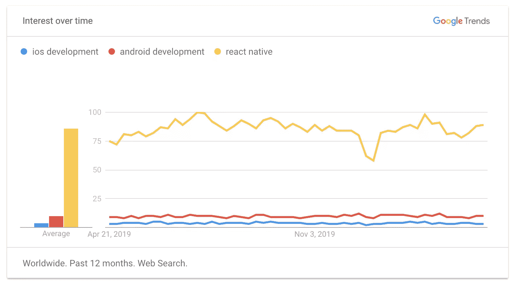

今天我将向大家展示如何用最新最好的版本开发一个 React 原生应用。在撰写本文时，这是 React 16.2.0 和 React Native 0.54.0。您将创建一个新的应用程序，添加 [AppAuth](https://appauth.io/) 进行身份验证，使用 Okta 进行身份验证，并看到它在 iOS 和 Android 上运行。

> AppAuth 是一个客户端 SDK，用于本地应用程序使用 OAuth 2.0 和 OpenID Connect 对最终用户进行身份验证和授权。它可用于 iOS、macOS、Android 和原生 JS 环境，为原生应用验证和授权实现了现代安全性和可用性最佳实践[。](https://tools.ietf.org/html/rfc8252)

## 创建您的 React 本机应用程序

React 有一个`create-react-app`命令行工具(CLI ),可以用来创建新的 React 应用。React Native 有一个类似的工具叫做 [Create React Native App](https://github.com/react-community/create-react-native-app) 。在你安装它之前，确保你已经安装了[节点](https://nodejs.org/) v6 或更高版本。

安装`create-react-native-app`并创建一个名为`okta-rn`的新项目:

```
npm install -g create-react-native-app
create-react-native-app okta-rn
cd okta-rn
npm start 
```

运行这些命令将导致您的终端提示您一些选项:

```
To view your app with live reloading, point the Expo app to this QR code.
You'll find the QR scanner on the Projects tab of the app.

[QR Code]

Or enter this address in the Expo app's search bar:

  exp://172.31.98.12:19000

Your phone will need to be on the same local network as this computer.
For links to install the Expo app, please visit https://expo.io.

Logs from serving your app will appear here. Press Ctrl+C at any time to stop.

 › Press a to open Android device or emulator, or i to open iOS emulator.
 › Press q to display QR code.
 › Press r to restart packager, or R to restart packager and clear cache.
 › Press d to toggle development mode. (current mode: development) 
```

如果你在苹果电脑上，按下 **i** 打开 iOS 模拟器。你会被提示安装/打开 Expo，然后呈现渲染过的`App.js`。

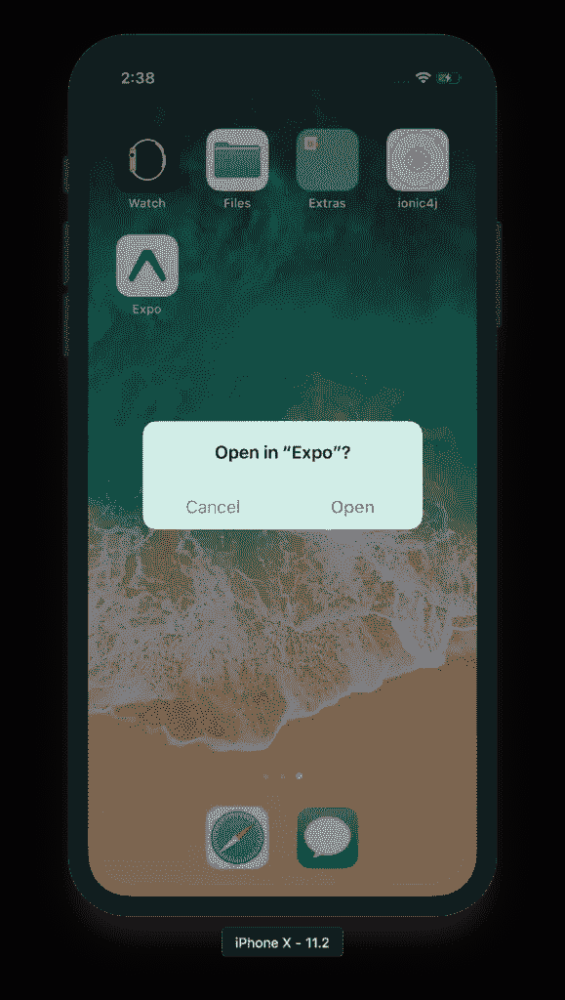

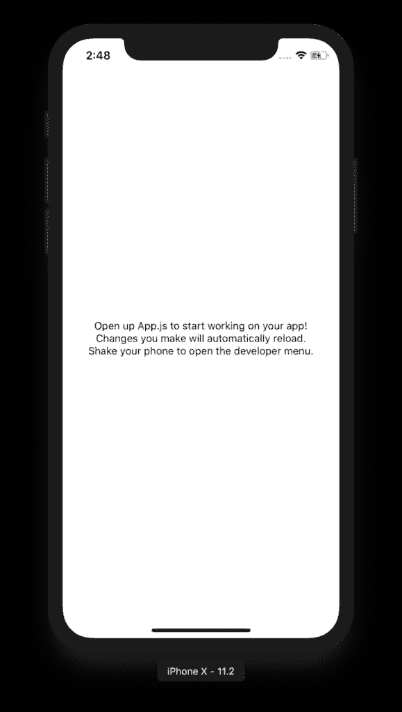

如果你用的是 Windows 或者 Linux，我建议你试试 Android 模拟器或者你的 Android 设备(如果你有的话)。如果它不工作，不要担心，稍后我会告诉你如何让它工作。

**提示:**你可以使用微软的[TypeScript React Native Starter](https://github.com/Microsoft/TypeScript-React-Native-Starter)在你的 React Native 应用中使用 TypeScript 代替 JavaScript。如果你决定走这条路，我建议你完成本教程后，按照以下步骤转换你的应用程序。

## React Native 和 OAuth 2.0

在这个例子中，我将使用由[强大的](http://formidable.com/)创建的库 [React Native App Auth](https://github.com/FormidableLabs/react-native-app-auth) 。我使用这个库的原因有三点:1)它们提供了一个优秀的[示例](https://github.com/FormidableLabs/react-native-app-auth/tree/master/Example)，我能够在几分钟内完成工作，2)它使用了 AppAuth(一个成熟的 OAuth 客户端实现)，3)我无法让其他任何东西工作。

*   我尝试了 [react-native-oauth](https://github.com/fullstackreact/react-native-oauth) ，但是发现在添加新的提供者之前，需要使用现有的提供者。我只想让 Okta 成为一个供应者。此外，大量的问题和拉取请求也是一个警告信号。
*   我尝试了 [react-native-simple-auth](https://github.com/adamjmcgrath/react-native-simple-auth) ,但是在让不推荐使用的 Navigator 组件与最新的 React Native 版本一起工作时遇到了问题。
*   我试着用 React Native 教程做这个 OAuth 2，但是在重定向回我的应用程序时遇到了问题。

### 在 Okta 中创建本地应用程序

在将 AppAuth 添加到 React 本机应用程序之前，您需要一个应用程序进行授权。如果你还没有一个免费的 Okta 开发者帐户，今天就去申请一个吧！

登录你的 Okta 开发者账号，导航到**应用** > **添加应用**。点击**原生**，点击**下一个**。给应用取一个你能记住的名字(如`React Native`)，除了默认的`Authorization Code`之外，选择`Refresh Token`作为授权类型。复制**登录重定向 URI** (例如`com.oktapreview.dev-158606:/callback`)并保存在某个地方。配置应用程序时，您将需要此值。

点击 **Done** ，您应该会在下一个屏幕上看到一个客户端 ID。复制并保存该值。

### 添加 React Native AppAuth 进行身份验证

您将需要“弹出”您的应用程序的本机配置，它通常由 create-react-native-app 隐藏。

```
npm run eject 
```

当提示回答问题时，请使用以下答案:

| 问题 | 回答 |
| --- | --- |
| 您希望如何从 create-react-native-app 退出？ | `React Native` |
| 你的应用在用户的主屏幕上应该是什么样子？ | `Okta RN` |
| 你的 Android Studio 和 Xcode 项目应该叫什么？ | `OktaRN` |

要为 React Native 安装 App Auth，请运行以下命令:

```
npm i react-native-app-auth@2.2.0
npm i
react-native link 
```

运行这些命令后，您必须[配置本地 iOS 项目](https://github.com/FormidableLabs/react-native-app-auth#setup)。为了您的方便，我复制了下面的步骤。

### iOS 设置

React Native App Auth 依赖于 [AppAuth-ios](https://github.com/openid/AppAuth-iOS) ，所以你要把它配置成依赖。最简单的方法是使用[椰子](https://guides.cocoapods.org/using/getting-started.html)。要安装 CocoaPods，请运行以下命令:

```
sudo gem install cocoapods 
```

在项目的`ios`目录中创建一个`Podfile`,将 AppAuth-ios 指定为依赖项。确保`OktaRN`与您在运行`npm run eject`时指定的应用程序名称相匹配。

```
platform :ios, '11.0'

target 'OktaRN' do
  pod 'AppAuth', '>= 0.91'
end 
```

然后从`ios`目录运行`pod install`。即使是在快速连接的情况下，第一次也可能需要一段时间。现在是喝杯咖啡或苏格兰威士忌的好时机！🥃

通过从`ios`目录运行`open OktaRN.xcworkspace`在 Xcode 中打开您的项目。

如果您打算支持 iOS 10 及更早版本，您需要在`ios/OktaRN/Info.plist`中定义支持的重定向 URL 方案，如下所示:

```
<key>CFBundleURLTypes</key>
<array>
  <dict>
    <key>CFBundleURLName</key>
    <string>$(PRODUCT_BUNDLE_IDENTIFIER)</string>
    <key>CFBundleURLSchemes</key>
    <array>
      <string>{yourReversedOktaDomain}</string>
    </array>
  </dict>
</array> 
```

下面是我更改应用程序标识符并添加此密钥后的样子。

```
<key>CFBundleIdentifier</key>
<string>com.okta.developer.reactnative.$(PRODUCT_NAME:rfc1034identifier)</string>
<key>CFBundleURLTypes</key>
<array>
  <dict>
    <key>CFBundleURLName</key>
    <string>$(PRODUCT_BUNDLE_IDENTIFIER)</string>
    <key>CFBundleURLSchemes</key>
    <array>
      <string>com.oktapreview.dev-158606</string>
    </array>
  </dict>
</array> 
```

打开 Xcode 项目中的`AppDelegate.h`(ok tarn>ok tarn>`AppDelegate.h`)，在下面添加旁边带有`+`的行。

```
+ @protocol OIDAuthorizationFlowSession;

  @interface AppDelegate : UIResponder <UIApplicationDelegate>
+ @property(nonatomic, strong, nullable) id<OIDAuthorizationFlowSession> currentAuthorizationFlow;
  @property (nonatomic, strong) UIWindow *window;
  @end 
```

该属性保存在重定向到 Okta 之前开始的授权流信息。Okta 授权你之后，重定向到传入的`redirect_uri`。

授权流程从一个`openURL()` app 委托方法开始。要添加它，打开`AppDelegate.m`并导入`AppAuth.h`。

```
#import "AppAuth.h" 
```

然后在类的底部(在`@end`之前)，添加`openURL()`方法。

```
- (BOOL)application:(UIApplication *)app
            openURL:(NSURL *)url
            options:(NSDictionary<NSString *, id> *)options {
  if ([_currentAuthorizationFlow resumeAuthorizationFlowWithURL:url]) {
    _currentAuthorizationFlow = nil;
    return YES;
  }
  return NO;
} 
```

## 构建您的 React 原生应用

用下面的 JavaScript 替换`App.js`中的代码。此代码允许您授权、刷新和撤销您的访问令牌。

```
import React, { Component } from 'react';
import { UIManager, LayoutAnimation } from 'react-native';
import { authorize, refresh, revoke } from 'react-native-app-auth';
import { Page, Button, ButtonContainer, Form, Heading } from './components';

UIManager.setLayoutAnimationEnabledExperimental &&
  UIManager.setLayoutAnimationEnabledExperimental(true);

const scopes = ['openid', 'profile', 'email', 'offline_access'];

type State = {
  hasLoggedInOnce: boolean,
  accessToken: ?string,
  accessTokenExpirationDate: ?string,
  refreshToken: ?string
};

const config = {
  issuer: 'https://{yourOktaDomain}/oauth2/default',
  clientId: '{clientId}',
  redirectUrl: 'com.{yourReversedOktaDomain}:/callback',
  additionalParameters: {},
  scopes: ['openid', 'profile', 'email', 'offline_access']
};

export default class App extends Component<{}, State> {
  state = {
    hasLoggedInOnce: false,
    accessToken: '',
    accessTokenExpirationDate: '',
    refreshToken: ''
  };

  animateState(nextState: $Shape<State>, delay: number = 0) {
    setTimeout(() => {
      this.setState(() => {
        LayoutAnimation.easeInEaseOut();
        return nextState;
      });
    }, delay);
  }

  authorize = async () => {
    try {
      const authState = await authorize(config);
      this.animateState(
        {
          hasLoggedInOnce: true,
          accessToken: authState.accessToken,
          accessTokenExpirationDate: authState.accessTokenExpirationDate,
          refreshToken: authState.refreshToken
        },
        500
      );
    } catch (error) {
      Alert.alert('Failed to log in', error.message);
    }
  };

  refresh = async () => {
    try {
      const authState = await refresh(config, {
        refreshToken: this.state.refreshToken
      });

      this.animateState({
        accessToken: authState.accessToken || this.state.accessToken,
        accessTokenExpirationDate:
          authState.accessTokenExpirationDate || this.state.accessTokenExpirationDate,
        refreshToken: authState.refreshToken || this.state.refreshToken
      });
    } catch (error) {
      Alert.alert('Failed to refresh token', error.message);
    }
  };

  revoke = async () => {
    try {
      await revoke(config, {
        tokenToRevoke: this.state.accessToken,
        sendClientId: true
      });
      this.animateState({
        accessToken: '',
        accessTokenExpirationDate: '',
        refreshToken: ''
      });
    } catch (error) {
      Alert.alert('Failed to revoke token', error.message);
    }
  };

  render() {
    const {state} = this;
    return (
      <Page>
        {!!state.accessToken ? (
          <Form>
            <Form.Label>accessToken</Form.Label>
            <Form.Value>{state.accessToken}</Form.Value>
            <Form.Label>accessTokenExpirationDate</Form.Label>
            <Form.Value>{state.accessTokenExpirationDate}</Form.Value>
            <Form.Label>refreshToken</Form.Label>
            <Form.Value>{state.refreshToken}</Form.Value>
          </Form>
        ) : (
          <Heading>{state.hasLoggedInOnce ? 'Goodbye.' : 'Hello, stranger.'}</Heading>
        )}

        <ButtonContainer>
          {!state.accessToken && (
            <Button onPress={this.authorize} text="Authorize" color="#017CC0"/>
          )}
          {!!state.refreshToken && <Button onPress={this.refresh} text="Refresh" color="#24C2CB"/>}
          {!!state.accessToken && <Button onPress={this.revoke} text="Revoke" color="#EF525B"/>}
        </ButtonContainer>
      </Page>
    );
  }
} 
```

确保根据您的设置调整`config`。

```
const config = {
  issuer: 'https://{yourOktaDomain}/oauth2/default',
  clientId: '{clientId}',
  redirectUrl: 'com.{yourReversedOktaDomain}:/callback',
  ...
}; 
```

将`index.js`更改为使用`OktaRN`作为您的应用程序名称。

```
AppRegistry.registerComponent('OktaRN', () => App); 
```

这段代码使用了[样式化组件](https://github.com/styled-components/styled-components)，因此您需要将其作为依赖项安装。

**注意:**在运行下面的命令之前，确保导航到项目的根目录。

```
npm i styled-components 
```

然后将`components`目录复制到您的项目根目录中。

```
svn export https://github.com/FormidableLabs/react-native-app-auth/trunk/Example/components 
```

抓取在`Page.js`组件中引用的背景图像。

```
svn export https://github.com/FormidableLabs/react-native-app-auth/trunk/Example/assets 
```

### 在 iOS 模拟器上运行

使用`npm run ios`运行您的应用程序。

你应该会看到一个屏幕，上面写着“你好，陌生人。”点击**授权**，系统会提示您是继续还是取消。

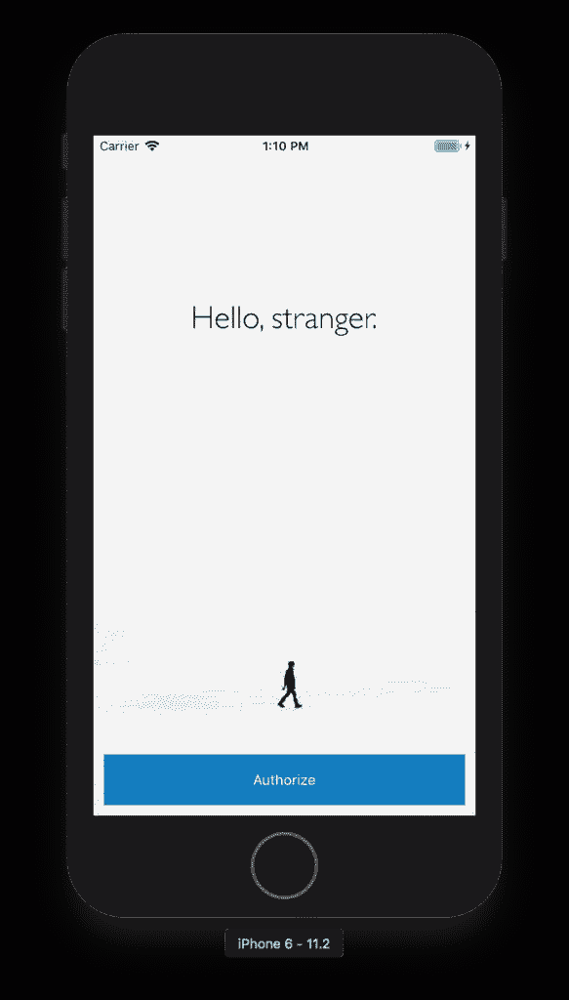

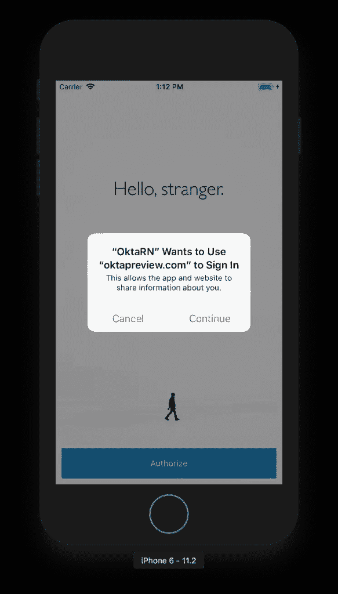

点击**继续**，你应该会看到一个 Okta 签到表。输入您的凭证，您将被重定向回应用程序。

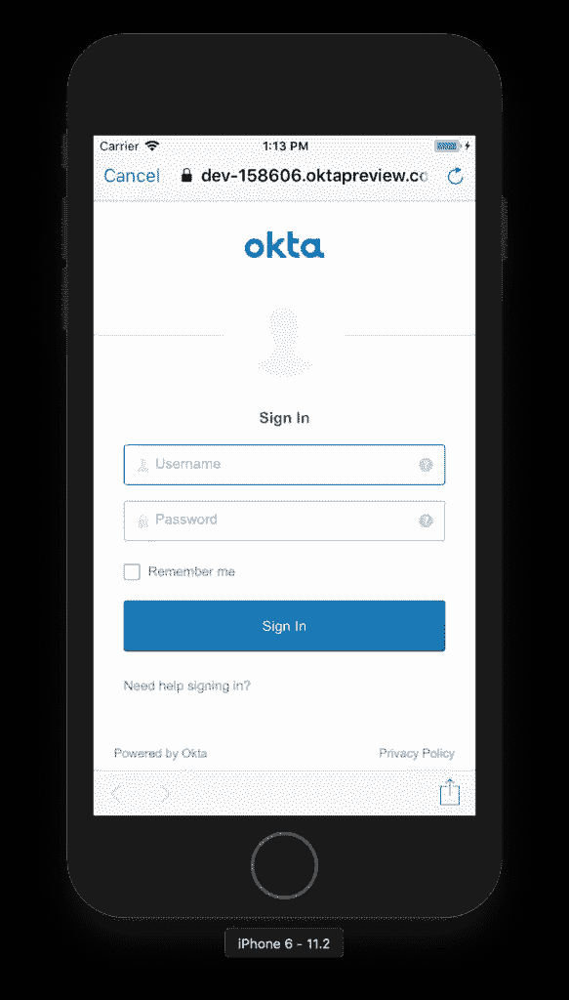

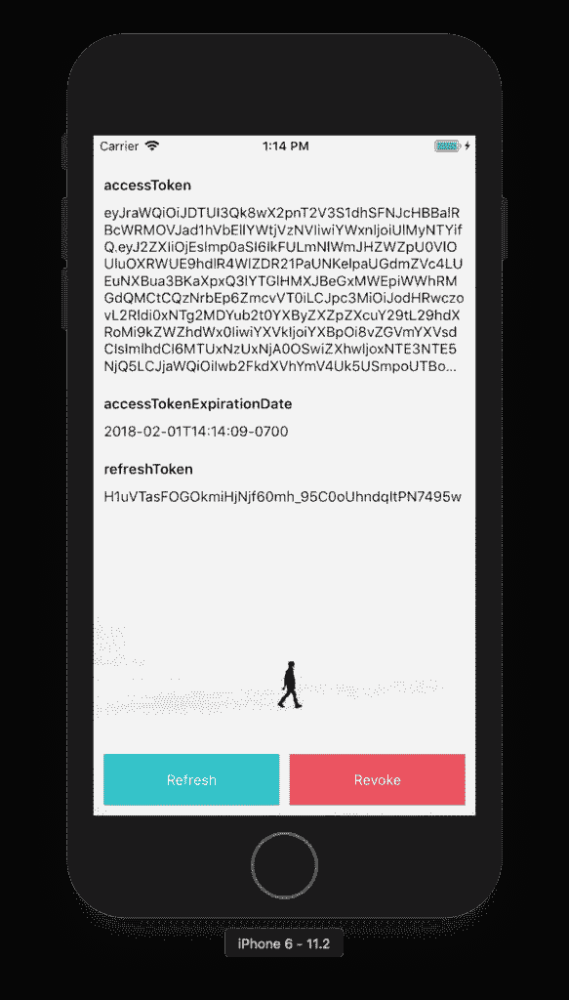

您可以单击**刷新**来观察访问令牌的值和到期日期的变化。

**提示:**如果 iOS 模拟器中动画出现缓慢，切换**调试** > **缓慢动画**。

### Android 设置

要配置原生 Android 项目，首先要升级它使用的 Gradle 版本。

```
cd android
./gradlew wrapper --gradle-version 4.6 
```

React Native App Auth for Android 依赖于 [AppAuth-android](https://github.com/openid/AppAuth-android) ，但是你需要在你的项目中添加正确的 Android 支持库版本。

将 Google Maven 存储库添加到您的`android/build.gradle`中，并升级 Android 工具依赖性:

```
buildscript {
    repositories {
        jcenter()
        google()
    }
    dependencies {
        classpath 'com.android.tools.build:gradle:3.0.1'
    }
} 
```

将`android/app/build.gradle`中的`appcompat`依赖项升级到`25.3.1`，以匹配 AppAuth 期望的依赖项。

```
dependencies {
  compile "com.android.support:appcompat-v7:25.3.1"
} 
```

移除`buildToolsVersion "23.0.1"`,因为不再需要。

更新`compileSdkVersion`:

```
android {
  compileSdkVersion 25
} 
```

将`appAuthRedirectScheme`属性添加到`android/app/build.gradle`中的`defaultConfig`:

```
android {
  defaultConfig {
    ...
    manifestPlaceholders = [
      appAuthRedirectScheme: '{yourReversedOktaDomain}'
    ]
  }
} 
```

做了这个改动后，我的`defaultConfig`如下图。

```
defaultConfig {
    applicationId "com.oktarn"
    minSdkVersion 16
    targetSdkVersion 22
    versionCode 1
    versionName "1.0"
    ndk {
        abiFilters "armeabi-v7a", "x86"
    }
    manifestPlaceholders = [
        appAuthRedirectScheme: 'com.oktapreview.dev-158606'
    ]
} 
```

### 在 Android 上运行

要在 Android 模拟器上尝试，运行`npm run android`。如果您没有接通电话或运行 Android 虚拟设备(AVD ),您会看到一个错误:

```
* What went wrong:
Execution failed for task ':app:installDebug'.
> com.android.builder.testing.api.DeviceException: No connected devices! 
```

要解决这个问题，打开 Android Studio，选择**打开现有项目**，并选择项目中的`android`目录。如果提示您更新任何内容，请批准它。

要创建新的 AVD，导航到**工具** > **安卓** > **AVD 管理器**。创建一个新的虚拟设备，然后单击播放。我选择了像素 2，你可以从下面我的设置中看到。

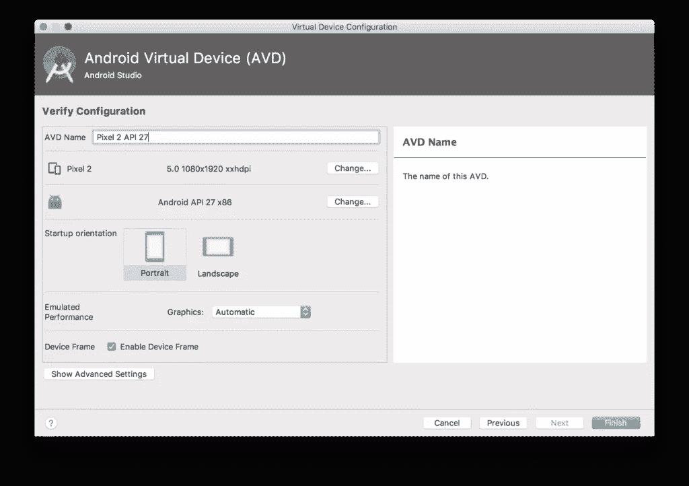

再次运行`npm run android`。您应该会看到一个欢迎屏幕，并能够成功授权。


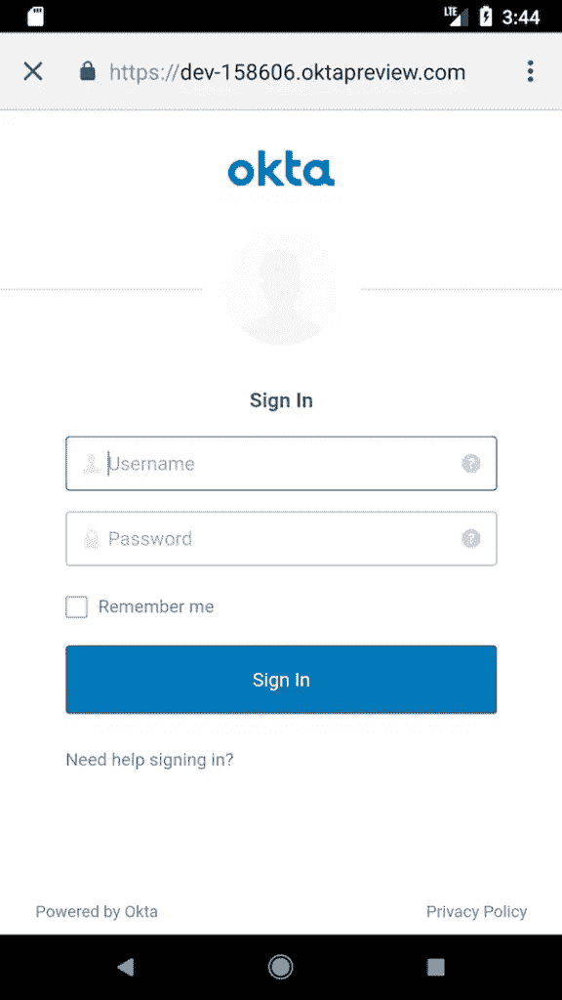

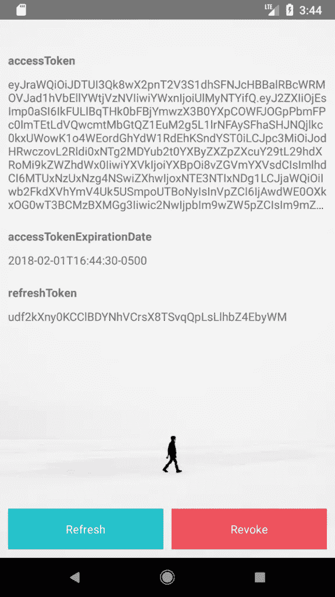

**提示:**修复`Configuration 'compile' in project ':app' is deprecated. Use 'implementation' instead.`，将`dependencies`下的`compile`改为`implementation`。更多信息可以在[Gradle 3 . 0 . 0](https://developer.android.com/studio/build/gradle-plugin-3-0-0-migration.html)迁移到 Android 插件中找到。

### 升级至 React Native 的最新版本

react-native-git-upgrade 工具是升级项目以使用最新版本的便捷方式。安装并运行它。

```
npm i -g react-native-git-upgrade
react-native-git-upgrade
npm i 
```

或者，你可以把你的`package.json`改成`"react-native": "0.54.2"`，然后运行`npm i`。

### 获取并查看 ID 令牌

如果除了访问令牌之外，您还想获得一个 ID 令牌，那么添加`idToken`作为类型`State`的属性，并在`App.js`中添加`state`变量。

```
type State = {
  ...
  idToken: ?string
};

export default class App extends Component<{}, State> {
  ...
  state = {
    ...
    idToken: ''
  }; 
```

然后更新`authorize()`方法来设置`authState`的属性。您将希望在`refresh()`和`revoke()`方法中添加类似的逻辑。

```
authorize = async () => {
  try {
    const authState = await authorize(config);
    this.animateState(
      {
        hasLoggedInOnce: true,
        accessToken: authState.accessToken,
        accessTokenExpirationDate: authState.accessTokenExpirationDate,
        refreshToken: authState.refreshToken,
        idToken: authState.idToken
      },
      500
    );
  } catch (error) {
    Alert.alert('Failed to log in', error.message);
  }
}; 
```

要查看你的 ID 令牌里有什么，安装[缓冲区](https://www.npmjs.com/package/buffer)。

```
npm i buffer 
```

在`App.js`顶部导入。

```
import { Buffer } from 'buffer'; 
```

然后改`render()`方法解码。

```
render() {
  const {state} = this;
  if (state.idToken) {
    const jwtBody = state.idToken.split('.')[1];
    const base64 = jwtBody.replace('-', '+').replace('_', '/');
    const decodedJwt = Buffer.from(base64, 'base64');
    state.idTokenJSON = JSON.parse(decodedJwt);
  }
  ... 
```

最后，在显示访问令牌的行之后添加一个`<Form.Label>`和`<Form.Value>`行。

```
<Form.Label>ID Token</Form.Label>
<Form.Value>{JSON.stringify(state.idTokenJSON)}</Form.Value> 
```

运行`npm run ios`(或`npm run android`)，在 Okta 授权后，您应该会看到 ID 令牌中的声明。下面是一个截图，证明它在 iOS 模拟器中工作。

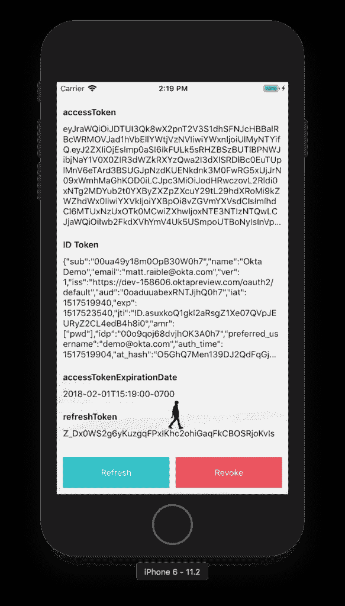

### 使用您的访问令牌调用 API

现在您有了一个访问令牌，您可以用它做什么呢？你可以用它在一个`Authorization`头中调用一个 Okta 保护的 API！

我在与 Spring Boot 和 React 的 [Bootiful 开发中写过如何创建一个“好啤酒”API。您可以使用该应用程序的后端来证明它是有效的。](https://developer.okta.com/blog/2017/12/06/bootiful-development-with-spring-boot-and-react)

从 GitHub 克隆项目并检查`okta`分支。

```
git clone https://github.com/oktadeveloper/spring-boot-react-example.git
git checkout okta 
```

修改`spring-boot-react-example/server/src/main/resources/application.properties`来设置`issuer`和`clientId`。

```
okta.oauth2.issuer=https://{yourOktaDomain}/oauth2/default
okta.oauth2.clientId={clientId} 
```

**注意:**您需要安装 [Java 8](http://www.oracle.com/technetwork/java/javase/downloads/jdk8-downloads-2133151.html) 来运行这个 Spring Boot 应用程序。

从`server`目录运行`./mvnw`启动应用程序。

回到 React Native 客户端。在`App.js`中，添加`beers`作为`state`的属性。

```
state = {
  ...
  beers: []
}; 
```

在`revoke()`方法中将其设置为相同的值。添加一个使用访问令牌调用后端的`fetchGoodBeers()`方法。

```
fetchGoodBeers = async () => {
  if (this.state.beers.length) {
    // reset to id token if beers is already populated
    this.animateState({beers: []})
  } else {
    fetch('http://localhost:8080/good-beers', {
      headers: {
        'Authorization': `Bearer ${this.state.accessToken}`
      }
    }).then(response => response.json())
      .then(data => {
        this.animateState({beers: data})
      })
      .catch(error => console.error(error));
  }
}; 
```

**提示:**为了在 Android 模拟器(和真实的手机)上运行，你需要将`localhost`改为你的 IP 地址。

在底部的`<ButtonContainer>`中，添加一个“Good Beers”按钮，允许您调用 API，并再次按下它以查看 ID 令牌。

```
{!!state.accessToken && <Button onPress={this.fetchGoodBeers} text={!this.state.beers.length ? 'Good Beers' : 'ID Token'} color="#008000" />} 
```

修改显示 ID 标记的行，以显示来自 API 的 JSON。

```
<Form.Label>{state.beers.length ? 'Good Beers' : 'ID Token'}</Form.Label>
<Form.Value>{JSON.stringify(state.beers.length ? state.beers : state.idTokenJSON)}</Form.Value> 
```

在 iOS 模拟器中，按下 **Command + R** 来重新加载所有东西，当你点击 **Good Beers** 按钮时，你应该会看到 JSON。可以在 Android 中使用 **Command + M** (在 Mac 上， **CTRL + M** 在其他操作系统上)重新加载。

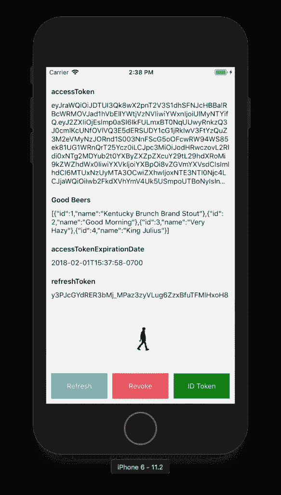

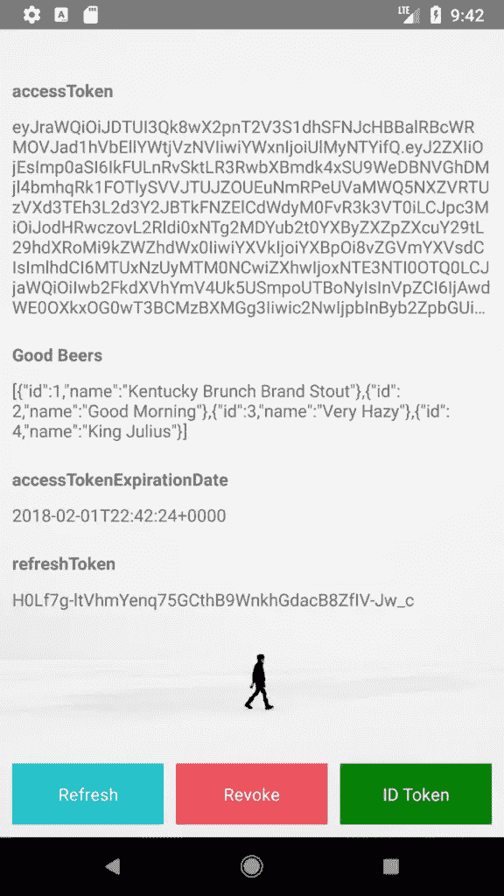

**注意:**react-native-app-auth 中有一个[未解决的问题，关于撤销不能与 Okta 一起工作，因为没有发送`Authorization`报头。](https://github.com/FormidableLabs/react-native-app-auth/issues/70)

## 了解有关 React Native 和 React 的更多信息

我希望您喜欢这个关于如何使用 Okta 和 React Native 进行身份验证的旋风之旅。你可以在 React Native 的官方网站上了解更多信息。你也可以在 GitHub 上添加到它的大约 60K 颗星星[。](https://github.com/facebook/react-native)

你可以在[https://github . com/okta developer/okta-react-native-app-auth-example](https://github.com/oktadeveloper/okta-react-native-app-auth-example)找到这个应用的源代码。

如果您有兴趣了解如何使用 Okta 进行常规 React 开发，我鼓励您查看以下资源:

*   [在 15 分钟内构建带有用户认证的 React 应用](https://developer.okta.com/blog/2017/03/30/react-okta-sign-in-widget)
*   [构建带认证的 Preact 应用](https://developer.okta.com/blog/2017/10/19/build-a-preact-app-with-authentication)
*   [与 Spring Boot 和 React 的良好发展](https://developer.okta.com/blog/2017/12/06/bootiful-development-with-spring-boot-and-react)

如果你对这篇文章有任何问题，请在 Twitter 上联系我。

## 分享这篇文章