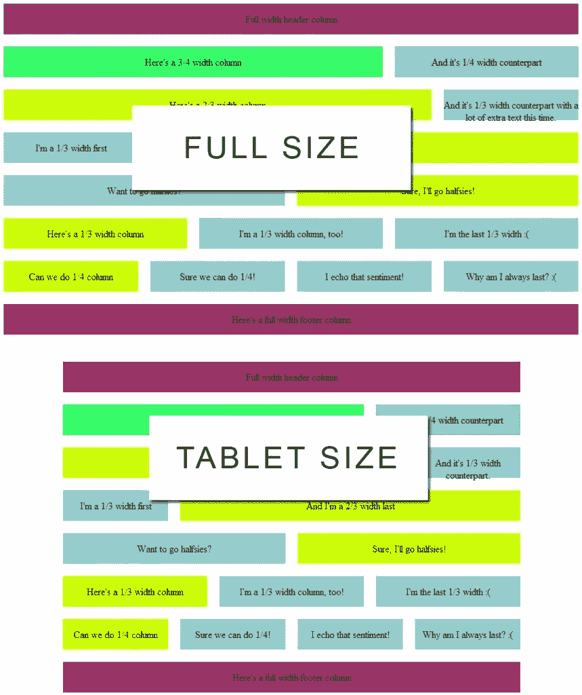
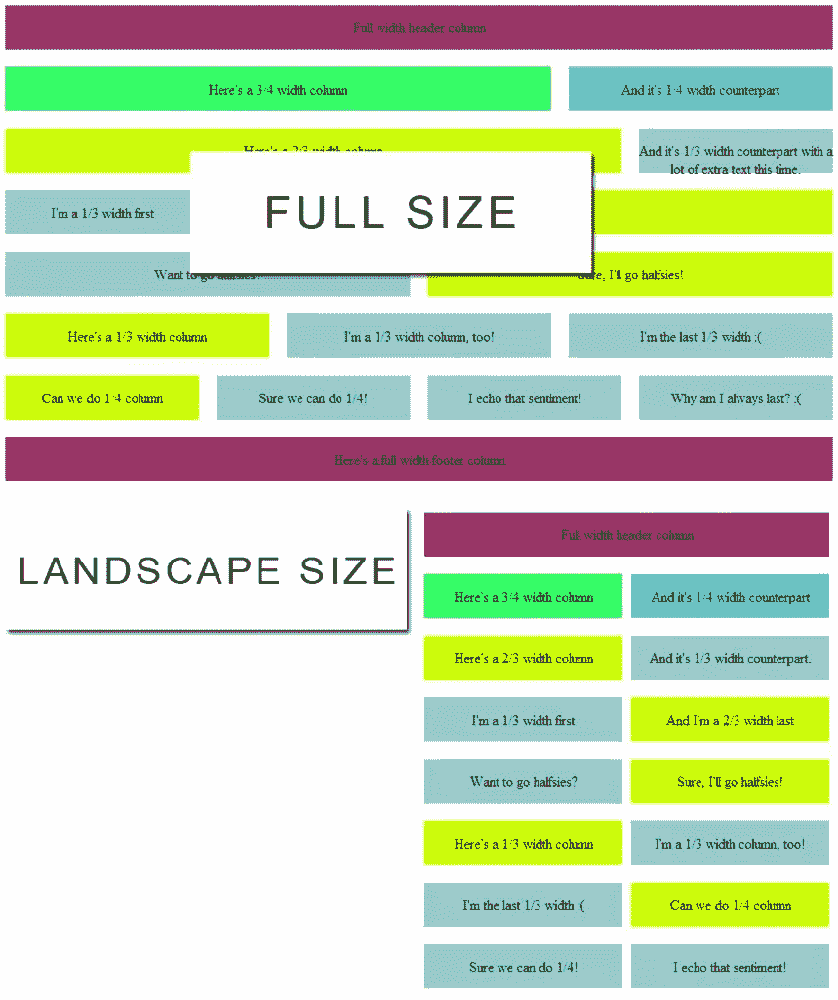
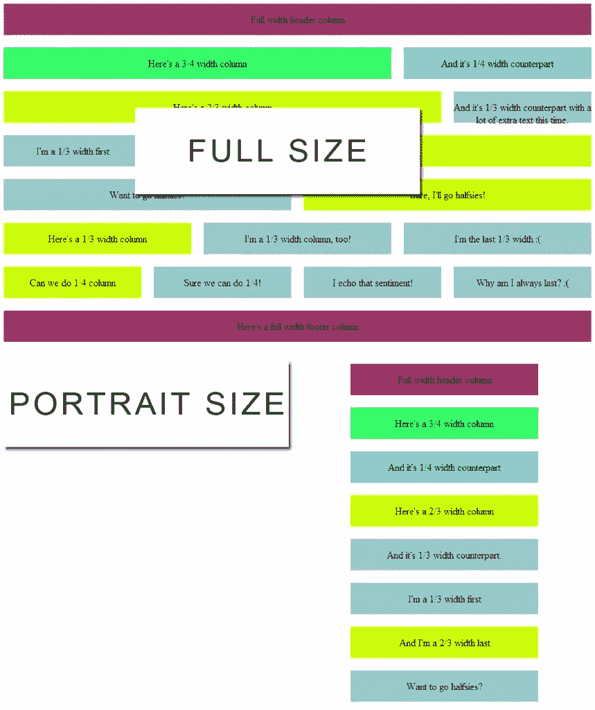

# 使用 960 网格构建响应式设计

> 原文：<https://www.sitepoint.com/build-a-responsive-design-using-960-grid/>

在最近的一篇文章中，我详细介绍了如何设计一个围绕 960 像素网格的 12 列主题。在这篇文章中，我们将升级我们的主题概念，并使整个事情具有响应性。

我所说的响应，是指各种列宽将适应屏幕大小，并保持你的内容有条理。这使得任何屏幕尺寸的用户都能看到一致的外观和感觉。

Responsive 与 fluid 的不同之处在于，它遍历各种屏幕尺寸并锁定列宽。内容将以这种方式一致地显示，让您的站点访问者获得一致的外观和感觉。

我避免流畅的布局，主要是因为我没有太多的控制力——而且当谈到布局时，我有点控制狂。记住，一旦你知道你在做什么，这个系统很容易被修改。

### 为什么是响应式设计？

首先也是最重要的，我讨厌去我手机上没有响应的网站，因为我必须挤压、捏和旋转我的屏幕来找到网站的最佳位置。通常内容很难看到，文本很小，图形也很难看到。

第二，我也讨厌当一个网站有一个“移动”版本被剥离下来。我的客户讨厌管理一个网站的两个不同版本，就像我讨厌查看它们一样。移动版本也给搜索引擎带来了问题，可能会导致重大问题。

简而言之，响应式设计解决了很多问题，而且一旦到位，维护起来也很简单。

### 通过媒体查询扩展 960°网格

媒体查询是 CSS 的一个惊人特性，它允许浏览器检测站点访问者使用的屏幕大小。然后，基于检测到的屏幕尺寸，CSS 可以被特别地递送以适合当前的约束。

这就是我们将要做的——创建一组特定于用户屏幕大小的 CSS。使用媒体查询，我们可以很好地策划这一点，并给自己近乎无限的控制布局。

这是我们将要工作的框架。您可以根据自己的需要对其进行修改，以增加或减少屏幕尺寸:

[sourcecode language="css"]

。img {宽度:100%；}

/*媒体查询之前的所有内容
应用于大于 960 像素的屏幕尺寸*/

/*****************/
/*媒体查询*/
/* * * * * * * * * * * * * * */

/*平板电脑屏幕尺寸*/
@纯媒体屏幕和(最小宽度:768 像素)和(最大宽度:959 像素){

}

/*手机横向屏幕尺寸*/
@媒体专用屏幕(最小宽度:480 像素)和(最大宽度:767 像素){

}
/*移动端口屏幕尺寸*/
@仅媒体屏幕和(最大宽度:479 像素){

}

[/sourcecode]

我们来分解一下这个 CSS 是干什么的。首先，我们确保图像将缩放到其容器宽度的 100%,这对于确保图像根据各种媒体屏幕尺寸调整大小很重要。

然后，我们声明@media screen，这意味着大括号内的代码将只适用于屏幕大小。印刷是另一个主要媒体，你可以声明单独的 CSS 来处理，但 3D 眼镜是另一个例子，我们可能会看到更多…

接下来，我们建立最小和最大宽度。这就像一个 IF 语句——如果以像素为单位的宽度介于其中一个范围之间，则应用下面的 CSS。

基于以上所述，我们的风格级联如下:

1.  媒体查询上面的所有样式都会被应用
2.  如果屏幕宽度大于 768 像素但小于 959 像素
3.  如果屏幕宽度大于 480 像素但小于 767 像素
4.  如果屏幕宽度小于 479 像素

同样，您可以将其分成或多或少的块，但这是一种相当标准的方式。

### 向 960 网格添加平板电脑屏幕尺寸

现在，让我们构建我们希望我们的站点能够容纳的各种大小。对于平板电脑大小的屏幕(768px-959px)，我只是将列的尺寸缩小了 80%:

[sourcecode language="css"]

/*平板电脑屏幕尺寸*/
@纯媒体屏幕和(最小宽度:768 像素)和(最大宽度:959 像素){

/*调整 body 大小*/
body { min-width:767 px；}

/*调整行的大小*/
。行{宽度:767px}

/*调整列的大小*/
。col _ 12 { width:748 px；}
。col _ 9 { width:492 px；}
。col _ 8 { width:556 px；}
。col _ 6 { width:364 px；}
。col _ 4 { width:172 px；}
。col _ 3 { width:236 px；}

}

[/sourcecode]

首先，我们将主体的大小调整到最小宽度，并获取。行宽度固定为 767 像素。这确保了页面的总宽度是固定的，只要屏幕符合该媒体查询的标准。其他列只是主要大小的 80%。

 
*(点击观看全尺寸版)*

### 添加横向屏幕尺寸

对于风景，我决定让三分之一、三分之二、四分之一和四分之三都等于一半。你可能想改变这一点。

请记住，您总是可以内联声明 CSS，因此，如果您希望某个特定的

是第三个，旁边有三分之二，您可以在媒体查询中手动这样做——只需给那些 div 一个唯一的 ID。

这是我如何改变它的，以及它与全尺寸相比的样子:

[sourcecode language="css"]

/*手机横向屏幕尺寸*/
@媒体专用屏幕(最小宽度:480 像素)和(最大宽度:767 像素){

/*调整 body 大小*/
body { min-width:479 px；}

/*调整行的大小*/
。行{宽度:479px}

/*调整列的大小*/
。col _ 12 { width:460 px；}
。col _ 9 { width:225 px；}
。col _ 8 { width:225 px；}
。col _ 6 { width:225 px；}
。col _ 4 { width:225 px；左边距:0px}
。col _ 3 { width:225 px；左边距:0px}

/*修复。上一期*/
。last {
左边距:0；
右边距:10px
}

}

[/sourcecode]

 
*(点击观看全尺寸版)*

正如你所看到的，所有的东西都落入漂亮整洁的半宽小格子里。

### 添加纵向屏幕尺寸

最后，对于最小的砂浆尺寸，我做了全幅。这使得查看更加容易，并最大限度地减少了需要在站点范围内进行的更改:

[sourcecode language="css"]

/*手机纵向屏幕尺寸*/
@媒体专用屏幕和(最大宽度:479 像素){

/*调整 body 大小*/
body { min-width:320 px；}

/*调整行的大小*/
。行{宽度:320px}

/*调整列的大小*/
。col _ 12 { width:300 px；}
。col _ 9 { width:300 px；}
。col _ 8 { width:300 px；}
。col _ 6 { width:300 px；}
。col _ 4 { width:300 px；左边距:0px}
。col _ 3 { width:300 px；左边距:0px}

/*修复。上一期*/
。last {
左边距:0；
右边距:10px
}
}

[/sourcecode]

 
*(点击观看全尺寸版)*

同样，在逐个分区的基础上，您总是可以添加一个 ID，并为这些分区创建一组唯一的大小。

### 把所有的放在一起

这是你可以使用的完整 CSS 和 HTML 模板:

[sourcecode language="css"]

/*固定正文宽度*/
正文{
min-width:960 px；
保证金:汽车；
}

/*包装*/
。row {
宽度:960px
保证金:汽车；
}

/*列边距*/
。col_12，/*全宽*/
。col_9，/* 3/4 宽度*/
。col_8，/* 2/3 宽度*/
。col_6，/*半宽*/
。col_4，/* 1/3 宽度*/
。col_3 /* 1/4 width */
{
左边距:10px
右边距:10px
显示:内嵌；
浮动:左；
}

/*名和姓*/
。第一个{
左边距:0；
}

。last {
右边距:0；
}

/*考虑边距的列宽*/
。col _ 12 { width:940 px；}
。col _ 9 { width:620 px；}
。col _ 8 { width:700 px；}
。col _ 6 { width:460 px；}
。col _ 4 { width:220 px；}
。col _ 3 { width:300 px；}

img {宽度:100%；}

/*****************/
/*媒体查询*/
/* * * * * * * * * * * * * * */

/*平板电脑屏幕尺寸*/
@媒体专用屏幕和(最小宽度:768px)和(最大宽度:959px) {
/*调整机身大小*/
机身{最小宽度:767px}

/*调整行的大小*/
。行{宽度:767px}

/*调整列的大小*/
。col _ 12 { width:748 px；}
。col _ 9 { width:492 px；}
。col _ 8 { width:556 px；}
。col _ 6 { width:364 px；}
。col _ 4 { width:172 px；}
。col _ 3 { width:236 px；}

}

/*手机横向屏幕尺寸*/
@媒体专用屏幕和(最小宽度:480px)和(最大宽度:767px) {
/*调整机身大小*/
机身{最小宽度:479px}

/*调整行的大小*/
。行{宽度:479px}

/*调整列的大小*/
。col _ 12 { width:460 px；}
。col _ 9 { width:225 px；}
。col _ 8 { width:225 px；}
。col _ 6 { width:225 px；}
。col _ 4 { width:225 px；左边距:0px}
。col _ 3 { width:225 px；左边距:0px}

/*修复。上一期*/
。last {
左边距:0；
右边距:10px
}

}

/*移动端口屏幕尺寸*/
@媒体专用屏幕和(最大宽度:479px) {
/*调整正文大小*/
正文{最小宽度:320px}

/*调整行的大小*/
。行{宽度:320px}

/*调整列的大小*/
。col _ 12 { width:300 px；}
。col _ 9 { width:300 px；}
。col _ 8 { width:300 px；}
。col _ 6 { width:300 px；}
。col _ 4 { width:300 px；左边距:0px}
。col _ 3 { width:300 px；左边距:0px}

/*修复。上一期*/
。last {
左边距:0；
右边距:10px
}
}

[/sourcecode]

并且您的 HTML 模板要求 CSS 文档在同一个文件夹中(参见 HTML 的第 6 行):

[sourcecode language="html"]

<html>
head>
<meta http-equiv = " Content-Type " Content = " text/html；charset=utf-8" / >
<标题>示例 960，12 列网格布局</标题>
<link rel = " style sheet " type = " text/CSS " href = " 960-12-col . CSS "/>
<样式>
/*列边距*/
。col_12，/*全宽*/
。col_9，/* 3/4 宽度*/
。col_8，/* 2/3 宽度*/
。col_6，/*半宽*/
。col_4，/* 1/3 宽度*/
。col_3 /* 1/4 宽度*/
{
高度:50px
margin-top:10px；
边距-底部:10px
文本对齐:居中；
显示:表格单元；
垂直对齐:居中；
}
</样式>
</头像>

div class = " col _ 12 first " style = " background-color:# 936> < p >全角标题列<！––>

下面是一个 3/4 宽度的列

< 2/3 宽度列

并且是 1/3 宽度对应。 

我是 1/3 宽度的 first

当然，我对半分！

下面是 1/3 宽度的列< /p > < /div >

我是最后 1/3 宽度:(

我附和那种情绪！

为什么我总是最后一个？:(

下面是一个全角页脚列< /p > < /div

我希望你喜欢这篇关于构建自己的响应式 HTML/CSS 设计的介绍。接下来还有更多！

## 分享这篇文章