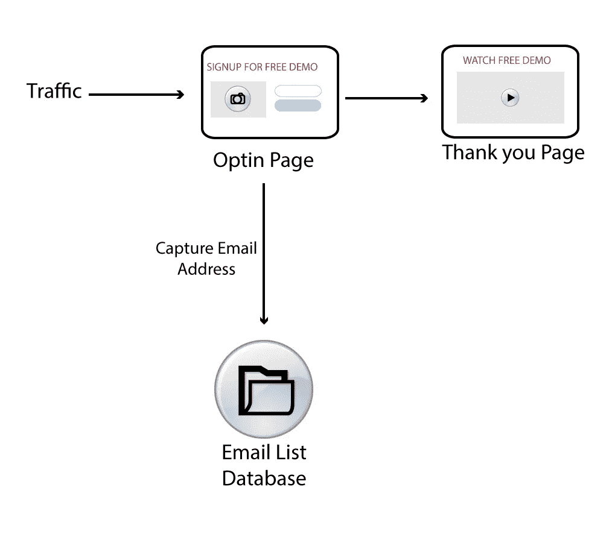
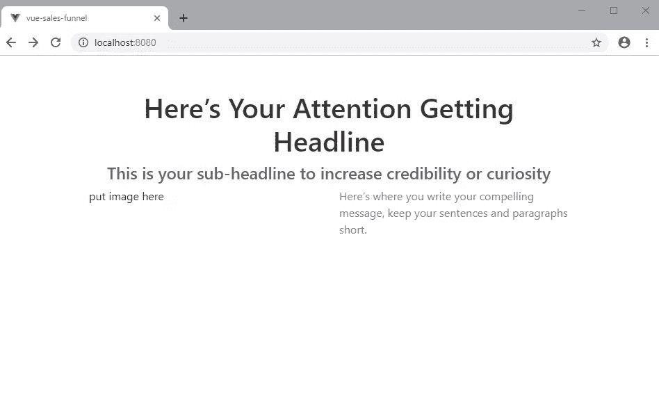
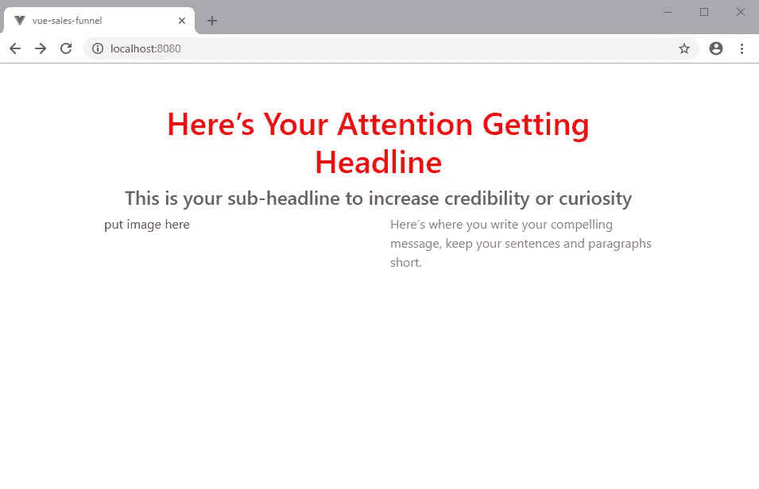
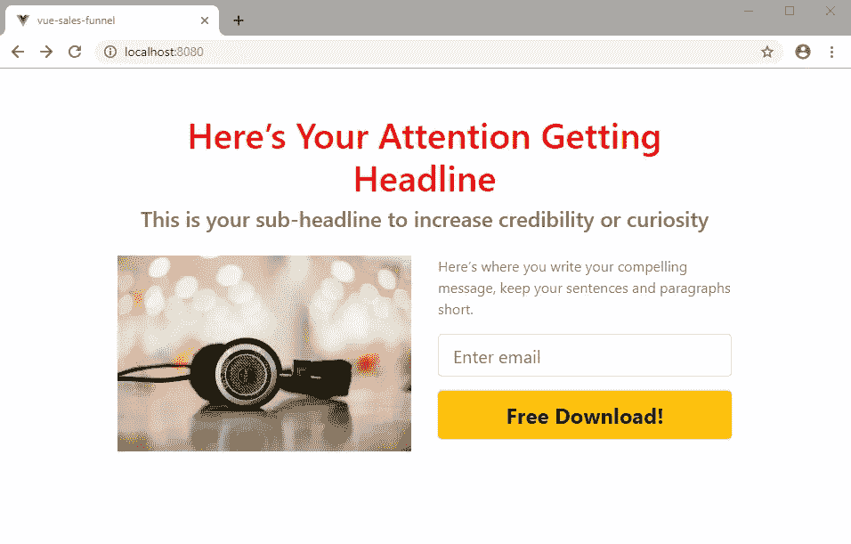
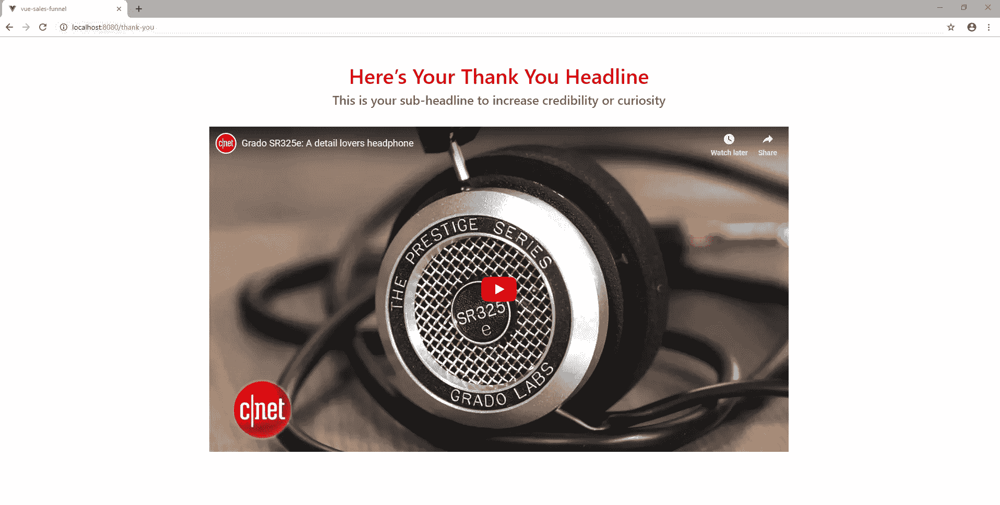
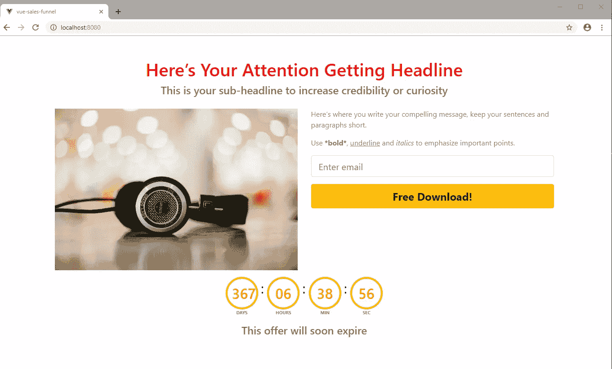

# 如何用 Vue.js 构建销售漏斗

> 原文：<https://www.sitepoint.com/build-a-sales-funnel-with-vue/>

销售漏斗是一种在线营销工具，旨在从流量中获取线索，并将其转化为客户。他们往往比普通网页转化率高 20%到 50%。销售漏斗通常由选择加入页面、订单、购物车、结账页面和电子邮件营销软件组成。建立这样一个系统不是在公园散步。

如今，构建销售漏斗的常见方式是从销售漏斗构建平台购买月度订阅计划。最受欢迎的提供商目前收费约 100 至 300 美元。还有其他负担得起的选择。但是，您可能会遇到与您合作的任何提供商的限制或技术挑战—有些比其他的更严重。

如果你不想支付订阅计划，那么你将不得不自己建立一个。从历史上看，编写自己的漏斗更加昂贵和耗时。然而，我们生活在 2019 年。在过去的 10 年里，web 开发人员使用的技术有了很大的改进。

构建和部署 web 应用程序更加容易和快速。我们有大量的第三方提供商允许通过远程 API 集成到他们的平台。这使得我们无需自己编写代码就可以轻松实现重型功能。

拥有自己的漏斗代码的好处意味着你的业务将更有弹性。如果你的服务提供商有什么问题，你可以很容易地更换服务器。你也可以轻松扩大你的在线业务，而不会遇到重大障碍。

在本教程中，我将向您展示如何用 Vue 编写您自己的简单销售漏斗，这将有助于您向消费者推销产品或服务。我们将建立一个简单的挤压页面漏斗，为您的电子邮件列表收集线索。

## 先决条件

本文假设您至少已经牢固掌握了:

*   [现代 JavaScript ES6+](https://www.sitepoint.com/premium/books/modern-javascript?utm_source=blog&utm_medium=articles)
*   [vue . js 中的初学者知识](https://www.sitepoint.com/premium/books/jump-start-vue-js?utm_source=blog&utm_medium=articles)

您需要在系统中安装 Node.js 和 Vue CLI 工具的最新版本。在撰写本文时，Node v10.15.1 是当前的 LTS。目前的 Vue CLI 版本工具是 v3.4.1，我个人的建议是使用 nvm 让你的 Node.js 环境保持最新。要安装 Vue.js CLI 工具，请执行以下命令:

```
npm install @vue/cli 
```

## 关于项目

你可以在 [GitHub](https://github.com/brandiqa/vue-sales-funnel) 上获得该项目的完整源代码。还有这个项目的[现场演示](https://codesandbox.io/s/github/brandiqa/vue-sales-funnel)。我们将使用 [Bootstrap-vue](https://bootstrap-vue.js.org/) 作为我们主要的 CSS 框架。如果您不熟悉这个框架，请务必阅读文档。

对于这个项目，我们将建立一个两页的漏斗，由一个选择加入页面(也称为挤压页面)和一个感谢页面组成。该设置将如下所示:



选择性加入页面捕获访问者的电子邮件地址，并将其保存到电子邮件列表中。同时，它将访问者带到下一页。就这么简单。你甚至可以只用普通的 HTML、CSS 和 JavaScript 就能做到。我们为什么要在 Vue.js 里做呢？

原因是因为我们可能想要建立不同类型的渠道来推广相同或不同的产品。我们不想重复我们之前在另一个漏斗中实现的相同代码。

Vue.js 是一个完美的解决方案，它允许我们构建易于维护和更新的可重用组件。此外，我们可以打包我们的组件，并将其发布到 npm 注册中心，使其可用于我们所有未来的漏斗项目。

要发布我们的漏斗，我们必须在像 Nuxt.js 这样的框架中完成。这是因为 Vue.js 主要是一种视图层技术。我们可以在一个 Nuxt.js 项目中安装我们的销售漏斗库。js 更像是一个完整的框架，因为它允许代码在服务器端和客户端运行。它还支持许多有用的特性，比如 SEO。

不幸的是，不可能在一个单独的教程中完成上面提到的大部分步骤。我们要做的是建立两页的漏斗。我将向您展示如何设计组件，使它们易于重用。

这样，您可以稍后打包项目，并将其安装在另一个漏斗项目中。我还将提供关于打包 Vue.js 项目并将其部署到私有 npm 服务器的附加链接。

有了这个计划，让我们继续前进，开始构建我们的漏斗库项目！

## 项目设置

打开控制台终端并创建一个新的 Vue 项目。

```
vue create vue-sales-funnel 
```

使用以下设置:

*   *功能*:巴别塔、路由器、棉绒(可选)
*   *路由器历史模式*:是
*   *Linter* : `ESlint` +更漂亮，保存时 Lint，提交时 Lint 和 fix(或者选择您喜欢的选项)
*   *配置文件*:在专用配置文件中

接下来，安装`Bootstrap-Vue`:

```
cd vue-sales-funnel
npm install vue bootstrap-vue bootstrap 
```

接下来，在您最喜欢的编辑器中打开项目。如果您有 Visual Studio 代码，您可以像这样启动它:

```
code . 
```

更新`src\main.js`如下:

```
import Vue from "vue";
import BootstrapVue from "bootstrap-vue";
import App from "./App.vue";
import router from "./router";

import "bootstrap/dist/css/bootstrap.css";
import "bootstrap-vue/dist/bootstrap-vue.css";

Vue.config.productionTip = false;
Vue.use(BootstrapVue);

new Vue({
  router,
  render: h => h(App)
}).$mount("#app"); 
```

这将在您的项目中设置引导 CSS 框架。接下来，更新`src\App.js`如下:

```
<template>
  <div id="app">
    <router-view />
  </div>
</template> 
```

按如下方式重命名以下文件:

*   `src/views/Home.vue`=>= 
*   `src/views/About.vue`=>= 

替换`src/views/Optin.vue`中的现有代码如下:

```
<template>
  <div class="optin">
    <b-row>
      <b-col>
        <p>Squeeze Funnel Page</p>
      </b-col>
    </b-row>
  </div>
</template>

<script>
export default {
  name: "optin"
};
</script> 
```

更新`src\router.js`中的代码，如下所示:

```
import Vue from "vue";
import Router from "vue-router";
import Optin from "./views/Optin.vue";
import ThankYou from "./views/Thank-you.vue";

Vue.use(Router);

export default new Router({
  mode: "history",
  base: process.env.BASE_URL,
  routes: [
    {
      path: "/",
      name: "optin",
      component: Optin
    },
    {
      path: "/thank-you",
      name: "thank-you",
      component: ThankYou
    }
  ]
}); 
```

您现在可以使用命令`npm run serve`启动您的项目服务器。打开浏览器，检查链接 [localhost:8080](http://localhost:8080/) 和[localhost:8080/谢谢](http://localhost:8080/thank-you)是否正常工作。如果是这样，您可以继续下一部分。如果没有，检查你的工作。

## 文本内容

我们将构建的第一个组件是一个文本组件。我们可以很容易地使用`<h1>`和`<p>`标签。但是，我们需要已经应用了样式的预设元素。我们需要在不考虑样式的情况下，在 10 分钟或更短时间内快速构建一个页面。

删除组件`src/components/HelloWorld.vue`并在其位置创建`TextComponent.vue`。复制以下代码:

```
<template>
  <div class="text-content" v-bind:style="{ marginTop: topMargin }">
    <h1 class="header" v-if="variant === 'header'">{{ content }}</h1>
    <h2 class="subheader" v-if="variant === 'subheader'">{{ content }}</h2>
    <p class="paragraph" v-if="variant === 'paragraph'" v-html="content"></p>
  </div>
</template>

<script> export default {
  name: "TextContent",
  props: {
    variant: String,
    content: String,
    topMargin: String
  }
}; </script>

<style scoped> .header {
  color: rgb(50, 50, 50);
  text-align: center;
}
.subheader {
  font-size: 1.5rem;
  color: rgb(100, 100, 100);
  text-align: center;
}
p {
  color: rgb(124, 124, 124);
} </style> 
```

让我们通过在`src/views/Optin.vue`中进行以下更改来测试它:

```
<template>
  <div class="optin container">
    <b-row>
      <b-col>
        <TextContent
          variant="header"
          content="Here’s Your Attention Getting Headline"
          topMargin="50px"
        />
        <TextContent
          variant="subheader"
          content="This is your sub-headline to increase credibility or curiosity"
        />
      </b-col>
    </b-row>
    <b-row>
      <b-col>
        put image here
      </b-col>
      <b-col>
        <TextContent
          variant="paragraph"
          content="Here’s where you write your compelling message, keep your sentences and paragraphs short."
        />
      </b-col>
    </b-row>
  </div>
</template>

<script> import TextContent from "../components/TextComponent";

export default {
  name: "optin",
  components: {
    TextContent
  }
}; </script> 
```

刷新您的页面。你应该有这样的东西:



您可能已经注意到了`paragraph`标签会以不同的方式呈现内容。我们使用`v-html`属性来允许用户传递 HTML 样式，比如`<strong>`和`<u>`。您可以通过添加以下代码片段来测试它:

```
<TextContent
  variant="paragraph"
  content="Use <strong>*bold*</strong>, <u>underline</u> and <i>italics</i> to emphasize important points."
/> 
```

我们构建了一个带有预构建样式的简单文本组件。属性`variant`用于确定需要呈现的文本标签的类型。我们还有一个道具`topMargin`,它可以让我们轻松地分隔文本元素。

假设这个测试对你有效，让我们进入下一个挑战。让我们假设我们需要标题和子标题有不同的样式。我们需要一种方法来指示`TextContent`组件改变样式。按如下方式更新`OptinForm.vue`代码:

```
<TextContent
  variant="header"
  content="Here’s Your Attention Getting Headline"
  topMargin="50px"
  theme="red"
/> 
```

我们增加了一个新道具叫做`theme`。我们需要在`TextComponent.vue`中声明这个新道具。按如下方式更新代码:

```
<template>
  <h1
    class="header"
    v-bind:style="getStyle()"
    v-if="variant === 'header'"
  >
    {{ content }}
  </h1>
</template>

<script> export default {
  ...
  props: {
    ...
    theme: String
  },
  data: function() {
    return {
      red: { // style object
        color: "red"
      },
      blue: { // style object
        color: "blue"
      }
    };
  },
  methods: {
    getStyle() {
      switch (this.$props.theme) {
        case "red":
          return this.red;
        case "blue":
          return this.blue;
        default:
          break;
      }
    }
  }
}; </script> 
```

当你刷新你的页面时，你应该看到这样的内容:



在这个例子中，我们声明了多个样式对象，`red`和`blue`。用户可以指定他们想要使用的主题。您可以随意向样式对象添加更多的属性，并创建更多的样式对象。

如果想更进一步，可以将样式对象外部化，使其与代码分离。您可以创建类似于`theme.css`文件的东西，这样更容易定制。

现在让我们看看下一个组件。

## 选择加入表格

opt-in 表单是线索捕获操作发生的地方。我们要求访问者给我们他们的电子邮件地址，以换取有价值的资源来帮助他们。

创建文件`src/components/OptinForm.vue`并插入以下代码:

```
<template>
  <div class="optin-form">
    <form @submit.prevent="onSubmit">
      <b-form-group>
        <b-form-input
          type="email"
          v-model="form.email"
          size="lg"
          required
          placeholder="Enter email"
        />
      </b-form-group>
      <b-button type="submit" v-bind:variant="submitColor" size="lg" block>{{
        submitText
      }}</b-button>
    </form>
  </div>
</template>

<script> export default {
  name: "optin-form",
  props: {
    submitText: String,
    submitColor: String
  },
  data() {
    return {
      form: {
        email: ""
      }
    };
  },
  methods: {
    onSubmit() {
      this.$emit("submit", this.form);
    }
  }
}; </script>

<style scoped> .btn {
  font-weight: bold;
  font-size: 1.5rem;
} </style> 
```

仔细检查代码，特别注意使用的道具。要演示如何使用该组件，只需如下更新`src/views/Optin.vue`:

```
<template>
  <b-row style="marginTop:20px">
      <b-col>
        <b-img
          src="https://images.unsplash.com/photo-1483032469466-b937c425697b?ixlib=rb-1.2.1&ixid=eyJhcHBfaWQiOjEyMDd9&auto=format&fit=crop&w=600&q=80"
          fluid
        />
      </b-col>
      <b-col>
        <TextContent
          variant="paragraph"
          content="Here’s where you write your compelling message, keep your sentences and paragraphs short."
        />
        <OptinForm
          submitText="Free Download!"
          submitColor="warning"
          @submit="handleSubmit"
        />
      </b-col>
    </b-row>
</template>

<script> import TextContent from "../components/TextContent";
import OptinForm from "../components/OptinForm";

export default {
  name: "optin",
  components: {
    TextContent,
    OptinForm
  },
  methods: {
    handleSubmit(form) {
      console.log("Add New Subscriber", form.email);
      this.$router.push({ path: '/thank-you'})
    }
  }
}; </script> 
```

请注意，我们已经用实际的图像标签替换了“将图像放在这里”的文本。我们还在`OptinForm`组件上指定了一个`@submit`事件，该事件将由`handleSubmit`函数处理。如果你回头看一下`OptinForm.vue`代码，你会注意到一个事件是通过这个代码触发的:`this.$emit("submit", this.form);`。

这就是我们解耦`OptinForm.vue`组件的方式。我们可以轻松地编写自定义代码，将电子邮件地址发送到您选择的任何电子邮件营销平台。我目前最喜欢的是 MailerLite。这是关于如何添加新用户的 API 文档。

您可以使用像`Fetch`或`Axios`这样的库通过 REST API 发送信息。如果你是新手，可以看看介绍 Axios 的教程[，这是一个流行的基于 Promise 的 HTTP 客户端](https://www.sitepoint.com/axios-beginner-guide/)。

刷新您的浏览器并确认选择加入页面正常工作:



目前，我们正在使用 HTML 验证。输入一个有效的电子邮件地址应该可以快速导航到`thank-you`页面。目前，它看起来不像。让我们在下一节中解决这个问题。

## 视频内容

在填充`Thank-You.vue`页面之前，我们需要创建`src/components/VideoContent.vue`组件。插入以下代码:

```
<template>
  <div class="video-content" v-bind:style="{ marginTop: topMargin }">
    <b-embed type="iframe" aspect="16by9" :src="link" allowfullscreen />
  </div>
</template>

<script> export default {
  name: "video-content",
  props: {
    link: String,
    topMargin: String
  }
}; </script> 
```

组件将允许我们嵌入来自 YouTube 和 Vimeo 等网站的任何视频。你必须得到一个嵌入链接才能工作。YouTube 的嵌入 URL 如下所示:

`https://www.youtube.com/embed/xxxxxxxxx`

一旦保存了组件，我们现在就可以开始处理`src/views/Thank-you.vue`。用以下代码替换所有现有代码:

```
<template>
  <div class="thank-you container">
    <b-row>
      <b-col>
        <TextContent
          variant="header"
          content="Here’s Your Thank You Headline"
          topMargin="50px"
          theme="red"
        />
        <TextContent
          variant="subheader"
          content="This is your sub-headline to increase credibility or curiosity"
        />
      </b-col>
    </b-row>
    <b-row>
      <b-col>
        <VideoContent
          link="https://www.youtube.com/embed/m9q58hSppds"
          topMargin="30px"
        />
      </b-col>
    </b-row>
  </div>
</template>

<script> import TextContent from "../components/TextContent.vue";
import VideoContent from "../components/VideoContent";

export default {
  name: "thank-you",
  components: {
    TextContent,
    VideoContent
  }
}; </script> 
```

如果您刷新[http://localhost:8080/thank-you](http://localhost:8080/thank-you)页面，您应该看到以下视图:



既然我们已经完成了，让我们再创建一个有点复杂的组件。这将进入我们的`Optin`页面。

## 倒计时定时器组件

倒计时器是一种流行的营销工具，用来制造一种紧迫感。它鼓励访问者在机会到期前立即采取行动。主要有两种类型的倒计时定时器:

1.  截止到指定日期
2.  一个固定的时间(通常在一个小时或几分钟内),每天或当会话开始时自动重置

在这种情况下，我们将专注于构建第一个用例。我们不打算实际编码这个定时器本身，而是从 npm 注册表中抓取一个。您需要首先退出 Vue.js 服务器。按照以下方式安装:

```
npm install vuejs-countdown 
```

接下来创建文件`src/components/Countdowntimer.vue`并插入以下代码:

```
<template>
  <div class="countdown-timer">
    <Countdown :deadline="endDate"></Countdown>
  </div>
</template>

<script> import Countdown from "vuejs-countdown";

export default {
  name: "countdown-timer",
  components: { Countdown },
  props: {
    endDate: String
  }
}; </script>

<style> .countdown-timer {
  padding: 15px;
  text-align: center;
}
.countdown-section {
  display: inline-block;
  margin-right: 25px;
}
.vuejs-countdown .digit {
  display: block;
  border: 4px solid orange;
  color: darkorange;
  padding: 10px;
  border-radius: 100px;
  width: 72px;
  margin-bottom: 10px;
}
.text {
  font-size: 0.7rem;
  font-weight: bold;
  color: gray;
} </style> 
```

接下来，将`CountdownTimer`组件添加到`src/views/Optin.vue`页面:

```
<template>
  ...
  <b-row>
    <b-col>
      <CountdownTimer endDate="March 3, 2020e" />
      <TextContent
        variant="subheader"
        content="This is offer will soon expire"
      />
    </b-col>
  </b-row>
  ...
</template>

<script> import CountdownTimer from "../components/CountdownTimer";
  ...
  components: {
    ...
    CountdownTimer
  }, </script> 
```

完成更改后，您现在可以启动服务器了。您的页面应该是这样的:



如果你的没有倒计时，那就改一下日期，确保设置在未来。现在让我们完成教程。

## 包装和出版

到目前为止，我们已经为销售漏斗库打下了良好的基础。您可以继续添加更多组件，每个组件都有更多可定制的选项。现在是谈论包装和推出生产就绪漏斗的好时机。虽然可以运行我们刚刚从 Vue 项目中创建的漏斗，但最好在 Nuxt.js 项目中启动它。

以下是一些有用的链接，可以帮助您完成我们之前讨论的任务:

*   [如何建立私有国家预防机制登记册](https://www.sitepoint.com/private-npm-packages-verdaccio/)
*   [在 npm 上发布 Vue 组件](https://vuejsdevelopers.com/2017/07/31/vue-component-publish-npm/)
*   [nuxt . js 简介](https://www.sitepoint.com/nuxt-js-universal-vue-js/)

## 摘要

希望你从这篇教程中学到了有用的东西。作为开发人员，你比非技术人员更有优势。当使用漏斗建立服务时，你可以用大多数营销人员支付的整个生命周期的一小部分成本来建立和启动你的漏斗。这将导致每年节省数千美元。

此外，与使用标准网站相比，您将能够销售更多的软件产品和服务。如果您计划创建一个开源版本的销售漏斗构建器来造福社区，请通过社交媒体告诉我们。

## 分享这篇文章