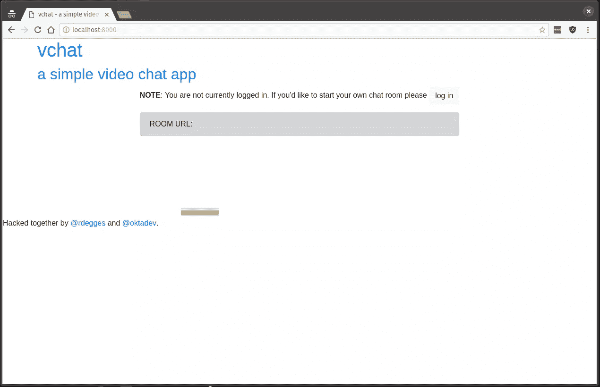
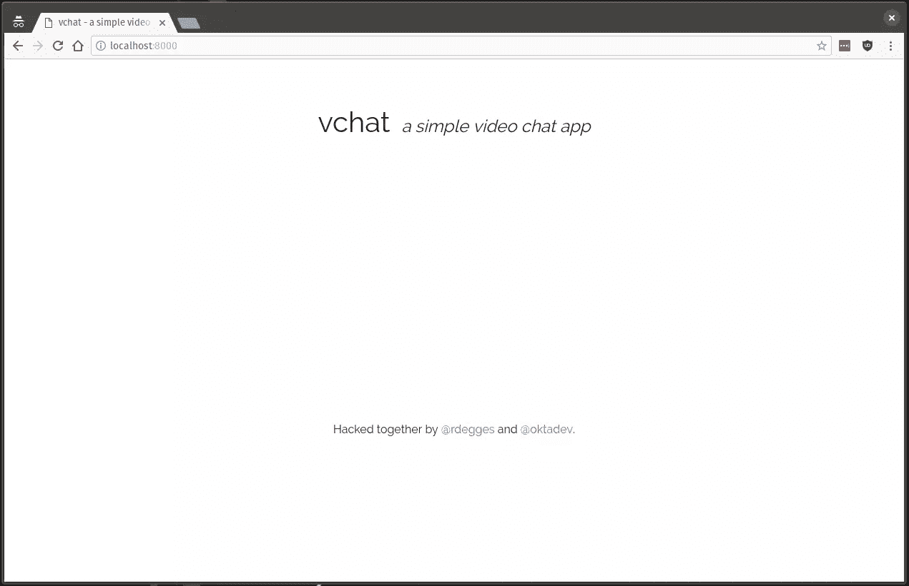
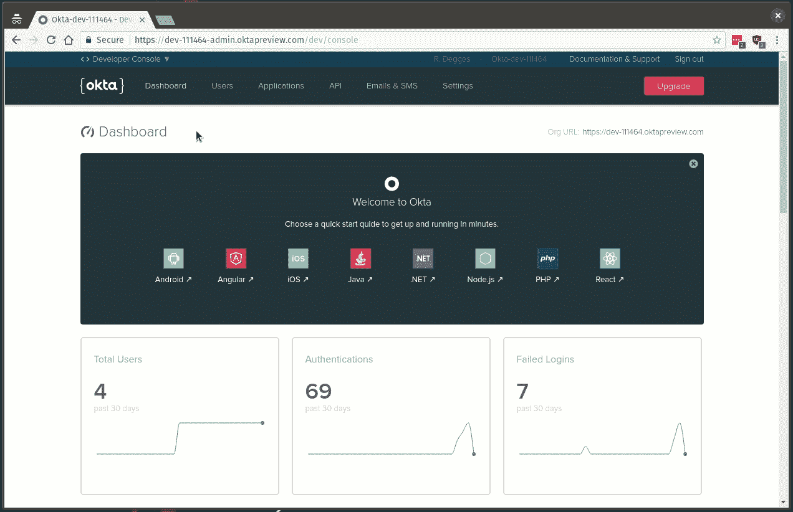
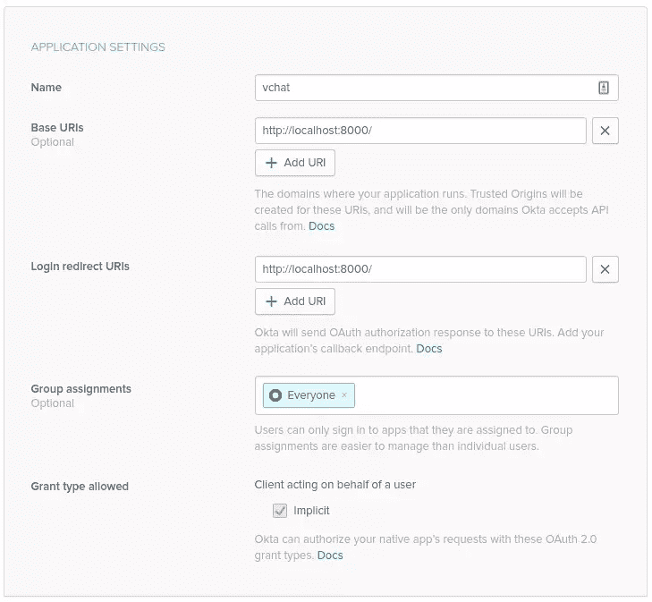
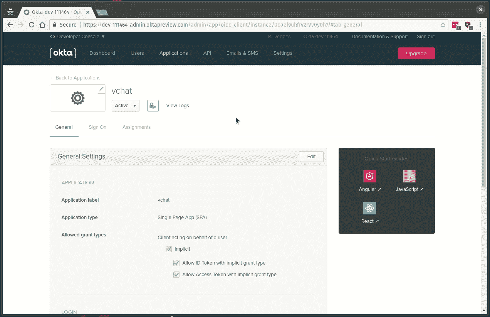
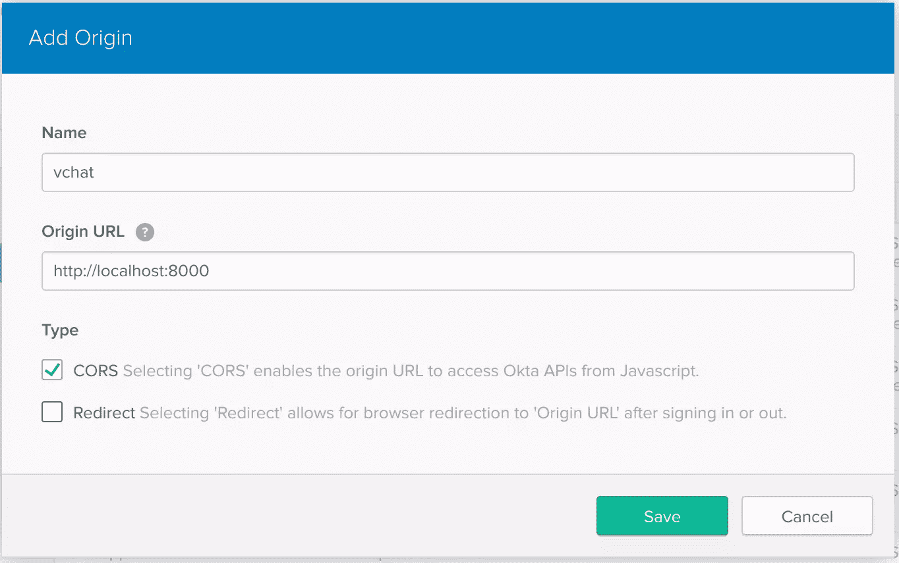
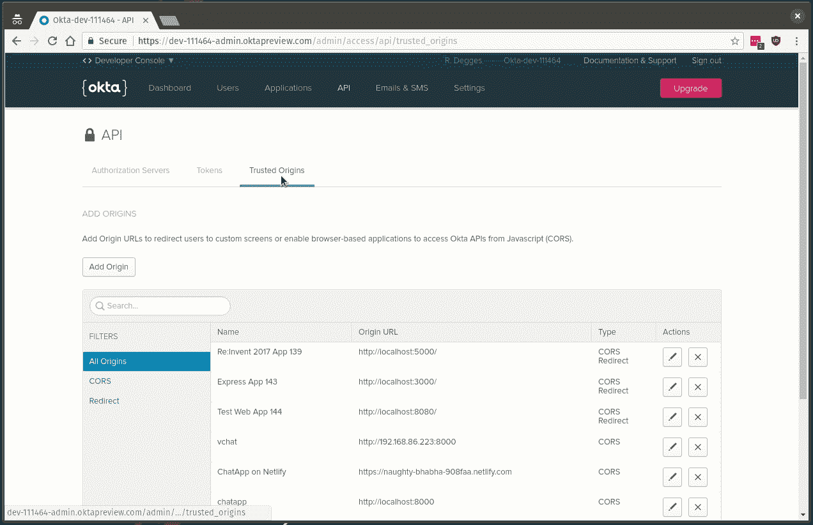
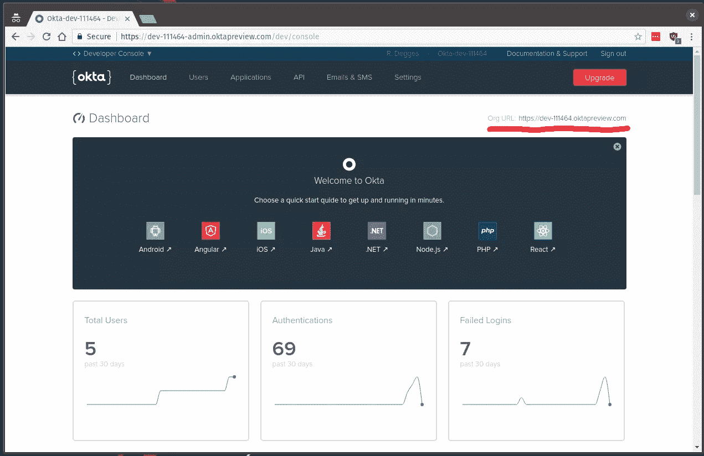
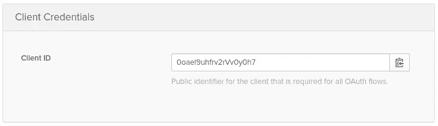
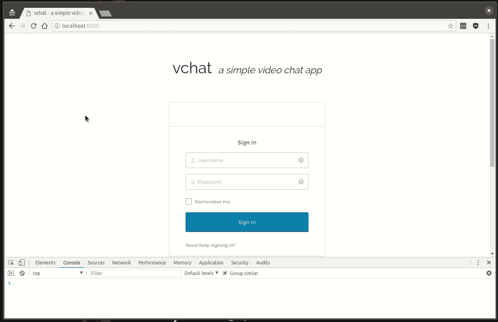

# 用 JavaScript、WebRTC 和 Okta 构建视频聊天服务

> 原文：<https://www.sitepoint.com/build-a-video-chat-service-with-javascript-webrtc-and-okta/>

*这篇文章最初发表在[Okta 开发者博客](https://developer.okta.com/blog/2018/05/08/build-video-chat-app-with-javascript-webrtc-and-okta)上。感谢您对使 SitePoint 成为可能的合作伙伴的支持。*

就在短短的七年前，在网络上构建视频应用程序还是一件痛苦的事情。还记得使用 Flash 和专有编解码器(*通常需要许可*)的日子吗？呸。在过去的几年里，视频聊天技术有了显著的进步，不再需要 Flash。

今天，由于 WebRTC(由谷歌、Mozilla、Opera 和其他公司构建和维护的开源项目)的出现，视频聊天的前景变得更加简单。WebRTC 允许您在浏览器中轻松构建实时通信软件，并且正在 W3C 和 IETF 级别上进行标准化。使用 WebRTC，您可以在浏览器中构建实时视频聊天应用程序，这些应用程序实际上运行得很好*！真是太神奇了。*

 *今天，我觉得带您体验一下使用 WebRTC 和 [Okta](https://developer.okta.com/signup/) 构建一个简单的视频聊天服务的过程会很有趣，这个服务允许用户创建一个聊天室，并将链接分享给他们想要的任何人，然后这些人可以加入聊天室并与他们实时聊天。

您今天将要构建的应用程序将使用 [Okta](https://developer.okta.com/signup/) (一种免费的认证服务)来处理用户登录和访问控制，并使用 WebRTC 来支持所有的视频功能。您还将使用纯 JavaScript 来创建 web 应用程序。

当您阅读完本指南时，您将对 web 认证和实时视频聊天如何在纯 JavaScript 环境中工作有更好的理解。

让我们开始吧。

[https://gfycat.com/ifr/BelatedRepentantGavial](https://gfycat.com/ifr/BelatedRepentantGavial)

**注**:想实时玩聊天 app？你可以在这里[这样做。你也可以在 GitHub](https://naughty-bhabha-908faa.netlify.com) 上查看我们将要构建的[应用的源代码。](https://github.com/rdegges/chatapp)

## 创建网页

您要做的第一件事是为应用程序创建一个简单的 HTML 网页。

当构建 web 应用程序时，我喜欢首先创建我的标记和 CSS，然后返回第二遍并添加应用程序逻辑。

在计算机上创建一个名为`chatapp`的新文件夹，然后创建一个包含以下内容的`index.html`文件:

```
<!DOCTYPE html>
<html>
  <head>
    <title>vchat - a simple video chat app</title>
    <link rel="stylesheet" href="https://maxcdn.bootstrapcdn.com/bootstrap/4.0.0/css/bootstrap.min.css" integrity="sha384-Gn5384xqQ1aoWXA+058RXPxPg6fy4IWvTNh0E263XmFcJlSAwiGgFAW/dAiS6JXm" crossorigin="anonymous">
    <link href="https://fonts.googleapis.com/css?family=Raleway" rel="stylesheet">
  </head>
  <body>
    <div class="container">
      <header>
        <h1><a href="/">vchat</a></h1>
        <h2><a href="/">a simple video chat app</a></h2>
      </header>

      <div id="okta-login-container"></div>

      <div class="row">
        <div class="col"></div>
        <div class="col-md-auto align-self-center">
          <p id="login"><b>NOTE</b>: You are not currently logged in. If you'd like to start your own
            chat room please <button type="button" class="btn btn-light">log in</button></p>
          <div id="url" class="alert alert-dark" role="alert">
            <span id="roomIntro">ROOM URL</span>: <span id="roomUrl"></span>
          </div>
        </div>
        <div class="col"></div>
      </div>

      <div id="remotes" class="row">
        <div class="col-md-6">
          <div class="videoContainer">
            <video id="selfVideo"></video>
            <meter id="localVolume" class="volume"></meter>
          </div>
        </div>
      </div>
    </div>

    <footer>
      <p>Hacked together by <a href="https://twitter.com/rdegges">@rdegges</a>
        and <a href="https://twitter.com/oktadev">@oktadev</a>.</p>
    </footer>
  </body>
</html> 
```

这个简单的页面使用了最新版本的 [Bootstrap](https://getbootstrap.com/) 和 [Raleway](https://fonts.google.com/specimen/Raleway) 字体(*我个人最喜欢的*)——但没有其他的。

这个简约的 HTML 页面中的关键元素是:

*   一个`okta-login-container` div，它将最终保存我们的登录表单
*   一个登录通知和房间 URL 占位符，通知用户是否需要登录，以及他们当前所在的聊天室
*   一个最终将包含来自不同参与者的所有视频源的 div

如果你在浏览器中打开这个页面，你会发现它看起来很糟糕。但是不要担心，你很快就会让它看起来很漂亮！；)



接下来，您需要创建一个名为`static`的文件夹，其中包含另一个名为`css`的文件夹。然后，你需要将下面的 CSS 复制到文件夹中的一个新的`style.css`文件中:

```
body {                                                                                                                        
  font-family: 'Raleway', sans-serif;                                                                                         
}                                                                                                                             

footer {                                                                                                                      
  text-align: center;                                                                                                         
  margin-top: 2em;                                                                                                            
}                                                                                                                             

h2 {                                                                                                                          
  font-style: italic;                                                                                                         
}                                                                                                                             

header {                                                                                                                      
  text-align: center;                                                                                                         
  margin: 4em;                                                                                                                
}                                                                                                                             

header h1, header h2 {         
  display: inline;             
}                              

header h1 a, header h2 a, header h1 a:hover, header h2 a:hover {                                                              
  color: inherit;              
  text-decoration: none;       
}                              

header h2 {                    
  font-size: 24px;             
  padding-left: .5em;          
}                              

#remotes {                     
  visibility: hidden;          
}                              

#url {                         
  text-align: center;          
  display: none;               
}                              

#login {                       
  display: none;               
}                              

#roomIntro {                   
  font-weight: bold;           
}

.videoContainer {              
  object-fit: cover;           
  margin: 0 auto;              
  padding: 0;                  
}                              

.videoContainer video {        
  width: 100%;                 
  height: 100%;                
  border-radius: 10px;         
  border: 5px double #f2f2f2;  
}                              

.volume {                      
  position: absolute;          
  left: 15%;                   
  width: 70%;                  
  bottom: 20px;                
  height: 10px;                
  display: none;               
}                              

.connectionstate {             
  position: absolute;          
  top: 10px;                   
  width: 100%;                 
  text-align: center;          
  color: #fff                  
}                              

.col-md-6 {                    
  margin-bottom: 1em;          
} 
```

我不会详细解释每个 CSS 规则(*，因为我不想让你无聊死*)，但是如果你将新创建的样式表添加到你的`index.html`页面，你会注意到 web 应用程序现在看起来更好了:

```
<head>
  <title>vchat - a simple video chat app</title>
  <link rel="stylesheet" href="https://maxcdn.bootstrapcdn.com/bootstrap/4.0.0/css/bootstrap.min.css" integrity="sha384-Gn5384xqQ1aoWXA+058RXPxPg6fy4IWvTNh0E263XmFcJlSAwiGgFAW/dAiS6JXm" crossorigin="anonymous">
  <link href="https://fonts.googleapis.com/css?family=Raleway" rel="stylesheet">
  <link rel="stylesheet" href="/static/css/style.css">
</head> 
```



## 建立 Okta

现在您已经有了一个带有一些样式的简单 web 页面，让我们使用 Okta 设置用户登录组件。如果你还没有一个 Okta 开发者账户，[现在就去创建一个](https://developer.okta.com/signup/)然后回来(应该只需要几秒钟)。

一旦你获得了你的 Okta 帐户，并登录到 Okta 仪表板，你将需要创建一个新的 Okta 应用程序(这是 Okta 如何知道你正在建立什么类型的应用程序和允许什么类型的认证)。

为此，从您的仪表板导航到**应用程序**选项卡，并单击**添加应用程序**按钮。在那里，点击**单页应用**图标(因为你正在创建一个水疗中心)，然后点击**下一步**。



一旦你到达**创建新应用**页面，用以下信息填写**应用设置**表格:



完成后，点击**完成**。你的秋田申请现在*几乎*准备好了。

接下来您需要做的是将您的本地计算机添加为**可信来源**——可信来源是允许从纯 JavaScript 环境与 Okta 交互的 URLs 您需要显式创建一个。

要做到这一点，点击 Okta 仪表板上的 **API** 选项卡，然后点击**可信来源**选项卡。要创建你的新原点，现在点击**添加原点**按钮:



一旦进入 **Add Origin** 屏幕，输入以下信息，Okta 将允许您在本地测试环境中使用 Okta 认证服务:



最后，现在您已经配置了 Okta 应用程序和所有必要的安全规则，您应该在 Okta 中创建一些用户帐户，以便以后登录。您可以通过点击**用户**选项卡，然后点击**添加人员**按钮来完成此操作:



## 使用 Okta 处理用户认证

现在你已经配置好了 Okta，你需要将 Okta 插入你的 web 应用程序，这样用户就可以登录你的视频聊天应用程序。

虽然有许多不同的方法可以与 Okta 集成，但是对于像您今天正在构建的这种单页面应用程序，您会希望使用 [Okta 登录小部件](https://github.com/okta/okta-signin-widget)。

Okta 登录小部件是一个纯 JS 库，您可以将其放入任何为您处理用户身份验证的 web 页面。

在添加小部件的 JS 代码(如下)之前，您需要访问您的 Okta 仪表板，并从页面的右上角获取 **Org URL** 值。



您还需要查看您之前创建的应用程序来获取**客户端 ID** 值。下面将使用这两个值(客户端 ID 和组织 URL)。



现在您已经有了必要的凭证，让我们开始将小部件插入到您的 web 应用程序中。打开您之前正在处理的`index.html`文件，导入 Okta 登录小部件依赖项，并在脚本标签中初始化页面底部的小部件。确保用适合您的应用程序的值替换`{{OKTA_ORG_URL}}`和`{{CLIENT_ID}}`。

```
<!-- snip -->

<head>                       
  <title>vchat - a simple video chat app</title>
  <link rel="stylesheet" href="https://maxcdn.bootstrapcdn.com/bootstrap/4.0.0/css/bootstrap.min.css" integrity="sha384-Gn53
84xqQ1aoWXA+058RXPxPg6fy4IWvTNh0E263XmFcJlSAwiGgFAW/dAiS6JXm" crossorigin="anonymous">
  <link href="https://fonts.googleapis.com/css?family=Raleway" rel="stylesheet">
  <script src="https://ok1static.oktacdn.com/assets/js/sdk/okta-signin-widget/2.6.0/js/okta-sign-in.min.js" type="text/javas
cript"></script>                                               
  <link href="https://ok1static.oktacdn.com/assets/js/sdk/okta-signin-widget/2.6.0/css/okta-sign-in.min.css" type="text/css"
 rel="stylesheet"/>                                            
  <link href="https://ok1static.oktacdn.com/assets/js/sdk/okta-signin-widget/2.6.0/css/okta-theme.css" type="text/css" rel="
stylesheet"/>                                                  
  <link rel="stylesheet" href="/static/css/style.css">       
</head>

<!-- snip -->

<footer>
  <p>Hacked together by <a href="https://twitter.com/rdegges">@rdegges</a>
    and <a href="https://twitter.com/oktadev">@oktadev</a>.</p>
</footer>

<script> var okta = new OktaSignIn({
    baseUrl: "{{OKTA_ORG_URL}}",
    clientId: "{{CLIENT_ID}}",
    authParams: {
      issuer: "{{OKTA_ORG_URL}}/oauth2/default",
      responseType: ["token", "id_token"],
      display: "page"
    }
  });

  // Render the login form.
  function showLogin() {
    okta.renderEl({ el: "#okta-login-container" }, function(res) {}, function(err) {
      alert("Couldn't render the login form, something horrible must have happened. Please refresh the page.");
    });
  }

  // Handle the user's login and what happens next.
  function handleLogin() {
    // If the user is logging in for the first time...
    if (okta.token.hasTokensInUrl()) {
      okta.token.parseTokensFromUrl(
        function success(res) {
          // Save the tokens for later use, e.g. if the page gets refreshed:
          okta.tokenManager.add("accessToken", res[0]);
          okta.tokenManager.add("idToken", res[1]);

          console.log("user just logged in");
        }, function error(err) {
          alert("We weren't able to log you in, something horrible must have happened. Please refresh the page.");
        }
      );
    } else {
      okta.session.get(function(res) {

        // If the user is logged in...
        if (res.status === "ACTIVE") {

          console.log("user is already logged in")
          return;
        }

        // If we get here, the user is not logged in.
        console.log("user not logged in");
        showLogin();
      });
    }
  }

  handleLogin(); </script> 
```

上面的代码初始化 Okta 小部件，处理用户身份验证，并向开发人员控制台记录一些消息，以帮助您了解正在发生的事情。

上面创建的`okta`对象控制小部件的功能:通过创建一个`OktaSignIn`类的新实例，并赋予它特定于应用程序的细节，您实际上是在告诉 Okta 您的 OpenID Connect 服务器在哪里以及如何使用它(Okta 在幕后使用 [OpenID Connect 协议](https://developer.okta.com/blog/2017/07/25/oidc-primer-part-1)来驱动这个登录小部件)。

你在上面看到的`handleLogin`功能是控制你的应用程序中的会话管理的。如果用户刚刚登录(作为 OIDC 流的一部分)，那么用户的访问和 ID 令牌将存储在 HTML 本地存储中，以便您的应用程序可以记住用户是谁。如果用户已经登录，但正在查看该页面，将向控制台回显一条消息。如果用户根本没有登录，那么将呈现登录表单(通过`showLogin`函数)。

现在您已经将小部件连接到您的应用程序，如果您在浏览器中查看您的应用程序，您将能够看到 Okta 登录小部件的运行:它将呈现一个好看的登录表单。如果您填写 Okta 用户登录详细信息，您会注意到相应的`console.log`消息将会触发:要么您没有登录，要么您刚刚登录，要么您已经登录。



## 配置状态管理

接下来，您需要为应用程序配置状态管理。但是在我们深入研究之前，让我们先来讨论一下这个应用程序是如何工作的。

你正在构建的视频聊天应用程序将为每个注册用户提供他们自己的专用聊天室，他们可以随时使用，并可以与任何外部人员共享。当另一个人加入这些专用聊天室时，他们会立即加入视频聊天会话，而不需要网站上的帐户。

为了以简单的方式实现这一功能，您将构建应用程序，以便每个注册用户都有一个专用的聊天室，其 URL 为`{{YOUR_SITE_URL}}?room={{email}}`。这样，如果我的电子邮件地址是`r@rdegges.com`，那么我将有一个专用的聊天室，我的朋友可以加入，那就是`{{YOUR_SITE_URL}}?room=r@rdegges.com`——容易记住，也容易分享。

如果用户在一个带有`room` querystring 的页面上，你会知道他们正试图加入一个特定的视频聊天室，并将使用 querystring 值将他们放入正确的房间。如果用户正在访问网站的主页(没有任何查询字符串)，你会知道他们可能试图登录应用程序，因此你应该向他们展示登录表单。

这是您将在下面实现的基本逻辑。随着本指南的进展，我们将在此基础上添加越来越多的功能，直到视频聊天服务完全构建完成。

首先，创建一个`hasQueryString`函数，它将有助于确定用户是在应用程序的主页上还是在特定的聊天室中:

```
// Determine whether or not we have a querystring.
function hasQueryString() {
  return location.href.indexOf("?") !== -1;
} 
```

接下来，定义两个助手函数:`getRoom`和`getRoomURL`，它们将确定聊天室的名称(来自 querystring)以及完全限定的聊天室 URL。这些将有助于以后编写视频聊天代码:

```
// Determine the room name and public URL for this chat session.
function getRoom() {
  var query = location.search && location.search.split("?")[1];

  if (query) {
    return (location.search && decodeURIComponent(query.split("=")[1]));
  }

  return okta.tokenManager.get("idToken").claims.email;
}

// Retrieve the absolute room URL.
function getRoomURL() {
  return location.protocol + "//" + location.host + (location.path || "") + "?room=" + getRoom();
} 
```

现在您已经有了一些有用的助手函数，您会想要将前面的`handleLogin`函数修改为:

*   将登录用户重定向到他们的专用聊天室(`{{YOUR_SITE_URL}}?room={{email}}`
*   通知未登录(但在视频聊天室中)的用户，如果他们愿意，可以登录

```
// Handle the user's login and what happens next.
function handleLogin() {
  // If the user is logging in for the first time...
  if (okta.token.hasTokensInUrl()) {
    okta.token.parseTokensFromUrl(
      function success(res) {
        // Save the tokens for later use, e.g. if the page gets refreshed:
        okta.tokenManager.add("accessToken", res[0]);
        okta.tokenManager.add("idToken", res[1]);

        // Redirect to this user's dedicated room URL.
        window.location = getRoomURL();
      }, function error(err) {
        alert("We weren't able to log you in, something horrible must have happened. Please refresh the page.");
      }
    );
  } else {
    okta.session.get(function(res) {

      // If the user is logged in...
      if (res.status === "ACTIVE") {

        // If the user is logged in on the home page, redirect to their room page.
        if (!hasQueryString()) {
          window.location = getRoomURL();
        }

        return;
      }

      // If we get here, the user is not logged in.

      // If there's a querystring in the URL, it means this person is in a
      // "room" so we should display our passive login notice. Otherwise,
      // we'll prompt them for login immediately.
      if (hasQueryString()) {
        document.getElementById("login").style.display = "block";
      } else {
        showLogin();
      }
    });
  }
} 
```

通过使用简单的助手函数来处理重定向，您*几乎*能够完成您在状态管理方面需要的一切。

但是，还有一件小事要做:您需要确保`login`按钮将任何用户重定向到应用程序的主页，以便他们可以查看登录表单。为此，只需在页面中的`button`元素上定义一个`onclick`处理程序:

```
<p id="login">
  <b>NOTE</b>: You are not currently logged in. If you'd like to start your own chat room please <button type="button" class="btn btn-light" onclick="document.location='/'">log in</button>
</p> 
```

随着最后的改变，应用程序的状态管理现在完成了！


是时候开始有趣的事情了:使用 WebRTC 的实时视频。

## 使用 WebRTC 实现实时视频聊天

为了在这个应用中实现实时视频聊天，我们将使用奇妙的 [SimpleWebRTC](https://simplewebrtc.com/) 库。这个库提供了一些优秀的 API，这些 API 封装了底层的 WebRTC APIs，使得它们更容易使用。

要开始使用 SimpleWebRTC，首先需要在 web 应用程序的`head`部分包含所需的适配器库:

```
<head>
  <title>vchat - a simple video chat app</title>
  <link rel="stylesheet" href="https://maxcdn.bootstrapcdn.com/bootstrap/4.0.0/css/bootstrap.min.css" integrity="sha384-Gn5384xqQ1aoWXA+058RXPxPg6fy4IWvTNh0E263XmFcJlSAwiGgFAW/dAiS6JXm" crossorigin="anonymous">
  <link href="https://fonts.googleapis.com/css?family=Raleway" rel="stylesheet">
  <script src="https://ok1static.oktacdn.com/assets/js/sdk/okta-signin-widget/2.6.0/js/okta-sign-in.min.js" type="text/javascript"></script>
  <link href="https://ok1static.oktacdn.com/assets/js/sdk/okta-signin-widget/2.6.0/css/okta-sign-in.min.css" type="text/css" rel="stylesheet"/>
  <link href="https://ok1static.oktacdn.com/assets/js/sdk/okta-signin-widget/2.6.0/css/okta-theme.css" type="text/css" rel="stylesheet"/>
  <script src="https://webrtc.github.io/adapter/adapter-4.2.2.js"></script>
  <link rel="stylesheet" href="/static/css/style.css">
</head> 
```

接下来，你需要修改你之前创建的`videoContainer` div，它将保存你的视频，这样做两件事:

1.  确保右键点击直播视频被禁用(否则用户会得到一个无用的菜单)，并且
2.  添加一些好的默认音量数字，使视频显示中的音量条正常工作

为此，您需要做的就是用更新后的 HTML 替换`videoContainer` div:

```
<div class="videoContainer">
  <video id="selfVideo" oncontextmenu="return false;"></video>
  <meter id="localVolume" class="volume" min="-45" max="-20" high="-25" low="-40"></meter>
</div> 
```

属性只是告诉浏览器在右键单击视频元素时不要做任何事情。音量指示器上额外的`min`、`max`、`high`和`low`属性是 SimpleWebRTC 推荐的合理缺省值，所以我们将使用这些属性。

接下来，您需要定义一个`loadSimpleWebRTC()`函数，它将:

*   提示用户允许摄像头/麦克风访问网页
*   在屏幕上呈现视频源
*   根据用户访问的 URL 自动加入合适的聊天室
*   处理出现的任何错误(当有人断开连接时，视频馈送被丢弃，等等。)

为此，您需要在 JS 代码中定义函数:

```
// Dynamically load the simplewebrtc script so that we can
// kickstart the video call.
function loadSimpleWebRTC() {
  var script = document.createElement("script");
  script.src = "https://simplewebrtc.com/latest-v3.js";
  document.head.appendChild(script);

  script.onload = function() {
    var webrtc = new SimpleWebRTC({
      localVideoEl: "selfVideo",
      // the id/element dom element that will hold remote videos
      remoteVideosEl: "",
      autoRequestMedia: true,
      debug: false,
      detectSpeakingEvents: true,
      autoAdjustMic: false
    });

    // Set the publicly available room URL.
    document.getElementById("roomUrl").innerText = getRoomURL();

    // Immediately join room when loaded.
    webrtc.on("readyToCall", function() {
      webrtc.joinRoom(getRoom());
    });

    function showVolume(el, volume) {
      if (!el) return;
      if (volume < -45) volume = -45; // -45 to -20 is
      if (volume > -20) volume = -20; // a good range
      el.value = volume;
    }

    // Display the volume meter.
    webrtc.on("localStream", function(stream) {
      var button = document.querySelector("form>button");
      if (button) button.removeAttribute("disabled");
      document.getElementById("localVolume").style.display = "block";
    });

    // If we didn't get access to the camera, raise an error.
    webrtc.on("localMediaError", function (err) {
      alert("This service only works if you allow camera access.Please grant access and refresh the page.");
    });

    // When another person joins the chat room, we'll display their video.
    webrtc.on("videoAdded", function(video, peer) {
      console.log("user added to chat", peer);
      var remotes = document.getElementById("remotes");

      if (remotes) {
        var outerContainer = document.createElement("div");
        outerContainer.className = "col-md-6";

        var container = document.createElement("div");
        container.className = "videoContainer";
        container.id = "container_" + webrtc.getDomId(peer);
        container.appendChild(video);

        // Suppress right-clicks on the video.
        video.oncontextmenu = function() { return false; };

        // Show the volume meter.
        var vol = document.createElement("meter");
        vol.id = "volume_" + peer.id;
        vol.className = "volume";
        vol.min = -45;
        vol.max = -20;
        vol.low = -40;
        vol.high = -25;
        container.appendChild(vol);

        // Show the connection state.
        if (peer && peer.pc) {
          var connstate = document.createElement("div");
          connstate.className = "connectionstate";
          container.appendChild(connstate);

          peer.pc.on("iceConnectionStateChange", function(event) {
            switch (peer.pc.iceConnectionState) {
              case "checking":
                connstate.innerText = "connecting to peer...";
                break;
              case "connected":
              case "completed": // on caller side
                vol.style.display = "block";
                connstate.innerText = "connection established";
                break;
              case "disconnected":
                connstate.innerText = "disconnected";
                break;
              case "failed":
                connstate.innerText = "connection failed";
                break;
              case "closed":
                connstate.innerText = "connection closed";
                break;
            }
          });
        }

        outerContainer.appendChild(container);
        remotes.appendChild(outerContainer);

        // If we're adding a new video we need to modify bootstrap so we
        // only get two videos per row.
        var remoteVideos = document.getElementById("remotes").getElementsByTagName("video").length;

        if (!(remoteVideos % 2)) {
          var spacer = document.createElement("div");
          spacer.className = "w-100";
          remotes.appendChild(spacer);
        }
      }
    });

    // If a user disconnects from chat, we need to remove their video feed.
    webrtc.on("videoRemoved", function(video, peer) {
      console.log("user removed from chat", peer);
      var remotes = document.getElementById("remotes");
      var el = document.getElementById("container_" + webrtc.getDomId(peer));
      if (remotes && el) {
        remotes.removeChild(el.parentElement);
      }
    });

    // If our volume has changed, update the meter.
    webrtc.on("volumeChange", function(volume, treshold) {
      showVolume(document.getElementById("localVolume"), volume);
    });

    // If a remote user's volume has changed, update the meter.
    webrtc.on("remoteVolumeChange", function(peer, volume) {
      showVolume(document.getElementById("volume_" + peer.id), volume);
    });

    // If there is a P2P failure, we need to error out.
    webrtc.on("iceFailed", function(peer) {
      var connstate = document.querySelector("#container_" + webrtc.getDomId(peer) + " .connectionstate");
      console.log("local fail", connstate);
      if (connstate) {
        connstate.innerText = "connection failed";
        fileinput.disabled = "disabled";
      }
    });

    // remote p2p/ice failure
    webrtc.on("connectivityError", function (peer) {
      var connstate = document.querySelector("#container_" + webrtc.getDomId(peer) + " .connectionstate");
      console.log("remote fail", connstate);
      if (connstate) {
        connstate.innerText = "connection failed";
        fileinput.disabled = "disabled";
      }
    });
  }
} 
```

虽然要理解的代码很多，但并不复杂。

在上述函数中，我们做的第一件事是动态加载 SimpleWebRTC 库(这将提示用户在浏览器中访问麦克风/摄像头，并处理视频连接逻辑):

```
var script = document.createElement("script");
script.src = "https://simplewebrtc.com/latest-v3.js";
document.head.appendChild(script); 
```

SimpleWebRTC 库完全加载后，下一段代码 simple 就会运行，并根据用户访问的页面 URL 自动将用户放入正确的聊天室。

例如，如果用户试图查看`?room=test`聊天室，他们将被放入名为`test`的聊天室。通过 querystring 参数简单地处理这个逻辑，我们能够避免使用任何服务器端逻辑。

下面是处理房间连接的代码片段:

```
script.onload = function() {
  var webrtc = new SimpleWebRTC({
    localVideoEl: "selfVideo",
    // the id/element dom element that will hold remote videos
    remoteVideosEl: "",
    autoRequestMedia: true,
    debug: false,
    detectSpeakingEvents: true,
    autoAdjustMic: false
  });

  // Set the publicly available room URL.
  document.getElementById("roomUrl").innerText = getRoomURL();

  // Immediately join room when loaded.
  webrtc.on("readyToCall", function() {
    webrtc.joinRoom(getRoom());
  });

  // snip 
```

既然您已经完成了困难的视频片段，那么您只需要定义一个函数`enableVideo`，它将显示视频框并初始化您刚刚定义的 SimpleWebRTC 代码:

```
// Enable video on the page.
function enableVideo() {
  document.getElementById("url").style.display = "block";
  document.getElementById("remotes").style.visibility = "visible";
  loadSimpleWebRTC();
} 
```

最后，您现在必须返回并修改您的`handleLogin`函数，以便它在适当的时候调用您的新`enableVideo`函数:

```
// Handle the user's login and what happens next.
function handleLogin() {
  // If the user is logging in for the first time...
  if (okta.token.hasTokensInUrl()) {
    okta.token.parseTokensFromUrl(
      function success(res) {
        // Save the tokens for later use, e.g. if the page gets refreshed:
        okta.tokenManager.add("accessToken", res[0]);
        okta.tokenManager.add("idToken", res[1]);

        // Redirect to this user's dedicated room URL.
        window.location = getRoomURL();
      }, function error(err) {
        alert("We weren't able to log you in, something horrible must have happened. Please refresh the page.");
      }
    );
  } else {
    okta.session.get(function(res) {

      // If the user is logged in, display the app.
      if (res.status === "ACTIVE") {

        // If the user is logged in on the home page, redirect to their room page.
        if (!hasQueryString()) {
          window.location = getRoomURL();
        }

        return enableVideo();
      }

      // If we get here, the user is not logged in.

      // If there's a querystring in the URL, it means this person is in a
      // "room" so we should display our passive login notice. Otherwise,
      // we'll prompt them for login immediately.
      if (hasQueryString()) {
        document.getElementById("login").style.display = "block";
        enableVideo();
      } else {
        showLogin();
      }
    });
  }
} 
```

通过在适当的时候调用上面的`enableVideo`,现在一切都应该正常工作了！您可以通过打开您的页面进行测试:

[https://gfycat.com/ifr/ScarceJadedCatfish](https://gfycat.com/ifr/ScarceJadedCatfish)

不错吧？

## 把所有的放在一起

现在你已经完成了应用程序的构建过程，你应该有一个好看的单页应用程序了。

为了完整起见，下面是单个`index.html`文件中的最终版本(减去前面显示的 CSS):

```
<!DOCTYPE html>
<html>
  <head>
    <title>vchat - a simple video chat app</title>
    <link rel="stylesheet" href="https://maxcdn.bootstrapcdn.com/bootstrap/4.0.0/css/bootstrap.min.css" integrity="sha384-Gn5384xqQ1aoWXA+058RXPxPg6fy4IWvTNh0E263XmFcJlSAwiGgFAW/dAiS6JXm" crossorigin="anonymous">
    <link href="https://fonts.googleapis.com/css?family=Raleway" rel="stylesheet">
    <script src="https://ok1static.oktacdn.com/assets/js/sdk/okta-signin-widget/2.6.0/js/okta-sign-in.min.js" type="text/javascript"></script>
    <link href="https://ok1static.oktacdn.com/assets/js/sdk/okta-signin-widget/2.6.0/css/okta-sign-in.min.css" type="text/css" rel="stylesheet"/>
    <link href="https://ok1static.oktacdn.com/assets/js/sdk/okta-signin-widget/2.6.0/css/okta-theme.css" type="text/css" rel="stylesheet"/>
    <script src="https://webrtc.github.io/adapter/adapter-4.2.2.js"></script>
    <link rel="stylesheet" href="/static/css/style.css">
  </head>
  <body>
    <div class="container">
      <header>
        <h1><a href="/">vchat</a></h1>
        <h2><a href="/">a simple video chat app</a></h2>
      </header>

      <div id="okta-login-container"></div>

      <div class="row">
        <div class="col"></div>
        <div class="col-md-auto align-self-center">
          <p id="login"><b>NOTE</b>: You are not currently logged in. If you'd like to start your own
            chat room please <button type="button" class="btn btn-light" onclick="document.location='/'">log in</button></p>
          <div id="url" class="alert alert-dark" role="alert">
            <span id="roomIntro">ROOM URL</span>: <span id="roomUrl"></span>
          </div>
        </div>
        <div class="col"></div>
      </div>

      <div id="remotes" class="row">
        <div class="col-md-6">
          <div class="videoContainer">
            <video id="selfVideo" oncontextmenu="return false;"></video>
            <meter id="localVolume" class="volume" min="-45" max="-20" high="-25" low="-40"></meter>
          </div>
        </div>
      </div>
    </div>

    <footer>
      <p>Hacked together by <a href="https://twitter.com/rdegges">@rdegges</a>
        and <a href="https://twitter.com/oktadev">@oktadev</a>.</p>
    </footer>

    <script> var okta = new OktaSignIn({
        baseUrl: "https://dev-111464.oktapreview.com",
        clientId: "0oaejf8gmll1TiDRz0h7",
        authParams: {
          issuer: "https://dev-111464.oktapreview.com/oauth2/default",
          responseType: ["token", "id_token"],
          display: "page"
        }
      });

      // Render the login form.
      function showLogin() {
        okta.renderEl({ el: "#okta-login-container" }, function(res) {}, function(err) {
          alert("Couldn't render the login form, something horrible must have happened. Please refresh the page.");
        });
      }

      // Determine the room name and public URL for this chat session.
      function getRoom() {
        var query = location.search && location.search.split("?")[1];

        if (query) {
          return (location.search && decodeURIComponent(query.split("=")[1]));
        }

        return okta.tokenManager.get("idToken").claims.email;
      }

      // Retrieve the absolute room URL.
      function getRoomURL() {
        return location.protocol + "//" + location.host + (location.path || "") + "?room=" + getRoom();
      }

      // Determine whether or not we have a querystring.
      function hasQueryString() {
        return location.href.indexOf("?") !== -1;
      }

      // Handle the user's login and what happens next.
      function handleLogin() {
        // If the user is logging in for the first time...
        if (okta.token.hasTokensInUrl()) {
          okta.token.parseTokensFromUrl(
            function success(res) {
              // Save the tokens for later use, e.g. if the page gets refreshed:
              okta.tokenManager.add("accessToken", res[0]);
              okta.tokenManager.add("idToken", res[1]);

              // Redirect to this user's dedicated room URL.
              window.location = getRoomURL();
            }, function error(err) {
              alert("We weren't able to log you in, something horrible must have happened. Please refresh the page.");
            }
          );
        } else {
          okta.session.get(function(res) {

            // If the user is logged in, display the app.
            if (res.status === "ACTIVE") {

              // If the user is logged in on the home page, redirect to their room page.
              if (!hasQueryString()) {
                window.location = getRoomURL();
              }

              return enableVideo();
            }

            // If we get here, the user is not logged in.

            // If there's a querystring in the URL, it means this person is in a
            // "room" so we should display our passive login notice. Otherwise,
            // we'll prompt them for login immediately.
            if (hasQueryString()) {
              document.getElementById("login").style.display = "block";
              enableVideo();
            } else {
              showLogin();
            }
          });
        }
      }

      // Enable video on the page.
      function enableVideo() {
        document.getElementById("url").style.display = "block";
        document.getElementById("remotes").style.visibility = "visible";
        loadSimpleWebRTC();
      }

      // Dynamically load the simplewebrtc script so that we can
      // kickstart the video call.
      function loadSimpleWebRTC() {
        var script = document.createElement("script");
        script.src = "https://simplewebrtc.com/latest-v3.js";
        document.head.appendChild(script);

        script.onload = function() {
          var webrtc = new SimpleWebRTC({
            localVideoEl: "selfVideo",
            // the id/element dom element that will hold remote videos
            remoteVideosEl: "",
            autoRequestMedia: true,
            debug: false,
            detectSpeakingEvents: true,
            autoAdjustMic: false
          });

          // Set the publicly available room URL.
          document.getElementById("roomUrl").innerText = getRoomURL();

          // Immediately join room when loaded.
          webrtc.on("readyToCall", function() {
            webrtc.joinRoom(getRoom());
          });

          function showVolume(el, volume) {
            if (!el) return;
            if (volume < -45) volume = -45; // -45 to -20 is
            if (volume > -20) volume = -20; // a good range
            el.value = volume;
          }

          // Display the volume meter.
          webrtc.on("localStream", function(stream) {
            var button = document.querySelector("form>button");
            if (button) button.removeAttribute("disabled");
            document.getElementById("localVolume").style.display = "block";
          });

          // If we didn't get access to the camera, raise an error.
          webrtc.on("localMediaError", function (err) {
            alert("This service only works if you allow camera access.Please grant access and refresh the page.");
          });

          // When another person joins the chat room, we'll display their video.
          webrtc.on("videoAdded", function(video, peer) {
            console.log("user added to chat", peer);
            var remotes = document.getElementById("remotes");

            if (remotes) {
              var outerContainer = document.createElement("div");
              outerContainer.className = "col-md-6";

              var container = document.createElement("div");
              container.className = "videoContainer";
              container.id = "container_" + webrtc.getDomId(peer);
              container.appendChild(video);

              // Suppress right-clicks on the video.
              video.oncontextmenu = function() { return false; };

              // Show the volume meter.
              var vol = document.createElement("meter");
              vol.id = "volume_" + peer.id;
              vol.className = "volume";
              vol.min = -45;
              vol.max = -20;
              vol.low = -40;
              vol.high = -25;
              container.appendChild(vol);

              // Show the connection state.
              if (peer && peer.pc) {
                var connstate = document.createElement("div");
                connstate.className = "connectionstate";
                container.appendChild(connstate);

                peer.pc.on("iceConnectionStateChange", function(event) {
                  switch (peer.pc.iceConnectionState) {
                    case "checking":
                      connstate.innerText = "connecting to peer...";
                      break;
                    case "connected":
                    case "completed": // on caller side
                      vol.style.display = "block";
                      connstate.innerText = "connection established";
                      break;
                    case "disconnected":
                      connstate.innerText = "disconnected";
                      break;
                    case "failed":
                      connstate.innerText = "connection failed";
                      break;
                    case "closed":
                      connstate.innerText = "connection closed";
                      break;
                  }
                });
              }

              outerContainer.appendChild(container);
              remotes.appendChild(outerContainer);

              // If we're adding a new video we need to modify bootstrap so we
              // only get two videos per row.
              var remoteVideos = document.getElementById("remotes").getElementsByTagName("video").length;

              if (!(remoteVideos % 2)) {
                var spacer = document.createElement("div");
                spacer.className = "w-100";
                remotes.appendChild(spacer);
              }
            }
          });

          // If a user disconnects from chat, we need to remove their video feed.
          webrtc.on("videoRemoved", function(video, peer) {
            console.log("user removed from chat", peer);
            var remotes = document.getElementById("remotes");
            var el = document.getElementById("container_" + webrtc.getDomId(peer));
            if (remotes && el) {
              remotes.removeChild(el.parentElement);
            }
          });

          // If our volume has changed, update the meter.
          webrtc.on("volumeChange", function(volume, treshold) {
            showVolume(document.getElementById("localVolume"), volume);
          });

          // If a remote user's volume has changed, update the meter.
          webrtc.on("remoteVolumeChange", function(peer, volume) {
            showVolume(document.getElementById("volume_" + peer.id), volume);
          });

          // If there is a P2P failure, we need to error out.
          webrtc.on("iceFailed", function(peer) {
            var connstate = document.querySelector("#container_" + webrtc.getDomId(peer) + " .connectionstate");
            console.log("local fail", connstate);
            if (connstate) {
              connstate.innerText = "connection failed";
              fileinput.disabled = "disabled";
            }
          });

          // remote p2p/ice failure
          webrtc.on("connectivityError", function (peer) {
            var connstate = document.querySelector("#container_" + webrtc.getDomId(peer) + " .connectionstate");
            console.log("remote fail", connstate);
            if (connstate) {
              connstate.innerText = "connection failed";
              fileinput.disabled = "disabled";
            }
          });
        }
      }

      handleLogin(); </script>
  </body>
</html> 
```

只需一点点努力，您就可以构建一个实时视频聊天应用程序，使用 WebRTC 支持视频聊天，使用 Okta 支持用户身份验证。

如果你想看这个项目稍微更有条理的版本，你可以看看我的 GitHub repo，它包含了清理后的源代码:https://github.com/rdegges/chatapp

如果你喜欢这篇文章，但没有完成教程，你可能想做的一件事是创建一个 [Okta 开发者账户](https://developer.okta.com/signup/)(他们是免费的)来处理任何用户管理、认证、授权、单点登录、社交登录等。这是一个非常强大的工具，在构建 web 应用程序时非常有用(尤其是那些没有服务器端后端的应用程序)。

如果你想看更多这样的文章，发推特给我们 [@oktadev](https://twitter.com/oktadev) 让我知道！我们也有很多其他有趣的开发者文章，你可以在 [Okta 开发者博客](https://developer.okta.com/blog/)上找到。

## 额外收获:使用 Netlify 实时部署您的站点

如果你和我一样，那么你会讨厌跟随教程却发现你正在构建的应用程序只能在本地主机上运行。如果你想以一种简单的方式将新的 Okta + WebRTC 应用程序部署到世界上，我强烈推荐使用 [Netlify](https://www.netlify.com/) 。

Netlify 是我最喜欢的服务之一——它是一个静态网站托管工具，与 GitHub 同步，使部署静态网站变得轻而易举。对于像这样没有后端的项目来说，Netlify 是非常有价值的，因为它可以 100%自动化你的部署，并且免费在它的快速 CDN 上为你托管你的站点！

要开始使用 Netlify，你首先需要[在他们的网站](https://app.netlify.com/signup)上创建一个账户。

一旦你有了一个帐户，你就需要创建一个新的 Netlify 应用程序(你可以想有多少就有多少，每个网站一个)。只需点击仪表板右上角的 **New site from Git** 按钮，然后选择您的主机提供商(在我的例子中是 GitHub)，找到您的项目，然后配置它。

这个过程在我看来是这样的:

[https://gfycat.com/ifr/PlainBowedKawala](https://gfycat.com/ifr/PlainBowedKawala)

在短短的几秒钟内，我就可以将我的 GitHub repo 与 Netlify 同步，这样它就可以自动将我的网站实时部署到它的 CDN(通过 SSL)——非常神奇，对吧？从这一点开始，每次您向 repo 推送新的提交(取决于您如何配置 Netlify ),它都会自动将您的静态站点部署到它的 CDN。

而且……一旦你在 Netlify 中设置好了你的站点，接下来你要做的就是优化它！Netlify 有一些很棒的功能，可以自动优化你的图片，CSS，HTML 等等。每次你推出新代码。

要启用此功能，您可以访问**站点设置**->-**构建&部署**菜单:

[https://gfycat.com/ifr/EducatedMadeupAsiaticlesserfreshwaterclam](https://gfycat.com/ifr/EducatedMadeupAsiaticlesserfreshwaterclam)

只需点击几下鼠标，你就可以通过压缩你所有的图片、JS 和 CSS 来大幅提升你的网站速度。

如果您想使用真实的 URL 而不是 Netlify 默认的项目 URL，您可以通过**域管理**选项卡轻松完成，该选项卡允许您设置自己的 DNS、免费生成 SSL 证书等。

总的来说，这是一个非常好的服务，我喜欢上了我所有的项目。

总之:我希望这个教程是有用的和有帮助的！

## 分享这篇文章*