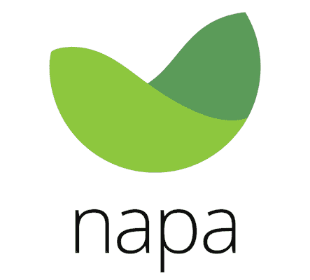

# 用 Napa 构建 API

> 原文：<https://www.sitepoint.com/build-apis-with-napa/>



API 是 web 开发中最热门的话题之一。随着 SPAs(单页应用)数量的增加和微服务热潮的兴起，API 会变得更加流行。作为 Ruby on Rails 的开发人员，我们拥有一个令人惊叹的框架，能够很好地构建 API。尽管 Rails 功能强大，但它也更复杂。有时我们需要一个更简单、更灵活的框架，一个只做一件事并且做得很好的框架。我想我找到了这样一个框架。请允许我向您介绍一个专门为构建 API 而设计的框架: [Napa](https://github.com/bellycard/napa) 。

Napa 结合了像 Grape、 [Roar](https://github.com/apotonick/roar) 和 ActiveRecord 这样的宝石，允许我们以最小的努力构建强大的 API。在本教程中，我们将学习如何使用 Napa 和[design](https://github.com/plataformatec/devise)构建一个带有令牌认证的 API。

## 安装 Napa

Napa 是一个宝石，需要 Ruby 2.0。我们需要首先使用 RVM 或 rbenv 安装它。切换到 Ruby 2.0 并安装 Napa:

```
gem install napa --no-ri --no-rdoc 
```

## 创建项目

首先，使用 Napa 的生成器创建项目:

```
napa new contact-service -d=pg 
```

默认情况下，Napa 将生成一个 MySQL 配置的项目。`-d=pg`开关告诉 Napa 生成一个 PostgreSQL 配置的项目。

Napa 将创建一个名为 **contact-service** 的项目目录，并生成所有必要的目录和文件。该项目的结构如下:

```
contact-service
- app
  - apis
  - models
  - representers
- config
- db
- lib
- log
- spec
- Gemfile
- Rakefile 
```

其结构与 Rails 应用程序非常相似，但更简单一些。应用程序的大部分代码都放在 **app** 目录中。我们的 API 将会在(等一下..)**原料药**目录。模型将进入**模型**目录，就像 Rails 一样。这里一个较新的位是**表示器**目录，它将保存 Roar 表示器。代表将模型转换成期望的 JSON 输出。其他目录的作用与它们在 Rails 应用程序中的作用相同。

切换到项目目录并安装所有 gem:

```
cd contact-service
bundle install 
```

安装完 gems 后，我们将在**中添加数据库细节。env** 。首先，创建数据库:

```
rake db:create 
```

让我们进入下一步。

## 创建 API

好东西的时间到了，创建实际的 API。为此，我们首先需要一个模型。使用姓名、电子邮件和电话号码等基本属性创建联系人模型:

```
napa generate model Contact name:string email:string phone:string 
```

迁移数据库:

```
rake db:migrate 
```

好了，现在让我们创建一个 API 端点:

```
napa generate api contact 
```

Napa 将生成 API 类-**app/APIs/contacts _ API . Rb**和表示器类-**app/representers/contact _ representer . Rb**。**联系人 _api.rb** 类应该如下所示:

```
class ContactsApi 
```

默认情况下，Napa 提供了 API 应该接受的参数的空白声明。这是为了保护 API 免受攻击。我们将更新`post`和`put`方法的`params`块，并设置允许的参数:

```
...
desc 'Create an contact'
params do
  optional :name, type: String, desc: 'The Name of the contact'
  optional :phone, type: String, desc: 'The Phone of the contact'
  optional :email, type: String, desc: 'The Email Address of the contact'
end
...

...
desc 'Update a contact'
params do
  optional :name, type: String, desc: 'The Name of the contact'
  optional :phone, type: String, desc: 'The Phone of the contact'
  optional :email, type: String, desc: 'The Email Address of the contact'
end
... 
```

现在，我们将更新**contact _ representator . Rb**类。在类中添加联系人模型字段，这些字段应该是 JSON 响应的一部分。更新**contact _ representator . Rb**类，如下所示:

```
class ContactRepresenter 
```

剩下的最后一部分是将 api 添加到 **application_api.rb** 中，它挂载 API:

```
class ApplicationApi  '/contacts'

  add_swagger_documentation
end 
```

## 发出一些请求

我们的 API 差不多准备好了。让我们用`curl`来测试一下。首先，启动开发服务器:

```
napa server 
```

现在，打开另一个终端，这样我们就可以在 API 上发出请求。首先，创建一个联系人:

```
curl -X POST -d name="Devdatta Kane" -d email="kane.devdatta@gmail.com" -d phone="25451512544" http://localhost:9393/contacts 
```

Napa 的回应总是包含在一个`data`元素中:

```
{
  "data": {
    "object_type": "contact",
    "id": "1",
    "name": "Devdatta Kane",
    "email": "kane.devdatta@gmail.com",
    "phone": "25451512544"
  }
} 
```

现在我们已经创建了一个联系人，让我们尝试获取所有联系人:

```
curl -X GET http://localhost:9393/contacts 
```

响应将是一个元素数组。

```
{
  "data": [
    {
      "object_type": "contact",
      "id": "1",
      "name": "Devdatta Kane",
      "email": "kane.devdatta@gmail.com",
      "phone": "25451512544"
    }
  ]
} 
```

我们可以通过传递联系人的 ID 来获取单个联系人:

```
curl -X GET http://localhost:9393/contacts/1 
```

它的回答是:

```
{
  "data": {
    "object_type": "contact",
    "id": "1",
    "name": "Devdatta Kane",
    "email": "kane.devdatta@gmail.com",
    "phone": "25451512544"
  }
} 
```

尝试更新联系人的详细信息:

```
curl -X PUT -d email="dev@devdatta.com" http://localhost:9393/contacts/1 
```

Napa 返回更新后的对象:

```
{
  "data": {
    "object_type": "contact",
    "id": "1",
    "name": "Devdatta Kane",
    "email": "dev@devdatta.com",
    "phone": "25451512544"
  }
} 
```

## 保护 API

我们有一个完全正常工作的 API。耶！但是完全没有安全感。嘘！我们允许 API 访问，无需任何认证。保护 API 最简单的认证方法之一是令牌认证。我们将使用[device](https://github.com/plataformatec/devise)在我们的 API 中实现简单的令牌认证。我们也可以自己实现身份验证，但是使用像 Devise 这样久经考验的库有其优势。

首先，在我们的 Gemfile 中添加 Devise:

```
gem 'devise' 
```

并更新包:

```
bundle install 
```

Devise 现已安装，但需要一个配置文件。在 Rails 中，我们可以使用 Devise generator 来生成文件，但在 Napa 中无法工作。所以我们将在**config/initializer**目录中手动创建文件。在该目录中创建一个名为**device . Rb**的文件，并添加以下内容:

```
Devise.setup do |config|
  config.secret_key = '6e059f15248c9c26e7208a4a1129029c13f4a0fcef629562c34a4b3f0b1bbcbb8ed1431728cdbc6fe6e6bc4ed0f90cc9fc701c962e63be107e0bfd021eb70f08'
  config.mailer_sender = 'a@example.com'
  require 'devise/orm/active_record'
  config.authentication_keys = [:email] 
  config.case_insensitive_keys = [:email ]
  config.strip_whitespace_keys = [:email ]
  config.skip_session_storage = [:http_auth]
  config.stretches = Rails.env.test? ? 1 : 10
  config.password_length = 8..128
end 
```

用新密码替换`config.secret_key`。现在我们将使用 Napa 的模型生成器创建一个用户模型。

```
napa generate model User 
```

Napa 也将创建模型类和迁移。打开迁移类并添加以下内容:

```
...
def change
  create_table :users do |t|
    t.string :email,              null: false, default: ""
    t.string :encrypted_password, null: false, default: ""
    t.string :authentication_token
    t.timestamps
  end
  add_index :users, :email, unique: true
  add_index :users, :authentication_token, :unique => true
end
... 
```

打开 **app/models/user.rb** 并添加以下内容:

```
class User 
```

现在我们已经有了模型和迁移，迁移数据库:

```
rake db:migrate 
```

我们将创建一个使用 Napa 控制台的用户，您可以使用:

```
napa console

pry(main)> User.create!(email:'kane.devdatta@gmail.com', password:'abcdabcd', password_confirmation:'abcdabcd') 
```

您应该得到以下输出:

```
 => #<user id: 1, email: "kane.devdatta@gmail.com", encrypted_password: "$2a$10$vdRAL.CusK3IEBTopa1cau5WTLihyNDdssuAtU3otieq...", authentication_token: "yFjgn5cwsFAfKhvU1R_t", created_at: "2015-08-08 11:41:05", updated_at: "2015-08-08 11:41:05">
</user> 
```

这是用户的`authentication_token`,我们稍后会用到。退出控制台。

我们必须为我们的 API 添加认证支持。按如下方式更新**app/API/application _ API . Rb**:

```
class ApplicationApi  '/contacts'

  add_swagger_documentation
end 
```

现在，再次启动`napa server`并测试认证是否正常工作:

```
curl -X GET http://localhost:9393/contacts 
```

这将导致一个错误，因为我们没有通过请求传递访问令牌:

```
{"error":{"code":"api_error","message":"401 Unauthorized"}} 
```

使用访问令牌尝试相同的请求:

```
curl -X GET http://localhost:9393/contacts\?access_token\=yFjgn5cwsFAfKhvU1R_t 
```

您将收到一个成功的回复:

```
{
  "data": {
    "object_type": "contact",
    "id": "1",
    "name": "Devdatta Kane",
    "email": "kane.devdatta@gmail.com",
    "phone": "25451512544"
  }
} 
```

## 包裹

今天我们学习了如何用 Napa 快速构建 API。Napa 通过中间件提供额外的功能，比如日志和敏感数据清理，你可以在 [Napa 的 GitHub 库](https://github.com/bellycard/napa)上探索这些功能。我们的身份验证解决方案也可以使用 OAuth 和访问授权之类的东西来改进，但是我把这项工作留给了您。

一如既往地欢迎评论和反馈。

## 分享这篇文章