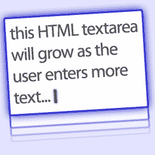

# 如何构建自动扩展的 Textarea jQuery 插件，第 1 部分

> 原文：<https://www.sitepoint.com/build-auto-expanding-textarea-1/>

自动扩展`textarea`元素在脸书等网站上很流行。根据用户输入的文本数量，`textarea`框的高度会伸缩。有几个优点:

1.  你的页面设计不是由大的`textarea`框所主导的。
2.  有几个文本区的在线表单看起来更短，完成起来也不那么困难。
3.  用户不用滚动就能看到所有的文本。

[**查看一个扩展的 textarea 演示……**](https://blogs.sitepointstatic.com/examples/tech/textarea-expander/demo.html)

这个 3 部分的教程描述了如何使用 HTML 和一个可重用的 jQuery 插件来构建一个自动扩展的`textarea`。在第 3 部分结束时，您将理解它是如何工作的，并拥有可以在自己的项目中使用的代码。

## 要求

像所有优秀的开发人员一样，我们应该彻底理解系统需求:

1.  当我们需要时，任何页面上的任何`textarea`应该自动扩展。
2.  但是，有些文本区域可能不需要自动扩展功能。
3.  我们必须能够指定`textarea`高度可以(a)无限增长，或者(b)在特定范围内增长，例如使用 50 到 200 像素之间的最佳高度。
4.  我们的解决方案应该可以在我们选择的任何页面上重用。
5.  应该使用渐进式增强技术来确保没有 JavaScript 的用户仍然可以使用标准的`textarea`框。
6.  该解决方案应跨浏览器兼容 IE6+、Firefox 2+、Opera、Safari 和 Chrome。

## 这个提议

我们将把这个解决方案实现为一个 jQuery 插件。jQuery 主要用于处理 DOM 嗅探和事件委托等更普通的方面；您可以使用另一个框架轻松地重写代码。

但是我们怎么知道什么时候应该调整一个`textarea`的大小，以及我们使用什么高度呢？

首先，我们可以为任何`textarea`分配一个“keyup”事件处理程序。这将在一个键被按下并且文本被修改后调用一个函数。

然后我们可以检查 DOM scrollHeight 属性。这将返回内部滚动部分的高度，即用户输入的文本的高度。如果我们将`textarea`的高度设置为当前的 scrollHeight 值，滚动条将会过时。不幸的是，scrollHeight 不是 W3C 的推荐标准，我们需要克服一些跨浏览器的不一致性:

*   在 Firefox、Safari 和 Chrome 中，scrollHeight 永远不会小于 textarea 的高度——即使没有添加任何文本。因此，框会扩大，但删除文本不会缩小。我们可以通过将 textarea 高度临时设置为 0px，然后应用 *real* scrollHeight 值来解决这个问题。
*   与 Mozilla scrollHeight 文档相反，Firefox 似乎不包含文本区域填充，而 Safari 4 和 Chrome 2 包含。如果我们在顶部和底部有 2px 的填充，那么在 WebKit 浏览器中 scrollHeight 会大 4px，并且 textarea 的高度会无限增长。减去填充会破坏 Firefox，所以最简单的解决方法是对扩展的 textarea 元素应用 0px 垂直填充。
*   在 IE 和 Opera 中，scrollHeight 是古怪的。它通常返回内部文本的真实高度，但是，将 textarea height 设置为 0px 可能会返回不正确的 scrollHeight 值。虽然[浏览器嗅探很糟糕](https://www.sitepoint.com/why-browser-sniffing-stinks/)，但我不认为在这种情况下我们有其他选择。我们必须确保 IE 和 Opera 从不设置 0px 的 textarea 高度。

我们还需要考虑滚动条。默认情况下，大多数浏览器只在需要时显示`textarea`滚动条。然而，如果我们将溢出设置为“自动”，滚动条将在添加新行时出现，然后随着`textarea`高度的改变而消失。将溢出设置为“隐藏”将解决滚动条闪烁的问题，但这决不能应用于非扩展文本区域或扩展超过其指定最大高度的文本区域。

最后，调整浏览器窗口大小可能是一个问题。Fluid web 设计可以实现一个基于百分比宽度的`textarea`:调整窗口大小会调整框的大小。虽然我们可以检测窗口大小调整，但事件在 IE 中表现很差，并快速调用处理程序。我们可以通过编码来解决这个问题，但是调整几个文本区域的大小会导致页面设计跳跃，让用户困惑。因此，在调整大小之后，我们将只在用户将焦点切换到那个框时调整一个`textarea`的高度。

这是一个很大的进步，还会有更多的进步！给自己冲杯咖啡，为第二部分做好准备……

*   [第二部分:文本区初始化](https://www.sitepoint.com/build-auto-expanding-textarea-2/)
*   [第三部分:JavaScript 插件代码](https://www.sitepoint.com/build-auto-expanding-textarea-3/)
*   [如何开发一个 jQuery 插件](https://www.sitepoint.com/how-to-develop-a-jquery-plugin/)

## 分享这篇文章