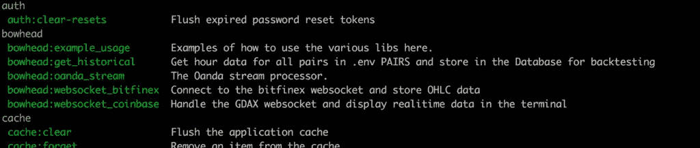
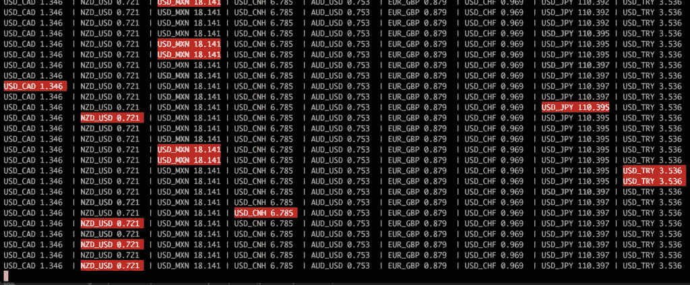
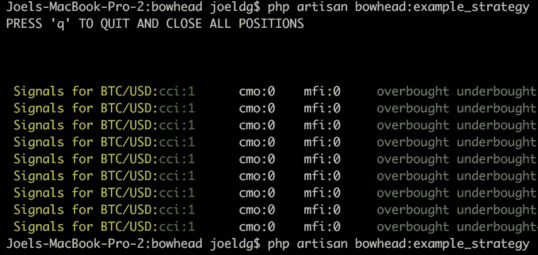
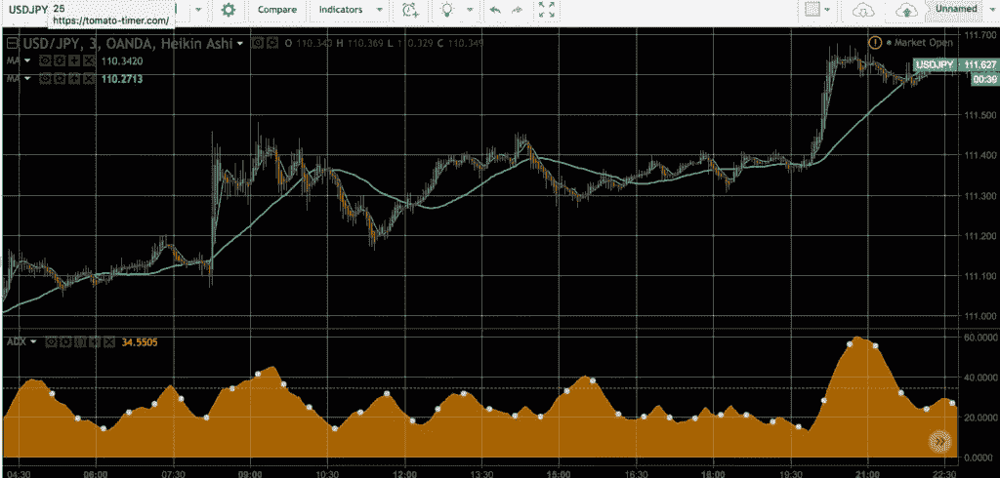
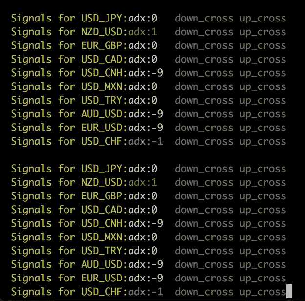
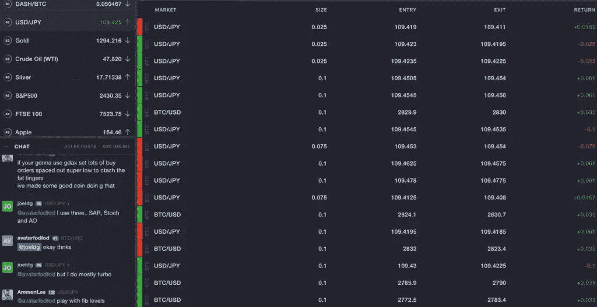

# 如何用 PHP 搭建一个加密货币自动交易机器人？💰

> 原文：<https://www.sitepoint.com/build-cryptocurrency-auto-trader-bot-php/>

*本文最初发表于[媒体](https://medium.com/@joeldg/an-advanced-tutorial-a-new-crypto-currency-trading-bot-boilerplate-framework-e777733607ae)上，经作者许可后转载于此。为什么不去那边给他们点❤️？*


本教程将带你了解用 PHP 构建比特币机器人的全过程——从设置，到你第一次执行自动交易，等等。

## 加密货币

我不需要告诉你，几个月前你可以以 11 美元的价格购买加密货币以太，它迅速上涨到 43 美元(我在这两个价格之间购买)，截至 2017 年 6 月，现在已经超过 335 美元。这种收益对于传统投资者来说几乎是不可思议的，然而这是这个领域的普遍现象。
兴奋了吗？这是一个场景:

您在加密货币上赚了一大笔钱，但由于潜在的资本利得税问题，您对通过您的银行转移加密货币有些担忧。如果你想将这笔钱用于其他投资，有些地方可以为你提供解决方案。这些地方不会让你拍摄你的许可证并将其发送进来，只需使用电子邮件，他们为你提供 BTC 存款钱包、模拟账户、API，然后当你准备好了，你就可以将钱发送进来，到了“开始”的时候，你可以使用加密货币作为基础货币工具，进行从国债到外汇的一切交易。

但是，你说，我是一个喜欢自动化的程序员，当然我们可以启动一些 BTCbot，我们可以让它为我们工作，这将使我们在睡眠中获得数百万，对不对？

大概不会。

## 我的解决方案

我不想写一个机器人，发布一个单一的策略，只是说“这里，用这个”，我不认为这对任何人都有帮助，我宁愿给你工具，告诉你如何自己编写策略，告诉你如何为策略设置数据收集，以及如何在交易系统中实现它们，并查看结果。

此外，我不想用一种新的或晦涩难懂的语言来创建它，我希望它用 PHP 编写，大多数人都熟悉它，并且在一个框架(Laravel 这里有一个很棒的[高级课程](https://www.sitepoint.com/premium/courses/laravel-5-2930?aref=bskvorc)出售，如果你不熟悉它，还有一堆免费文章)中，它简单易用，但足够强大，让你可以创建你需要的东西。如果你认为 PHP 只是用于网页，继续读下去，这会让你大吃一惊。

我喜欢建立系统。我写这个帖子已经有一段时间了，它代表了大量的非衍生定制工作。如果你读过我的一些其他教程，你知道我喜欢写“我希望我已经找到而不是不得不写”的教程，所以你会彻底阅读，有很多复制粘贴式的食谱。

让我们开始吧。

### 我们将采取的步骤:

*   安装样板文件/框架。
*   浏览系统的核心部分，看看哪里有什么。
*   安装和配置我们需要的软件。
*   在我们将使用的经纪公司创建帐户，为脚本设置 API 密钥。
*   运行测试和示例。
*   设置 websocket 流以获取数据。
*   为我们的自动化代理寻找策略。
*   深入探究我们可用的指示器和蜡烛。
*   编写我们第一个特工的代码。
*   测试代理。
*   对你所冒的风险说几句结束语。

## 安装样板文件/框架(Bowhead)

你可以在它的 [Github 仓库](https://github.com/joeldg/bowhead)中找到 Bowhead 样板文件的仓库。它已经是一个完整的应用程序，但我们将使用它的功能来完成这篇文章中的内容。

*建议您使用极其友好的 [Homestead Improved](https://www.sitepoint.com/quick-tip-get-homestead-vagrant-vm-running/) 游民箱，这是一个良好的、隔离的开发环境，您可以在 5 分钟内开始使用。如果你不熟悉流浪者，这里有一个极好的[重新介绍](https://www.sitepoint.com/re-introducing-vagrant-right-way-start-php/)，如果你想深入挖掘，这本[高级书](http://bit.ly/phpenv-sp)会教你惊人的事情。*

```
git clone https://github.com/joeldg/bowhead.git
cd bowhead
composer install
cp .env-example .env
sudo pecl install trader
echo "extension=trader.so" | sudo tee /etc/php/7.1/mods-available/trader.ini
sudo phpenmod trader 
```

现在让我们来解释应用程序的当前文件夹结构。

### 应用程序/控制台/命令/

这是我们所有控制台命令的位置。

*   `BitfinexWebsocketCommand.php`–来自 Bitfinex 的流式市场数据
*   `CoinbaseWebsocketCommand.php`–从 GDAX 获取市场数据
*   `ExampleForexStrategyCommand.php`–外汇策略示例
*   `ExampleStrategyCommand.php`–我们的战略示例
*   `ExampleUsageCommand.php`–基本用法示例
*   `GetHistoricalCommand.php`–从经纪人处获取历史数据
*   `OandaStreamCommand.php`–来自 Oanda 的流式市场数据

### 应用程序/实用程序/

在这里可以找到所有可用的实用程序类。

*   `Bitfinex.php`–Bitfinex API 包装器
*   `BrokersUtil.php`–各种经纪人的公用事业
*   `Candles.php`–所有 60 款 TALib 蜡烛包装
*   `Coinbase.php`–GDAX API 包装器
*   `Console.php`–控制台颜色、表格和进度
*   `Indicators.php`–21 个 TALib 指标和移动平均线。
*   `Oanda.php`–Oanda API 包装器
*   `OneBroker.php`–1 代理 API 包装器
*   `Other.php`–可能的指标，尚未实施
*   这是你的测试策略
*   `Whaleclub.php`–whale club API 包装器

### 应用程序/脚本

额外的和一些测试数据，这些脚本是 SKLearn 价格预测脚本，取自一项关于啤酒消费的研究，我认为非常有用，这些可能用于市场价格预测。

*   `close_prediction.py`–sk learn 脚本预测收盘价
*   `ohlc-btc.csv`–CSV 数据样本，如果需要
*   `open_prediction.py`–sk learn 预测开盘价的脚本–根目录下名为“streaming.py”的 python 脚本，它是 Oanda streaming 命令的一部分。

如果执行`php artisan`，应该会看到类似下面的东西，你感兴趣的部分在下面。



### Redis 和 MySQL

Redis 真的不需要任何开箱即用的调整，如果你使用的是[Homestead enhanced](https://www.sitepoint.com/quick-tip-get-homestead-vagrant-vm-running/)，它已经安装好了。

MySQL 将需要一个数据库和一些表格。更改`.env`文件中的凭证(如果不存在，从`.env.example`创建)。

```
DB_CONNECTION=mysql
DB_HOST=localhost
DB_PORT=3306
DB_DATABASE=homestead
DB_USERNAME=homestead
DB_PASSWORD=secret 
```

让我们将数据库转储添加到 MySQL 中:

```
mysql -u homestead -psecret < app\Script\DBdump.sql 
```

在 Sequel Pro 之类的工具中打开数据库，您将看到 bowhead_ohlc(开盘价、盘高、盘低、收盘价)表中的样本数据。

## 为了设置自动交易，我们需要 API 帐户

> 完全披露:在可能的情况下，我在这些链接上为你设置了奖金，以下所有网站提供免费账户，不需要“验证”，也不需要押金。这些链接是推荐链接，如果你注册的话，也会给我带来一些好处。

1) [Whaleclub](https://whaleclub.co/join/tn6uE) 是本教程中我们想要交易的主要网站。他们从 Bitfinex websocket 获取市场数据，并与 Oanda Forex 流数据相匹配。该网站允许您以高达 20 倍的杠杆与 BTC 交易许多工具和商品，外汇交易高达 222 倍，并提供基于 BTC 的二元期权。他们有一个简单，易于理解的界面和一个优秀的 API。点击右上角的您的姓名，然后点击 API，即可找到 API 密钥。(使用演示 API 键启动)

2) [1Broker](https://1broker.com/?r=21434) 我们想要交易的二级网站，他们类似于其他 BTC 的做市商，也有一个相当有趣的“交易者跟踪”系统，特别是让人们跟踪“你”。API 键在右边，就在电子邮件图标下面，有一个看起来像滑块的小框，然后点击访问& API 管理。

3) [Oanda](https://www.oanda.com/) 是我们获取流式外汇数据的地方，你需要一个账户。在这里找到了 API 访问[。](https://www.oanda.com/demo-account/tpa/personal_token)

4) [比特币基地/GDAX](https://www.coinbase.com/join/51950ca286c21b84dd000021) 过去被称为“比特币基地交易所”，现在被称为 GDAX。自从他们开业以来，我一直在那里进行自动交易。API 密匙在右上角，然后点击 API 并创建你的密匙。

5)[Bitfinex](https://www.bitfinex.com/)–你需要一个有 API 密匙的账户，这样我们才能获得加密货币报价。API 键位于“帐户”下，然后单击 API。

6) [Poloniex](https://poloniex.com/) 类似 Bitfinex，但支持许多替代币。API 密钥位于设置–API 密钥下。

7) [TradingView](http://tradingview.go2cloud.org/SHpx) 不是必须的，但你会想要一个账户，因为 bowhead 使用的所有指标都可以在图表上查看，以帮助你建立策略。

这种组合背后的原因是 Whaleclub 和 1Broker APIs 是有速率限制的，WC 每分钟只允许 60 个请求，如果我们想确保我们有实时数据流，我们需要从 BTC 的一家经纪公司获得数据流。外汇也是如此。

一定要在这些网站上四处看看，看看他们能提供什么，我已经和许多经纪人和做市商网站在一起了，对于 BTC 来说，截至 2017 年 6 月，这些网站都很好。对于外汇，Oanda 是伟大的，但在这里使用 BTC 交易的目的，我们只需要他们的外汇数据流。

一旦你得到了这些站点的 API 密匙，你会想把它们放到你的`.env`文件中。

> 注意:从使用演示/测试 API 密匙开始，不要在未经测试的交易脚本中使用真钱 API 密匙。

### 让我们测试一下我们的设置是否正确。

Bowhead 有一个测试脚本来验证一切都设置正确，你有正确的 API 密钥，PHP 版本和交易扩展安装正确。

```
php artisan bowhead:example_usage 
```

该脚本将在您可能遇到的任何问题上停止，并提供运行来修复问题的命令或获取您可能仍然需要的 API 密钥的链接。

### 让数据流入

对于这里的数据，我们需要做两件事，这样我们就可以创建一个可以交易加密和外汇对的自动化交易系统。我们将使用这些数据在 BTC 做市商网站上进行实时交易。

*   获得从 Oanda 进入我们的数据库的流动外汇数据。
*   从 Bitfinex 获取流入我们数据库的加密货币流数据

> 注意:您应该在运行应用程序的服务器上安装 screen 命令。Screen 是一个终端工具，用于分离窗口并保持它们在后台运行。您可以分离屏幕、注销并在其他时间从其他位置返回并重新连接到它。

```
screen python streaming.py
screen php artisan bowhead:oanda_stream 
```



这是什么样子的外汇流注，如果你打开回显。

现在，如果外汇市场是开放的(美国东部时间，周日下午 5:00 到周五下午 4:00)，您将开始看到数据流入 bowhead_ohlc 表，用于 Whaleclub 上交易的货币对。列表在 streaming.py 中，可以在那里修改。以下配对现在都实时流入你的数据库。美元日元，欧元美元，澳元美元，欧元英镑，美元加元，美元瑞士法郎，美元 MXN，美元特里，美元 CNH，新西兰元美元

现在我们有了常规的外汇数据，让我们加入 BTC/美元货币对。

```
screen php artisan bowhead:websocket_bitfinex 
```

加密市场是 24/7 开放的，你应该立即开始看到当前的数据流入。

使用`screen -list`和`screen -r`查看这些正在运行的进程并重新连接它们

```
~$ screen -list
There are screens on:
 4604.ttys005.Joels-MacBook-Pro-2 (Detached)
 4636.ttys005.Joels-MacBook-Pro-2 (Detached)
 4652.ttys005.Joels-MacBook-Pro-2 (Detached)
3 Sockets in /var/folders/bq/79z2kd916hbd39n5bckb5_s00000gn/T/.screen. 
```

左边的数字是屏幕 id，因此在这种情况下，您可以使用以下命令重新连接到最新的(Bitfinex)屏幕。

```
screen -r 4604 
```

出于本教程的目的，我们只在本地机器上使用 screen，对于服务器环境，我们将它们放在 supervisord 上，以确保它们始终在我们的服务器上运行，如果它们死亡，那么它们会重新启动。

这是我使用的超级配置，你可能需要为你的用户改变目录。从`/etc/supervisor/conf.d/crypt.conf`开始:

```
[program:oanda]
command=/usr/bin/python streaming.py
user=ubuntu
directory=/home/ubuntu/bowhead
startretries=3
stopwaitsecs=10
autostart=true
[program:o_stream]
command=/usr/bin/php artisan bowhead:oanda_stream
user=ubuntu
directory=/home/ubuntu/bowhead
startretries=3
stopwaitsecs=10
autostart=true
[program:wsbitfinex]
command=/usr/bin/php artisan bowhead:websocket_bitfinex
directory=/home/ubuntu/bowhead
startretries=3
stopwaitsecs=10
autostart=true 
```

您可以在 Supervisor 中看到这些内容

```
~$ sudo supervisorctl
o_stream      RUNNING   pid 31644, uptime 1 day, 22:15:24
oanda         RUNNING   pid 31645, uptime 1 day, 22:15:24
wsbitfinex    RUNNING   pid 31646, uptime 1 day, 22:15:24
supervisor> help
default commands (type help <topic>):
=====================================
add    exit      open  reload  restart   start   tail
avail  fg        pid   remove  shutdown  status  update
clear  maintail  quit  reread  signal    stop    version
supervisor> 
```

> 注意:目前，bowhead 仅支持 Bitfinex 的 LTC 美元，我将在未来的版本中添加 ETH 和 LTC。如果您愿意，可以通过复制和修改`BitfinexWebsockCommand.php`文件来使用 ETHUSD 并重命名该类，从而创建一个 ETH 版本。您需要将任何新的命令类添加到`app/Console/Kernel.php`中的`$commands`数组中

### 寻找策略

因此，我们已经建立了样板/框架。我们有账户，有数据流入我们的数据库。我们还有指示器/信号和蜡烛在工作。让我们来看看如何创建一个非常简单的策略。

既然我们看到了如何利用这一点，我们需要战略，我们需要知道如何找到更多的战略。Quantopian 是一个伟大的战略资源。

例如，我最近在看的两个:“股票在移动”和“在多个 TA-Lib 信号上交易”都很有趣，但是说我们在 bowhead 中使用 TALib 方法，让我们使用后者，此外这将只适用于 BTC，因为 Oanda 不返回外汇对的交易量。

你会注意到，这个策略使用三个信号来确定一只股票(或者在我们的例子中是一对)是超买(卖出)还是欠买(买入)。

*   货币流通指数
*   商品频道指数(cci)
*   钱德动量振荡器

这是一个简单的技术策略，如果这三个指标都一致，那么我们就按照他们说的方向走。下面是该策略的核心部分代码。

```
$indicators  = new \Bowhead\Util\Indicators();
$recentData  = $util->getRecentData('BTC/USD');
$cci = $indicators->cci($instrument, $recentData);
$cmo = $indicators->cmo($instrument, $recentData);
$mfi = $indicators->mfi($instrument, $recentData);

/** instrument is overbought, we will short */
if ($cci == -1 && $cmo == -1 && $mfi == -1) {
    $overbought = 1;
}
/** It is underbought, we will go LONG */
if ($cci == 1 && $cmo == 1 && $mfi == 1) {
    $underbought = 1;
} 
```

不要担心把它放在哪里，这个策略作为一个控制台命令包含在 bowhead 中

```
php artisan bowhead:example_strategy 
```

> 注意:**在测试之前，不要在您的 LIVE 帐户上运行此功能，请使用您的演示 API 密钥开始。**

输出会是这样的！



如果你想看看这些指标在图表上是什么样子，那就去 TradingView 添加指标。TradingView idea stream 是另一个寻找策略和了解其他人在做什么的好地方，你可以在 TradingView 的源代码部分查看这些策略。

### 船头指示器和蜡烛

我在 bowhead 中提供了两个类来检查数据信号:蜡烛和指示器。每个类都有一个`all`方法，该方法将在您提供的数据上运行其父类中的所有方法。

为了在不牺牲功能的情况下尽可能保持简单，这两个库中的所有方法都提供了-1、0 或 1 的返回值。其中“1”将始终是买方或“看涨”方，而“-1”将始终是卖方或“看跌”方，如适用。有几个函数返回-100 和 100 作为返回值，请阅读每个方法上方和每个类中的注释，以获得关于异常返回值的更多信息，因为有链接解释它们的作用和我们为什么使用它们，以及它们代表什么，以及如何在脚本中使用它们。

Candles.php[—`allCandles()`方法将检查数据集中是否存在 60 根特定的蜡烛线。它返回一个复杂的数组，甚至提供蜡烛的数据点位置和蜡烛周围的数据点。出于自动化脚本的目的，返回中的`current`数组是当前活动的蜡烛线。](https://github.com/joeldg/bowhead/blob/master/app/Util/Candles.php)

[Indicators.php](https://github.com/joeldg/bowhead/blob/master/app/Util/Indicators.php)—在一个数据集上提供多个指标，这些都是常见的技术指标，如布林线、RSI 和多种类型的移动平均线。这些指标包括重叠研究、势头指标、数量指标和波动性指标。目前还没有周期指标。核心方法有`adx`、`aroonosc`、`cmo`、`sar`、`mfi`、`obv`、`stoch`、`rsi`、`macd`、`bollingerBands`、`atr`，MA 方法有`sma`、`ema`、`wma`、`dema`、`tema`、`trima`、`kama`、`mama`、`t3`，可以用`macdext()`动态组合使用。

> SMA 方法通常自己调用，因为它们不能用买入或卖出信号来响应

这两组指标和蜡烛可以以许多不同的方式组合，在每个类顶部的评论中已经提到。结合 MA 交叉和熊市/牛市蜡烛图(这对均线来说是不明显的)，你可以更好的确定你的进场和出场。

以这种方式包装这些交易者方法给你提供了很大的灵活性，你可以很容易地使用它们，正如你在上面注意到的，当你只有买入(1)/持有(0)/卖出(-1)信号时，翻译策略是非常简单的。

### 编码吧

因此，让我们做另一个快速脚本，将展示我们所做的事情，这一次让我们做一个外汇机器人，在 WC 上交易所有对，它将使用以下技术策略。

*   平均方向运动指数(ADX)是一个趋势指标，通常返回 0-100 之间的数字。低于 20 表明趋势疲软，高于 50 表明趋势强劲。Bowhead 为 20 岁以下返回 a -1，为 50 岁以上返回 1；

*   两个简单的移动平均线，周期 6 和周期 40。第 6 期 SMA 将非常紧密地跟随价格，并消除任何峰值。SMA 40 是平滑得多的平均值，当运动开始发生时，它将在不同的点穿过周期 6。ADX 是一种检验，证明我们确实处于一个趋势中，而不是处于一个窄幅波动的市场中。

*   当 ADX 记录了一个趋势(超过 50)，我们的 SMA(40)向下穿过 SMA(6)时，我们可以买入，因为趋势正在上升。

*   当 ADX 记录了一个趋势，我们的 SMA (40)向上穿过 SMA(6)时，我们可以卖出，因为趋势正在向下移动。

下面是这个在 TradingView 上的样子，底部的橙色是 ADX，绿线是 SMA(6)，蓝线是 SMA(40)。你可以看到你最有可能*希望*在哪里进行交易，你瞧，我们在这些确切的地方或附近有一些线交叉。



似乎有点复杂？当你在 bowhead 工作的时候就不会了。最重要的是我们需要从堆栈中获取数据来检查以前和当前的值，这样你就可以知道一个移动平均线何时穿过另一个移动平均线。

```
$recentData = $util->getRecentData($instrument);

$adx         = $indicators->adx($instrument, $recentData);
$_sma6       = trader_sma($recentData['close'], 6);
$sma6        = array_pop($_sma6);
$prior_sma6  = array_pop($_sma6);
$_sma40      = trader_sma($recentData['close'], 40);
$sma40       = array_pop($_sma40);
$prior_sma40 = array_pop($_sma40);
/** have the lines crossed? */
$down_cross  = (($prior_sma6 <= $sma40 && $sma6 > $sma40) ? 1 : 0);
$up_cross    = (($prior_sma40 <= $sma6 && $sma40 > $sma6) ? 1 : 0);
Now you can just
if ($adx == 1 && $down_cross) {
    $buy = 1;
}
if ($adx == 1 && $up_cross) {
    $sell = 1;
} 
```

### 测试它

好的，所以我提供了如下的文件，ADX 将在没有至少 21 个数据点的情况下抛出错误(-9)，所以请记住这一点。

```
app/Console/Commands/ExampleForexStrategyCommand.php
~$ php artisan bowhead:example_forex_strategy 
```

这是它看起来的样子。



## 结束语和关于风险的注释

现在，您可以通过技术指标和蜡烛图找到策略并快速构建自己的脚本来交易加密货币。天空是极限。

因为这是在 Laravel 框架内，你可以创建网页来管理你的自动交易，使用基于网络的工具轻松创建策略。您可以使用 queues and jobs 系统获得策略“workers”(我将在更新时添加)、广播等等。

现在来谈谈风险。

> 我想指出的是，加密货币交易存在很大的风险，在测试和制定策略时，你需要确保自己处于演示模式。这是至关重要的，因为我不愿意听到有人因此而损失任何金额的钱。

我个人相当能承受风险，有时会有回报。我使用 Bowhead 进行 WC“Turbo”交易(这是外汇二元期权)，这些是 1 分钟和 5 分钟合约价格上涨或下跌的“猜测”。如果你猜对了，那么赢得高达 75%的回报，如果你猜错了，那么你失去了你的整个赌注。有一些外汇策略专门针对涡轮交易，我有一些好运气。然而，请注意，大多数要求你在一个趋势市场。因此，像 ADX 这样的长期指标是个不错的选择。

这是一个成功策略的例子。




## 最后一个音符

第 2 部分将介绍如何让您的机器人与所有交易所对话，甚至尝试辨别价格差异，使用大约五种外汇策略构建实时 GDAX 跨座机器人，甚至将 Bowhead 设置为 API。

如果您注意到这里有任何错误或对代码有任何问题，请让我知道，在这里发表评论或在 Github 库中提出问题，我会解决它。

—请记住，该项目正在积极开发中。

## 分享这篇文章