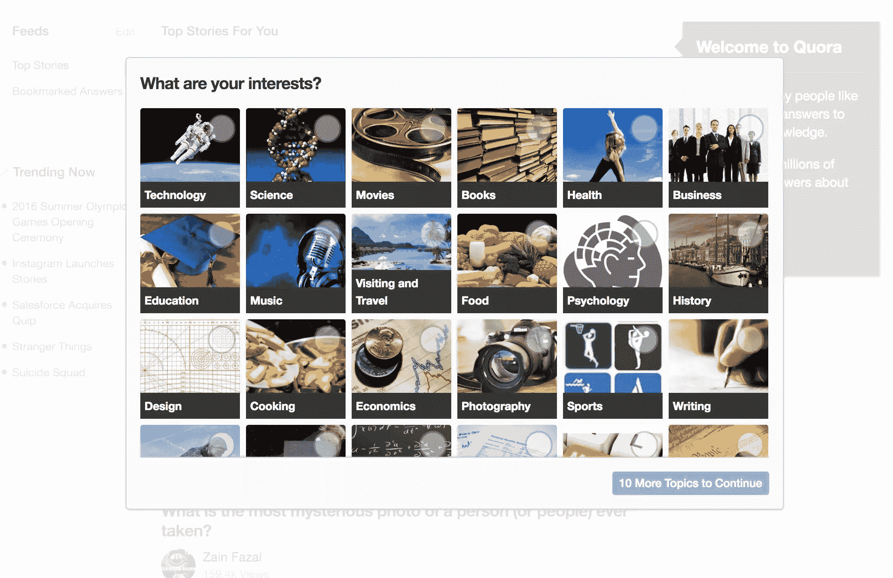
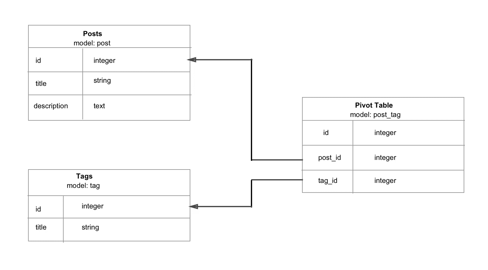

# 利用 Rails 中的精选提要挖掘用户兴趣

> 原文：<https://www.sitepoint.com/build-curated-interest-feeds-in-rails/>

通常，当注册一个新平台时，你会被要求从一个列表中选择一个条目，以便看到与你的兴趣相关的帖子。采用这种技术的网站有 [Quora](https://www.quora.com/) 、 [Medium](https://medium.com/) 和 [pinterest](https://www.pinterest.com/) 等等。这是 quora 刚注册后的截图。



在本教程中，我们将在一个普通的博客上实现这个功能。在第一部分中，我们将创建帖子并标记它们。稍后，我们将添加用户认证，让用户选择他们的兴趣。这里是一个工作的演示。完整的代码可以在 [github](https://github.com/andela-cvundi/curated-feed/) 上找到。

让我们从创建一个新的 rails 应用程序开始。我在本教程中使用的是 rails 4.2:

```
rails new curated-feed 
```

## 博客

现在让我们分别创建一个 post 控制器和一个 post 模型:

```
rails g controller Posts index feed new edit show
rails g model Posts title:string description:text
rake db:migrate 
```

我们将要创建的帖子非常简单，只有标题和描述。让我们添加一个*post 资源*，这样我们就可以获得所有的路由来对*post*执行 CRUD 操作。我们还将把我们的`root_path`改为指向`PostsController`的`index`动作:

*config/routes.rb*

```
Rails.application.routes.draw do
  #create routes for performing all CRUD operations on posts
  resources :posts

  #make the homepage the index action of the posts controller
  root 'posts#index'
end 
```

现在，将以下代码添加到控制器操作中:

*app/controllers/posts _ controller . Rb*

```
class PostsController < ApplicationController
  before_action :find_post, only: [:show, :edit, :update, :destroy]

  def index
    @posts = Post.all
  end

  def feed

  end

  def new
    @post = Post.new
  end

  def create
    @post = Post.new post_params
    if @post.save
      flash[:success] = "Post was created successfully"
      redirect_to @post
    else
      render :new
    end
  end

  def show
  end

  def edit
  end

  def update
    if @post.update post_params
      flash[:success] = "The post was updated successfully"
      redirect_to @post
    else
      flash.now[:danger] = "Error while submitting post"
      render :edit
    end
  end

  def destroy
    @post.destroy
    redirect_to root_url
  end

  private

  def post_params
    params.require(:post).permit(:title, :description, tag_ids: [])
  end

  def find_post
    @post = Post.find(params[:id])
  end
end 
```

对于典型的 Rails CRUD 应用程序来说，`index`、`create`、`update`和`destroy`动作是正常的。我们已经声明了一个`before_action`来为`show`和`edit`动作找到一个帖子。稍后我们将为`feed`方法添加代码。

开始创建视图。我们将使用 bootstrap，因为它使样式非常容易:

*Gemfile*

```
gem 'bootstrap-sass'
[...] 
```

然后运行`bundle install`

我们需要更新我们的*app/files/CSS/application . scss*文件，这样引导样式才能生效:

```
@import "bootstrap";
@import "bootstrap-sprockets"; 
```

首先，这是我们布局的代码:

*app/views/layouts/application . html . erb*

```
<nav class="navbar navbar-default">
  <div class="container">
    <div class="navbar-header">
      <%= link_to 'Curated-feed', root_path, class: 'navbar-brand' %>
    </div>
    <div id="navbar">
      <ul class="nav navbar-nav pull-right">
        <li>
      </ul>
    </div>
  </div>
</nav>

<div class="container">
  <% flash.each do |key, value| %>
    <div class="alert alert-
      <%= value %>
    </div>
  <% end %>
  <%= yield %>
</div> 
```

为表单制作一个分部总是一个好主意:

*app/views/posts/_ form . html . erb*

```
<div class="form-group">
  <%= form_for @post do |f| %>
    <div class="form-group">
      <%= f.label :title %>
      <%= f.text_field :title, class: "form-control" %>
    </div>

    <div class="form-group">
      <%= f.label :description %>
      <%= f.text_area :description, class: "form-control" %>
    </div>

    <div class="form-group">
      <%= f.submit class: "btn btn-primary" %>
    </div>
  <% end %>
</div> 
```

最后，这里是一篇文章的`new`、`edit`、`show`和`index`视图:

*app/views/posts/new . html . erb*

```
<div class="col-md-6 col-md-offset-3">
  <h1>Create a new post</h1>
  <%= render 'form' %>
</div> 
```

*app/views/posts/edit . html . erb*

```
<div class="col-md-6 col-md-offset-3">
  <h1>Create a new post</h1>
  <%= render 'form' %>
</div> 
```

*app/views/posts/show . html . erb*

```
<div class="col-md-8 col-md-offset-2">
  <h1><%= @post.title %></h1>
  <p><%= @post.description %></p>
</div> 
```

*app/views/posts/index . html . erb*

```
<div class="col-md-8 col-md-offset-2">
  <h1>All posts</h1>
  <% @posts.each do |post| %>
    <ul>
      <li>
        <h3><%= post.title %></h3>
        <p><%= post.description %></p>
      </li>
    </ul>
  <% end %>
</div> 
```

因此，到目前为止，我们一直在 Rails 的 RESTful 方法的范围内。这是一个提要视图，它是非标准的。

*app/views/posts/feed . html . erb*

```
<div class="col-md-8 col-md-offset-2">
  <h1>Feed</h1>
</div> 
```

最终，feed 视图将只包含带有用户兴趣标签的帖子。实际上，提要和索引视图中的代码不会有什么不同。唯一的区别是在索引和提要操作中加载文章的逻辑。

现在我们已经设置了视图，我们可以播种我们的数据库，这样我们就可以看到总体布局。我将使用 [faker gem](https://github.com/stympy/faker) 将 15 篇文章植入数据库，因此将它添加到 **Gemfile** :

```
[...]
gem 'faker', '~> 1.6', '>= 1.6.6'
[...] 
```

运行`bundle install`安装宝石。使用我们工具箱中的 faker gem，种子文件如下所示:

*app/db/seeds.rb*

```
15.times do
  title = Faker::Lorem.sentence # all options available below
  description = Faker::Lorem.paragraph
  Post.create!(title:  title,
               description: description)
end 
```

运行`rake db:seed`用假数据填充我们的数据库。如果你在浏览器中访问`http://localhost:3000`，你应该会看到随机的帖子。这很无聊，不过，我相信你已经过了用 Rails 创建博客的阶段。在下一节，我们将讨论给文章添加标签。

### 标记帖子

标签和文章，您可能会意识到多对多的关系，也就是说，一个标签可以与许多文章相关联，反之亦然。为此，我们需要一个数据透视表。数据透视表是两个其他表之间有关系的中间表。它通过使用两个外键来定义其他表中的行，从而将这两个表链接在一起。下图将帮助您更好地理解这一点:



首先，生成标记模型:

```
rails g model Tag title
rake db:migrate 
```

和枢轴模型。姑且称之为`post_tag`:

```
rails g model Post_tag title post:references tag:references
rake db:migrate 
```

更新我们的模型以记录这些关系:

*应用/模型/标签. rb*

```
[...]
has_many :post_tags, dependent: :destroy
has_many :posts, through: :post_tags
[...] 
```

*app/models/post.rb*

```
[...]
has_many :post_tags, dependent: :destroy
has_many :tags, through: :post_tags
[...] 
```

现在我们已经声明了我们的关系，是时候添加在创建或编辑文章时标记文章的功能了。我们必须更改指定帖子允许的参数的行，允许*tag _ id*作为这些参数的一部分:

*app/controllers/posts _ controller . Rb*

```
def post_params
  params.require(:post).permit(:title, :description, tag_ids: [])
end 
```

注意，`tag_ids`被存储为一个数组，因为一篇文章可以被多个标签标记。我们不会创建标签控制器，因为在本教程中，所有标签都是在控制台中创建的。但是，我们将创建一个标记 partial，使我们能够在帖子下面呈现标记:

```
 mkdir app/views/tags
touch app/views/tags/_tag.html.erb 
```

*app/views/tags/tag . html . erb*

```
<span class="quiet"><small><%= link_to tag.title, "#" %> </small></span> 
```

让我们通过控制台创建一些标签。五个就够了:

```
$ rails c
Tag.create!(title: "technology")
Tag.create!(title: "politics")
Tag.create!(title: "science")
Tag.create!(title: "entrepreneurship")
Tag.create!(title: "programming") 
```

我们可以使用复选框来标记文章，但复选框可能会有限制。假设我们有数百个标签，这意味着数百个复选框。乱七八糟吧？在本教程中，我们将为此需要[选择轨道](https://github.com/tsechingho/chosen-rails)宝石。Chosen 是一个 jQuery 插件，它使得长而笨拙的选择框更加用户友好。它还可以通过输入标签名称来过滤标签。将此添加到您的 **Gemfile** 中，然后执行`bundle install`:

*Gemfile*

```
[...]
gem 'compass-rails'
gem 'chosen-rails'
[...] 
```

更新以下文件以使选择生效:

*app/assets/JavaScript/application . js*

```
[...]
//Make sure you require chosen after jquery. In my case I have it after the turbolinks line
//= require chosen-jquery
[...] 
This is for those using jQuery. There's documentation for those of you using prototype on the chosen-rails github repo.

*app/assets/css/application.scss*

```

```
[...]
*= require chosen
[...] 
```

然后，在您的 **app/assets/javascripts** 文件夹中，添加这个 CoffeeScript 文件:

*app/assets/JavaScript s/tag-select . js . coffee*

```
 $ ->
  # enable chosen js
  $('.chosen-select').chosen
    allow_single_deselect: true
    no_results_text: 'No results matched'
    width: '450px' 
```

将这个代码片段添加到表单中，以便用户可以选择标签:
*app/views/posts/_ form . html . erb*

```
<div class="form-group">
  <%= f.collection_select :tag_ids, Tag.order(:title), :id, :title, {}, { multiple: true, class: "chosen-select" } %>
</div>

</code></pre>

<p>This is how your form should look like now:</p>
<pre><code>
<div class="form-group">
  <%= form_for @post do |f| %>
    <div class="form-group">
      <%= f.label :title %>
      <%= f.text_field :title, class: "form-control" %>
    </div>

    <div class="form-group">
      <%= f.label :description %>
      <%= f.text_area :description, class: "form-control" %>
    </div>

    <div class="form-group">
      <%= f.collection_select :tag_ids, Tag.order(:title), :id, :title, {}, { multiple: true, class: "chosen-select" } %>
    </div>

    <div class="form-group">
      <%= f.submit class: "btn btn-primary" %>
    </div>
  <% end %>
</div> 
```

尝试创建一个新帖子。您应该能够添加和移除标签，就像您在堆栈溢出时所做的那样。如果标签不在可用选项列表中，也可以让用户创建标签，但这超出了本教程的范围。我们还想在文章下面列出属于某篇文章的标签。更新文章索引视图，如下所示:

*app/views/posts/index . html . erb*

```
<div class="col-md-8 col-md-offset-2">
  <h1>All posts</h1>
  <% @posts.each do |post| %>
    <ul>
      <li>
        <h3><%= post.title %></h3>
        <p><%= post.description %></p>
        <% if post.tags.any? %>
          <p>Tags: <%= render post.tags %></p>
        <% end %>
      </li>
    </ul>
  <% end %>
</div> 
```

## 建模用户

让我们允许人们在我们的平台上注册。为此，我们将使用[设计](https://github.com/plataformatec/devise)宝石:

*Gemfile*

```
[...]
gem 'devise', '~> 4.2'
[...] 
```

然后做一个`bundle install`。

运行设计生成器。

```
rails generate devise:install 
```

运行该命令后，您将在控制台中看到几条指令。您可以放心地忽略这些说明，因为我们已经设置了大部分内容，并且今天不会发送任何电子邮件。

让我们生成用户模型:

```
rails g devise User
rake db:migrate 
```

此时，用户可以注册并登录。更新导航，以便用户能够看到*注册*、*登录*和*注销*链接:

*app/views/layouts/application . html . erb*

```
<nav class="navbar navbar-default">
  <div class="container">
    <div class="navbar-header">
      <%= link<em>to 'Curated-feed', root</em>path, class: 'navbar-brand' %>
    </div>
    <div id="navbar">
      <ul class="nav navbar-nav pull-right">
        <% unless user_signed_in? %>
          <li><%= link_to "Sign in", new_user_session_path %></li>
          <li><%= link_to "Sign up", new_user_registration_path %></li>
        <% else %>
          <li><%= link_to "Sign out", destroy_user_session_path, method: :delete %></li>
        <% end %>
      </ul>
    </div>
  </div>
</nav>

<div class="container">
  <% flash.each do |key, value| %>
    <div class="alert alert-<%= key %>">
      <%= value %>
    </div>
  <% end %>
  <%= yield %>
</div> 
```

回到我们的关系。一个用户可以订阅多个标签，一个标签可以有多个用户订阅。这是一种多对多的关系。为此，我们需要另一个数据透视表，因此生成模型:

```
rails g model user_tag user:references tag:references
rake db:migrate 
```

更新`Tag`和`User`型号。它们现在应该看起来像这样:

*应用/模型/标签. rb*

```
class Tag < ActiveRecord::Base
  has_many :post_tags, dependent: :destroy
  has_many :posts, through: :post_tags

  has_many :user_tags, dependent: :destroy
  has_many :users, through: :user_tags
end 
```

*app/models/user.rb*

```
class User < ActiveRecord::Base
  # Include default devise modules. Others available are:
  # :confirmable, :lockable, :timeoutable and :omniauthable
  devise :database_authenticatable, :registerable,
         :recoverable, :rememberable, :trackable, :validatable
  has_many :user_tags, dependent: :destroy
  has_many :tags, through: :user_tags
end 
```

生成用户控制器:

```
rails g controller users edit update 
```

请注意，`new`和`create`动作由 Devise 负责。Devise 还提供了一种方法来更新用户对象，而不需要提供密码，只要您正在编辑一个`UsersController`中的属性。在我们的例子中，我们将传入`tag_ids`作为我们想要更新的参数的一部分:

*app/控制器/用户 _ 控制器. rb*

```
class UsersController < ApplicationController
  before_action :find_user

  def edit
  end

  def update
    if @user.update(user_params)
      flash[:success] = "Interests updated"
      redirect_to root_path
    else
      flash[:alert] = "Interests could not be updated."
      render :edit
    end
  end

  private

  def find_user
    @user = current_user
  end

  def user_params
    params.require(:user).permit(tag_ids: [])
  end
end 
```

现在，我们可以通过控制台将`tag_ids`分配给一个用户。让我们更新我们的 routes 文件，以适应用户的`edit`和`update`动作。我们还将创建更新用户兴趣的视图，并在导航中添加更新兴趣的链接:

*config/routes.rb*

```
[...]
resources :users, only: [:edit, :update]
[...] 
```

*app/views/users/edit . html . erb*

```
<div class="col-md-8 col-md-offset-2">
  <h1>Please check your interests</h1>
  <%= form_for (@user) do |f| %>

    <strong>Interests:</strong>
    <%= f.collection_check_boxes :tag_ids, Tag.all, :id, :title do |cb| %>
    <%= cb.label(class: "checkbox-inline input_checkbox") {cb.check_box(class: "checkbox") + cb.text} %>
    <% end %>
    <br><br>

    <div class="form-group">
      <%= f.submit class: "button button_flat button_block" %>
    </div>

  <% end %>
</div> 
```

*app/views/layouts/application . html . erb*

```
[...]
<% unless user_signed_in? %>
  <li><%= link_to "Sign in", new_user_session_path %></li>
  <li><%= link_to "Sign up", new_user_registration_path %></li>
<% else %>
  <li><%= link_to "Update interests", edit_user_path(current_user) %></li>
  <li><%= link_to "Sign out", destroy_user_session_path, method: :delete %></li>
<% end %>
[...] 
```

访问*http://localhost:3000/users/1/edit*，你会看到一个兴趣列表，旁边有复选框。在编辑视图中，当提到标签时，我们使用命名兴趣。然而，在大多数情况下，用户应该在注册后访问可用内容之前选择他们的兴趣。

让我们创建一个名为 *registrations_controller* 的新控制器，并添加代码以在注册后将用户重定向到编辑视图:

```
touch app/controllers/registrations_controller.rb 
```

*应用/控制器/注册 _ 控制器. rb*

```
class RegistrationsController < Devise::RegistrationsController
  protected

  def after_sign_up_path_for(resource)
    edit_user_path(current_user)
  end
end 
```

修改路由以使用新的控制器。我们将更新`devise_for`行，如下所示:

*config/routes.rb*

```
[...]
devise_for :users, controllers: { registrations: "registrations" }
[...] 
```

注册后，用户将被带到编辑页面，在那里他们将更新他们的兴趣，然后继续。

我们还没有更新`posts_controller`中`feed`方法的代码。与此同时，用户将被重定向到`root_path`。现在让我们更新我们的 feed 方法:

*app/controllers/posts _ controller . Rb*

```
def feed
  @my_interests = current_user.tag_ids
  @posts = Post.select { |p| (p.tag_ids & @my_interests).any? }
end 
```

在第一行，我们获得了所有属于认证用户的`tag_ids`——记住我们将`tag_ids`存储为一个数组。在 Ruby 中，我们可以使用`&`符号寻找两个数组之间的[交集。打开我们的控制台，让你明白我的意思:](https://singlethread.io/post/find-the-intersection-of-two-arrays/)

```
rails c
irb(main):001:0> [1,2,3,4] & [3, 1]
=> [1, 3] #what is returned
irb(main):002:0> [7,3,4,5] & [3, 1]
=> [3]
irb(main):003:0> [2,3,4,5] & [6, 7]
=> [] 
```

如果两个数组有交集，则返回包含两个数组共有元素的数组，否则返回空数组。让我们回到`feed`方法内部的代码。一旦我们获得了属于被认证用户的`tag_ids`，我们就可以将这些`tag_ids`与属于一个帖子的`tag_ids`进行比较，如果有交集，那么这个帖子将被选中并添加到`@posts`变量中。

我们现在可以加载所有标记了属于登录用户的任何兴趣的帖子。让我们更新一下*提要视图*:

*app/views/posts/feed . html . erb*

```
<div class="col-md-8 col-md-offset-2">
  <h1>Your feed</h1>
  <% @posts.each do |post| %>
    <ul>
      <li>
        <h3><%= post.title %></h3>
        <p><%= post.description %></p>
        <% if post.tags.any? %>
          <p>Tags: <%= render post.tags %></p>
        <% end %>
      </li>
    </ul>
  <% end %>
</div> 
```

然而，访问主页会显示所有帖子，不管它们是否带有用户兴趣的标签。这是因为`root_path`映射到了`posts#index`。经过身份验证的用户应该只能看到相关的帖子，而不是所有的帖子。Devise 附带了一些方法，包括一种可以为认证用户定义`root_path`的方法。在 **config/routes.rb** 中添加:

*config/routes.rb*

```
 [...]
authenticated :user do
  root 'posts#feed', as: "authenticated_root"
end

root 'posts#index'
[...] 
```

现在，当我们访问 *http://localhost:3000* 时，只有标有我们兴趣的帖子才会出现。还有一个问题是，经过身份验证的用户没有选择任何兴趣。这是否意味着他们的饲料将是空的？让我们重温一下 *posts_controller* 里面的`feed`方法并更新它:

```
def feed
  @my_interests = current_user.tag_ids

  #check if the authenticated user has any interests
  if @my_interests.any?
    @posts = Post.select { |p| (p.tag_ids & @my_interests).any? }
  else
    #load all the posts if the authenticated user has not specified any interests
    @posts = Post.all
  end
end 
```

## 结论

这是一个简单的方法。我想谈谈多对多关系，以及如何检查不同模型之间的交集。您可以在此基础上，通过向标签添加图像，然后在视图中的复选框旁边显示图像。大多数网站都是这样做的。您还可以让用户点击图像而不是复选框，通过 AJAX 调用来更新用户对象。有太多的方法可以做出这样的花式。我正在学习 Rails，并且喜欢分享我所学到的东西，所以我希望这篇教程是有帮助的。

## 分享这篇文章