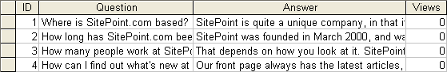
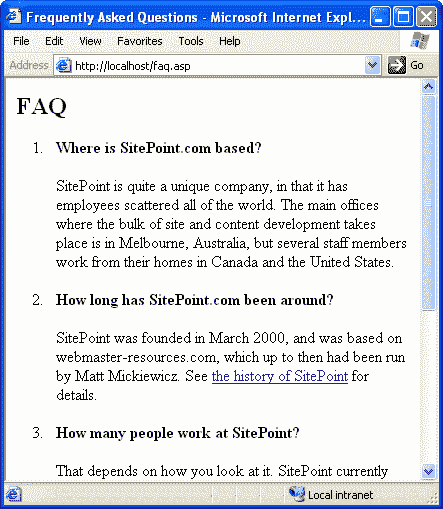
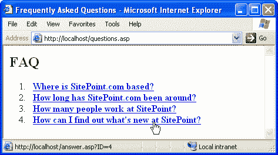
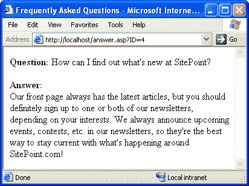

# 用 ASP 和 MS Access 建立一个 FAQ

> 原文：<https://www.sitepoint.com/build-faq-asp-ms-access/>

总的来说，ASP 是一项相当容易使用的技术。与其他一些让你用服务器端脚本开发动态网站的产品相比，相对来说，没有什么能吓倒 ASP 新手。它很容易设置，命令也很简单，开发一个普通的 ASP 网站所涉及的概念也相对容易掌握。然而，对于 ASP 初学者来说，要获得使用 ASP 建立数据库驱动的网站所需的信息总是令人沮丧的困难，除非他们能买得起(并花一个月的时间阅读)一本关于这个主题的大书。通过这篇文章，我的目标是改变这一切！

尽管对于流量较大的网站来说并不理想，但对于学习使用 ASP 进行数据库驱动的 Web 开发的基础知识来说，Microsoft Access 是一个很好的数据库。在本文中，我将演示如何通过使用 ASP 构建一个简单的 Web 数据库应用程序来访问、检索和更新存储在 access 数据库中的信息。我们将研究的例子是一个基于网络的常见问题(FAQ)列表。通过这个案例研究，我不仅将展示使用数据库构建这样的 Web 应用程序所带来的巨大便利，还将展示使用数据库后端所带来的一些巧妙技巧。

在我们开始写代码之前，让我告诉你我对你的期望。本文将假设您对 ASP 和 Microsoft Access 的基础知识有所了解。如果你是 ASP 新手，你很幸运；我已经写了一系列很棒的文章，会让你很快跟上进度。从[ASP 入门](http://www.webmasterbase.com/article.php/371)开始，然后阅读 [ASP 语言基础](http://www.webmasterbase.com/article.php/387)、[用 ASP 处理提交的数据](http://www.webmasterbase.com/article.php/420)，最后是 [ASP 会话和应用](http://www.webmasterbase.com/article.php/472)，然后你就可以准备好处理这里介绍的材料了。对于那些从未使用过 MS Access 的人来说，有两个很好的教程可以帮助你快速入门，这两个教程分别是由 Helen Bradley 编写的 Access 和[关系数据库](http://www.canadacomputes.com/v3/story/1,1017,7190,00.html)。把羽毛牢牢地戴在你的帽子上，我们准备好开始了。我们走吧！

##### 常见问题数据库

最重要的是。在我们构建一个基于 ASP 的页面来显示 FAQ 数据库的内容之前，我们需要*构建*这个数据库。对于这个应用程序，我们只需要一个简单的单表数据库。打开 MS Access 并创建一个名为`faq.mdb`的新的空白数据库。创建一个名为`FAQ`的表，其中的列如下所示:

一旦你创建了表格，填写一些条目，这样你的 ASP 脚本就有东西可以使用了:

注意，对于新条目,`Views`列应该总是被设置为零，以表示它们还没有被查看。为了简化这一点，请确保将该列设置为 Required，默认值为 0。如果您发现您需要的问题超过了`Text`规定的 255 个字符的限制(`Memo`最多允许 65，535 个字符)，您还可以将`Question`列从`Text`更改为`Memo`数据类型。

这就是我们简单的 FAQ 系统背后的数据库的全部内容！如果您计划经常更新数据库，您可能希望在 Access 中设置一个窗体来编辑您的 FAQ，但这超出了本文的范围，MS Access 帮助文件中有大量关于如何创建窗体的信息。

要使你的数据库联机，你需要将`faq.mdb`文件复制到你的 Web 服务器(当然，除非你使用你自己的计算机作为你的 ASP 服务器)，并把它放在你的 ASP 脚本能够访问它的地方。不要*不要*将文件放在与你网站文件相同的目录结构中，否则你网站的访问者将能够下载整个数据库，就像他们下载你网站上的任何其他文件一样。在这个例子中，这没什么大不了的，因为我们将通过 ASP 使数据库的所有内容可见，但是如果您使用这样的数据库来存储用户名和密码，或者关于您网站访问者的私人信息(例如，姓名、电子邮件地址等)。)，您不希望您的数据库文件是可下载的！如果您需要帮助来决定将数据库文件放在服务器的什么位置，请向您的 Web 主机寻求建议。

现在你已经创建了你的数据库并把它放到了网上，你已经准备好写一些 ASP 脚本来使用它了！

##### 用 ASP 检索 Access 数据

ASP 是一个框架，旨在将 VBScript 等脚本语言的简单性与成熟的 Windows 应用程序通常使用的对象库的强大功能结合起来，以构建强大的动态 Web 应用程序。 **ActiveX 数据对象(ADO)** 库为 ASP 提供了与大多数数据库服务器交互所需的功能，Microsoft Access 就是其中之一。

在本系列的前几篇文章中，我们已经看到 ASP 提供了几个对象(`Request`、`Response`、`Server`、`Application`和`Session`)来完成动态网页所需的基本任务，比如表单处理和会话跟踪。所有当前 ASP 服务器附带的 ADO 库增加了对象的选择，为 ASP 中的数据库访问功能提供支持。学习如何在 ASP 中使用数据库基本上意味着学习 ADO 库中的对象。

如果我们想让 FAQ 数据库在 Web 上可用，我们需要做的第一件也是最基本的事情是检索数据库的内容以供显示。每当用 ADO 检索数据库记录时，都需要一个`Recordset`。`Recordset`是 ADO 提供的新对象之一，我们的首要任务是创建一个。ASP 使这变得非常简单:

```
Dim rsFAQ  

Set rsFAQ = Server.CreateObject("ADODB.Recordset")
```

上面的第一行创建了一个变量(`rsFAQ`)来存储我们新的`Recordset`对象。第二行使用服务器对象的`CreateObject`方法创建一个新的`Recordset`，然后设置`rsFAQ`变量，使其引用这个新对象。`Server.CreateObject`是创建 ASP 或其库支持的任何对象的标准方法。在这种情况下，我们希望在 ADO 库中创建一个`Recordset`对象的实例。所有的 ADO 对象前面都必须有前缀`ADODB`来让 ASP 知道你指的是哪个库，所以参数`"ADODB.Recordset"`只是表明我们希望创建一个 ADO `Recordset`对象。`Set`关键字是将对象引用分配给`rsFAQ`变量所必需的，而不是分配给它一个简单的 VBScript 值。

一旦创建了一个`Recordset`，就可以用它的`Open`方法用数据库中的记录填充它。在这种基本情况下，`Open`需要两个参数:

*   我们要从中获取记录的**表名**,以及
*   数据库的**连接字符串**。

现在，表的名称只是简单的`"FAQ"`，这是我们在 Access 中赋予表的名称。连接字符串稍微复杂一些。由于 ADO 库能够连接到许多数据库服务器和许多其他数据源，字符串必须告诉我们的`Recordset`不仅要告诉*在哪里*找到数据库(路径和文件名)，还要告诉*如何通过给出其**数据库提供者**的名称来读取*数据库。

数据库提供者对于 ADO 就像设备驱动程序对于操作系统一样。这是一款允许 ADO 以标准方式与给定类型的数据库进行通信的软件。ADO 附带了用于 Access、SQL Server、Oracle 和 ODBC 数据库服务器等的内置提供程序。

**Jet OLE DB** 是 Microsoft Access 的数据库提供商，在撰写本文时，当前版本是 4.0。因此，要连接到 Access 数据库，连接字符串必须将提供程序指定为`Microsoft.Jet.OLEDB.4.0`。因此，如果数据库文件(`faq.mdb`)存储在您的 Web 服务器上的`D:faq`中，您的连接字符串应该是:

```
Provider=Microsoft.Jet.OLEDB.4.0; Data Source=D:faqfaq.mdb
```

为了让您有所了解，下面是更高级的 MS SQL Server 的连接字符串:

```
Provider=SQLOLEDB; Data Source=*servername*; Initial Catalog=*databasename*;  

User Id=*username*; Password=*password*
```

记住所有这些，下面是将`FAQ`表的内容提取到 ADO `Resultset`中的完整代码:

```
Dim rsFAQ   ' A Resultset for our FAQ  

Dim strConn ' The database connection string  

rsFAQ = Server.CreateObject("ADODB.Recordset")  

strConn = "Provider=Microsoft.Jet.OLEDB.4.0;Data Source=D:faqfaq.mdb"  

rsFAQ.Open "FAQ", strConn
```

因为你更有可能需要在你的站点上的几个 ASP 页面中使用相同的连接字符串，所以通常的做法是将你的连接字符串放在你的`global.asa`文件中的一个应用程序变量中，如下所示(参见 [ASP 会话和应用程序](http://www.webmasterbase.com/article/472)了解更多关于应用程序变量的信息):

```
<SCRIPT LANGUAGE="VBScript" RUNAT="Server">  

Sub Application_OnStart()  

  Dim strConn  

  strConn = "Provider=Microsoft.Jet.OLEDB.4.0;Data Source=D:faqfaq.mdb"  

  Application("strConn") = strConn  

End Sub  

</SCRIPT>
```

检索`FAQ`表内容的代码因此大大简化了:

```
Dim rsFAQ   ' A Resultset for our FAQ  

rsFAQ = Server.CreateObject("ADODB.Recordset")  

rsFAQ.Open "FAQ", Application("strConn")
```

既然我们已经学习了如何从 Access 数据库获取信息到 ASP 中，我们需要学习如何使用它。

##### 显示结果集

一旦填充了来自数据库的记录，`Resultset`对象的工作就是提供对这些记录的访问。像数据库表一样，结果集可以被认为是表，每一行包含一个数据库记录的数据。在我们的例子中，我们刚刚用`FAQ`表的内容填充了`rsFAQ` `Recordset`。因此，如果我们的表有四个条目，`rsFAQ`现在应该包含四行。类似地，由于我们的`FAQ`表有四个字段(`ID`、`Question`、`Answer`和`Views`)，我们的`Recordset`也将有同样的四个字段。

一个`Recordset`，一旦打开，保持跟踪当前记录。首先，当前记录是集合中的第一条记录。通过调用`Recordset`对象的`MoveNext`方法，您可以前进到集合中的下一条记录，如果有的话。如果在当前记录是集合中的最后一条记录时调用 MoveNext，`Recordset`的`EOF`属性将变为 true(其余时间为 false)。因此，要显示一个`Recordset`的全部内容，你可以简单地使用一个`Do-While`循环，如下所示(参见 [ASP 语言基础](http://www.webmasterbase.com/article/387)了解更多关于`Do-While`循环的信息):

```
Do While Not rsFAQ.EOF   

  ' ... display the current record ...   

  rsFAQ.MoveNext   

Loop
```

考虑到记录集可能是空的，如果您的`FAQ`表碰巧是空的，就会发生这种情况，您也可以使用`Recordset`的`BOF`属性。当到达记录集的末尾时，`EOF`为真，当到达记录集的开头时，`BOF`为真。如果按照上面的`Do-While`循环，`BOF`为真，那么您知道您位于结果集的开头和结尾，这只有在结果集为空时才会发生:

```
Do While Not rsFAQ.EOF   

  ' ... display the current record ...   

  rsFAQ.MoveNext   

Loop   

If rsFAQ.BOF Then   

  Response.Write "<p>No FAQs in the database!</p>"   

End If
```

显示当前记录的每个字段非常简单。简单地将`Recordset`对象视为一个集合。例如，当前记录的`Question`字段可作为`rsFAQ("Question")`访问。因此，显示结果集中所有常见问题的完整代码如下:

```
Do While Not rsFAQ.EOF   

  Response.Write "<li><b>" & rsFAQ("Question") & "</b>"   

  Response.Write "<p>" & rsFAQ("Answer") & "</p></li>"   

  rsFAQ.MoveNext   

Loop   

If rsFAQ.BOF Then   

  Response.Write "<p>No FAQs in the database!</p>"   

End If
```

一旦你完成了一个`Resultset`对象，你应该总是`Close`它:

```
rsFAQ.Close
```

这将释放与数据库的连接，供另一个脚本使用。由于这些连接，尤其是作为数据库的 Access，可能会供应不足，所以不到需要的时候不要使用`Open` a `Resultset`，一旦使用完毕就要使用`Close`。

我们完成的 FAQ 列表页面的代码如下(不要忘记在您的`global.asa`中设置`strConn`应用程序变量！):

```
1   <% Option Explicit %>   

2   <html>   

3   <head>   

4   <title>Frequently Asked Questions</title>   

5   </head>     

6   <body>   

7   <h2>FAQ</h2>   

8   <ol>   

9   <%   

10  Dim rsFAQ   

11  Set rsFAQ = Server.CreateObject("ADODB.Recordset")   

12  rsFAQ.Open "FAQ", Application("strConn")   

13   

14  Do While Not rsFAQ.EOF   

15    Response.Write "<li><b>" & rsFAQ("Question") & "</b>"   

16    Response.Write "<p>" & rsFAQ("Answer") & "</p></li>"   

17    rsFAQ.MoveNext   

18  Loop   

19  If rsFAQ.BOF Then   

20    Response.Write "<p>No FAQs in the database!</p>" & vbNewLine   

21  End If   

22   

23  rsFAQ.Close   

24  %></ol>   

25  </body>   

26  </html>
```

将此文件保存在配备 ASP 的 Web 服务器上，并在浏览器中查看。您应该会看到类似这样的内容:

打开 MS Access，进行一些更改，上传新的`faq.mdb`文件，刷新浏览器，查看所做的更改！现在任何可以使用 Microsoft Access 的人都可以更新您的 FAQ 页面了！现在，如果你认为这很棒，看看我们接下来做什么…

##### SQL 查询

在前面的例子中，我们基本上将整个 MS Access 表读入一个 ADO `Resultset`并显示在一个 Web 页面中。对于那个例子来说，这是完全可以接受的，尽管您可能会想到我们没有必要从数据库中获取`ID`和`Views`列。我说“不必要”是因为这些信息从来没有在页面显示中使用过。在 ASP 脚本的执行过程中，这是一个很小的内存浪费，尽管可以忽略不计。

现在，随着时间的推移，您的 FAQ 页面很可能会变得很大，您可能不再希望您的用户必须滚动浏览他们不感兴趣的问题的所有答案才能找到他们想要的答案。相反，最好只在一个页面上显示*个问题*，并让每个问题的文本链接到包含所选特定问题答案的页面。

现在，先把显示一个有正确答案的页面这个明显的挑战放在一边，想想问题列表。这个页面的代码与我们之前的例子没有太大的不同，除了这次我们不会在我们的`Resultset`中使用`Answer`字段！现在，当我们不使用`ID`或`Views`时，这没什么大不了的，因为那些字段包含相对较短的值，但是`Answer`字段是我们数据库中最大的！在我们继续之前，我们需要找到一种方法来使我们的结果集更有效。

在数据库行家的语言中，一个数据库请求被称为一个**查询**。我们在前面的例子中使用的查询非常简单:`"FAQ"` —请求一个表的完整内容。然而，在大多数情况下，我们需要更复杂的查询来从数据库中获取我们需要的信息。

大多数现代数据库中复杂的数据库查询都是用**结构化查询语言(SQL)** 发出的。所有优秀的数据库程序员都称之为“续集”，但“ess-cue-ell”也同样适用。我们简单的`"FAQ"`查询的 SQL 版本实际上是`"SELECT * FROM FAQ"`，它翻译成*从 FAQ 表*中选择所有内容。现在，对于只列出问题的 FAQ 页面，我们只需要`Question`列。因此，SQL 查询将是`"SELECT Question FROM FAQ"`，并且将产生一个每个记录中只有`Question`字段的结果集。

剩下的工作就是弄清楚如何将每个问题链接到一个只有相应答案的页面。解决方案是在链接的 URL 中传递一个变量。该变量将包含被点击问题的 ID，生成带有答案(`answer.asp`)的页面的 ASP 脚本将使用该变量从数据库中仅获取所请求的答案。

因为我们希望在问题列表页面的链接中包含问题的 ID，所以我们也需要数据库中的那个字段，所以我们的 SQL 查询变成了`"SELECT ID, Question FROM FAQ"`。以下是问题页面的完整代码:

```
1   <% Option Explicit %>    

2   <html>    

3   <head>    

4   <title>Frequently Asked Questions</title>    

5   </head>      

6   <body>    

7   <h2>FAQ</h2>    

8   <ol>    

9   <%    

10  Dim rsFAQ    

11  Set rsFAQ = Server.CreateObject("ADODB.Recordset")    

12  rsFAQ.Open "SELECT ID, Question FROM FAQ", Application("strConn")    

13    

14  Do While Not rsFAQ.EOF    

15    Response.Write "<li><b><a href=""answer.asp?ID=" & rsFAQ("ID") & _    

16                   """>"    

17    Response.Write rsFAQ("Question") & "</a></b></li>"    

18    rsFAQ.MoveNext    

19  Loop    

20  If rsFAQ.BOF Then    

21    Response.Write "<p>No FAQs in the database!</p>" & vbNewLine    

22  End If    

23    

24  rsFAQ.Close    

25  %></ol>    

26  </body>    

27  </html>
```

结果页面应该是这样的:

这个页面上的每个链接都指向`answer.asp`，并传递一个查询字符串变量 ID 来指示要显示的答案的数据库 ID。该变量将作为`Request("ID")`出现在`answer.asp`中。使用该值，我们可以构建一个 SQL 查询，只获取与该 ID 对应的特定数据库条目的`Question`和`Answer`字段。例如，如果 ID 的值是 4，SQL 查询将是:`"SELECT Question, Answer FROM FAQ WHERE ID=4"`。因此，我们可以创建如下 SQL 查询:

```
Dim strSQL    

strSQL = "SELECT Question, Answer FROM FAQ WHERE ID=" & Request("ID")
```

请注意，第二行末尾的下划线告诉 VBScript 命令在下一行继续。

我们现在有了写作所需的一切。这是:

```
1   <% Option Explicit %>    

2   <html>    

3   <head>    

4   <title>Frequently Asked Questions</title>    

5   </head>      

6   <body>    

7   <%    

8   Dim rsFAQ    

9   Dim strSQL    

10  Set rsFAQ = Server.CreateObject("ADODB.Recordset")    

11  strSQL = "SELECT Question, Answer FROM FAQ WHERE ID=" & Request("ID")    

13  rsFAQ.Open strSQL, Application("strConn")    

14  %>    

15  <p><b>Question:</b> <%=rsFAQ("Question")%></p>    

16  <p><b>Answer:</b><br><%=rsFAQ("Answer")%></p>    

17  <% rsFAQ.Close %>    

18  </body>    

19  </html>
```

有了这个脚本，让我们看看当我们点击其中一个问题时会发生什么:

太好了！现在剩下的就是跟踪每个问题被查看的次数(还记得我们的`FAQ`表中尚未使用的`Views`列吗？)，并使用该值以合理的顺序向访问者展示 FAQ 列表。

##### 动作查询

到目前为止，我们看到的所有 SQL 查询都是`SELECT`查询。`SELECT`查询用于从数据库中获取记录，因为这是我们到目前为止所做的全部工作，所以毫不奇怪这就是我们所使用的全部内容。我们的`FAQ`表的`Views`列将需要不同类型的查询，但是，因为每次访问者查看其中一个问题的答案时，我们都希望增加该问题的`Views`字段中的数字。

这个任务需要的 SQL 查询是一个`UPDATE`查询。这里有一个查询，它将增加带有`ID 4`的 FAQ 的`Views`值:

```
UPDATE FAQ SET Views = Views + 1 WHERE ID=4
```

现在，一个`SELECT`查询会产生一个`Resultset`，所谓的**动作查询**比如`UPDATE`不会。因此，我们不使用 ADO `Recordset`对象来运行`UPDATE`查询。相反，我们使用一个 **`Connection`** 对象如下:

```
Dim conFAQ     

Set conFAQ = Server.CreateObject("ADODB.Connection")     

conFAQ.Open Application("strConn")     

conFAQ.Execute("UPDATE FAQ SET Views = Views + 1 WHERE ID=4")     

conFAQ.Close
```

这段代码首先声明变量`conFAQ`，然后创建一个新的 ADO `Connection`对象(像往常一样使用`Server.CreateObject`)存储在其中。接下来，我们调用`Connection`的`Open`方法，提供连接字符串(`Application("strConn")`)来建立到我们的`FAQ`数据库的连接。一旦以这种方式打开，`Connection`对象就可以用于在单个数据库连接上运行任意数量的查询。在最后一行，我们使用连接的`Execute`方法来运行我们的`UPDATE`查询。就像使用`Resultset` s 一样，一旦你完成了它，使用`Close` a `Connection`是很重要的，就像我们在上面的最后一行所做的那样。

现在，在我们的`answer.asp`脚本中，我们已经使用了一个`Resultset`对象来运行`SELECT`查询，该查询获取问题和答案以供显示:

```
11  strSQL = "SELECT Question, Answer FROM FAQ WHERE ID=" & Request("ID")     

13  rsFAQ.Open strSQL, Application("strConn")
```

这个`Resultset`对象实际上在后台创建了自己的`Connection`对象来连接数据库。现在，由于我们已经建立了一个`Connection`来执行我们的`UPDATE`查询，当我们可以简单地重用第一个连接时，为这个查询创建第二个连接是没有意义的。有两种方法可以做到这一点。首先，我们可以将`Connection`对象传递给`Resultset`的`Open`方法，而不是连接字符串:

```
rsFAQ.Open strSQL, conFAQ
```

或者，我们可以像上面运行`UPDATE`查询一样运行`SELECT`查询:使用`Connection`的`Execute`方法。当用来运行一个`SELECT`查询时，`Execute`返回一个`Resultset` 对象，所以这将省去我们创建自己的`Resultset`的麻烦:

```
Set rsFAQ = conFAQ.Execute(strSQL)
```

下面是 answer.asp 的完整代码，它使用一个数据库`Connection`首先`UPDATE`选择 FAQ 的`Views`列，然后`SELECT`显示`Question`和`Answer`字段:

```
1   <% Option Explicit %>     

2   <html>     

3   <head>     

4   <title>Frequently Asked Questions</title>     

5   </head>       

6   <body>     

7   <%     

8   Dim conFAQ, rsFAQ, strSQL     

9   Set conFAQ = Server.CreateObject("ADODB.Connection")     

10     

11  conFAQ.Open Application("strConn")     

12  conFAQ.Execute("UPDATE FAQ SET Views = Views + 1 WHERE ID=" & _     

13                 Request("ID"))     

14     

15  strSQL = "SELECT Question, Answer FROM FAQ WHERE ID=" & Request("ID")     

16  Set rsFAQ = conFAQ.Execute(strSQL)     

17  %>     

18  <p><b>Question:</b> <%=rsFAQ("Question")%></p>     

19  <p><b>Answer:</b><br><%=rsFAQ("Answer")%></p>     

20  <%     

21  rsFAQ.Close     

22  conFAQ.Close     

23  %>     

24  </body>     

25  </html>
```

从用户的角度来看，这个版本的`answer.asp`和旧版本没有什么不同；然而，在后台，它会通过更新数据库中的`Views`字段，在您的网站上每次查看 FAQ 时进行计数！去试试吧。用这个新版本的`answer.asp`查看一些你的常见问题，然后从你的网站下载`faq.mdb`文件。在 MS Access 中打开它，注意到`FAQ`表的`Views`栏中的数字已经相应地改变了！

对于我们的最后一个技巧，让我们好好利用这个`Views`字段。现在，您的问题列表页面(`questions.asp`)按照 FAQ 被添加到数据库的顺序列出了 FAQ。相反，根据他们收到的浏览次数对他们进行排序不是很有意义吗？这样，最受欢迎和最有用的问题可以出现在列表的顶部，这样你的用户就可以很快找到它们！要做到这一点，我们需要做的就是更改我们用来获取问题和答案以供显示的`SELECT`查询:

```
SELECT ID, Question FROM FAQ **ORDER BY Views DESC**
```

我们在这里添加的`ORDER BY Views DESC`部分告诉 Access 根据`Views`字段对`FAQ`表中的条目进行排序，并以降序(从查看次数最多到最少)发送结果。这就是全部了！以下是`questions.asp`的更新代码，供您参考:

```
1   <% Option Explicit %>     

2   <html>     

3   <head>     

4   <title>Frequently Asked Questions</title>     

5   </head>       

6   <body>     

7   <h2>FAQ</h2>     

8   <ol>     

9   <%     

10  Dim rsFAQ     

11  Set rsFAQ = Server.CreateObject("ADODB.Recordset")     

12  rsFAQ.Open "SELECT ID, Question FROM FAQ ORDER BY Views DESC", _     

13             Application("strConn")     

14     

15  Do While Not rsFAQ.EOF     

16    Response.Write "<li><b><a href=""answer.asp?ID=" & rsFAQ("ID") & _     

17                   """>"     

18    Response.Write rsFAQ("Question") & "</a></b></li>"     

19    rsFAQ.MoveNext     

20  Loop     

21  If rsFAQ.BOF Then     

22    Response.Write "<p>No FAQs in the database!</p>" & vbNewLine     

23  End If     

24     

25  rsFAQ.Close     

26  %></ol>     

27  </body>     

28  </html>
```

##### Access 怎么了？

在您使用新发现的 ASP 数据库技能并在您自己的站点上实现一个系统(比如我在本文中介绍的示例)之前，有一个重要的问题需要注意。Microsoft Access 从来不是为数据库驱动的网站设计的重型后端。它所能处理的同时连接的数量是非常有限的，所以如果你的网站一次接收了很多访问者，那么在这种压力下访问可能会不稳定。这里有一个很好的讨论，讨论了以这种方式使用 MS Access 的局限性: [15 秒:Access 的真相](http://www.15seconds.com/issue/010514.htm)。

由于上述原因，如果您想在比个人网站更大的网站上部署数据库驱动的 Web 应用程序，您需要探索 Access 的替代方案。微软会让你投资他们的高性能 MS SQL 服务器，但是 ASP 可以同样容易地连接到 MySQL 等免费数据库。幸运的是，由于 ADO 库可用于连接所有这些数据库以及更多数据库，并且它们都使用 SQL(尽管方言略有不同)来描述它们的查询，所以您在本文中学到的技能同样适用于更高级的数据库后端。

##### 进一步阅读的摘要和资源

在本文中，我们探讨了在 ASP 中使用 ActiveX 数据对象(ADO)库来构建网页的最基本概念，这些网页使用数据库来存储要显示的内容。为了举例，我们使用一个简单的 Microsoft Access 数据库来构建一个常见问题系统，该系统跟踪每个常见问题收到的查看次数，以便根据它们的受欢迎程度列出问题。像这样的实用系统在网络上随处可见。

在使用 ASP 进行数据库驱动编程的领域中，您的下一步应该是更全面地理解结构化查询语言(SQL)。一本关于这个主题的优秀的书，不仅涵盖了你需要知道的概念和所有可用的不同查询类型，还探索了大多数流行数据库支持的 SQL 方言的特质，这本书就是[Beginning SQL Programming](http://amazon.com/exec/obidos/ASIN/1861001800/webmasterresou05/)(2001 年，WROX 出版社)。除了从本书中获得丰富的知识外，您还将获得 MS SQL Server 2000 的 120 天评估版！

关于 ADO 库，它包含的对象，以及它们的属性和方法，还有很多东西需要学习。为了相对全面地介绍 ADO 库以及它能为您做的一切，我强烈推荐 [Professional ASP 3.0](http://amazon.com/exec/obidos/ASIN/1861002610/webmasterresou05/) (1999 年，WROX 出版社)的第 8 章和第 9 章(见我的评论[这里](http://www.webmasterbase.com/article/419))。然而，为了更深入地研究这个主题，你不能错过专业的 ADO 2.5 编程(2000 年，WROX 出版社)。这本书涵盖了 ADO 的各个方面，它将告诉你更多关于这个库的信息，比你可能会用到的还要多。这本书绝对是为核心数据库驱动的 ASP 程序员而写的，但是对于普通的 ASP 开发人员来说可能有点过头了，对于他们来说专业的 ASP 3.0 已经足够了。

## 分享这篇文章