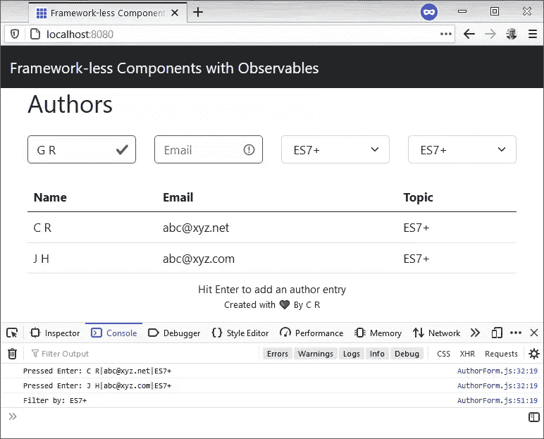

# 使用现代 JavaScript 和 Web 组件构建 Web 应用程序

> 原文：<https://www.sitepoint.com/build-frameworkless-web-app-modern-javascript-web-components/>

浏览器中的 JavaScript 已经进化。想要利用最新特性的开发人员可以选择更少麻烦的框架。通常保留给前端框架的选项，比如基于组件的方法，现在在普通的旧 JavaScript 中是可行的。

在本文中，我将展示所有最新的 JavaScript 特性，使用一个带有网格和搜索过滤器的用户界面来显示作者数据。为了简单起见，一旦介绍了一种技术，我将继续介绍下一种技术，这样就不会重复了。因此，UI 将有一个添加选项和一个下拉搜索过滤器。作者模型将有三个字段:姓名、电子邮件和一个可选主题。表单验证将主要展示这种无框架技术，但并不全面。

这种曾经勇敢的语言已经发展出许多现代特性，比如代理、导入/导出、可选的链操作符和 web 组件。这完全符合 [Jamstack](https://www.sitepoint.com/learn-jamstack/) 的要求，因为应用程序通过 HTML 和普通 JavaScript 在客户端呈现。

为了专注于应用程序，我将省略 API，但我将指出这种集成在应用程序中的位置。

## 入门指南

该应用程序是一个典型的 JavaScript 应用程序，有两个依赖项:http-server 和 Bootstrap。代码将只在浏览器中运行，所以除了托管静态资产之外，没有其他后端。代码在 GitHub 上供你使用。

假设您在机器上安装了最新的节点 LTS:

```
mkdir framework-less-web-components
cd framework-less-web-components
npm init 
```

这应该以一个单独的`package.json`文件结束，其中放置了依赖项。

要安装这两个依赖项:

```
npm i http-server bootstrap@next --save-exact 
```

*   [http-server](https://www.npmjs.com/package/http-server) :在 Jamstack 中托管静态资产的 http 服务器
*   Bootstrap :一套简洁、强大的 CSS 样式来简化 web 开发

如果你觉得`http-server`不是一个依赖项，而是这个应用程序运行的一个必要条件，可以选择通过`npm i -g http-server`进行全局安装。无论哪种方式，这种依赖都不会传送到客户机，而只是为客户机提供静态资产。

打开`package.json`文件，通过`scripts`下的`"start": "http-server"`设置进入点。继续通过`npm start`启动应用程序，这将使`http://localhost:8080/`对浏览器可用。放在根文件夹中的任何`index.html`文件都会自动由 HTTP 服务器托管。你所做的就是刷新页面以获得最新的信息。

文件夹结构如下所示:

```
┳
┣━┓ components
┃ ┣━━ App.js
┃ ┣━━ AuthorForm.js
┃ ┣━━ AuthorGrid.js
┃ ┗━━ ObservableElement.js
┣━┓ model
┃ ┣━━ actions.js
┃ ┗━━ observable.js
┣━━ index.html
┣━━ index.js
┗━━ package.json 
```

这是每个文件夹的用途:

*   `components`:带有`App.js`的 HTML web 组件和从`ObservableElement.js`继承的定制元素
*   `model`:监听 UI 状态变化的应用状态和突变
*   `index.html`:可以在任何地方托管的主要静态资产文件

要在每个文件夹中创建文件夹和文件，请运行以下命令:

```
mkdir components model
touch components/App.js components/AuthorForm.js components/AuthorGrid.js components/ObservableElement.js model/actions.js model/observable.js index.html index.js 
```

## 集成 Web 组件

简而言之，web 组件是定制的 HTML 元素。它们定义可以放在标记中的自定义元素，并声明一个呈现组件的回调方法。

下面是一个自定义 web 组件的简要介绍:

```
class HelloWorldComponent extends HTMLElement {
  connectedCallback() { // callback method
    this.innerHTML = 'Hello, World!'
  }
}

// Define the custom element
window.customElements.define('hello-world', HelloWorldComponent)

// The markup can use this custom web component via:
// <hello-world></hello-world> 
```

如果你觉得你需要一个更温和的 web 组件介绍，看看 MDN 文章。起初，他们可能会觉得不可思议，但是很好地掌握回调方法会让这一点变得非常清楚。

主`index.html`静态页面声明了 HTML web 组件。我将使用 Bootstrap 来设计 HTML 元素的样式，并引入成为应用程序进入 JavaScript 的主要入口点和网关的`index.js`资产。

打开`index.html`文件，把它放好:

```
<!doctype html>
<html lang="en">
<head>
  <meta charset="utf-8">
  <meta name="viewport" content="width=device-width, initial-scale=1">
  <link href="node_modules/bootstrap/dist/css/bootstrap.min.css" rel="stylesheet">
  <title>Framework-less Components</title>
</head>
<body>
<template id="html-app">
  <div class="container">
    <h1>Authors</h1>
    <author-form></author-form>
    <author-grid></author-grid>
    <footer class="fixed-bottom small">
      <p class="text-center mb-0">
        Hit Enter to add an author entry
      </p>
      <p class="text-center small">
        Created with ❤ By C R
      </p>
    </footer>
  </div>
</template>
<template id="author-form">
  <form>
    <div class="row mt-4">
      <div class="col">
        <input type="text" class="form-control" placeholder="Name" aria-label="Name">
      </div>
      <div class="col">
        <input type="email" class="form-control" placeholder="Email" aria-label="Email">
      </div>
      <div class="col">
        <select class="form-select" aria-label="Topic">
          <option>Topic</option>
          <option>JavaScript</option>
          <option>HTMLElement</option>
          <option>ES7+</option>
        </select>
      </div>
      <div class="col">
        <select class="form-select search" aria-label="Search">
          <option>Search by</option>
          <option>All</option>
          <option>JavaScript</option>
          <option>HTMLElement</option>
          <option>ES7+</option>
        </select>
      </div>
    </div>
  </form>
</template>
<template id="author-grid">
  <table class="table mt-4">
    <thead>
      <tr>
        <th>Name</th>
        <th>Email</th>
        <th>Topic</th>
      </tr>
    </thead>
    <tbody>
    </tbody>
  </table>
</template>
<template id="author-row">
  <tr>
    <td></td>
    <td></td>
    <td></td>
  </tr>
</template>
<nav class="navbar navbar-expand-lg navbar-light bg-dark">
  <div class="container-fluid">
    <a class="navbar-brand text-light" href="/">
      Framework-less Components with Observables
    </a>
  </div>
</nav>
<html-app></html-app>
<script type="module" src="index.js"></script>
</body>
</html> 
```

请密切注意将`type`属性设置为`module`的`script`标签。这就是在浏览器中解锁普通 JavaScript 的导入/导出的原因。带有`id`的`template`标签定义了支持 web 组件的 HTML 元素。我把这个应用程序分成三个主要部分:`html-app`、`author-form`和`author-grid`。因为 JavaScript 中还没有定义任何东西，所以应用程序将呈现没有任何自定义 HTML 标签的导航栏。

为了容易开始，将它放在`ObservableElement.js`中。它是所有作者组件的父元素:

```
export default class ObservableElement extends HTMLElement {
} 
```

然后，在`App.js`中定义`html-app`组件:

```
export default class App extends HTMLElement {
  connectedCallback() {
    this.template = document
      .getElementById('html-app')

    window.requestAnimationFrame(() => {
      const content = this.template
        .content
        .firstElementChild
        .cloneNode(true)

      this.appendChild(content)
    })
  }
} 
```

注意使用`export default`来声明 JavaScript 类。这是我在引用主脚本文件时通过`module`类型启用的功能。要使用 web 组件，从`HTMLElement`继承并定义`connectedCallback`类方法。剩下的就交给浏览器了。我正在使用`requestAnimationFrame`在浏览器下一次重画之前渲染主模板。

这是 web 组件中常见的技术。首先，通过元素 ID 获取模板。然后，通过`cloneNode`克隆模板。最后，`appendChild`新的`content`进入 DOM。如果您遇到任何 web 组件无法呈现的问题，请确保首先检查克隆的内容是否被附加到 DOM 中。

接下来，定义`AuthorGrid.js` web 组件。这一个将遵循类似的模式，并对 DOM 进行一些操作:

```
import ObservableElement from './ObservableElement.js'

export default class AuthorGrid extends ObservableElement {
  connectedCallback() {
    this.template = document
      .getElementById('author-grid')
    this.rowTemplate = document
      .getElementById('author-row')
    const content = this.template
      .content
      .firstElementChild
      .cloneNode(true)
    this.appendChild(content)

    this.table = this.querySelector('table')
    this.updateContent()
  }

  updateContent() {
    this.table.style.display =
      (this.authors?.length ?? 0) === 0
        ? 'none'
        : ''

    this.table
      .querySelectorAll('tbody tr')
      .forEach(r => r.remove())
  }
} 
```

我用一个`querySelector`定义了主`this.table`元素。因为这是一个类，所以可以通过使用`this`保持对目标元素的良好引用。`updateContent`方法主要是在网格中没有作者显示的时候使用主表。可选的链接操作符 ( `?.`)和空合并负责将`display`样式设置为无。

看一下`import`语句，因为它在文件名中引入了带有完全限定扩展名的依赖项。如果您习惯于节点开发，这就是它与遵循标准的浏览器实现的不同之处，后者需要像`.js`这样的文件扩展名。跟我学，在浏览器工作的时候一定要把文件扩展名。

接下来，`AuthorForm.js`组件有两个主要部分:呈现 HTML 和将元素事件连接到表单。

要呈现表单，请打开`AuthorForm.js`:

```
import ObservableElement from './ObservableElement.js'

export default class AuthorForm extends ObservableElement {
  connectedCallback() {
    this.template = document
      .getElementById('author-form')
    const content = this.template
      .content
      .firstElementChild
      .cloneNode(true)

    this.appendChild(content)

    this.form = this.querySelector('form')
    this.form.querySelector('input').focus()
  }

  resetForm(inputs) {
    inputs.forEach(i => {
      i.value = ''
      i.classList.remove('is-valid')
    })
    inputs[0].focus()
  }
} 
```

`focus`引导用户在表单中第一个可用的输入元素上开始输入。确保将任何 DOM 选择器*放在*和`appendChild`之后，否则这种技术将不起作用。`resetForm`现在没有使用，但是当用户按下 Enter 键时，它会重置表单的状态。

通过在`connectedCallback`方法中添加此代码，经由`addEventListener`连接事件。这可以添加到`connectedCallback`方法的最后:

```
this.form
  .addEventListener('keypress', e => {
    if (e.key === 'Enter') {
      const inputs = this.form.querySelectorAll('input')
      const select = this.form.querySelector('select')

      console.log('Pressed Enter: ' +
        inputs[0].value + '|' +
        inputs[1].value + '|' +
        (select.value === 'Topic' ? '' : select.value))

      this.resetForm(inputs)
    }
  })

this.form
  .addEventListener('change', e => {
    if (e.target.matches('select.search')
      && e.target.value !== 'Search by') {
      console.log('Filter by: ' + e.target.value)
    }
  }) 
```

这些是典型的事件监听器，附加到 DOM 中的`this.form`元素。`change`事件使用事件委托来监听表单中的所有变更事件，但是只针对`select.search`元素。这是将单个事件委托给父元素中尽可能多的目标元素的有效方法。准备就绪后，在表单中键入任何内容并按回车键会将表单重置为零状态。

要让这些 web 组件呈现在客户端上，打开`index.js`并将其放入:

```
import AuthorForm from './components/AuthorForm.js'
import AuthorGrid from './components/AuthorGrid.js'
import App from './components/App.js'

window.customElements.define('author-form', AuthorForm)
window.customElements.define('author-grid', AuthorGrid)
window.customElements.define('html-app', App) 
```

现在可以在浏览器中随意刷新页面，并使用 UI。打开您的开发人员工具，在表单中单击和键入时查看控制台消息。按下`Tab`键应该可以帮助你在 HTML 文档的输入元素之间导航。

## 验证表单

在摆弄这个表单时，您可能会注意到，当姓名和电子邮件都是必需的，而主题是可选的时，它会接受任意输入。无框架方法可以是 HTML 验证和一点 JavaScript 的结合。幸运的是，Bootstrap 通过`classList` web API 添加/删除 CSS 类名使这变得有些容易。

在`AuthorForm.js`组件中，找到`Enter`键事件处理程序中的`console.log`，找到带有“按下 Enter”的日志，并将其放在它的正上方:

```
if (!this.isValid(inputs)) return 
```

然后，在`AuthorForm`中定义`isValid`类方法。这可能会超越`resetForm`的方法:

```
isValid(inputs) {
  let isInvalid = false

  inputs.forEach(i => {
    if (i.value && i.checkValidity()) {
      i.classList.remove('is-invalid')
      i.classList.add('is-valid')
    } else {
      i.classList.remove('is-valid')
      i.classList.add('is-invalid')
      isInvalid = true
    }
  })

  return !isInvalid
} 
```

在普通 JavaScript 中，调用`checkValidity`使用内置的 [HTML 验证器](https://www.sitepoint.com/using-the-html5-constraint-api-for-form-validation/)，因为我用`type="email"`标记了一个输入元素。为了检查必填字段，可以通过`i.value`进行基本的真实性检查。`classList` web API 添加或删除 CSS 类名，因此引导样式可以完成它的工作。

现在，继续给应用程序另一个尝试。试图输入无效数据现在会被标记，有效数据现在会重置表单。

## 看得见的

这种方法的肉(或土豆)的时间到了，因为 web 组件和事件处理程序只能带我到这里。为了让这个应用程序*成为状态驱动的*，我需要一种方法来跟踪 UI 状态的变化。事实证明 observables 非常适合这种情况，因为当状态发生变化时，它们可以触发对 UI 的更新。可以把 observables 想象成一个 sub/pub 模型，订阅者监听变化，发布者触发 UI 状态中发生的变化。这简化了在没有任何框架的情况下构建复杂而激动人心的 ui 所需的推和拉代码的数量。

打开`model`下的`obserable.js`文件，放入:

```
const cloneDeep = x => JSON.parse(JSON.stringify(x))
const freeze = state => Object.freeze(cloneDeep(state))

export default initialState => {
  let listeners = []

  const proxy = new Proxy(cloneDeep(initialState), {
    set: (target, name, value) => {
      target[name] = value
      listeners.forEach(l => l(freeze(proxy)))
      return true
    }
  })

  proxy.addChangeListener = cb => {
    listeners.push(cb)
    cb(freeze(proxy))
    return () =>
      listeners = listeners.filter(el => el !== cb)
  }

  return proxy
} 
```

这乍一看可能很吓人，但是它做了两件事:劫持 setter 来捕捉突变，以及添加侦听器。在 ES6+中，`Proxy`类启用了一个包装`initialState`对象的代理。这可以拦截像这个`set`方法这样的基本操作，当对象有变化时执行。在 setter 中返回`true`让 JavaScript 的内部机制知道突变成功了。`Proxy`设置一个处理程序对象，在这里定义陷阱，比如`set`。因为我只关心状态对象的*突变*，所以`set`有一个陷阱。所有其他功能，如读取，都直接转发到原始状态对象。

侦听器保留一个订阅的回调列表，这些回调希望得到有关变化的通知。添加侦听器后，回调被执行一次，并返回侦听回调以供将来参考。

放置`freeze`和`cloneDeep`函数是为了防止底层状态对象的任何进一步突变。这使得 UI 状态更加可预测，并且有点无状态，因为数据只在一个方向上移动。

现在，转到`actions.js`文件并把它放在适当的位置:

```
export default state => {
  const addAuthor = author => {
    if (!author) return

    state.authors = [...state.authors, {
      ...author
    }]
  }

  const changeFilter = currentFilter => {
    state.currentFilter = currentFilter
  }

  return {
    addAuthor,
    changeFilter
  }
} 
```

这是一个可测试的 JavaScript 对象，执行状态的实际变化。为了简洁起见，我将放弃编写单元测试，但将把它作为一个练习留给读者。

为了激发 web 组件的变化，它们需要在全局`window.applicationContext`对象上注册。这使得这个带有突变的状态对象对应用程序的其余部分可用。

打开主`index.js`文件，将它添加到我注册定制元素的地方:

```
import observableFactory from './model/observable.js'
import actionsFactory from './model/actions.js'

const INITIAL_STATE = {
  authors: [],
  currentFilter: 'All'
}

const observableState = observableFactory(INITIAL_STATE)
const actions = actionsFactory(observableState)

window.applicationContext = Object.freeze({
  observableState,
  actions
}) 
```

有两个对象可用:代理`observableState`和带有突变的`actions`。`INITIAL_STATE`用初始数据启动应用程序。这就是设置初始零配置状态的原因。动作突变接受可观察的状态，并通过对`observableState`对象进行更改来触发对所有监听器的更新。

因为突变还没有通过`applicationContext`连接到 web 组件，所以 UI 不会跟踪任何变化。web 组件需要 HTML 属性来改变和显示状态数据。这是接下来的事情。

## 观察到的属性

对于 web 组件，状态的变化可以通过属性 web API 来跟踪。这些是`getAttribute`、`setAttribute`和`hasAttribute`。有了这个库，在 DOM 中持久化 UI 状态会更有效。

打开`ObservableElement.js`并取出它，用下面的代码替换它:

```
export default class ObservableElement extends HTMLElement {
  get authors() {
    if (!this.hasAttribute('authors')) return []

    return JSON.parse(this.getAttribute('authors'))
  }

  set authors(value) {
    if (this.constructor
      .observedAttributes
      .includes('authors')) {
      this.setAttribute('authors', JSON.stringify(value))
    }
  }

  get currentFilter() {
    if (!this.hasAttribute('current-filter')) return 'All'

    return this.getAttribute('current-filter')
  }

  set currentFilter(value) {
    if (this.constructor
      .observedAttributes
      .includes('current-filter')) {
      this.setAttribute('current-filter', value)
    }
  }

  connectAttributes () {
    window
      .applicationContext
      .observableState
      .addChangeListener(state => {
        this.authors = state.authors
        this.currentFilter = state.currentFilter
      })
  }

  attributeChangedCallback () {
    this.updateContent()
  }
} 
```

我特意在`current-filter`属性中使用了蛇形外壳。这是因为属性 web API 只支持小写名称。getter/setter 在这个 web API 和类所期望的之间进行映射，这是 camel 的情况。

web 组件中的`connectAttributes`方法添加了自己的监听器来跟踪状态变化。有一个`attributeChangedCallback`在属性改变时触发，web 组件更新 DOM 中的属性。这个回调还调用`updateContent`来告诉 web 组件更新 UI。ES6+ getter/setter 声明了与 state 对象中相同的属性。例如，这就是 web 组件可以访问`this.authors`的原因。

注意`constructor.observedAttributes`的用法。这是一个我现在可以声明的自定义静态字段，因此父类`ObservableElement`可以跟踪 web 组件关心的属性。这样，我就可以挑选出状态模型中与 web 组件相关的部分。

我将借此机会充实实现的其余部分，通过每个 web 组件中的可观察对象来跟踪和更改状态。这就是当状态发生变化时，UI“活起来”的原因。

返回`AuthorForm.js`并进行这些更改。代码注释会告诉你放在哪里(或者你可以咨询[回购](https://github.com/sitepoint-editors/framework-less-web-components/blob/master/components/AuthorForm.js)):

```
// This goes at top, right below the class declaration
static get observedAttributes() {
  return [
    'current-filter'
  ]
}

// In the Enter event handler, right above resetForm
this.addAuthor({
  name: inputs[0].value,
  email: inputs[1].value,
  topic: select.value === 'Topic' ? '' : select.value
})

// In the select event handler, rigth below console.log
this.changeFilter(e.target.value)

// At the very end of the connectedCallback method
super.connectAttributes()

// These helpers method go at the bottom of the class
addAuthor(author) {
  window
    .applicationContext
    .actions
    .addAuthor(author)
}

changeFilter(filter) {
  window
    .applicationContext
    .actions
    .changeFilter(filter)
}

updateContent() {
  // Capture state mutation to synchronize the search filter
  // with the dropdown for a nice effect, and reset the form
  if (this.currentFilter !== 'All') {
    this.form.querySelector('select').value = this.currentFilter
  }
  this.resetForm(this.form.querySelectorAll('input'))
} 
```

在 Jamstack 中，您可能需要调用一个后端 API 来持久化数据。我建议对这些类型的调用使用助手方法。一旦持久化的状态从 API 返回，它就可以在应用程序中发生变化。

最后，找到`AuthorGrid.js`并连接可观察的属性(最后一个文件是[，这里是](https://github.com/sitepoint-editors/framework-less-web-components/blob/master/components/AuthorGrid.js)):

```
// This goes at top, right below the class declaration
static get observedAttributes() {
  return [
    'authors',
    'current-filter'
  ]
}

// At the very end of the connectedCallback method
super.connectAttributes()

// This helper method can go right above updateContent
getAuthorRow(author) {
  const {
    name,
    email,
    topic
  } = author

  const element = this.rowTemplate
    .content
    .firstElementChild
    .cloneNode(true)
  const columns = element.querySelectorAll('td')

  columns[0].textContent = name
  columns[1].textContent = email
  columns[2].textContent = topic

  if (this.currentFilter !== 'All'
    && topic !== this.currentFilter) {
    element.style.display = 'none'
  }

  return element
}

// Inside updateContent, at the very end
this.authors
  .map(a => this.getAuthorRow(a))
  .forEach(e => this.table
    .querySelector('tbody')
    .appendChild(e)) 
```

每个 web 组件可以跟踪不同的属性，这取决于 UI 中呈现的内容。这是分离组件的一种干净的方式，因为它只处理自己的状态数据。

继续在浏览器中运行这个程序。打开开发工具，检查 HTML。您将在 web 组件的根处看到 DOM 中设置的属性，如`current-filter`。当您点击并按下`Enter`时，请注意应用程序会自动跟踪 DOM 中的状态变化。

## 逮到你了

对于 pieèce de resistance，请确保开发人员工具处于打开状态，转到 JavaScript 调试器并找到`AuthorGrid.js`。然后，在`updateContent`的任意位置设置断点。选择一个搜索过滤器。注意到浏览器不止一次点击这个代码了吗？这意味着更新 UI 的代码不会运行一次，而是在每次状态发生变化时运行。

这是因为`ObservableElement`中的代码:

```
window
  .applicationContext
  .observableState
  .addChangeListener(state => {
    this.authors = state.authors
    this.currentFilter = state.currentFilter
  }) 
```

目前，当状态发生变化时，正好有两个侦听器会触发。如果 web 组件跟踪不止一个状态属性，比如`this.authors`，就会触发更多的 UI 更新。这导致 UI 更新效率低下，并可能导致足够的侦听器和 DOM 更改滞后。

要解决这个问题，打开`ObservableElement.js`并关注 HTML 属性设置器:

```
// This can go outside the observable element class
const equalDeep = (x, y) => JSON.stringify(x) === JSON.stringify(y)

// Inside the authors setter
if (this.constructor.observedAttributes.includes('authors')
  && !equalDeep(this.authors, value)) {

// Inside the currentFilter setter
if (this.constructor.observedAttributes.includes('current-filter')
  && this.currentFilter !== value) { 
```

这增加了一层防御性编程来检测属性变化。当 web 组件意识到它不需要更新 UI 时，它会跳过属性的设置。

现在回到带有断点的浏览器，更新状态应该只命中`updateContent`一次。


## 最终演示

这是带有可观察对象和 web 组件的应用程序的外观:



而且别忘了，你可以在 GitHub 上找到[的完整代码。](https://github.com/sitepoint-editors/framework-less-web-components)

## 结论

通过 web 组件和 observables 的无框架应用有一个很好的方式来构建功能丰富的 ui，没有任何依赖性。这使得应用程序的有效负载对客户来说轻巧而快捷。

## 分享这篇文章