# 通过在 Photoshop 中对照片进行颜色匹配来构建出色的登录页面

> 原文：<https://www.sitepoint.com/build-great-landing-pages-by-color-matching-photos-in-photoshop/>

好的登陆页面和优秀的登陆页面之间的差别往往非常微妙。布局、颜色和图像的微小变化往往会在这些页面的说服力方面产生很大的差异。当涉及到这些谨慎的美学选择时，一个精明的设计师会利用他们对细节的一丝不苟的关注(和他们精致的设计技术)来使客户的网站既漂亮又强大。一种经常被忽视的为登录页面添加额外修饰的方法是匹配各种图像的颜色，以创建一个有凝聚力的、专业的外观，增加所提供的产品或服务的可信度。

为您的登录页面或任何其他需要多个图像的项目寻找图像可能是一个相当大的挑战。你可能会花上几个小时试图找到最完美的照片，结果却发现它们看起来并不特别相配。一致性是关键，尤其是在设计中，那么你怎么做呢？

你要做的第一件事是把你所有的图片都放进 Photoshop。我们将下载一些样本图片，链接会提供给你。我们有一个女人在她的电脑前的图像，在这里找到了，一个办公室电话的图像，在这里找到了，一个黑暗的董事会会议室的图像，在这里找到了，还有一个穿着西装拿着存钱罐的男人的图像，在这里找到了。这些图像如下所示:

[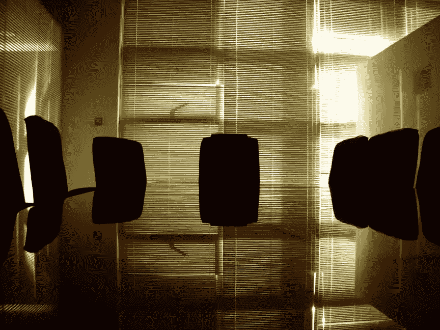](https://www.sitepoint.com/wp-content/uploads/2012/05/Screen-shot-2012-05-05-at-1.08.09-AM.png)

在看这些图像时，它们看起来根本不像是属于彼此的。那个拿着电脑的女人的形象漂亮、干净、明快、明亮、轻盈。一个穿着西装的男人拿着一个存钱罐的形象也不算太差，但是我们可以调整它来更好地匹配女人的形象。下一张商务电话的图片也有很多暖色调。董事会会议室是黑暗和阴暗的，所以我们需要记住这一点，并对此进行补偿。

匹配这些图像的关键在于在 Photoshop 中同时打开它们。此方法仅适用于同时打开的多个文档。您可以从上面的图像中看出，真正突出的严重不匹配是电话和会议室图像。最干净和最质朴的图像是一个女人和她的笔记本电脑。

在 Photoshop 中同时打开所有图像。我们暂时不去管那个女人和她的笔记本电脑的图像。转到其他图像之一，然后进入“图像”>“调整”>“匹配颜色”

[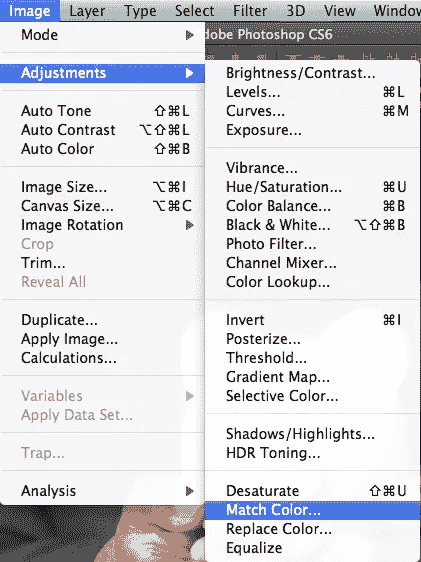](https://www.sitepoint.com/wp-content/uploads/2012/05/Screen-shot-2012-05-29-at-12.14.27-AM.png)

一个对话框出现了，你可以做几个选择，但是第一个要注意的选项是你的源。我选择了这个女人和她的笔记本电脑的图像作为来源，它最终吹出了图像中较亮的区域。为了解决这个问题，并使图像看起来与其他图像一致，我们可以调整顶部的滑块。*亮度*调节图像中光线的多少。*颜色强度*决定颜色变化的剧烈程度，如果效果仍然过于强烈，那么您可以使用*渐变*滑块来减轻效果。

[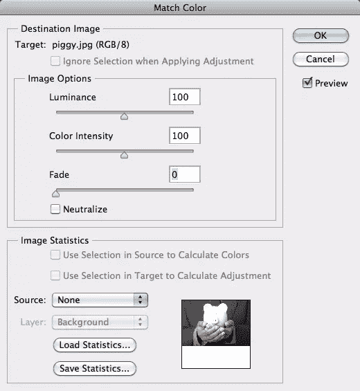](https://www.sitepoint.com/wp-content/uploads/2012/05/Screen-shot-2012-05-29-at-12.17.18-AM.png)

[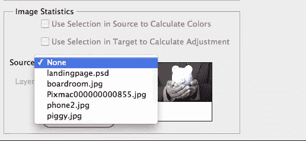](https://www.sitepoint.com/wp-content/uploads/2012/05/Screen-shot-2012-05-29-at-12.17.35-AM.png)

这种效果是严格按照口味来做的，因为每个图像(以及每组不匹配的图像)都是不同的。因此，您将无法使用与示例图像完全相同的设置，因为每个图像都有自己的颜色信息。最好的计划是确定你的最佳形象，并以此作为你的起点。如果这个图像有你想要的外观和感觉，用它来调整你的其他图像。接下来，我来做手机。

正如你所看到的，按照同样的步骤，我能够消除重色偏，给它一个更明亮，更干净的外观。

之前:

之后:

木头变亮了，手机内部的音调也变亮了。色偏消失了，图像看起来更符合我们对登录页面的要求。

会议室有点不同，因为太暗了。它倾向于有一个不同于其他图像的情绪，但通过一些调整，我们可以调整它。遵循同样的步骤，但是对于这张图片，我们需要提高*亮度*滑块。仅此一点就足以改变一切。以前，形象是阴暗和忧郁的，但现在，他看起来干净和专业。拍摄细节和倒影更加突出。

之前:

之后:

[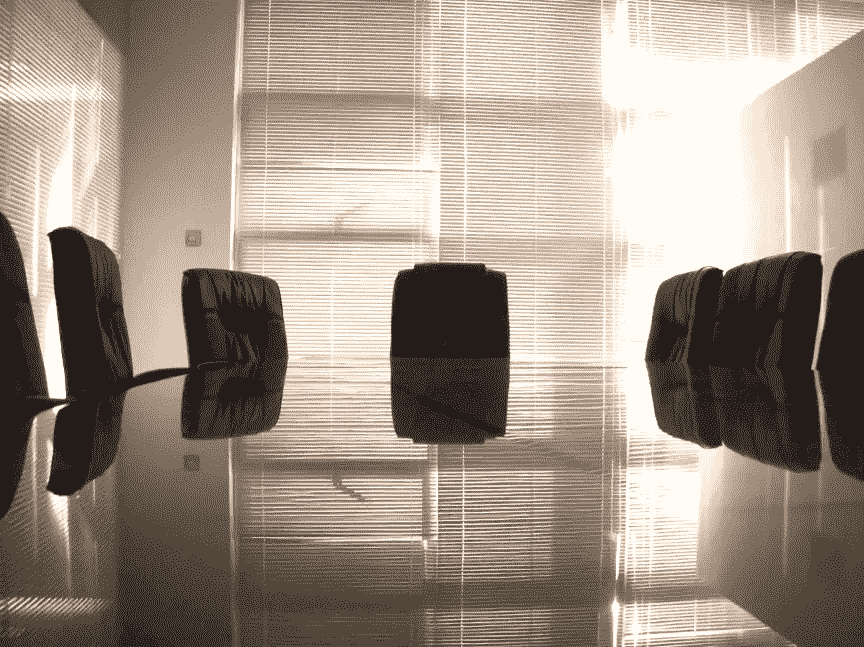](https://www.sitepoint.com/wp-content/uploads/2012/05/Screen-shot-2012-05-29-at-12.51.32-AM.png)

这些图像看起来更加一致，现在可以在我们的登录页面中实现了。下面是一个例子，我们的登录页面将如何看待我们的新图像。

[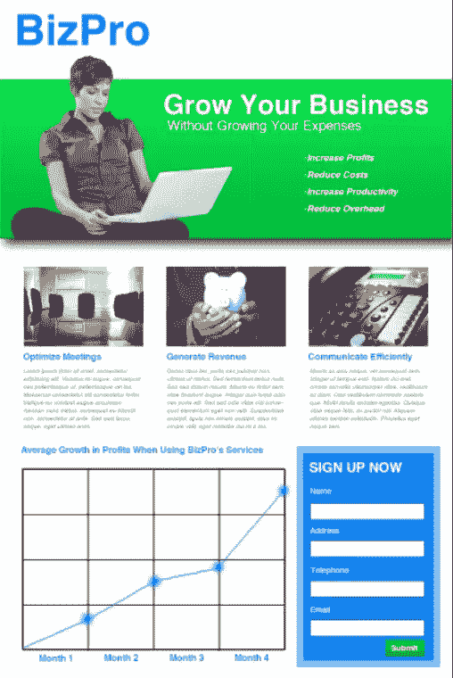](https://www.sitepoint.com/wp-content/uploads/2012/05/Screen-shot-2012-05-29-at-1.15.39-AM.png)

要制作上面的登录页面，请在 Photoshop 中创建一个新文档。上面的例子是 800 像素宽，1200 像素高。我把背景留白了。选择矩形选框工具，创建一个新的层。选择一种鲜艳的绿色，画一个大约 250 像素高的方框，横跨文档的宽度。双击图层添加投影和渐变叠加。

[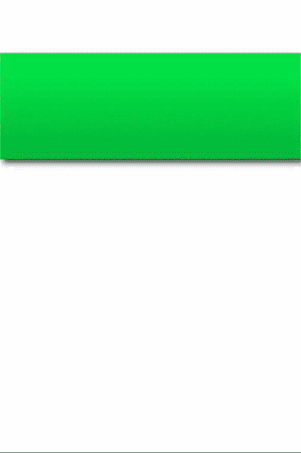](https://www.sitepoint.com/wp-content/uploads/2012/05/Screen-shot-2012-05-29-at-2.26.53-AM.png)

通过创建一个新的层来增加盒子的光泽。按住 Command/Ctrl 键点按绿色框层，以将其大小和形状作为选区载入。填充白色，不透明度设置为 20%左右。按 Command/Ctrl + "T "来变换该框。按住 Command/Ctrl 键，单击并向上拖动右下角，直到它与右上角重叠。右击可变换的形状以显示不同的选项。选择“扭曲”,然后单击并向上拖动对角线边缘的中间，使该边缘弯曲。按回车键提交转换。

[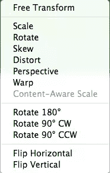](https://www.sitepoint.com/wp-content/uploads/2012/05/Picture-36.png)

[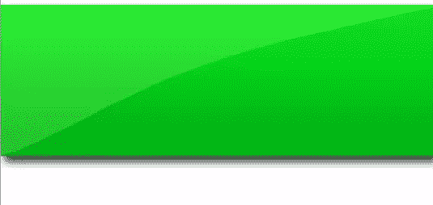](https://www.sitepoint.com/wp-content/uploads/2012/05/Picture-35.png)

接下来，我们将从背景中移除带着笔记本电脑的女士。打开图像，使用快速选择工具选择女人和她的笔记本电脑，然后单击选项栏中名为“优化边缘”的按钮

选中智能半径选项，并将滑块移动到最右侧。然后，在“输出”下，选中名为“净化颜色”的框，并将滑块移动到最右侧。使用画笔在选区中添加或减去不同的区域。选择新层与图层蒙版作为您的选择。然后，您可以通过在蒙版上绘制黑色和白色来手动调整蒙版。我还按了 Command/Ctrl+“T”来转换图像，我水平翻转它，使她面向内。

调整图像大小并缩放，使她的头稍微露出我们之前创建的绿色栏。确保底部的锐边与绿色条的边缘对齐。

选择文本工具并创建您的徽标文本。如果你已经有了一个 logo，可以在这里导入，放在左上角。我选择 Helvetica 粗体作为 BizPro 的名称，并使用#0082fb，这是一种明亮的蓝色。为了组织内容，我还设置了指南。我设置了引导线，在登录页面周围创建了一个 20 像素的边距。然后，我取整体宽度，减去左右边距，剩下的尺寸除以 3。这为我们的登录页面提供了一个 3 列布局。

[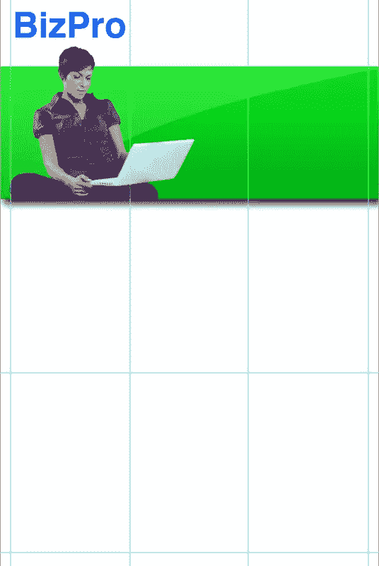](https://www.sitepoint.com/wp-content/uploads/2012/05/Picture-12.png)

接下来，我们将在页面中间的功能栏中添加一些标题文本。选择文本工具，选择 Helvetica 加粗，选择一个大尺寸(如 16-20pt)，并创建标题。在下一行，使用较小的字体创建潜台词，并使用 Helvetica 的常规字体。将它放在最右边的两列中，如下所示。

接下来，我们将在右栏中添加一个特性列表。选择文本工具，并将大小降低到 10-12 磅之间。单击并拖动鼠标在右栏中绘制一个文本框，确保每边都留有一点空白。若要创建项目符号，请按住 alt/option 键并键入“8”键。做好每一个要点，最后按回车键。如果你需要增加空间，将行距增加到 12-14 磅。我还将字体设置为斜体，以引起对这个区域的注意。

接下来，我们将实现其余的图像。在 Photoshop 中打开每张图片，找到一张构图不错的图片。以风景的形式裁剪它。按 Command/Ctrl + Option/Alt 和“I”调出图像大小。这些设置是你将拨入你的裁剪工具，所以你所有的图像将大小相同。转到另外两张图片，将它们裁剪成相同的尺寸，选择最佳的排列方式。现在，您有三个大小相同、外观一致的图像，并且可以在您的登录页面中使用。实际大小并不重要，因为我们将缩小每个尺寸以适应我们的布局。将它们排成一行，根据你的内容和信息合理地排列。

接下来，我们将为每一列添加标题。选择我们用于标识的蓝色，为每一列文本创建标题。我用的是 16 磅的 Helvetica 粗体。我还将它对齐到每张图片的左侧。为了快速简单，一旦你创建了第一个标题，使用 Command/Ctrl + "J "复制文本层两次。然后，双击每一层的“T”图标，并简单地为每一列键入您想要的文本，并将每个文本与每个图像的左侧对齐。若要将移动限制为垂直对齐，请在左右移动文本时按住 shift 键。

[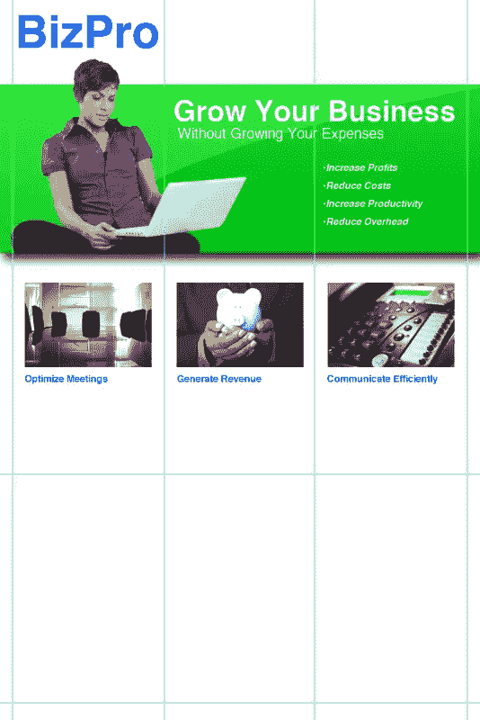](https://www.sitepoint.com/wp-content/uploads/2012/05/Picture-16.png)

现在，可以添加一些样本体副本了。由于这是一个模型，我们将添加 lorem ipsum 文本只是为了放置。选择您的文本工具，并在左栏的约束范围内拖出一个文本框，在每一侧保留填充。使它大约 140-150 像素高。从类似的网站上复制一些 Lorem ipsum 文本，粘贴到你的文本框中。将字体大小降低到 8-10 磅，坚持使用 Helvetica 字体；选择一个中深灰色，并设置为斜体或倾斜。然后，重复我们对每个标题执行的复制过程，我将正文文本添加到其他两列，对不同的占位符文本进行采样以进行变化。

接下来，我们将添加一个图表，显示使用 BizPro 服务的平均结果。该图表将有 2 列宽。首先，为图表创建一个标题，使用我们用于正文标题的蓝色。

接下来，我们将绘制图表本身。选择矩形选框工具，并创建一个适合您的登录页面的左两列的矩形，每边填充，底部填充更多。用前景色填充选区。选择什么并不重要，因为我们要将这一层的填充降低到 0%。然后，双击图层添加 1 像素黑色描边图层样式，但是描边设置为内侧。

然后，复制矩形，按 Command/Ctrl+“T”，向下拖动顶部的手，制作一个细长的矩形，大约是大矩形的 1/4 或高度。复制这一层 3 次。对齐它以创建四个与盒子宽度相同的条。如果它们与盒子的整个高度不匹配，选择所有四个矩形层并同时变换它们以匹配大盒子的大小。

[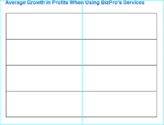](https://www.sitepoint.com/wp-content/uploads/2012/05/Picture-22.png)

然后，选择所有四个矩形层，向下拖动它们复制它们。在复制的矩形仍然选中的情况下，按 Command/Ctrl+“T”来变换它们。在角上单击并拖动以旋转矩形。同时按住 shift 键，将它们限制在 45 度角，直到它们从水平变为垂直。按住 Alt/Option 键，单击并拖动中间手柄，以匹配图表的宽度和高度。

[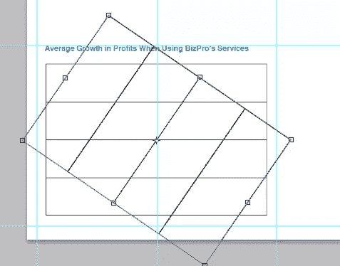](https://www.sitepoint.com/wp-content/uploads/2012/05/Picture-23.png)

[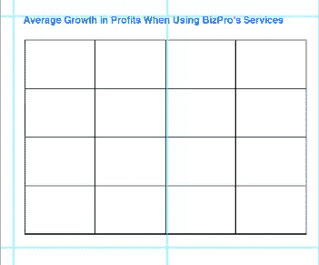](https://www.sitepoint.com/wp-content/uploads/2012/05/Picture-24.png)

接下来，我们将为我们的图形创建直线。创建一个新层，并选择钢笔工具。创建不同的数据点，在图表上从左到右显示随时间的增加。完成后，转到路径面板，选择画笔描边路径。我选择了我们在标题中使用的蓝色。然后，在图表中的关键点上，我使用爆发笔刷来突出显示这些点。然后，双击图层添加外发光，设置为强光。我把它设置成我们一直使用的蓝色。

在图表的底部，我们希望为每一列添加时间增量。选择文本工具，并在第一个实例中键入“Month 1”。重复之前相同的过程，复制文本层，每次改变数字。然后，将每个文本层移动到每列的适当位置。

尽管我们已经创造了一切，但我们还没有创造出最重要的特征——行动号召。右下栏是我们要添加 web 表单以吸引感兴趣的查看者的地方。首先，选择选框工具，创建一个跨越列宽的高矩形。

[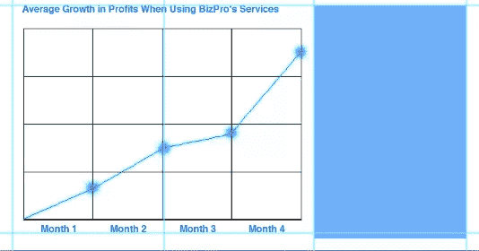](https://www.sitepoint.com/wp-content/uploads/2012/05/Picture-29.png)

接下来，点击 Command/Ctrl+ "J "复制层。设置原始矩形层为 50%不透明度。对于复制的矩形，按 Command/Ctrl + "T ",在按住 Alt/Option + Shift 的同时，向内拖动一个角以缩小实心蓝色矩形，并从下面的矩形中留出一个边框。

[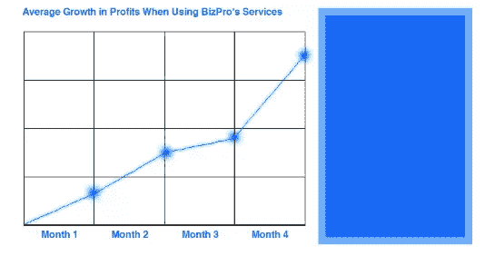](https://www.sitepoint.com/wp-content/uploads/2012/05/Picture-30.png)

现在，选择文字工具，创建一个白色标题，使用 Helvetica 粗体设置为 24pt。创建一个新的文本层，这一次使用常规 Helvetica 设置为 14pt。创建名称字段。接下来，根据需要多次复制文本层，以制作每个所需的文本字段。双击每个文本层，将文本更改为您需要的每个字段。我选择了姓名、地址、电话和电子邮件。按住 Shift 键并将最后一个文本层拖动到您想要放置文本的位置的底部。然后，按住 Shift 键，选择所有文本层，并单击屏幕顶部选项栏中的“垂直居中对齐”按钮这将使每个字段名在垂直方向上彼此距离相等。

创建一个新层。选择选框工具，画一个短而宽的矩形，用白色作为前景色，按 Alt/Option + Delete，用白色填充选区。双击图层，在形状内部添加一个 1 像素的描边作为图层样式。

[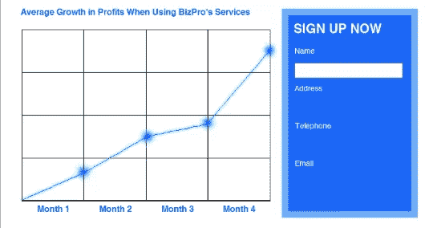](https://www.sitepoint.com/wp-content/uploads/2012/05/Picture-32.png)

重复同样的过程，我们做了我们的文字层，复制他们，并安排他们平等。

[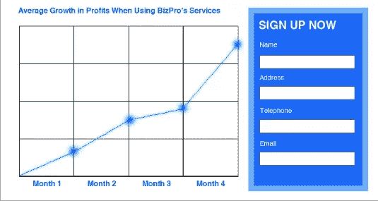](https://www.sitepoint.com/wp-content/uploads/2012/05/Picture-33.png)

接下来，创建一个新的层，并选择选框工具。创建一个与表单文本字段右边缘对齐的矩形。用我们在登录页面顶部的栏中使用的绿色填充它。此外，给它一个渐变叠加。选择文字工具，使用 Helvetica 粗体，创建白色的“提交”文本。现在，我们的登录页面模型已经完成。

[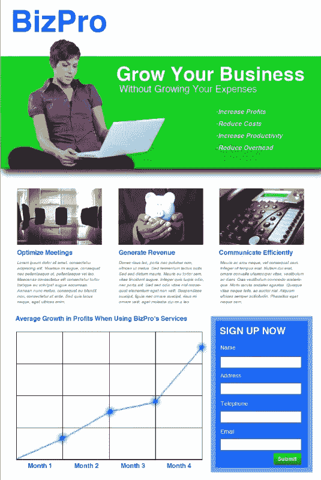](https://www.sitepoint.com/wp-content/uploads/2012/05/Picture-34.png)

## 结论

从一开始就很难找到最适合我们设计的图像。找到能传达正确信息的正确图像已经够难的了，但即便如此，我们还是会遇到颜色一致性的问题。它们可能包含我们想要的内容或信息，但是在同一个设计中，它们放在一起可能不好看。使用 Photoshop 中的匹配颜色选项，我们可以将所有的图像放入，并对它们进行调整，使它们彼此更加一致。结果可以使你的登陆页面看起来更加完美和专业，这反过来会为你的客户带来更多的转换和客户。

## 分享这篇文章