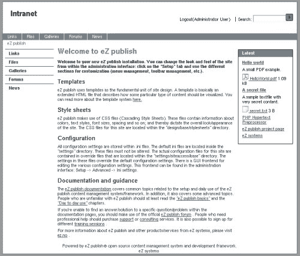
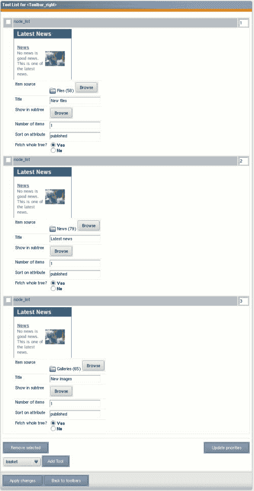
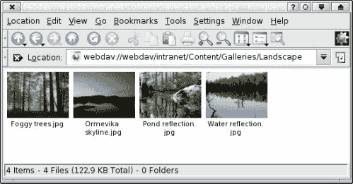
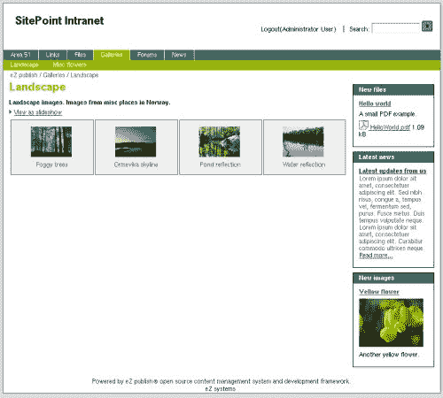

# 用 eZ publish 构建一个支持 WebDav 的内部网

> 原文：<https://www.sitepoint.com/build-intranet-ez-publish/>

每个公司和组织都需要内部沟通，在这个持续的过程中，内部网是一个有价值的工具。

本文展示了如何配置 eZ publish 来共享信息，并限制 intranet 上的信息。它还展示了如何用支持 WebDav 的可访问的虚拟版本化文件系统替换现有的网络文件系统。

##### 让 eZ publish 运行起来

由于 eZ publish 是开源的，你可以直接从 eZ publish 网站下载。在本文中，我使用了该系统的 3.5 版本，在撰写本文时该版本还处于测试阶段。

我不会介绍 eZ publish 的安装过程，因为它已经在其他资料中介绍过了，比如官方的 eZ publish 安装文档。在安装过程中，会要求您选择站点类型；选择“内网”。安装程序的下一步是选择功能；在那里，选择:

*   文件
*   论坛
*   图像库
*   新闻

intranet 站点类型是预先配置的，要求用户登录后才能使用该站点。这不同于其他网站类型，在默认情况下，其他网站类型的所有内容都是公开的。下图显示了我们的内部网站点安装后的样子。



##### 安装后配置

一旦安装了 eZ publish，您就可以立即开始发布文章、文件和图像等内容。但是，我们想改变我们的内部网的外观和感觉，以适应企业概况。在开始向站点添加内容之前，让我们先这样做。

eZ publish 为设计风格的应用提供了许多可能性，最简单的就是简单地改变 CSS。因为 eZ publish 是用所谓的“无表 div 布局”标记的，所以你可以通过修改 CSS 定义来改变大部分设计。如果你对 CSS 不太熟悉，可以看看 SitePoint 的 [HTML Utopia:使用 CSS](https://www.sitepoint.com/books/css1/) 设计无表格。

出于本教程的目的，我们将使用 eZ publish 安装附带的一个示例主题。要用所提供的 20 个主题中的一个来改变样式表，请在管理界面中转到 Design 选项卡，然后单击“Look and Feel”。在那里，您可以更改网站磁贴、编辑一些元数据、上传新的徽标以及更改主题。我把标题改成了“SitePoint Intranet ”,选择了主题 20。

通过更改模板，您可以使网站看起来与众不同，但是如果您有非常特殊的需求，而这些需求无法通过更改 CSS 文件来满足，您可以随时自己编辑模板。eZ publish 的所有可视部分都是在模板中定义的，并且可以更改:[eZ publish 站点有关于更改模板的详细信息](http://ez.no/ez_publish/documentation/building_an_ez_publish_site)。

##### 菜单和工具栏

默认情况下，eZ publish 带有一个顶部和左侧的菜单。为了减少内部网的水平空间，我们可以使用菜单管理切换到双水平菜单。菜单管理位于管理界面的“设计”选项卡下。在应用菜单更改之前，请确保选择了正确的站点访问。在我们的例子中，intranet 是正确的站点访问名称。

工具栏是一种 eZ publish 机制，使您能够在默认 eZ publish 安装的顶部、右侧或底部配置具有功能的框。当然，这些都是基于模板的，所以你可以改变或者添加额外的工具栏，或者改变它们的位置。Intranet 站点样式附带了一个工具，默认显示最近发布的文件。

让我们使用设计选项卡下的工具栏管理，让 eZ publish 显示最后一个文件、最后一篇新闻文章和最后发布的图像。为此，编辑右侧工具栏，添加三个节点列表工具。通过单击项目源浏览按钮，选择从中提取对象的源。将项目数更改为 1，并为每个框输入一个新标题。下面的屏幕截图显示了工具栏配置页面。



##### 资料管理

Word、Excel、Power Point、PDF 等文档。是每个内部网中最常见的内容容器。如果上传和访问这些文件太困难，就不会使用内部网解决方案。因此，每个内部网都有一个计划良好的流程来管理这一点是至关重要的。

用户习惯于将文档保存在他们的本地光盘或安装的网络驱动器上。我们应该尽可能平稳地过渡到在内部网上保存文件。如果我们使用 eZ publish 中的 [WebDav 功能](http://www.webdav.org/),用户可以将内部网作为虚拟文件系统使用。通过 WebDav 接口上传的文件可以在内部网中立即访问，反之亦然。Word 和 PDF 文档等已知文件的内容也将在搜索引擎中建立索引，因此检索文档非常简单。eZ publush 网站为[提供了关于如何配置二进制文件索引器](http://ez.no/ez_publish/documentation/configuration/configuration/search_engine/configuring_binary_file_indexing.)的信息。

另外，系统中的所有文档都有版本控制。这意味着如果你覆盖了一个文件，eZ publish 会创建一个新版本的文档；如果需要，以后可以回滚到以前的版本。

##### 配置 WebDav 界面

如前所述，eZ publish 标配了一个 WebDav 接口。要启动并运行这个接口，我们需要创建一个新的虚拟主机。为此，我们编辑 Apache 配置文件 httpd.conf。要在 httpd.conf 中添加新的 virtualhost 指令，您需要添加如下所示的配置。只需用 eZ publish 安装的根目录替换路径/var/www/intranet，用 webdav 虚拟主机的 DNS 名称替换 ServerName webdav.no。

```
<VirtualHost *> 

    Options FollowSymLinks Indexes 

    ServerAdmin nospam@ez.no 

    DocumentRoot /var/www/intranet 

    RewriteEngine On 

    RewriteRule !.(css|jar|js|html|php)$ /var/www/intranet/webdav.php 

    ServerName webdav.no 

    ErrorLog logs/error_log 

    CustomLog logs/access_log common 

</VirtualHost>
```

如果您没有访问 DNS 服务器的权限，可以在“hosts”配置文件中添加一个条目。或者，您可以让 Apache 监听另一个端口，例如端口 81。如果您将 webdav 主机名添加到“hosts”配置文件中，将无法从任何其他计算机访问它。

webdav 接口也需要在 eZ publish 中启用。这可以通过改变 settings/webdav.ini 来实现。下面是启用 webdav 界面的设置。

```
[GeneralSettings] 

EnableWebDAV=true
```

##### 使用 WebDav

要通过 WebDav 接口访问 eZ publish，您需要一个支持 WebDav 的客户机。一些 WebDav 客户端包括 Windows 资源管理器、OS-X Finder 和 Konqueror，但还有其他几个客户端。在本文中，我将使用 Konqueror 客户端，就像我在我的工作站上使用 Linux 下的 KDE 一样。

要访问 WebDav 界面，只需在位置工具栏中键入“webdav://webdav.no”。请记住用您在配置中使用的域替换该域。可用的“站点访问”应该显示为文件夹。站点访问是在 eZ publish 中定义的虚拟站点；您可以在同一个 eZ publish 安装中定义几个虚拟站点。

当您进入 intranet 网站访问时，系统会提示您输入登录名和密码。使用任何有效的 eZ publish 用户进行登录。从那里，您可以将 eZ publish 用作一个普通的远程虚拟文件系统。用户可以执行的任务由角色系统中定义的权限控制。因此，如果您没有查看权限，“51 区”将不可见。

因为 eZ publish 有一个比普通文件系统更高级的结构，它将以文件夹的形式显示所有不是图像或文件的对象。但是，这可以在 webdav.ini 配置文件中进行配置。

下面的屏幕截图显示了在图库中浏览图像时 WebDav 界面的外观。这就像在您的本地文件系统上导航一样:您可以拖放图像、文件或文件夹，它们将自动导入 eZ publish 并发布。



下面的截图显示了网页上显示的图片库。您可以用同样的方式浏览文件夹中的文件。还要注意页面有一个新的颜色主题，一个新的标题和新的工具栏框在右边，这是我们上面设置的配置选项的结果。



##### 51 区

eZ publish 中的任何内容都由基于角色的权限系统控制。为了创建一个受限区域，我们在内部网的根目录下建立一个文件夹。转到 eZ publish 中的管理界面，单击 Content Structure 选项卡。这允许您导航内容根目录。从下拉列表中选择“文件夹”，然后单击“在此创建”按钮。然后，您将被重定向到该文件夹的编辑界面。输入文件夹的名称，例如“Area 51”，然后单击“发送以供发布”按钮。

该文件夹将自动出现在用户站点的菜单中，但它还没有受到任何限制。我们可以给这个文件夹分配一个新的“分区”,使它具有唯一性。section 是一种 eZ publish 机制，用于为对象分配受限的权限。

首先，我们需要创建这个新部分。如果你转到 Setup 选项卡并点击 Sections 菜单项，你将得到创建一个新节的选项；这样做，并将该节命名为“Restricted”。要将分区分配到文件夹，请单击分区列表中的回形针图标。在位置浏览器中选择“Area 51”文件夹，然后单击“确定”。

要验证是否正确分配了该部分，请通过单击“内容结构”选项卡返回到导航根目录。点击子项目的详细视图。下面的截图显示了这个详细的视图。请注意，分配给“区域 51”的部分是受限的。在此文件夹下发布的任何内容都将继承分区信息，因此内容也将以同样的方式受到限制。

##### 创建用户

我们需要创建一个新用户，因为默认情况下，我们只有管理员用户，他有权查看任何对象。要创建新用户，请转到“用户帐户”选项卡，然后单击“来宾帐户”用户组。从下拉列表中选择用户，然后单击“在此创建”按钮。然后，输入用户信息，点击“发送发布”。您现在可以用这个新用户帐户登录；请注意，您无法再访问“区域 51”文件夹。这是因为来宾用户被分配了匿名角色，这允许他们只读取标准部分的内容。

请注意，这与我们创建“Area 51”文件夹时使用的编辑界面是同一类型的。这是因为 eZ publish 中的所有内容都以相同的方式处理，而用户只是一种特定类型的内容。如果愿意，您可以定义几个具有不同属性的不同用户类型。例如，您可以向用户帐户添加电话号码和地址信息。

##### 关于政策和角色

eZ publish 中基于角色的权限系统是基于角色的。角色由一系列策略组成。策略定义对某些内容的访问，例如，阅读文章、删除文件夹或登录管理界面。默认情况下，用户无权访问任何内容，除非在分配的角色中明确定义了该访问权限。一个角色可以分配给一个或多个用户或组。

只需在现有的用户组下添加一个新的用户组，就可以创建用户组的层次结构。分配给用户组的任何角色都可以由子用户或子组继承(如果需要，可以在配置文件中将此功能限制为一级继承)。

##### 最后的话

我们已经了解了如何使用免费的开源内容管理系统 eZ publish 来驱动一个典型的内部网站点。CMS 具有内部网所需的基本功能，包括一个替代的中央文档存储和集成搜索。所有这些都可以不费吹灰之力实现。如果您可以访问 Apache Web 服务器，您可以在 30 分钟内将 eZ publish 配置为 intranet 站点。

如果您无法访问 Apache Web 服务器，但仍然想尝试 eZ publish，您可以使用 eZ publish 演示站点。管理界面位于 http://admindevel.ezpublish.no/的[。用户名是“admin”，密码是“publish”。该网站对公众开放，并具有管理权限。它每两个小时重置一次，所以你可以测试任何你想测试的功能。但是要注意，很多人可能会同时测试安装。](http://admindevel.ezpublish.no/)

## 分享这篇文章