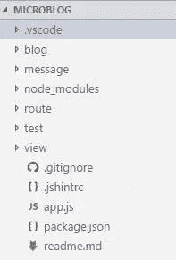
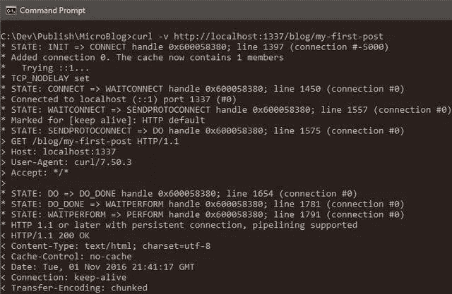

# 使用 Node.js、Git 和 Markdown 构建微博

> 原文：<https://www.sitepoint.com/build-microblog-node-js-git-markdown/>

*使用 Node.js、Git 和 Markdown 建立一个微博，由[马克·布朗](https://www.sitepoint.com/author/mbrown/)、[贾尼·哈迪凯宁](https://www.sitepoint.com/author/jhartikainen/)和[琼·尹](https://github.com/newjs)进行同行评审。感谢 SitePoint 的所有同行评审员使 SitePoint 的内容尽可能做到最好！*


在现代编程中,“微”这个词经常被使用:微框架、微服务等等。对我来说，这意味着没有膨胀地解决手头的问题。同时解决一个简单的问题。这意味着专注于手头的问题，减少不必要的依赖。

我觉得 Node 在网络方面遵循了金凤花原则。您从低级库中获得的 API 集对于构建微型网站非常有用。这些 API 既不太复杂，也不太简单，但正好适合构建 web 解决方案。

在本文中，让我们探索用 Node、Git 和一些依赖项构建一个微博。这个应用程序的目的是从提交到存储库的文件提供静态内容。您将学习如何构建和测试应用程序，并深入了解交付解决方案的流程。到最后，你将拥有一个极简主义的工作博客应用程序，你可以在其上进行构建。

## 微博的主要成分

要建立一个令人敬畏的博客，首先，你需要几个要素:

*   发送 HTTP 消息的库
*   存储博客文章的存储库
*   单元测试运行程序或库
*   降价分析器

要发送 HTTP 消息，我选择 Node，因为这正好给了我从服务器发送超文本消息所需的信息。特别感兴趣的两个模块是 [http](https://nodejs.org/api/http.html) 和 [fs](https://nodejs.org/api/fs.html) 。

`http`模块将创建一个节点 HTTP 服务器。`fs`模块将读取一个文件。Node 拥有使用 HTTP 构建微博的库。

为了存储博客文章的存储库，我将选择 Git，而不是一个成熟的数据库。原因是，Git 已经是一个带有版本控制的文本文档库。这正是我存储博客文章数据所需要的。免于将数据库作为依赖项添加的自由将我从大量问题的编码中解放出来。

我选择以 Markdown 格式存储博客文章，并使用标记为的[解析它们。如果我以后决定这样做，这给了我逐步增强原始内容的自由。Markdown 是普通 HTML 的一个很好的轻量级替代方案。](https://www.npmjs.com/package/marked)

对于单元测试，我选择名为[bake . it](https://www.npmjs.com/package/roast.it)的优秀测试运行程序。我会选择这个替代方案，因为它没有依赖性，并且解决了我的单元测试需求。你可以选择另一个类似于 [taper](https://www.npmjs.com/package/taper) 的测试用例，但是它有大约八个依赖项。我喜欢`roast.it`的地方在于它没有依赖性。

有了这份材料清单，我就有了创建微博所需的所有依赖。

挑选依赖关系不是一件小事。我认为关键是，眼前问题之外的任何东西都可能成为一种依赖。例如，我既没有构建一个测试运行程序，也没有构建一个数据存储库，所以这被添加到列表中。任何给定的依赖都不能囫囵吞下解决方案并挟持代码。因此，只挑选轻量级组件是有意义的。

本文假设读者对[节点](https://nodejs.org/en/download/)、 [npm](https://www.npmjs.com/) 和 [Git](https://git-scm.com/download) 以及各种测试方法有所了解。我不会走完建立微博的每一步，而是集中讨论代码的特定区域。如果你想在家继续学习，代码在 [GitHub](https://github.com/sitepoint-editors/MicroBlog) 上，你可以尝试每个代码片段。

### 测试

测试让你对你的代码有信心，并收紧反馈回路。编程中的反馈循环是指编写新代码和运行代码之间的时间。在任何 web 解决方案中，这意味着要跳过许多层才能获得任何反馈。例如，浏览器、web 服务器，甚至数据库。随着复杂性的增加，这意味着需要几分钟甚至一个小时来获得反馈。通过单元测试，我们去掉了那些层，并得到了快速的反馈。这使焦点保持在手头的问题上。

我喜欢通过编写快速的单元测试来开始任何解决方案。这让我有了为任何新代码编写测试的想法。这是你如何起床和运行与烤。它

在`package.json`文件中，添加:

```
"scripts": {
  "test": "node test/test.js"
},
"devDependencies": {
  "roast.it": "1.0.4"
} 
```

`test.js`文件是您引入所有单元测试并运行它们的地方。例如，可以这样做:

```
var roast = require('roast.it');

roast.it('Is array empty', function isArrayEmpty() {
  var mock = [];

  return mock.length === 0;
});

roast.run();
roast.exit(); 
```

要运行测试，请执行`npm install && npm test`。让我感到高兴的是，我不再需要为了测试新代码而费尽周折。这就是测试的意义所在:一个快乐的程序员获得信心，并专注于解决方案。

如您所见，测试运行程序期望调用`roast.it(strNameOfTest, callbackWithTest)`。每次测试结束时的`return`必须解析为`true`，测试才能通过。在真实的应用程序中，你不会希望在一个文件中编写所有的测试。为了解决这个问题，您可以`require`在 Node 中进行单元测试，并将它们放在一个不同的文件中。如果你看看微博里的 [test.js](https://github.com/sitepoint-editors/MicroBlog/blob/master/test/test.js) ，你会发现这正是我所做的。

> **提示**:您使用`npm run test`运行测试。这可以缩写成`npm test`甚至`npm t`。

## 骷髅

微博将使用 Node 响应客户端请求。一种有效的方法是通过`http.CreateServer()`节点 API。这一点可以从 [app.js](https://github.com/sitepoint-editors/MicroBlog/blob/master/app.js) 的以下摘录中看出:

```
/* app.js */
var http = require('http');
var port = process.env.port || 1337;

var app = http.createServer(function requestListener(req, res) {
  res.writeHead(200, { 'Content-Type': 'text/plain; charset=utf-8'});
  res.end('A simple micro blog website with no frills nor nonsense.');
});

app.listen(port);

console.log('Listening on http://localhost:' + port); 
```

通过`package.json`中的 npm 脚本运行:

```
"scripts": {
  "start": "node app.js"
} 
```

现在，`http://localhost:1337/`成为默认路由，并向客户端返回一条消息作为响应。这个想法是添加更多返回其他响应的路由，比如用博客文章内容进行响应。

### 文件夹结构

为了构建应用程序的结构，我决定了以下几个主要部分:



我将使用这些文件夹来组织代码。以下是每个文件夹用途的概述:

*   `blog`:以简单的减价方式存储原始博客文章
*   `message`:可重用模块，用于构建对客户端的响应消息
*   `route`:默认路线之外的路线
*   `test`:编写单元测试的地方
*   `view`:放置 HTML 模板的地方

如前所述，请随意跟进，代码在 [GitHub](https://github.com/sitepoint-editors/MicroBlog) 上。您可以按照显示的那样尝试每个代码片段。

## 更多带测试的路线

对于第一个用例，我将进一步介绍博客文章的路径。我选择将这条路线放在一个名为`BlogRoute`的可测试组件中。我喜欢的是你可以把依赖注入其中。将单元及其依赖项之间的关注点分离开来，可以进行单元测试。每个依赖项都在一个独立的测试中得到一个模拟。这允许您编写不可变的、可重复的和快速的测试。

例如，构造函数如下所示:

```
/* route/blogRoute.js */
var BlogRoute = function BlogRoute(context) {
  this.req = context.req;
}; 
```

有效的单元测试是:

```
/* test/blogRouteTest.js */
roast.it('Is valid blog route', function isValidBlogRoute() {
  var req = {
    method: 'GET',
    url: 'http://localhost/blog/a-simple-test'
  };

  var route = new BlogRoute({ req: req });

  return route.isValidRoute();
}); 
```

目前，`BlogRoute`需要一个来自节点 API 的`req`对象。要通过测试，只需做到以下几点:

```
/* route/blogRoute.js */
BlogRoute.prototype.isValidRoute = function isValidRoute() {
  return this.req.method === 'GET' && this.req.url.indexOf('/blog/') >= 0;
}; 
```

有了这个，我们可以将它连接到请求管道。你可以在 [app.js](https://github.com/sitepoint-editors/MicroBlog/blob/master/app.js) 里面做这样的事情:

```
/* app.js */
var message = require('./message/message');
var BlogRoute = require('./route/BlogRoute');
// Inside createServer requestListener callback...

  var blogRoute = new BlogRoute({ message: message, req: req, res: res });

  if (blogRoute.isValidRoute()) {
    blogRoute.route();
    return;
  }
// ... 
```

进行测试的好处是我不必预先担心实现细节。我很快会定义`message`。`res`和`req`对象来自`http.createServer()`节点 API。

在[route/blogro te . js](https://github.com/sitepoint-editors/MicroBlog/blob/master/route/blogRoute.js)中，你可以随意浏览博客路线。

## 仓库

下一个要解决的问题是读取`BlogRoute.route()`中的原始博客文章数据。Node 提供了一个`fs`模块，可以用来读取文件系统。

例如:

```
/* message/readTextFile.js */
var fs = require('fs');
var path = require('path');

function readTextFile(relativePath, fn) {
  var fullPath = path.join(__dirname, '../') + relativePath;

  fs.readFile(fullPath, 'utf-8', function fileRead(err, text) {
    fn(err, text);
  });
} 
```

这段代码片段在 [message/readTextFile.js](https://github.com/sitepoint-editors/MicroBlog/blob/master/message/readTextFile.js) 中。解决方案的核心是读取存储库中的文本文件。注意`fs.readFile()`是异步操作。这就是它接受一个`fn`回调并用文件数据调用它的原因。这个异步解决方案使用了一个简单的回调函数。

这提供了 IO 需要的文件。我喜欢它的原因是它只解决了一个问题。因为这是一个横切关注点，比如读取一个文件，所以没有必要进行单元测试。单元测试应该只测试你自己的代码，而不是别人的。

理论上，您可以在内存中模拟文件系统，并以这种方式编写单元测试，但是解决方案将开始到处泄漏问题，并变成一团乱麻。

横切关注点，例如读取文件，超出了代码的范围。例如，读取一个文件依赖于超出你直接控制的子系统。这使得测试变得脆弱，并增加了反馈循环的时间和复杂性。这是一个必须从您的解决方案中分离出来的问题。

在`BlogRoute.route()`函数中，我现在可以做:

```
/* route/bogRoute.js */
BlogRoute.prototype.route = function route() {
  var url = this.req.url;
  var index = url.indexOf('/blog/') + 1;
  var path = url.slice(index) + '.md';

  this.message.readTextFile(path, function dummyTest(err, rawContent) {
    this.res.writeHead(200, { 'Content-Type': 'text/html; charset=utf-8' });
    this.res.end(rawContent);
  }.bind(this));
}; 
```

注意，`message`和`res`是通过`BlogRoute`构造函数注入的，因此:

```
this.message = context.message;
this.res = context.res; 
```

从请求中取出`req`对象，并读取一个 Markdown 文件。不用担心`dummyTest()`。现在，像处理响应的任何其他回调一样对待它。

对该`BlogRoute.route()`功能进行单元测试:

```
/* test/blogRouteTest.js */
roast.it('Read raw post with path', function readRawPostWithPath() {
  var messageMock = new MessageMock();
  var req = {
    url: 'http://localhost/blog/a-simple-test'
  };

  var route = new BlogRoute({ message: messageMock, req: req });

  route.route();

  return messageMock.readTextFileCalledWithPath === 'blog/a-simple-test.md' &&
    messageMock.hasCallback;
}); 
```

`message`模块被注入到`BlogRoute`来模仿`message.readTextFile()`。这样，我可以验证被测系统(即`BlogRoute.route()`)是否通过。

你不会想把模块放在需要它们的代码中。原因是，你是热粘合依赖。这使得任何类型的测试都变成了全面的集成测试——例如，`message.readTextFile()`将读取一个实际的文件。

这种方法被称为[依赖倒置](https://en.wikipedia.org/wiki/Dependency_inversion_principle)，是[坚实原则](https://en.wikipedia.org/wiki/SOLID_(object-oriented_design))之一。这将软件模块解耦，并支持依赖注入。单元测试建立在这个原则之上，带有一个模拟依赖。例如，`messageMock.readTextFileCalledWithPath`测试该单元是否正常工作。它不跨越职能界限。

不要害怕嘲笑。这是一个用来测试东西的轻型物体。例如，您可以使用 [sinon](https://www.npmjs.com/package/sinon) ，并为模拟添加这种依赖性。

我喜欢的是自定义模拟，因为这为处理许多用例提供了灵活性。定制模拟提供的一个优势是它们将模拟从测试代码中分离出来。这增加了单元测试的精确性和清晰性。

目前`MessageMock`所做的就是:

```
/* test/mock/messageMock.js */
var MessageMock = function MessageMock() {
  this.readTextFileCalledWithPath = '';
  this.hasCallback = false;
};

MessageMock.prototype.readTextFile = function readTextFile(path, callback) {
  this.readTextFileCalledWithPath = path;

  if (typeof callback === 'function') {
    this.hasCallback = true;
  }
}; 
```

你可以在 [test/mock/messageMock.js](https://github.com/sitepoint-editors/MicroBlog/blob/master/test/mock/messageMock.js) 中找到这段代码。

注意，mock 不需要有任何异步行为。事实上，它甚至从不调用回调函数。目的是确保它以满足用例的方式被使用。确保`message.readTextFile()`被调用，并且有正确的路径和回调。

注入到`BlogRoute`中的实际`message`对象来自[消息/message.js](https://github.com/sitepoint-editors/MicroBlog/blob/master/message/message.js) 。它所做的是将所有可重用的组件放入一个单一的实用程序对象中。

例如:

```
/* message/message.js */
var readTextFile = require('./readTextFile');

module.exports = {
  readTextFile: readTextFile
}; 
```

这是一种可以在 Node 中使用的有效模式。以文件夹命名文件，并从一个位置导出文件夹中的所有组件。

在这一点上，应用程序是所有的连线，并准备发送回原始的降价数据。是时候进行端到端测试来验证这一点了。

键入`npm start`，然后在单独的命令行窗口中，执行`curl -v http://localhost:1337/blog/my-first-post`:



Post 数据通过 Git 进入存储库。您可以通过`git commit`保存博客文章的更改。

## 降价分析器

对于下一个问题，是时候将存储库中的原始降价数据转换成 HTML 了。这个过程有两个步骤:

*   从`view`文件夹中抓取一个 HTML 模板
*   将 Markdown 解析成 HTML 并填充模板

在声音编程中，想法是将一个大问题分解成小块。让我们来解决第一个问题:我如何根据我在`BlogRoute`中所拥有的来获取 HTML 模板？

一种方法可以是:

```
/* route/blogRoute.js */
BlogRoute.prototype.readPostHtmlView = function readPostHtmlView(err, rawContent) {
  if (err) {
    this.res.writeHead(404, { 'Content-Type': 'text/plain; charset=utf-8' });
    this.res.end('Post not found.');
    return;
  }

  this.rawContent = rawContent;
  this.message.readTextFile('view/blogPost.html', this.renderPost.bind(this));
}; 
```

记住，这取代了上一节中使用的虚拟回调函数`dummyTest`。

要替换回调`dummyTest`，执行以下操作:

```
this.message.readTextFile(path, this.readPostHtmlView.bind(this)); 
```

是时候编写一个快速的单元测试了:

```
/* test/blogRouteTest.js */
roast.it('Read post view with path', function readPostViewWithPath() {
  var messageMock = new MessageMock();
  var rawContent = 'content';

  var route = new BlogRoute({ message: messageMock });

  route.readPostHtmlView(null, rawContent);

  return messageMock.readTextFileCalledWithPath !== '' &&
   route.rawContent === rawContent &&
   messageMock.hasCallback;
}); 
```

我在这里只测试了快乐路径。还有另一个测试，以防它找不到博文。所有的`BlogRoute`单元测试都在[测试/blogrogetest](https://github.com/sitepoint-editors/MicroBlog/blob/master/test/blogRouteTest.js)下进行。如果有兴趣的话，你可以随意在那里逛逛。

此时，您已经通过了测试！即使不可能验证整个请求管道，您也有足够的信心继续下去。再次强调，这就是测试的意义所在:保持在最佳状态，专注，快乐。编程时没有理由感到悲伤或沮丧。我当然认为你应该高兴而不是悲伤。

请注意，该实例在`this.rawContent`中存储原始的降价发布数据。还有更多的工作正在进行中，您可以在下一次回调中看到这一点(即`this.renderPost()`)。

如果你不熟悉`.bind(this)`，在 JavaScript 中这是一种有效的方法来确定回调函数的范围。默认情况下，回调的作用域是外部作用域，这在这种情况下是不好的。

### 将 Markdown 解析为 HTML

下一个小问题是获取 HTML 模板和原始内容数据，并把它们放在一起。我将在上面我们用作回调的`BlogRoute.renderPost()`中这样做。

这里有一个可能的实现:

```
/* route/blogRoute.js */
BlogRoute.prototype.renderPost = function renderPost(err, html) {
  if (err) {
    this.res.writeHead(500, { 'Content-Type': 'text/plain; charset=utf-8' });
    this.res.end('Internal error.');
    return;
  }

  var htmlContent = this.message.marked(this.rawContent);
  var responseContent = this.message.mustacheTemplate(html, { postContent: htmlContent });

  this.res.writeHead(200, { 'Content-Type': 'text/html; charset=utf-8' });
  this.res.end(responseContent);
}; 
```

同样，我将测试快乐路径:

```
/* test/blogRouteTest.js */
roast.it('Respond with full post', function respondWithFullPost() {
  var messageMock = new MessageMock();
  var responseMock = new ResponseMock();

  var route = new BlogRoute({ message: messageMock, res: responseMock });

  route.renderPost(null, '');

  return responseMock.result.indexOf('200') >= 0;
}); 
```

你可能想知道`responseMock`从何而来。记住，模拟是用来测试事物的轻量级对象。使用`ResponseMock`确保`res.writeHead()`和`res.end()`被调用。

在这个模拟中，我是这样写的:

```
/* test/mock/responseMock.js */
var Response = function Response() {
  this.result = '';
};

Response.prototype.writeHead = function writeHead(returnCode) {
  this.result += returnCode + ';';
};

Response.prototype.end = function end(body) {
  this.result += body;
}; 
```

如果能提高信心水平，这个模拟回答就可以了。至于信心，对作者来说是主观的。单元测试告诉你写代码的人在想什么。这给你的程序增加了清晰度。

代码在这里:[test/mock/response mock . js](https://github.com/sitepoint-editors/MicroBlog/blob/master/test/mock/responseMock.js)。

因为我引入了`message.marked()`(将 Markdown 转换成 HTML)和`message.mustacheTemplate()`(一个轻量级模板函数)，所以我可以模仿它们。

它们被附加到`MessageMock`:

```
/* test/mock/messageMock.js */
MessageMock.prototype.marked = function marked() {
  return '';
};

MessageMock.prototype.mustacheTemplate = function mustacheTemplate() {
  return '';
}; 
```

此时，每个组件返回什么内容并不重要。我主要关心的是确保两者都是模拟的一部分。

拥有令人敬畏的模拟的好处在于，你可以迭代并使它们变得更好。当您发现 bug 时，您可以加强单元测试并向反馈循环中添加更多的用例。

有了这个，你就能通过测试。是时候将它连接到请求管道了。

在`message/message.js`做:

```
/* message/message.js */
var mustacheTemplate = require('./mustacheTemplate');
var marked = require('marked');
// ...

module.exports = {
  mustacheTemplate: mustacheTemplate,
// ...
  marked: marked
}; 
```

是我选择添加为依赖项的 Markdown 解析器。

将其添加到`package.json`:

```
"dependencies": {
  "marked": "0.3.6"
} 
```

`mustacheTemplate`是消息文件夹内的可复用组件，位于[message/mustache template . js](https://github.com/sitepoint-editors/MicroBlog/blob/master/message/mustacheTemplate.js)中。我决定不把它作为另一个依赖项来添加，因为考虑到我需要的特性列表，这看起来有些多余。

小胡子模板函数的关键在于:

```
/* message/mustacheTemplate.js */
function mustache(text, data) {
  var result = text;

  for (var prop in data) {
    if (data.hasOwnProperty(prop)) {
      var regExp = new RegExp('{{' + prop + '}}', 'g');

      result = result.replace(regExp, data[prop]);
    }
  }

  return result;
} 
```

有单元测试来验证这一点。也可以随意浏览这些内容:[test/mustachetemplatestest . js](https://github.com/sitepoint-editors/MicroBlog/blob/master/test/mustacheTemplateTest.js)。

您仍然需要添加一个 HTML 模板或视图。在 [view/blogPost.html](https://github.com/sitepoint-editors/MicroBlog/blob/master/view/blogPost.html) 中，执行如下操作:

```
<!-- view/blogPost.html -->
<body>
  <div>
    {{postContent}}
  </div>
</body> 
```

有了这些，是时候在浏览器中演示了。

若要尝试，请键入`npm start`，然后转到`http://localhost:1337/blog/my-first-post`:


永远不要忽视软件中模块化、可测试和可重用的组件。事实上，不要让任何人说服你接受一个与此敌对的解决方案。任何代码库都可以有干净的代码，即使与框架紧密耦合，所以不要失去希望！

## 展望未来

这就给了你一个可用的应用程序。从这一点来看，有很多可能性可以让它做好生产准备。

一些可能改进的例子包括:

*   例如，Git 部署使用 [GitFlow](http://nvie.com/posts/a-successful-git-branching-model/)
*   添加一种管理客户端资源的方法
*   客户端和服务器端内容的基本缓存
*   添加元数据(可能使用 [front matter](http://jekyllrb.com/docs/frontmatter/) )使帖子对 SEO 友好

没有限制，在你的世界里，你可以随心所欲地使用这个应用程序。

## 总结

我希望您看到如何在 Node.js 中只使用一些轻量级的依赖项来构建解决方案。你所需要的只是一点想象力和对手头问题的关注。可供您使用的 API 集足以构建一些令人惊叹的东西。

很高兴看到[接吻原则](https://en.wikipedia.org/wiki/KISS_principle)对任何解决方案是多么重要。只解决眼前的问题，尽可能降低复杂性。

这个工作解决方案在磁盘上加上依赖项总计约 172KB。这种规模的解决方案在几乎任何 web 主机上都将具有令人难以置信的性能。一个反应灵敏的轻量级应用会让用户很开心。最棒的是，你现在有一个很好的微博可以玩，甚至可以走得更远。

我很乐意阅读您对该方法的评论和问题，并听听您的想法！

## 分享这篇文章