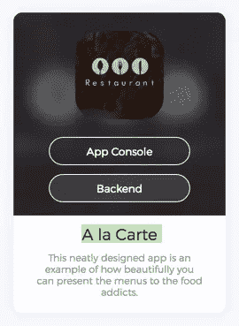
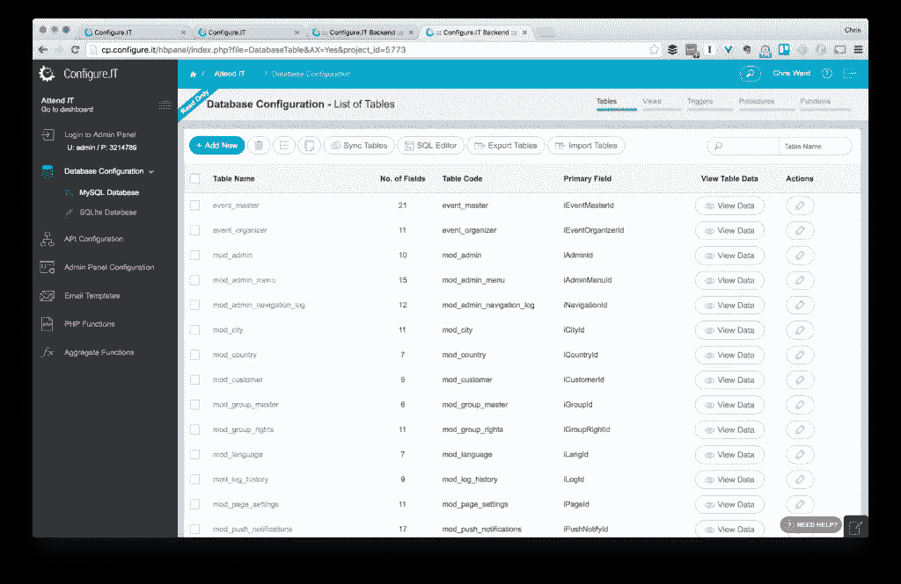
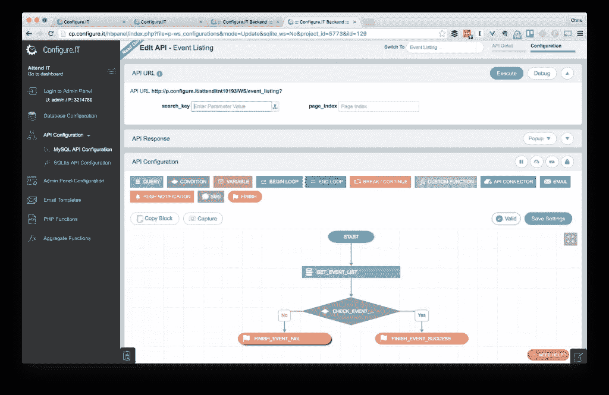
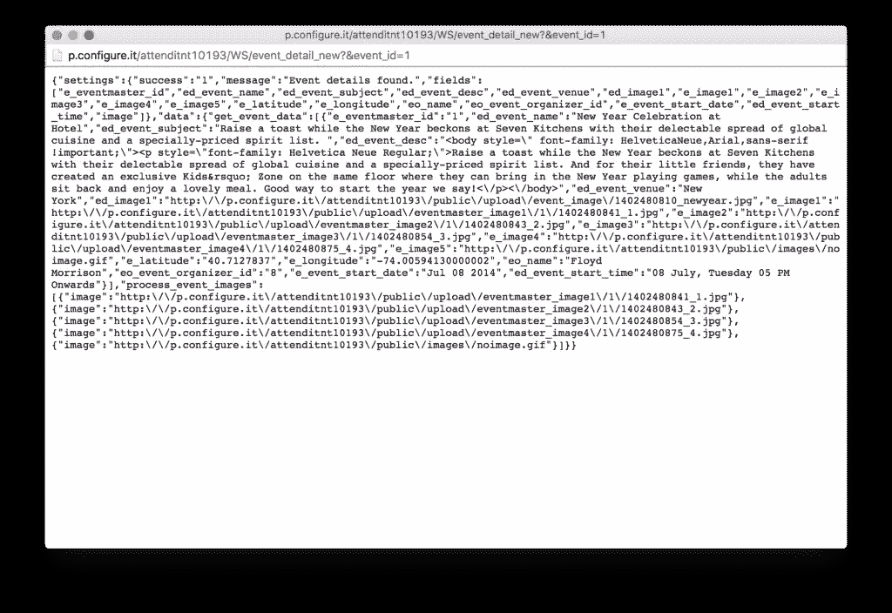
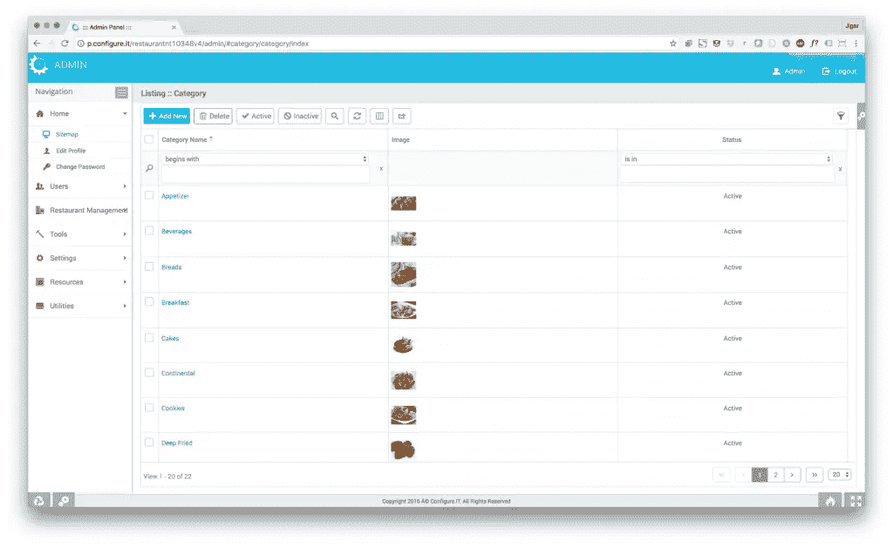
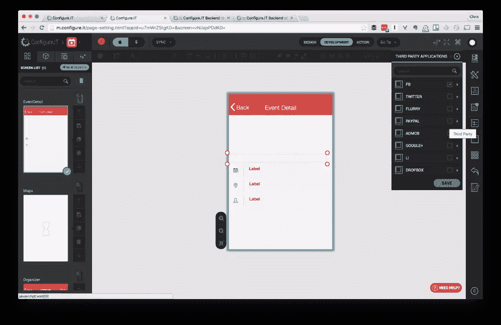
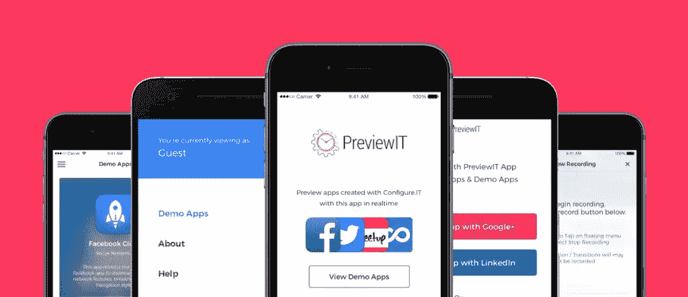
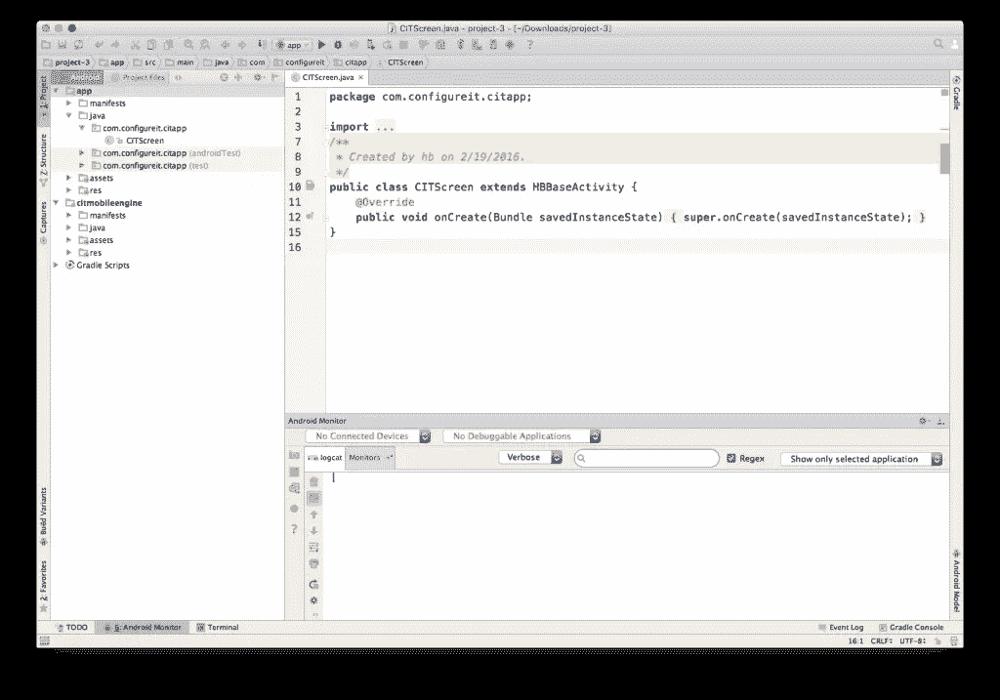
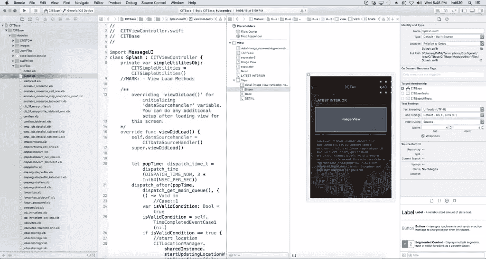

# 使用配置在浏览器中构建本地应用程序。信息技术

> 原文：<https://www.sitepoint.com/build-native-apps-in-the-browser-with-configure-it/>

*本文由 [Configure 赞助。它](http://www.configure.it/?utm_source=SitePoint&utm_medium=Article&utm_campaign=Sitepoint2017)。感谢您对使 SitePoint 成为可能的赞助商的支持。*

创建一个现代且功能丰富的移动应用从来都不是一件简单的任务，但现在比以往任何时候都更加复杂。有太多的平台、编程语言和策略需要考虑，知道从哪里开始和走哪条路需要理解和欣赏许多相互关联的组件。

## 移动平台

这是更容易做出的决定之一，因为没有竞争者对 iOS 和 Android 的双头垄断市场份额产生任何重大影响。然而，在每个平台上都有一些更成功的应用，你需要考虑如何营销和创造收入，因为每个生态系统的最佳方法都不尽相同。

取决于你决定使用哪个平台，下一个决定是一个重大的决定。

### 应用程序语言

如果你想为 Android 进行原生开发，那么你需要学习 Java。Java 是一门有着 20 年历史和庞大社区的通用语言，但是 Android 加入了自己的概念、API 和工具。虽然您会发现许多文档和学习资源，但 Java 并不是最容易入门的语言，可能需要很长时间才能掌握。

有了 iOS，你现在可以选择两种编程语言，Objective-C 和 Swift。Objective-C 受到了 C 和 C++的影响，这两种语言都和 Java 一样成熟，但也不是一种容易学习的语言，Apple 正在慢慢地淘汰它。Swift 是它的替代品，虽然它更简单、更精简，但它经常变化，在未来几年内，您仍需要使用 Objective-C 来完成更复杂的任务。

如果你想尝试减少你需要编写的独特代码的数量，有各种各样的[混合和跨平台](http://www.configure.it/blog/mobile-app-development-native-vs-cross-platform-app/?utm_source=SitePoint&utm_medium=Article&utm_campaign=Sitepoint2017)选项允许你用一种编程语言(包括 C#和 JavaScript)为多个平台开发。所有这些都涉及折衷，并且在性能、功能集以及与它们所支持的核心平台的同步性方面有所不同。

### 应用后端

如果你的应用程序需要存储用户数据，在多个平台之间同步，或者从其他来源读取和写入数据，你将需要一个数据库和一些东西来处理与它的交互。

这是一个更广泛的话题。有几十种数据库和后端编程语言、SaaS(软件即服务)产品、架构技术和策略。

我是否也提到过，如果你的应用变得流行，你将不得不满足这些服务的需求？已经有很多流行服务由于受欢迎程度的快速增长而崩溃的案例，这让潜在的客户感到不安。那么分析、处理错误、测试以及应用程序的更新呢？同样，更多的选择需要权衡和研究。

今年早些时候，当脸书关闭曾经引领移动后端即服务领域的 Parse 时，成千上万的应用被迫从位于 SaaS 的后端迁移到托管的后端。供应商锁定扼杀了使用可扩展和灵活的后端系统的全部意义。

如果你有资源，你可以雇佣所有你需要的专家来有效地处理每种语言、组件和任务，但是这对于小公司来说并不总是可行的。或者你可以处理一个小(或一个人)团队之间的所有事情——你有 6 个月的空闲时间来学习你需要学习的所有东西，不是吗？

## 面向本地应用开发者的平台

见证了试图使移动开发更容易，但最终失败的解决方案的流行和数量的增长。它看起来让一些不同的和独特的。它的创始人着手创建一个移动应用开发平台，它不仅能给你你需要的一切，还能生成真正的原生代码——不需要交叉编译、网页浏览或妥协。

它采用不同的方法来构建应用程序，认识到开发人员将遵循的典型流程，并试图简化流程，以便任何具有少量技术知识的人都可以使用。

该平台的关键主张是将任何移动应用程序的关键部分紧密集成到一个平台中——后端、API 层、移动应用程序 UI——所有这些都基于最广泛使用的定制应用程序制作技术。

出于本文的目的，我们将看看其中一个[演示项目](http://www.configure.it/demo-apps/?utm_source=SitePoint&utm_medium=Article&utm_campaign=Sitepoint2017)(一个事件应用程序)作为基础。该项目分为两个部分:后端和前端。

## 后端

您的应用程序的后端部分被分成子组件，这些子组件允许您创建和管理数据库、API、管理面板(CMS)和您的整个服务器端业务逻辑。

### 数据库ˌ资料库

不仅仅是表和字段的抽象列表，您还可以访问完整的 MySQL 和 SQLite 数据库，包括视图、触发器和过程。您可以使用表视图或原始 SQL 来管理它们，并且可以从其他工具导入和导出它们。您可以从三个服务器端数据库选项中选择——MySQL、MSSQL 和 PostgreSQL。

### 应用程序接口

位于数据库之上的是一个 API 管理工具，用于向您的应用程序公开数据。您可以使用可视化的拖放流工具创建这些 API 方法，允许您将 API 调用连接到其他触发器和操作以及原始数据。一旦创建了方法，就很容易进行测试，并对将要处理的结果有所了解。

您可以在流程图中用 PHP 添加自己的定制代码，这允许您虚拟地集成任何定制的业务逻辑。此外，第三方 API 连接器是一个强大的特性，可以帮助您使用各种方法(REST、XML、JSON 等)与平台之外的任何 API 进行连接。还有一个可视化的调试器，当你用流程图制作 API 时，它会立即显示错误，消除任何语法错误的可能性。

#### 数据处理盘

数据面板部分允许您基于您可能想要定义的不同模块来构建定制的管理面板、表单和列表。它是该平台最通用的部分，能够生成非常详细的信息仪表板，以便您可以管理应用程序中的动态信息。

### 该应用程序

GUI 应用程序设计器鼓励您开发尽可能轻薄的前端应用程序，允许您创建应用程序屏幕并将它们直接连接到 API 数据源。然后，您可以添加与第三方服务、通知、屏幕小部件和布局的集成，所有这些都可以直接与您的数据连接和交互。

如你所料，有一个标准操作系统组件的小部件库，以及他们构建的大量定制控件，这些控件通常不捆绑在供应商提供的 SDK 中。您可以将它们拖到画布上，并在页面结构中检查它们。

有几个选项可供您访问设备的所有硬件功能，并相应地定制应用程序端逻辑-通过在该界面中构建案例和条件。

要查看您的应用在不同平台和设备上的外观，您可以使用顶部菜单上的切换按钮，应用设计器将生成适合不同设备和尺寸的布局。

在另一个平台上复制你在一个平台上构建的东西很容易，几乎不费吹灰之力。一旦你为 iOS 开发了一个应用程序，它可以很快被复制到 Android 上。

### 使用 PreviewIT 在真实设备上查看输出

PreviewIT 应用程序是一款适用于 iOS 和 Android 的免费应用程序，允许您在智能手机或平板电脑上预览应用程序。预览应用程序不需要配置、编译或任何 SDK。

一旦您在浏览器中对应用程序配置进行了更改，您就可以使用 PreviewIT 在设备上看到这些更改。还有一些功能可以帮助团队成员提供反馈，例如做笔记和录制截屏。

这款应用可以从[应用商店](https://itunes.apple.com/in/app/previewit/id921587706)和 [Google Play](https://play.google.com/store/apps/details?id=com.configureit.previewit) 免费下载。

## 给我看看代码！

我们都尝试过像 Configure 这样的工具。虽然它们很灵活，允许你创建全功能的应用程序，但它们通常用于有限的行业和用例。你很少能把你能在平台中创造的东西进一步调整和定制——你被平台所提供的东西所束缚。

配置。它让您能够下载项目的每个组件的代码，后端、API、iOS(基于 Swift 2.0 的 XCode 项目)和 Android apps(基于 Java 的 Android Studio 项目)。

下面是在 Android Studio 中下载并运行的示例项目的示例。

而对于 XCode 中的 iOS

从这里，您可以添加任何其他您希望的本机功能，或者将应用程序带入任何自定义配置和构建流程。

## 配置您需要的一切？

开发人员经常对可视化应用构建工具持怀疑态度，认为它们对于投资组合或营销应用之外的任何东西都太简单了。配置。它的目标是创造不同于竞争对手的东西，针对那些希望快速创建高质量应用程序，但不在复杂性或性能上妥协的开发者。它非常适合企业公司的内部开发人员，或者为客户开发定制应用的小型开发人员。

如果你是本地开发的新手，并且有一个很棒的想法想要推向市场，或者一个有经验的开发人员想要更快地实现，那么看看吧。你可能会感到惊喜。此外，作为 Sitepoint 阅读器，您有机会利用他们订阅的特殊折扣，并能够以 50%的折扣下载您应用程序的原生源代码。点击[此处](http://www.configure.it/?utm_source=SitePoint&utm_medium=Article&utm_campaign=Sitepoint2017)认领优惠。

## 分享这篇文章