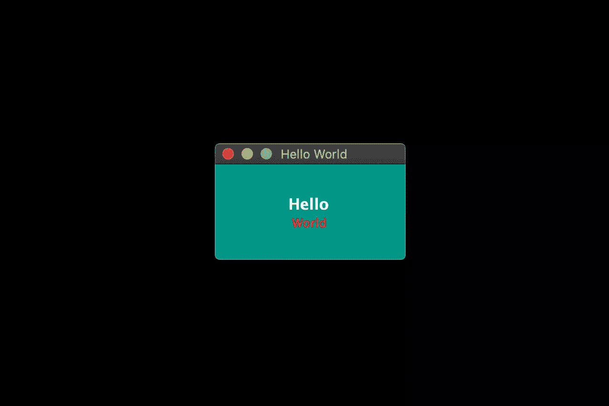
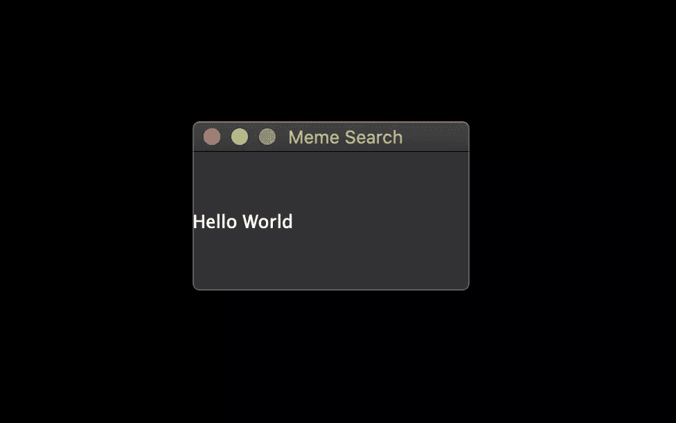
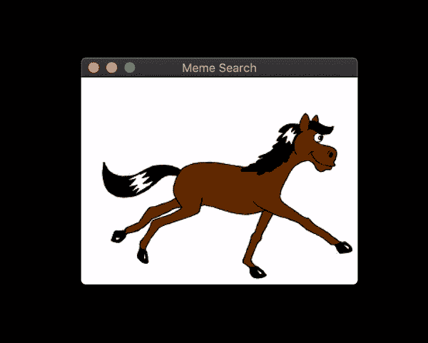
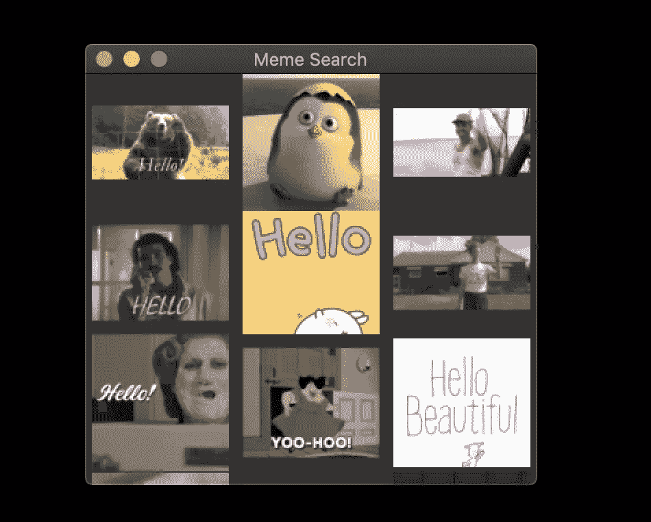
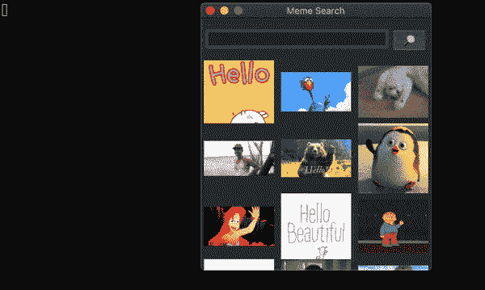
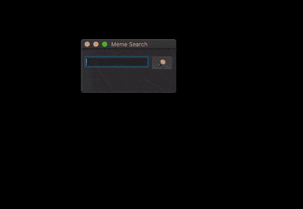
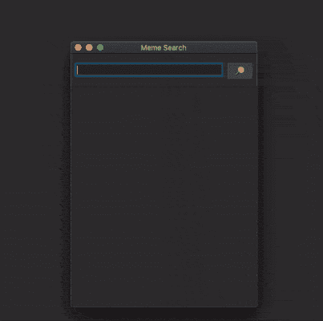
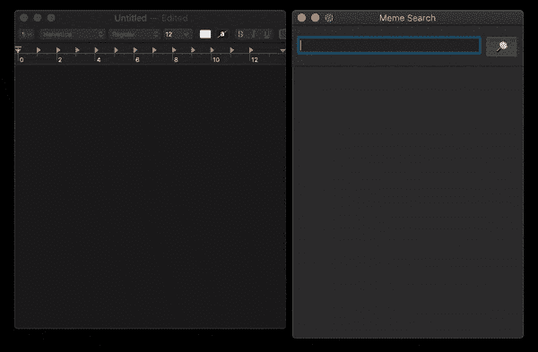
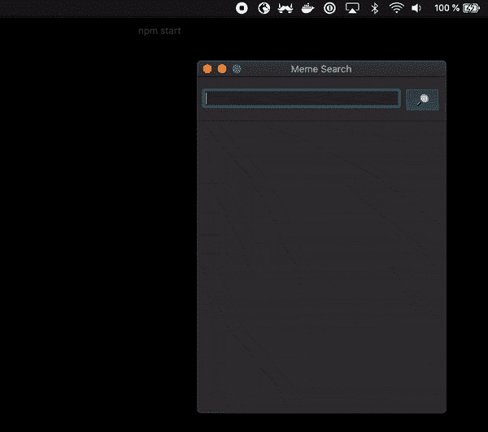

# 使用 NodeGui 构建一个原生桌面 GIF 搜索器应用程序

> 原文：<https://www.sitepoint.com/build-native-desktop-gif-searcher-app-using-nodegui/>

**[NodeGui](https://docs.nodegui.org/) 是一个开源库，用于使用 Node.js 构建跨平台的原生桌面应用，NodeGui 应用可以在 macOS、Windows 和 Linux 上运行。使用 NodeGui 构建的应用程序使用 JavaScript 编写，使用 CSS 样式，并使用 [Qt 框架](https://doc.qt.io/)呈现为原生桌面小部件。**

NodeGui 的一些特性是:

*   内置黑暗模式支持的本机小部件
*   低 CPU 和内存占用
*   CSS 样式包括对 Flexbox 布局的完全支持
*   完整的 Node.js API 支持和对所有 Node.js 兼容的 npm 模块的访问
*   使用 Chrome 的 DevTools 提供出色的调试支持
*   一流的类型脚本支持

NodeGui 由 Qt 框架提供支持，这使得它与其他基于 Chromium 的解决方案(如 Electron)相比，具有更高的 CPU 和内存效率。这意味着使用 NodeGui *编写的应用程序不会*打开浏览器实例并在其中呈现 ui。相反，所有的小部件都是原生呈现的。

本教程将演示如何安装 NodeGui，并使用它来构建一个位于系统托盘中的 meme 搜索器，并与 [GIPHY API](https://developers.giphy.com/) 进行通信。

本教程的完整源代码在 GitHub 上有[。](https://github.com/sitepoint-editors/memesearchapp-nodegui-tutorial)

## 安装和基本设置

对于本教程，假设您已经安装了 [Node.js v12](https://nodejs.org/en/download/) 或更高版本。您可以通过运行以下命令来确认节点和 npm 都可用:

```
# This command should print the version of Node.js
node -v

# This command should print the version of npm
npm -v 
```

如果您在这一步需要帮助，请查看我们关于安装节点的[教程。](https://www.sitepoint.com/quick-tip-multiple-versions-node-nvm/)

## 安装 CMake 和编译工具

NodeGui 需要 CMake 和 C++编译工具来构建项目的原生 C++层。确保安装 CMake >= 3.1 以及支持 C++11 及更高版本的 C++编译器。根据操作系统的不同，详细说明会有所不同。

### 马科斯

建议使用自制软件安装 CMake。安装 Homebrew 后，在终端中运行以下命令:

```
brew install cmake
brew install make 
```

您可以通过运行以下命令来确认安装:

```
# This command should print the version of CMake which should be higher than 3.1
cmake --version

make --version 
```

最后，您需要 GCC/Clang 来编译 C++代码。使用以下命令验证您已经安装了 GCC:

```
gcc --version 
```

如果你没有安装 GCC，确保你安装了 Xcode 的*命令行工具*或来自[苹果开发者页面](https://developer.apple.com/download/more/)的 *XCode 开发者工具*。

### Windows 操作系统

您可以从 [CMake 下载页面](https://cmake.org/download/)下载最新版本，在 Windows 上安装 CMake。

强烈建议您在 Windows 中使用 Powershell 作为首选终端。

您可以通过运行以下命令来确认 CMake 安装:

```
# This command should print the version of CMake which should be higher than 3.1
cmake --version 
```

最后，你需要一个 C++编译器。一种可能是[安装 Visual Studio 2017 或更高版本](https://docs.microsoft.com/en-us/visualstudio/install/install-visual-studio?view=vs-2017)。建议您在安装过程中选择使用 C++ 工作负载的**桌面开发。**

### Linux 操作系统

出于本教程的目的，我们将关注 Ubuntu 18.04。建议使用软件包管理器安装 CMake。在终端中运行以下命令:

```
sudo apt-get install pkg-config build-essential
sudo apt-get install cmake make 
```

您可以通过运行以下命令来确认安装:

```
# This command should print the version of CMake which should be higher than 3.1
cmake --version

make --version 
```

最后，您需要 GCC 来编译 C++代码。使用以下命令验证您已经安装了 GCC:

```
# gcc version should be >= v7
gcc --version 
```

## 你好世界

为了开始使用我们的 NodeGui meme 应用程序，我们将克隆 starter 项目。

*注意:运行这个需要 Git 和 npm。*

打开终端并运行:

```
git clone https://github.com/nodegui/nodegui-starter memeapp
cd memeapp
npm install
npm start 
```

如果一切顺利，您应该会在屏幕上看到一个工作的 hello world NodeGui 应用程序。



默认情况下， [nodegui-starter 项目](https://github.com/nodegui/nodegui-starter)是一个类型脚本项目。然而，在本教程中，我们将用 JavaScript 编写我们的应用程序。为了将我们的 starter 转换成一个 JS 项目，我们将做如下的小改动:

1.  删除`src`文件夹中的`index.ts`文件。

2.  在`src`目录下新建一个文件`index.js`，内容如下:

    **src/index.js**

    ```
    const { QMainWindow, QLabel } = require('@nodegui/nodegui');

    const win = new QMainWindow();
    win.setWindowTitle('Meme Search');

    const label = new QLabel();
    label.setText('Hello World');

    win.setCentralWidget(label);
    win.show();

    global.win = win; 
    ```

就开发而言，NodeGui 应用程序本质上是 Node.js 应用程序。NodeGui 中的所有 API 和特性都可以通过`@nodegui/nodegui`模块访问，就像任何其他 Node.js 模块一样需要这个模块。此外，您可以访问所有 Node.js APIs 和节点模块。NodeGui 使用本地组件而不是基于 web 的组件作为构建块。

在上面的例子中，我们已经导入了 [QMainWindow](https://docs.nodegui.org/docs/api/generated/classes/qmainwindow/) 和 [QLabel](https://docs.nodegui.org/docs/api/generated/classes/qlabel) 来创建一个显示文本“Hello World”的本地窗口。

现在再次运行应用程序:

```
npm start 
```



现在我们已经准备好了基本的设置，让我们开始构建我们的迷因搜索器🥳.

*注意:如果在遵循本教程的过程中有些东西不工作，请检查您的`package.json`文件以确保 starter 项目已经获得了 NodeGui 的最新版本。*

## 显示动画 GIF

由于迷因通常是动画 GIF，我们将从创建一个显示来自 URL 的 GIF 图像的基本窗口开始。

为此，我们将使用 QLabel 和 [QMovie](https://docs.nodegui.org/docs/api/generated/classes/qmovie) 。QMovie 不是一个 widget，而是一个可以播放简单动画的容器。我们将它与 QLabel 结合使用。

QMovie 的用法示例如下:

```
const movie = new QMovie();
movie.setFileName('/absolute/path/to/animated.gif');
movie.start();

const animatedLabel = new QLabel();
animatedLabel.setMovie(movie); 
```

因为，我们想从一个 URL 加载一个图像，我们不能使用`QMovie`的 [setFileName](https://docs.nodegui.org/docs/api/generated/classes/qmovie#setfilename) 方法，它只为本地文件保留。相反，我们将使用 [axios](https://www.npmjs.com/package/axios) 作为缓冲下载 GIF 图像，并使用 QMovie 方法 [loadFromData](https://docs.nodegui.org/docs/api/generated/classes/qmovie#loadfromdata) 来代替。

因此，让我们从 axios 安装开始:

```
npm i axios 
```

现在让我们创建一个函数，它将 URL 作为参数，并返回 GIF 的一个已配置的`QMovie`实例:

```
async function getMovie(url) {
  const { data } = await axios.get(url, { responseType: 'arraybuffer' });
  const movie = new QMovie();
  movie.loadFromData(data);
  movie.start();
  return movie;
} 
```

`getMovie`函数接收一个 URL，告诉 axios 下载 GIF 作为缓冲区，然后使用该缓冲区创建一个`QMovie`实例。

你可以把`QMovie`看作是一个处理逐帧播放 GIF 动画的内部逻辑的类。`QMovie`不是 widget，所以不能原样显示在屏幕上。相反，我们将使用一个常规的`QLabel`实例，并为其设置`QMovie`。

由于`getMovie`返回了一个承诺，我们需要对代码进行一些修改。经过一些小的重构，我们得到了下面的结果。

**src/index.js**

```
const { QMainWindow, QMovie, QLabel } = require('@nodegui/nodegui');
const axios = require('axios').default;

async function getMovie(url) {
  const { data } = await axios.get(url, { responseType: 'arraybuffer' });
  const movie = new QMovie();
  movie.loadFromData(data);
  movie.start();
  return movie;
}

const main = async () => {
  const win = new QMainWindow();
  win.setWindowTitle('Meme Search');

  const label = new QLabel();
  const gifMovie = await getMovie(
    'https://upload.wikimedia.org/wikipedia/commons/e/e3/Animhorse.gif'
  );
  label.setMovie(gifMovie);

  win.setCentralWidget(label);
  win.show();
  global.win = win;
};

main().catch(console.error); 
```

`main`函数是我们的入口。这里我们创建一个窗口和一个标签。然后，我们在`getMovie`函数的帮助下实例化一个`QMovie`实例，最后将`QMovie`设置为`QLabel`。

使用`npm start`运行应用程序，您应该会看到类似这样的内容:



## 从 GIPHY API 获取 gif

Giphy.com 有一个公共 API，任何人都可以用它来构建使用动画 gif 的优秀应用程序。为了使用 GIPHY API，您应该在[developers.giphy.com](https://developers.giphy.com)注册并获得一个 API 密钥。你可以在这里找到[的进一步说明](https://support.giphy.com/hc/en-us/articles/360020283431-Request-A-GIPHY-API-Key)。

我们将使用[搜索端点](https://developers.giphy.com/docs/api/endpoint/#search)功能来实现我们的 meme 搜索。

让我们首先编写一个`searchGifs`函数，它将接受一个`searchTerms`参数作为输入，并使用上面的端点请求 gif:

```
const GIPHY_API_KEY = 'Your API key here';

async function searchGifs(searchTerm) {
  const url = 'https://api.giphy.com/v1/gifs/search';
  const res = await axios.get(url, {
    params: {
      api_key: GIPHY_API_KEY,
      limit: 25,
      q: searchTerm,
      lang: 'en',
      offset: 0,
      rating: 'pg-13'
    }
  });
  return res.data.data;
} 
```

该函数执行后的结果如下所示:

```
[
  {
    "type": "gif",
    "id": "dzaUX7CAG0Ihi",
    "url": "https://giphy.com/gifs/hello-hi-dzaUX7CAG0Ihi",
    "images": {
      "fixed_width_small": {
        "height": "54",
        "size": "53544",
        "url": "https://media3.giphy.com/media/dzaUX7CAG0Ihi/100w.gif?cid=725ec7e0c00032f700929ce9f09f3f5fe5356af8c874ab12&rid=100w.gif",
        "width": "100"
      },
      "downsized_large": {
        "height": "220",
        "size": "807719",
        "url": "https://media3.giphy.com/media/dzaUX7CAG0Ihi/giphy.gif?cid=725ec7e0c00032f700929ce9f09f3f5fe5356af8c874ab12&rid=giphy.gif",
        "width": "410"
      },
      ...
    },
    "slug": "hello-hi-dzaUX7CAG0Ihi",
    ...
    "import_datetime": "2016-01-07 15:40:35",
    "trending_datetime": "1970-01-01 00:00:00"
  },
  {
    type: "gif",
    ...
  },
  ...
] 
```

结果实际上是一个包含每个 GIF 信息的对象数组。我们对每张图片的`returnValue[i].images.fixed_width_small.url`特别感兴趣，它包含 GIF 的 URL。

## 使用 API 的响应显示 gif 列表

为了显示 gif 列表，我们将创建一个`getGifViews`函数，它将:

1.  创建一个 [QWidget](https://docs.nodegui.org/docs/api/generated/classes/qwidget) 容器
2.  为每个 GIF 创建一个`QMovie`小部件
3.  从每个`QMovie`实例创建一个`QLabel`
4.  将每个`QLabel`作为`QWidget`容器的子容器
5.  返回`QWidget`容器

代码如下所示:

```
async function getGifViews(listOfGifs) {
  const container = new QWidget();
  container.setLayout(new FlexLayout());

  const promises = listOfGifs.map(async gif => {
    const { url, width } = gif.images.fixed_width_small;
    const movie = await getMovie(url);
    const gifView = new QLabel();
    gifView.setMovie(movie);
    gifView.setInlineStyle(`width: ${width}`);
    container.layout.addWidget(gifView);
  });

  await Promise.all(promises);

  container.setInlineStyle(` flex-direction: 'row';
      flex-wrap: 'wrap';
      justify-content: 'space-around';
      width: 330px;
      height: 300px; `);

  return container;
} 
```

让我们把它分解一下。

首先，我们创建容器小部件。本质上是充当容器的空部件。它们类似于网络世界中的`<div>`元素。

接下来，为了给`QWidget`分配子部件，我们需要给它一个布局。一个**布局**决定了子部件应该如何在父部件中排列。这里我们选择 [FlexLayout](https://docs.nodegui.org/docs/api/generated/classes/flexlayout) 。

然后，我们使用我们的`getMovie`函数为每个 GIF URL 创建一个`QMovie`实例。我们将`QMovie`实例分配给一个`QLabel`(名为`gifView`)，并使用`setInlineStyle`方法给它一些基本的样式。最后，我们使用`layout.addWidget`方法将`QLabel`小部件添加到容器的布局中。

因为这一切都是异步发生的，所以在设置一些容器样式并返回容器小部件之前，我们使用`Promise.all`等待一切都解决。

## 将列表附加到窗口小部件

现在让我们修改我们的`main`函数，以便查看我们准备的小部件列表。

**src/index.js**

```
const { FlexLayout, QLabel, QMainWindow, QMovie, QWidget } = require('@nodegui/nodegui');
const axios = require('axios').default;
const GIPHY_API_KEY = 'Your API key here';

async function getMovie(url) { ... }
async function searchGifs(searchTerm) { ... }
async function getGifViews(listOfGifs) { ... }

const main = async () => {
  const win = new QMainWindow();
  win.setWindowTitle('Meme Search');

  const center = new QWidget();
  center.setLayout(new FlexLayout());

  // We get the list of gifs here
  const listOfGifs = await searchGifs('hello');

  // We create the container with GIF view widgets
  const container = await getGifViews(listOfGifs);

  // We finally attach the container to the widget
  center.layout.addWidget(container);

  win.setCentralWidget(center);
  win.show();

  global.win = win;
};

main().catch(console.error); 
```

如果在进行这些更改后运行项目，您应该会看到:



太好了！现在，让我们添加一个搜索输入字段和一个按钮，以便用户可以搜索除“hello”gif 之外的内容。

## 添加搜索输入和按钮

让我们首先创建一个`createSearchContainer`函数，它将接受一个回调函数作为参数。当单击搜索按钮时，将调用这个函数。

下面是该函数应该做的事情:

1.  创建一个`QWidget`容器，我们将添加一个搜索输入字段和按钮作为子元素
2.  创建一个布局并将其附加到容器
3.  创建一个搜索输入和按钮，然后将它们附加到`FlexLayout`
4.  将一个事件监听器附加到按钮上，当点击该按钮时，将调用`onSearch`回调函数，将文本输入字段中出现的任何文本传递给它
5.  返回`QWidget`容器

代码如下所示:

```
function createSearchContainer(onSearch) {
  const searchContainer = new QWidget();
  searchContainer.setObjectName('searchContainer');
  searchContainer.setLayout(new FlexLayout());

  const searchInput = new QLineEdit();
  searchInput.setObjectName('searchInput');

  const searchButton = new QPushButton();
  searchButton.setObjectName('searchButton');
  searchButton.setText(' 🔎 ');

  searchButton.addEventListener('clicked', () => {
    onSearch(searchInput.text());
  });

  searchContainer.layout.addWidget(searchInput);
  searchContainer.layout.addWidget(searchButton);

  searchContainer.setStyleSheet(` #searchContainer {
      flex-direction: 'row';
      padding: 10px;
      align-items: 'center';
    }
    #searchInput {
      flex: 1;
      height: 40px;
    }
    #searchButton {
      margin-left: 5px;
      width: 50px;
      height: 35px;
    } `);
  return searchContainer;
} 
```

希望您对这里发生的事情有一个公平的想法，但是需要注意的一件新事情是 [setStyleSheet 方法](https://docs.nodegui.org/docs/api/generated/classes/qwidget#setstylesheet)。您可以将此视为一次性应用块级 CSS 的方法。它非常类似于 Web 上的全局样式表，但是不同之处在于，在 NodeGui/Qt 中，样式表可以附加到任何块上，而不仅仅是全局的。

为了使用样式表对小部件进行样式化，我们需要向小部件添加一个`objectName`,我们将用它在样式表中引用它。这与网络世界中的`id`非常相似。为了设置一个`objectName`，我们将使用`setObjectName`方法。

现在让我们把这个`searchContainer`添加到主窗口。

**src/index.js**

```
const {
  FlexLayout,
  QLabel,
  QLineEdit,
  QMainWindow,
  QMovie,
  QPushButton,
  QWidget,
} = require('@nodegui/nodegui');

const axios = require('axios').default;
const GIPHY_API_KEY = 'Your API key here';

async function getMovie(url) { ... }
async function searchGifs(searchTerm) { ... }
async function getGifViews(listOfGifs) { ... }
function createSearchContainer(onSearch) { ... }

const main = async () => {
  const win = new QMainWindow();
  win.setWindowTitle('Meme Search');

  const center = new QWidget();
  center.setLayout(new FlexLayout());

  // Here we create the search container
  const searchContainer = createSearchContainer(searchText => {
    console.log('searchText: ', searchText);
  });

  // Here we add it to the center widget before we add the list of GIFs.
  center.layout.addWidget(searchContainer);

  const listOfGifs = await searchGifs('hello');
  const container = await getGifViews(listOfGifs);

  center.layout.addWidget(container);

  win.setCentralWidget(center);
  win.show();

  global.win = win;
};

main().catch(console.error); 
```

现在，当您启动应用程序并在搜索栏中输入一些内容时，您应该会看到您搜索的任何内容都记录到了您的终端上。



## 将搜索连接到 GIF 视图

为了加载新的 gif 来响应用户的搜索，我们需要做以下事情:

1.  在单击搜索按钮时触发的回调函数中，获取搜索文本并使用`searchGifs`函数获取新的 gif 列表。
2.  使用`getGifViews`函数为这些 gif 创建一个新的容器。
3.  从窗口中移除现有容器。
4.  将新容器添加到窗口中。

如果我们稍微移动一下，我们会得到:

```
const main = async () => {
  const win = new QMainWindow();
  win.setWindowTitle('Meme Search');

  const center = new QWidget();
  center.setLayout(new FlexLayout());

  let container = new QWidget();
  const searchContainer = createSearchContainer(async searchText => {
    try {
      // Create a new GIF container with new GIFs
      const listOfGifs = await searchGifs(searchText);
      const newGifContainer = await getGifViews(listOfGifs);

      // Remove existing container from the window
      center.layout.removeWidget(container);
      container.close();

      // Add the new GIF container to the window
      center.layout.addWidget(newGifContainer);
      container = newGifContainer;
    } catch (err) {
      console.error('Something happened!', err);
    }
  });
  center.layout.addWidget(searchContainer);

  win.setCentralWidget(center);
  win.show();

  global.win = win;
}; 
```

让我们再运行一次，看看神奇的🧙‍♂️.



如您所见，当您在搜索框中键入内容并点击搜索按钮时，我们的小部件将从 GIPHY API 中获取与搜索词匹配的 gif 列表。

## 使用`QScrollArea`使 gif 列表可滚动

虽然这一切都在朝着正确的方向发展，但你可能已经注意到 gif 列表在底部被截断，没有办法滚动它们。这是因为我们使用了一个`QWidget`容器来显示它们。为了使容器可滚动，我们需要将`QWidget`替换为 [QScrollArea](https://docs.nodegui.org/docs/api/generated/classes/qscrollarea/) 。这提供了到另一个小部件的滚动视图。

我们将从移除`getGifViews`函数中的`height`属性开始:

```
async function getGifViews(listOfGifs) {
 ... 
 container.setInlineStyle(`
      flex-direction: 'row';
      flex-wrap: 'wrap';
      justify-content: 'space-around';
 width: 330px; - height: 300px;  `); 
 return container; } 
```

然后我们需要将`src/index.js`修改成这样:

```
const {
  FlexLayout,
  QLabel,
  QLineEdit,
  QMainWindow,
  QMovie,
  QPushButton,
  QScrollArea,
  QWidget,
} = require('@nodegui/nodegui');

const axios = require('axios').default;
const GIPHY_API_KEY = 'Your API key here';

async function getMovie(url) { ... }
async function searchGifs(searchTerm) { ... }
async function getGifViews(listOfGifs) { ... }
function createSearchContainer(onSearch) { ... }

const main = async () => {
  const win = new QMainWindow();
  win.setWindowTitle('Meme Search');

  const center = new QWidget();
  center.setLayout(new FlexLayout());

  const scrollArea = new QScrollArea();
  scrollArea.setWidgetResizable(false);
  scrollArea.setInlineStyle('flex: 1; width: 350px; height: 400px;');

  const searchContainer = createSearchContainer(async searchText => {
    try {
      const listOfGifs = await searchGifs(searchText);
      const newGifContainer = await getGifViews(listOfGifs);

      // Remove existing container from the scrollArea
      const oldContainer = scrollArea.takeWidget();
      if (oldContainer) oldContainer.close();

      // Add the new GIF container to the scrollArea
      scrollArea.setWidget(newGifContainer);
    } catch (err) {
      console.error('Something happened!', err);
    }
  });

  center.layout.addWidget(searchContainer);
  center.layout.addWidget(scrollArea);

  win.setCentralWidget(center);
  win.show();

  global.win = win;
};

main().catch(console.error); 
```

这里没有什么太令人兴奋的事情。我们正在创建一个新的`QScrollArea`，我们将它添加到搜索栏下方的布局中。我们还使用了`QScrollArea`的 [takeWidget 方法](https://docs.nodegui.org/docs/api/generated/classes/qscrollarea#takewidget)，在追加新的搜索结果之前，从滚动区移除任何现有的容器。

如果你启动迷因搜索器，你现在应该有可滚动的 gif:



## 添加点击监听器以复制 GIF URLs 用于共享

既然我们可以看到所有的 gif，我们希望能够分享它们。一个快速的方法是每当用户点击他们选择的 GIF 时，将 URL 复制到全局剪贴板上。

然后用户可以简单的导航到他们想要使用 GIF 的地方，用`Ctrl` / `Cmd` + `V`插入。

为此，我们必须:

1.  为每个 GIF 附加一个鼠标按下事件监听器
2.  在事件监听器回调中，使用 [QClipboard 类](https://docs.nodegui.org/docs/api/generated/classes/qclipboard)将 URL 复制到全局剪贴板
3.  向用户显示一个模式，告诉用户 URL 已经被复制

事件监听器可以附加在`getGifViews`函数内:

```
async function getGifViews(listOfGifs) {
  ...

  const promises = listOfGifs.map(async gif => {
    ...

    gifView.addEventListener(WidgetEventTypes.MouseButtonRelease, () => {
      const clipboard = QApplication.clipboard();
      clipboard.setText(url, QClipboardMode.Clipboard);

      showModal(
        'Copied to clipboard!',
        `You can press Cmd/Ctrl + V to paste the GIF url: ${url}`
      );

    });

    container.layout.addWidget(gifView);
  });

  ...

  return container;
} 
```

这里，[QA application . clipboard](https://docs.nodegui.org/docs/api/generated/classes/qapplication#static-clipboard)返回一个与剪贴板交互的对象。我们可以使用这个对象的`setText`方法来改变实际剪贴板的内容。

我们还利用了一个`showModal`函数。接下来让我们定义一下:

```
function showModal(title, details) {
  const modal = new QMessageBox();
  modal.setText(title);
  modal.setDetailedText(details);
  const okButton = new QPushButton();
  okButton.setText('OK');
  modal.addButton(okButton, ButtonRole.AcceptRole);
  modal.exec();
} 
```

[QMessageBox 小部件](https://docs.nodegui.org/docs/api/generated/classes/qmessagebox/)类似于 web 浏览器中的警告框。它可以用来暂停用户交互并显示一条消息。

最后，我们需要在`src/index.js`的顶部导入所有这些新部件:

```
const {
  ButtonRole,
  FlexLayout,
  QApplication,
  QClipboardMode,
  QLabel,
  QLineEdit,
  QMainWindow,
  QMessageBox,
  QMovie,
  QPushButton,
  QScrollArea,
  QWidget,
  WidgetEventTypes,
} = require('@nodegui/nodegui');
const axios = require('axios').default;
const GIPHY_API_KEY =  'Your API key here';

async function searchGifs(searchTerm) { ... };
async function getGifViews(listOfGifs) { ... };
async function getMovie(url) { ... };
function createSearchContainer(onSearch) { ... };
function showModal(title, details) { ... };

const main = async () => { ... };

main().catch(console.error); 
```

如果您启动了 meme searcher，您现在应该能够复制/粘贴 GIF URLs:



## 添加系统托盘图标

我们希望我们的应用程序在不使用时隐藏在系统托盘中。为此，我们将创建一个系统托盘图标，该图标将有一个菜单项，单击该菜单项将切换正在运行的小部件的可见性。

涉及的步骤有:

1.  创建一个带有图标的 [QSystemTrayIcon](https://docs.nodegui.org/docs/api/generated/classes/qsystemtrayicon) 。
2.  使用 [QMenu](https://docs.nodegui.org/docs/api/generated/classes/qmenu) 为系统托盘图标创建一个菜单。将菜单实例设置为系统托盘的上下文菜单。
3.  使用 [QAction 小部件](https://docs.nodegui.org/docs/api/generated/classes/qaction)创建菜单项，并设置事件监听器监听它们的`trigger`事件。
4.  触发时，隐藏或显示窗口。

让我们从要求必要的模块开始，然后对`main`函数做一个小的改变，告诉它使用我们的图标:

```
const {
  ButtonRole,
  FlexLayout,
  QApplication,
  QClipboardMode,
  QIcon,
  QLabel,
  QLineEdit,
  QMainWindow,
  QMenu,
  QMessageBox,
  QMovie,
  QAction,
  QPushButton,
  QScrollArea,
  QSystemTrayIcon,
  QWidget,
  WidgetEventTypes,
} = require('@nodegui/nodegui');
const axios = require('axios').default;
const path = require('path');
const iconImg = require('../assets/systray.png').default;
const GIPHY_API_KEY =  'Your API key here';

const main = async () => {
  ...

  win.show();
  systemTrayIcon(win);

  global.win = win;
}; 
```

如你所见，我们需要一个来自`assets`文件夹的图标。如果你正在跟进，你可以从这里下载图标文件。

现在是创建系统托盘图标的函数:

```
function systemTrayIcon(win) {
  const icon = new QIcon(path.resolve(__dirname, iconImg));
  const tray = new QSystemTrayIcon();
  tray.setIcon(icon);
  tray.show();

  // Menu that should pop up when clicking on systray icon.
  const menu = new QMenu();
  tray.setContextMenu(menu);

  //Each item in the menu is called an action
  const visibleAction = new QAction();
  menu.addAction(visibleAction);
  visibleAction.setText('Show/Hide');
  visibleAction.addEventListener('triggered', () => {
    if (win.isVisible()) {
      win.hide();
    } else {
      win.show();
    }
  });

  global.tray = tray;
} 
```

这里，我们使用 NodeGui 的 [QIcon 类](https://docs.nodegui.org/docs/api/generated/classes/qicon/)创建图标。然后我们使用`QSystemTrayIcon`类为我们的应用程序创建一个系统托盘图标。

最后，我们需要调整我们的 webpack 设置(在`webpack.config.js`中)以防止 webpack 多填充`__dirname`:

```
const path = require('path');

module.exports = {
 ...
 node: { - __dirname: true, - __filename: true + __dirname: false, + __filename: false  },
 ... } 
```

最终结果:



## 一些最终的调整

### 错误处理

在我们继续打包之前，让我们利用我们的`showModal`函数并添加一个错误处理对话框:

```
const main = async () => {
  ...
  const searchContainer = createSearchContainer(async searchText => {
    try {
      ...
    } catch (err) {
      ...
      showModal('Something went wrong!', JSON.stringify(err));
    }
  });
  ...
}; 
```

例如，如果从 GIPHY 获取 gif 的 Ajax 请求出现问题，这将警告用户。你可以把你的 API 键改成无效的，然后启动应用程序，尝试搜索 GIF。

### 允许用户输入 API 密钥

当我们谈到 API 密钥时，让我们添加一个对话框，允许用户输入他们的 API 密钥。这意味着它不必硬编码在程序中:

```
const {
  ...
  QDialog,
  ...
} = require('@nodegui/nodegui');
...
let GIPHY_API_KEY = '';

async function searchGifs(searchTerm) { ... }
async function getGifViews(listOfGifs) { ... }
async function getMovie(url) { ... }
function createSearchContainer(onSearch) { ... }
function showModal(title, details) { ... }
function systemTrayIcon(win) { ... }

function showAPIKeyDialog() {
  const dialog = new QDialog();
  dialog.setLayout(new FlexLayout());
  const label = new QLabel();
  label.setText('Enter your Giphy API Key');
  const input = new QLineEdit();
  const okButton = new QPushButton();
  okButton.setText('OK');
  okButton.addEventListener('clicked', () => {
    GIPHY_API_KEY = input.text();
    dialog.close();
  });
  dialog.layout.addWidget(label);
  dialog.layout.addWidget(input);
  dialog.layout.addWidget(okButton);
  dialog.setInlineStyle(` padding: 10;
    height: 150px;
    flex-direction: 'column';
    align-items:'center';
    justify-content: 'space-around'; `);
  dialog.exec();
}

const main = async () => {
  ...
  showAPIKeyDialog();
  global.win = win;
};

main().catch(console.error); 
```

如您所见，我们使用一个 [`QDialog`小部件](https://docs.nodegui.org/docs/api/generated/classes/qdialog)来提示用户输入，然后将他们提供的任何内容存储在`GIPHY_API_KEY`变量中。如果您在阅读本教程后希望提高 NodeGui 技能，那么您可以考虑改进这一点——例如，通过将密钥持久化到文件系统，或者验证它并向用户提供反馈。

*注:别忘了，完整的源代码在这里:[https://github . com/site point-editors/memesearch app-node GUI-tutorial](https://github.com/sitepoint-editors/memesearchapp-nodegui-tutorial)。*

## 为跨平台分发打包应用程序

在我们成功地构建了应用程序之后，我们需要为 macOS、Windows 和 Linux 创建可供最终用户下载和使用的发行版。

每个操作系统创建可分发包的过程通常是不同的，所以为了减轻痛苦，我们将使用 NodeGui 的打包工具`@nodegui/packer`。

### 使用

首先，安装 packer 作为开发依赖项:

```
npm install --save-dev @nodegui/packer 
```

接下来，使用 packer 创建一个部署模板:

```
npx nodegui-packer --init MemeApp 
```

该模板本质上是一个特定于操作系统的项目，包含成功打包所有 NodeGui 应用程序的代码、资产和依赖项的代码。请注意，您需要在 Windows、macOS 和 Linux 中分别运行此程序，以创建三个不同的模板。此模板允许您微调特定于每个操作系统的最终部署设置。你可以根据自己的需要调整公司信息、图标和其他元数据。

对于 Linux，模板如下所示:

```
.
└── deploy
    ├── config.json
    └── linux
        └── MemeApp
            ├── default.desktop
            ├── default.png
            └── qode.json 
```

注意，您只需要运行 init 命令*一次*。然后，您对模板进行更改，并在项目报告中提交它。

下一步是实际构建项目并打包成一个可分发的。

删除`build`目录(如果存在):

```
rm -rf ./deploy/build 
```

然后使用 webpack 构建应用程序:

```
npm run build 
```

最后，运行打包程序的 pack 命令，将文件夹`dist`作为参数传递给它:

```
npx nodegui-packer --pack ./dist 
```

这将导致以下结果:

*   在 macOS 上，packer 会输出一个`dmg`文件。
*   在 Linux 上，packer 会输出一个`AppImage`，类似于 macOS 中的一个`.app`文件。
*   在 Windows 上，packer 输出一个包含可执行文件和所有 dll 的文件夹。

一旦命令成功，它应该打印输出目录，该目录通常在`deploy/<os>/build`目录中。确保你*没有*提交这个目录:

```
.
└── deploy
    ├── config.json
    └── linux
        ├── build
        │   └── MemeApp
        │       ├── Application-aed23d8-x86_64.AppImage
        │       ├── AppRun -> qode
        │       ├── default.desktop
        │       ├── default.png
        │       ├── dist
        │       │   ├── f59514675cec2e70ce8598286c94dc22.png
        │       │   ├── index.js
        │       │   └── nodegui_core-7b3e73f5fef149ae765d5ea5d13d5bb0.node
        │       ├── doc
        │       │   └── ...
        │       ├── lib
        │       │   └── ...
        │       ├── plugins
        │       │   └── ...
        │       ├── qode
        │       ├── qode.json
        │       └── qt.conf
        └── MemeApp
            ├── default.desktop
            ├── default.png
            └── qode.json 
```

Linux 的可分发版本是`deploy/linux/build/MemeApp/Application-aed23d8-x86_64.AppImage`🚀📦。

## 结论

在本教程中，我们使用 NodeGui 用大约 200 行代码成功构建了一个真实世界的 meme 搜索应用程序。我们学习了该库的一些基本概念和功能。我们还能够将完成的应用程序打包成可与最终用户共享的可分发版本。

我相信 NodeGui 为使用 Node.js 创建大量真正高效的原生应用打开了大门。

NodeGui 还支持 [React(官方)](https://react.nodegui.org/)、 [Angular(社区)](https://github.com/irustm/angular-nodegui)以及即将推出的 [Vue.js(社区)](https://github.com/NovusTheory/vue-nodegui)等库和框架。如果你对这些感兴趣，请在 GitHub 上给它们一颗星。

NodeGui 是一个开源库，它将从代码贡献中获益匪浅。它有一个相对容易理解的代码库和一个非常受欢迎的社区。我鼓励每个人都来帮忙。

最后，由于它们内置的许多小部件和 CSS 样式，我相信 NodeGui 应用程序和 web 或电子应用程序一样容易开发。我鼓励你建立一些你自己的很酷的东西，并与我们分享。

本教程摘自 [SitePoint Premium library](https://www.sitepoint.com/premium/library?utm_source=blog&utm_medium=articles) ，在这里您可以构建一个工作就绪的 Node.js 技能集。

## 分享这篇文章