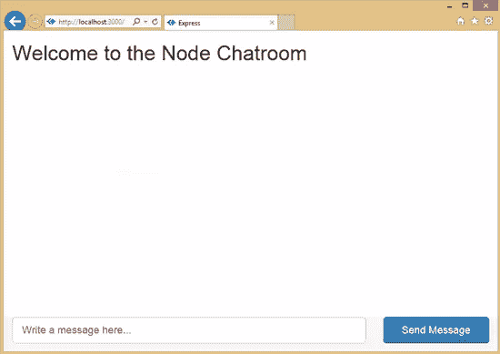

# 构建一个 Node.js 支持的聊天室 Web 应用程序:带有引导程序的聊天室 UI

> 原文：<https://www.sitepoint.com/build-node-js-powered-chatroom-web-app-chatroom-ui-bootstrap/>

本文是微软网站开发技术系列的一部分。感谢您对使 SitePoint 成为可能的合作伙伴的支持。

这个 [Node.js](http://nodejs.org/?WT.mc_id=12833-DEV-sitepoint-othercontent) 教程系列将帮助您构建一个完全部署在云中的 Node.js 支持的实时聊天室 web 应用程序。在这个系列中，你将学习如何在你的 Windows 机器上设置 [Node.js](http://nodejs.org/?WT.mc_id=12833-DEV-sitepoint-othercontent) (或者如果你在 Mac 上只学习概念)，如何用 [Express](http://expressjs.com/?WT.mc_id=12833-DEV-sitepoint-othercontent) 开发 web 前端，如何将 Node.js Express 应用部署到 [Azure](http://azure.microsoft.com/en-us/pricing/free-trial/?WT.mc_id=12779-DEV-sitepoint-link) ，如何使用 [Socket。IO](http://socket.io/?WT.mc_id=12833-DEV-sitepoint-othercontent) 添加实时层，以及如何一起部署。

教程将使用可选的 [Visual Studio](https://www.visualstudio.com/en-us/products/visual-studio-community-vs?WT.mc_id=12779-DEV-sitepoint-link) 和 [Node.js Tools for Visual Studio 插件](http://nodejstools.codeplex.com/releases/view/119433?WT.mc_id=12833-DEV-sitepoint-othercontent)作为开发环境。我提供了这两个工具的免费下载链接。这是一篇初级到中级水平的文章——你应该了解 HTML5 和 JavaScript。

> [第一部分——node . js 简介](https://www.sitepoint.com/build-node-js-powered-chatroom-web-app-getting-started/)
> 
> [第二部分——欢迎使用 Node.js 和 Azure 表达](https://www.sitepoint.com/build-node-js-powered-chatroom-web-app-expess-azure/)
> 
> 第 3 部分——用 Node.js、Mongo 和 Socket 构建后端。IO
> 
> 第 4 部分——用 Bootstrap 构建聊天室 UI
> 
> [第 5 部分——用网络套接字连接聊天室](https://www.sitepoint.com/build-node-js-powered-chatroom-web-app-connecting-websockets)
> 
> [第六部分——压轴和调试远程 Node.js 应用](https://www.sitepoint.com/build-node-js-powered-chatroom-web-app-debugging-remotely/)

## 第 4 部分——用 Bootstrap 构建聊天室 UI

欢迎来到 Node.js 实用教程系列的第 4 部分:构建基于 Node.js 的聊天室 web 应用程序。

在这一期中，我将向你展示如何给你在[第二部分](https://www.sitepoint.com/build-node-js-powered-chatroom-web-app-expess-azure/)和[第三部分](https://www.sitepoint.com/build-node-js-powered-chatroom-web-app-node-mongodb-socket/)中构建的聊天室后端添加一个 Twitter 引导风格的前端。

## 什么是自举？

Bootstrap 是一个非常流行的 HTML 和 CSS 框架，用于构建网站和 web 应用程序。它是 GitHub 上的头号项目。Bootstrap 支持响应式 web 设计，允许您的页面布局适应设备(桌面、平板、移动)。

## 向我们的项目添加引导程序

要将 Bootstrap 添加到我们的项目中，我们必须为 Bootstrap 下载缩小的 CSS 和 JS 文件。你可以从这个[链接](https://github.com/twbs/bootstrap/releases/download/v3.2.0/bootstrap-3.2.0-dist.zip?WT.mc_id=12833-DEV-sitepoint-othercontent)下载 Bootstrap。下载完 Bootstrap 后，解压文件并将文件夹`css`、`js`和`fonts`复制到项目中的`public`文件夹。

您将注意到与现有文件夹结构的一些不一致。我们将统一样式表和 JavaScript 文件夹。我更喜欢将`stylesheets`命名为`css`，将`javascript`命名为`js`，因为这是与其他第三方库共享的。将`stylesheets`中的文件复制到`css`中，删除`javascript`文件夹，因为它应该是空的。接下来转到`layout.jade`并更改以下行:

```
link(rel='stylesheet' href='/stylesheets/style.css')
```

收件人:

```
link(rel='stylesheet' href='/css/style.css')
```

接下来，我们想要添加引导 CSS 文件链接到标题，并在`layout.jade`文件中为 HTML5 应用添加适当的 meta 标签。您必须在包含`style.css`链接的行之前添加以下行。

```
meta(charset="utf-8")
meta(http-equiv="X-UA-Compatible" content="IE=edge")
link(rel='stylesheet' href='/css/bootstrap.min.css')
link(rel='stylesheet' href='/css/bootstrap-theme.min.css')
```

接下来，我们要添加 Bootstrap 组件和插件所需的 JavaScript 文件。在`layout.jade`的末尾添加以下一行:

```
script(type=’text/javascript’ src=’/js/bootstrap.min.js’)
```

#### 已完成的布局. jade

```
doctype html
html
  head
    title= title
    meta(charset="utf-8")
    meta(http-equiv="X-UA-Compatible" content="IE=edge")
    link(rel='stylesheet' href='/css/bootstrap.min.css')
    link(rel='stylesheet' href='/css/bootstrap-theme.min.css')
    link(rel='stylesheet' href='/css/style.css')

  body
    block content

    script(type='text/javascript' src='/js/bootstrap.min.js')
```

## 创建聊天 UI 布局

是时候开发聊天用户界面布局了。首先，你可能想读一读 Bootstrap，看看这篇[长教程](http://www.tutorialrepublic.com/twitter-bootstrap-tutorial/bootstrap-introduction.php?WT.mc_id=12833-DEV-sitepoint-othercontent)。所有的聊天引擎都有一个最近收到信息的区域和一个用户写和发送信息的区域。从历史上看，这种布局是将编辑区附在底部，消息在顶部。

不做一点工作就把 HTML 页面上的元素固定在视窗的底部是不容易的。我将按照这个[样本](http://getbootstrap.com/2.3.2/examples/sticky-footer.html?WT.mc_id=12833-DEV-sitepoint-othercontent)来固定底部的页脚。我们想要修改`index.jade`文件，并删除内容块下的所有代码行。

首先，我们添加将包含接收到的消息的页面区域。让我们从用类`wrap`添加一个`div`开始。在 Jade 中，你只需要写`.wrap`来生成一个`<div class="wrap"></div>`。通过使用缩进，我们可以向 Jade 模板引擎发出信号，更多缩进的元素将放入更少缩进的元素中。如果你在其他教程中错过了这个[玉石教程](http://jade-lang.com/tutorial/?WT.mc_id=12833-DEV-sitepoint-othercontent)，那就来看看吧。

接下来，我们想用类`container-fluid`添加另一个`div`来给页面添加一个流体宽度。在内部，我将创建一个写着“欢迎来到节点聊天室”的`h1`元素，一个 id 为`messages`的`div`和一个 final 为`push`的`div`，我们将使用它们将聊天室的消息编辑区域下推到视窗的底部。

```
.wrap
  .container-fluid
    h1 Welcome to the Node Chatroom
    #messages
    .push
```

接下来，我们将开发消息编辑区。我们希望在名为`footer`的`div`和名为`container-fluid`的`div`中捕获文本框和发送按钮。`footer` `div`将与`wrap` `div`具有相同的缩进。

接下来，我将使用 Bootstrap grid 系统(在此处[了解此事](http://getbootstrap.com/css/#grid?WT.mc_id=12833-DEV-sitepoint-othercontent))将消息编辑区域一分为二。其中一列将占据大部分空间，并将包含用于编写消息的文本框，第二列将包含用于发送消息的`block-level`按钮。注意 Jade 如何让我们使用`paragraph`符号指定元素的属性。代码将如下所示:

```
.footer
  .container-fluid
    .row
      .col-xs-8.col-sm-9
        input(type="text" id="message-box" class="form-control input-lg" placeholder="Write a message here..." rows="3")
      .col-xs-4.col-sm-3
        button#send-message-btn.btn.btn-primary.btn-lg.btn-block Send Message
```

#### 已完成的索引. jade

```
extends layout
block content
  .wrap
    .container-fluid
      h1 Welcome to the Node Chatroom
      #messages

      .push
  .footer
    .container-fluid
      .row
        .col-xs-8.col-sm-9
          input(type="text" id="message-box" class="form-control input-lg" placeholder="Write a message here..." rows="3")
        .col-xs-4.col-sm-3
          button#send-message-btn.btn.btn-primary.btn-lg.btn-block Send Message
```

## 添加 CSS 以强制消息编辑区域位于视窗底部

我们想要强制消息编辑区域位于视窗的底部，我们想要在`public/css/style.styl`页面中添加一些自定义 CSS 规则。这个文件使用了[手写笔](http://learnboost.github.io/stylus/?WT.mc_id=12833-DEV-sitepoint-othercontent) CSS 预处理器，但是你也可以粘贴将被重新复制到生成的 CSS 文件中的 CSS。

首先，我们要确保整个页面占据 100%的高度。

```
html, body
  height: 100%
```

第二，我们希望确保换行区域占据最大高度，但在底部为页脚和消息编辑区域留出 60px 的空白。

```
.wrap
  min-height: 100%
  height: auto !important
  height: 100%
  margin: 0 auto -60px
```

第三，我们希望确保这个编辑区域的空间得到尊重，并将其分配给页脚。

```
.push, .footer
  height: 60px
```

最后，出于风格的原因，让我们添加一个微妙的背景颜色的页脚。

```
.footer
    background-color: **#f5f5f5**
```

#### 完整的 style.styl

```
html, body
    height: 100%
.wrap
    min-height: 100%
    height: auto !important
    height: 100%
    margin: 0 auto -60px

 .push, .footer
     height: 60px

 .footer
     background-color: #f5f5f5
```

#### 屏幕上显示程序运行的图片

如果你做的一切都正确，你应该得到一个类似这样的用户界面:



## 结论

瞧啊。我们已经使用 Bootstrap 和 Jade/Stylus 预处理程序为 Node.js 提供服务的聊天室添加了一个漂亮的 UI 布局。

## 请继续关注第 5 部分！

第 5 部分—用 WebSockets 连接聊天室在这里是。你可以通过关注[我的推特账号](https://twitter.com/ramisayar?WT.mc_id=12833-DEV-sitepoint-othercontent)来了解这篇文章和其他文章的最新动态

## Azure 上的更多 Node.js 学习

为了更深入地学习 Node.js，我的课程可以在微软虚拟学院的找到。

或者类似 Node.js 主题的一些较短格式的视频:

*   六部分系列:用 node 构建应用程序。JS

*   [漫步穿越节点(Coding4Fun)](http://channel9.msdn.com/coding4fun/blog/A-Stroll-Through-Node?WT.mc_id=12833-DEV-sitepoint-othercontent)

本文是微软网站开发技术系列的一部分。我们很高兴与你分享斯巴达项目的[和它的](http://blogs.msdn.com/b/ie/archive/2015/01/22/project-spartan-and-the-windows-10-january-preview-build.aspx?WT.mc_id=12833-DEV-sitepoint-othercontent)[新渲染引擎](http://blogs.msdn.com/b/ie/archive/2015/02/26/a-break-from-the-past-the-birth-of-microsoft-s-new-web-rendering-engine.aspx?WT.mc_id=12779-DEV-sitepoint-link)。在 [modern 获得免费虚拟机或在您的 Mac、iOS、Android 或 Windows 设备上进行远程测试。即](http://modern.ie/?utm_source=SitePoint&utm_medium=other&utm_campaign=SitePoint) *。*

## 分享这篇文章