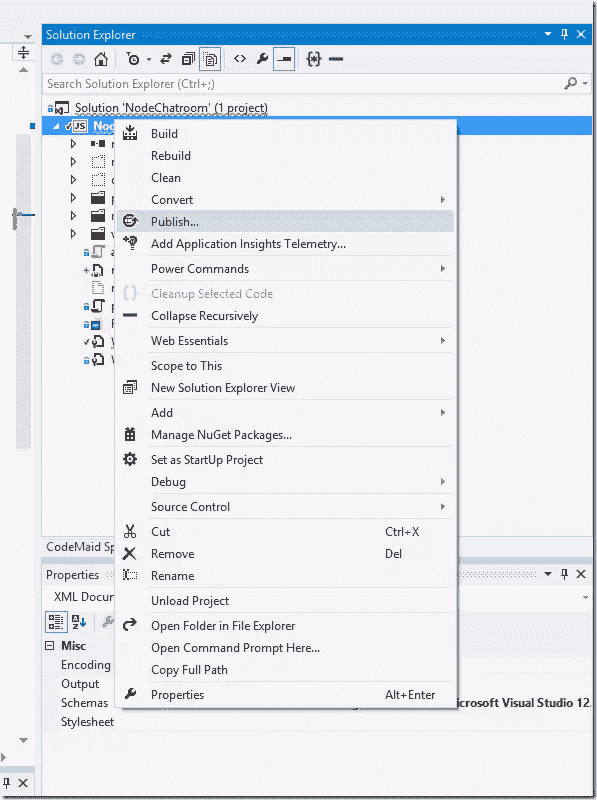
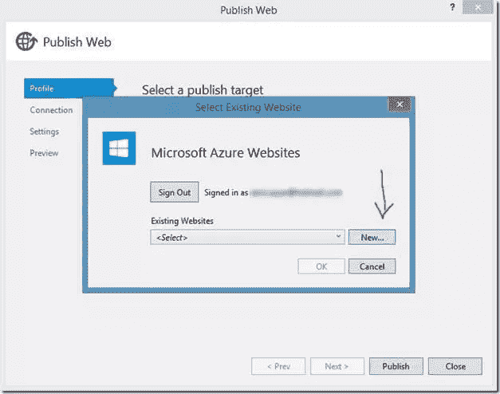
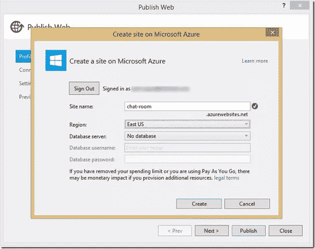
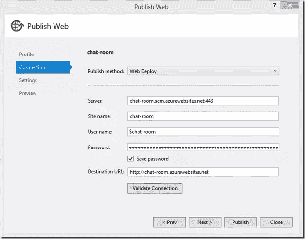
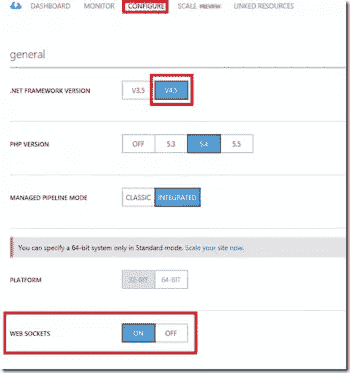
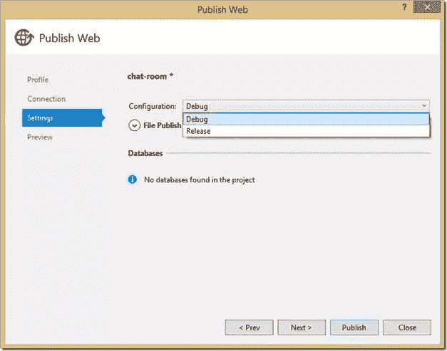
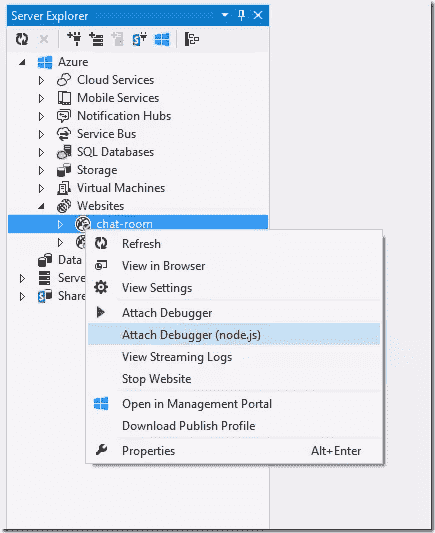
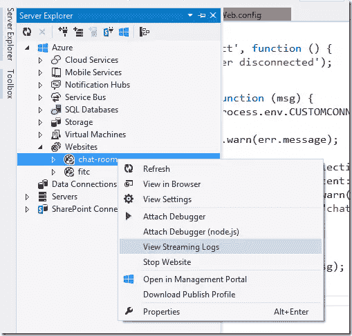

# 构建 Node.js 支持的聊天室 Web 应用程序:远程调试

> 原文：<https://www.sitepoint.com/build-node-js-powered-chatroom-web-app-debugging-remotely/>

本文是微软网站开发技术系列的一部分。感谢您对使 SitePoint 成为可能的合作伙伴的支持。

这个 [Node.js](http://nodejs.org/?WT.mc_id=12833-DEV-sitepoint-othercontent) 教程系列将帮助您构建一个完全部署在云中的 Node.js 支持的实时聊天室 web 应用程序。在这个系列中，你将学习如何在你的 Windows 机器上设置 [Node.js](http://nodejs.org/?WT.mc_id=12833-DEV-sitepoint-othercontent) (或者如果你在 Mac 上只学习概念)，如何用 [Express](http://expressjs.com/?WT.mc_id=12833-DEV-sitepoint-othercontent) 开发 web 前端，如何将 Node.js Express 应用部署到 [Azure](http://azure.microsoft.com/en-us/pricing/free-trial/?WT.mc_id=12779-DEV-sitepoint-link) ，如何使用 [Socket。IO](http://socket.io/?WT.mc_id=12833-DEV-sitepoint-othercontent) 添加实时层，以及如何一起部署。

教程将使用可选的 [Visual Studio](https://www.visualstudio.com/en-us/products/visual-studio-community-vs?WT.mc_id=12779-DEV-sitepoint-link) 和 [Node.js Tools for Visual Studio 插件](http://nodejstools.codeplex.com/releases/view/119433?WT.mc_id=12833-DEV-sitepoint-othercontent)作为开发环境。我提供了这两个工具的免费下载链接。这是一篇初级到中级水平的文章——你应该了解 HTML5 和 JavaScript。

> [第一部分——node . js 简介](https://www.sitepoint.com/build-node-js-powered-chatroom-web-app-getting-started/)
> 
> [第二部分——欢迎使用 Node.js 和 Azure 表达](https://www.sitepoint.com/build-node-js-powered-chatroom-web-app-expess-azure/)
> 
> 第 3 部分——用 Node.js、Mongo 和 Socket 构建后端。IO
> 
> [第 4 部分——用 Bootstrap 构建聊天室用户界面](https://www.sitepoint.com/build-node-js-powered-chatroom-web-app-chatroom-ui-bootstrap/)
> 
> [第 5 部分——用网络套接字连接聊天室](https://www.sitepoint.com/build-node-js-powered-chatroom-web-app-connecting-websockets)
> 
> 第 6 部分——总结和调试远程 Node.js 应用程序

## 第 6 部分——总结和调试远程节点应用程序

欢迎来到 Node.js 实用教程系列的第 6 部分:构建基于 Node.js 的聊天室 web 应用程序。

在这最后一部分中，我将向您展示如何最终部署您的聊天室，以及如何执行远程调试。

## 部署到 Azure

现在我们已经让 Node.js 支持的匿名聊天室应用程序工作了，让我们点击几下就把它部署到云上。你可以部署到任何支持 Node.js 的云。我将使用微软 Azure，因为我可以在那里免费运行 Node.js 网站。

你可以在这里注册免费试用微软 Azure。你将获得试用积分，用于购买所有 Azure 服务。对于我们正在使用的服务， [Azure 网站](http://azure.microsoft.com/en-us/services/websites/?WT.mc_id=12833-DEV-sitepoint-othercontent)，你实际上可以运行 10 个网站，而不用花一毛钱。

1.  设置好 Azure 帐户后，返回 IDE，右键单击项目，然后单击发布。

    

2.  点击发布将打开一个带有几个选项的向导，选择目标*微软 Azure 网站*。

3.  这一步将要求您登录，请使用您在 Azure 注册时使用的 Microsoft 帐户。

4.  单击*新建*创建一个新的 Azure 网站，或者，如果您已经创建了一个网站，您可以从下拉列表中选择它。

    

5.  您需要完成向导中的字段(如下所示)。确保选择一个唯一的站点名称，然后点击*创建*。

    

6.  您将看到一个预填充的向导。点击*发布*。

    

我们已经部署到云，但工作还没有结束！

## 在 Azure 网站中启用 WebSockets

要确保您的网站启用了 WebSockets，您需要做一些事情。如果你想要更详细的步骤或常见问题，请务必[访问此页面](http://azure.microsoft.com/en-us/documentation/articles/web-sites-nodejs-chat-app-socketio/?WT.mc_id=12833-DEV-sitepoint-othercontent)。

首先，您需要从 Azure 命令行或配置选项卡启用 WebSockets，如下所示:



第二，您需要修改您的`web.config`文件和下面的一行到`system.webServer` XML 元素。

```
&amp;lt;webSocket enabled=&amp;quot;false&amp;quot; /&amp;gt;
```

这看起来可能违反直觉，但这禁用了`IIS WebSockets`模块，该模块包括其自己的 WebSockets 实现，并与 Node.js 特定的 WebSockets 模块(如`Socket.IO`)冲突。

## 调试远程 Node.js 应用程序

Node Tools for Visual Studio 附带了一些高级调试功能，如条件断点、“命中次数”断点、跟踪点以及对 Windows、Linux 和 OS X 的远程调试支持。在此阅读更多。

## 连接到远程 Node.js 实例

NTVS 支持在 Azure 网站上运行的远程调试代码。与常规远程调试不同，不能通过 TCP 直接访问目标机器。NTVS 附带了一个用于调试协议的 WebSocket 代理，它通过 HTTP 公开调试器协议。当你创建一个新的 Windows Azure 项目时，代理已经在`Web.Debug.config`中为你完全配置好了，如果你按照下面几个步骤在`Debug`配置中发布你的项目，它将在 Azure 网站上启用。

1.  右键点击项目，选择*发布*。

    

2.  选择左侧的设置选项卡，并确保从下拉菜单中选择*调试*配置。

    

3.  点击*发布*。

一旦正确部署了项目并启用了 WebSockets，就可以从服务器资源管理器附加到网站。如果没有打开服务器资源管理器窗口，可以通过*视图→服务器资源管理器*打开它。然后，在 *Windows Azure →网站*下找到你的网站，右键点击。如果它正在运行，并且您的项目已经使用调试配置部署到它上面，您应该在上下文菜单中看到*附加调试器(Node.js)* 命令。



## 读取日志和流式日志

如果你想流最新的日志，这是相当容易的！你所要做的就是在服务器浏览器中右击你的网站，然后选择*查看流日志*。



## 结论

瞧啊。你有它！你现在在云中有一个匿名的实时聊天室！在整个系列中，我们学习了如何设置 Node.js，如何使用 Express 开发 web 前端，如何将我们的应用程序部署到云，如何使用 Socket。IO 加一个实时层，然后怎么一起部署！


一定要重读我的博客上的不同部分[，因为我可能会偶尔对本教程进行更新。你可以通过关注](http://blogs.msdn.com/b/cdndevs/archive/2014/09/04/node-js-tutorial-series-a-chatroom-for-all-part-1-introduction-to-node.aspx?WT.mc_id=12833-DEV-sitepoint-othercontent)[我的推特账号](https://twitter.com/ramisayar?WT.mc_id=12833-DEV-sitepoint-othercontent)来了解这篇文章和其他文章的最新动态

附:如果你想要更多成功的礼物，请点击这里。

## Azure 上 Node.js 的更多信息

为了更深入地学习 node，我的课程可以在微软虚拟学院的这里[找到。](http://www.microsoftvirtualacademy.com/training-courses/building-apps-with-node-js-jump-start?WT.mc_id=12833-DEV-sitepoint-othercontent)

或者类似节点题材的一些较短格式的视频:

*   六部分系列:用 node 构建应用程序。JS

*   [漫步穿越节点(Coding4Fun)](http://channel9.msdn.com/coding4fun/blog/A-Stroll-Through-Node?WT.mc_id=12833-DEV-sitepoint-othercontent)

本文是微软网站开发技术系列的一部分。我们很高兴与你分享斯巴达项目的[和它的](http://blogs.msdn.com/b/ie/archive/2015/01/22/project-spartan-and-the-windows-10-january-preview-build.aspx?WT.mc_id=12833-DEV-sitepoint-othercontent)[新渲染引擎](http://blogs.msdn.com/b/ie/archive/2015/02/26/a-break-from-the-past-the-birth-of-microsoft-s-new-web-rendering-engine.aspx?WT.mc_id=12779-DEV-sitepoint-link)。在 [modern 获得免费虚拟机或在您的 Mac、iOS、Android 或 Windows 设备上进行远程测试。即](http://modern.ie/?utm_source=SitePoint&utm_medium=other&utm_campaign=SitePoint) *。*

## 分享这篇文章